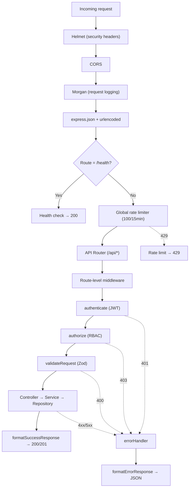

# API Reference — BudgetChain Monorepo

> **Scope:** every REST endpoint, its method, route, authentication, authorization, request body/query/params, response shape, validation schema, and error codes.
> **Source of truth:** `routes/*.js`, `validators/*.js`, `controllers/*.js`, `middleware/*.js`, `utils/responseFormatter.js`, `constants/httpStatus.js`. Anything not determinable from code is marked *unknown*.

---

## 1. Conventions

### 1.1 Base URL

All endpoints are prefixed with `/api` (mounted in `app.js:37`). The base URL for local development is `http://localhost:5000/api`.

### 1.2 Response envelope

Every response uses one of two standard JSON shapes defined in `utils/responseFormatter.js`:

**Success:**
```json
{
  "success": true,
  "message": "Human-readable message",
  "data": { ... }
}
```

**Error:**
```json
{
  "success": false,
  "message": "Human-readable error message",
  "errors": [ ... ]
}
```

### 1.3 Authentication

Unless otherwise noted, all `/api/*` endpoints require a valid JWT access token in the `Authorization` header:

```
Authorization: Bearer <access_token>
```

The `authenticate` middleware (`middleware/authMiddleware.js`) verifies the token and attaches `req.user` (with `id`, `role`, `email`). Failure returns `401 Unauthorized`.

### 1.4 Authorization (RBAC)

After authentication, `authorize(...roles)` (`middleware/rbacMiddleware.js`) checks `req.user.role` against the allowed roles. Failure returns `403 Forbidden`.

The four roles are:
| Role | Constant |
|---|---|
| `Administrator` | `ROLES.ADMINISTRATOR` |
| `Treasurer` | `ROLES.TREASURER` |
| `BudgetOfficer` | `ROLES.BUDGET_OFFICER` |
| `Auditor` | `ROLES.AUDITOR` |

### 1.5 Validation

Request bodies, query parameters, and route parameters are validated with Zod schemas via `validateRequest(schema, source)` (`validators/validateRequest.js`). Validation failure returns `400 Bad Request` with field-level error details in the `errors` array.

### 1.6 Pagination

Paginated endpoints accept `page` (default `1`) and `limit` (default `10`, max `100`) as query parameters. Paginated responses include:

```json
{
  "data": [...],
  "pagination": {
    "page": 1,
    "limit": 10,
    "total": 42,
    "totalPages": 5
  }
}
```

### 1.7 Rate limiting

| Limiter | Scope | Window | Max | Source |
|---|---|---|---|---|
| Global | All `/api/*` | 15 min | 100/IP | `middleware/rateLimiter.js:30` |
| Auth Login | `POST /api/auth/login` | 15 min | 5/IP | `middleware/rateLimiter.js:44` |
| Document Upload | Upload endpoints | 15 min | 20/IP | `middleware/rateLimiter.js:72` |

Rate limit violations return `429 Too Many Requests`.

### 1.8 HTTP status codes

| Code | Constant | Meaning |
|---|---|---|
| 200 | `OK` | Success |
| 201 | `CREATED` | Resource created |
| 400 | `BAD_REQUEST` | Validation failure or bad input |
| 401 | `UNAUTHORIZED` | Missing or invalid token |
| 403 | `FORBIDDEN` | Insufficient role |
| 404 | `NOT_FOUND` | Resource not found |
| 408 | `REQUEST_TIMEOUT` | Request timed out |
| 409 | `CONFLICT` | Duplicate resource |
| 413 | `PAYLOAD_TOO_LARGE` | File exceeds size limit |
| 415 | `UNSUPPORTED_MEDIA_TYPE` | File type not allowed |
| 422 | `UNPROCESSABLE_ENTITY` | Business rule violation |
| 429 | `TOO_MANY_REQUESTS` | Rate limit exceeded |
| 500 | `INTERNAL_SERVER_ERROR` | Unexpected server error |
| 503 | `SERVICE_UNAVAILABLE` | Service unavailable |

---

## 2. Health Check

| Method | Route | Auth | Roles | Source |
|---|---|---|---|---|
| `GET` | `/health` | None | Public | `app.js:28` |

**Response** `200`:
```json
{
  "status": "OK",
  "timestamp": "2026-08-06T00:00:00.000Z",
  "uptime": 12345.678
}
```

> This endpoint is mounted directly on the Express app, outside `/api`, so it is not rate-limited.

---

## 3. Authentication (`/api/auth`)

Source: `routes/authRoutes.js` → `controllers/authController.js`

### 3.1 Login

| Method | Route | Auth | Roles | Rate limit |
|---|---|---|---|---|
| `POST` | `/api/auth/login` | None | Public | `authLoginLimiter` (5/15min) |

**Request body** (validated by `loginSchema`):
| Field | Type | Required | Rules |
|---|---|---|---|
| `email` | `string` | ✅ | Valid email format |
| `password` | `string` | ✅ | Min 1 char |

**Response** `200`:
```json
{
  "success": true,
  "message": "Login successful",
  "data": {
    "user": { "id", "fullName", "email", "role", "status" },
    "accessToken": "jwt...",
    "refreshToken": "opaque..."
  }
}
```

**Errors:** `400` validation, `401` invalid credentials, `429` rate limited.

---

### 3.2 Refresh token

| Method | Route | Auth | Roles |
|---|---|---|---|
| `POST` | `/api/auth/refresh` | None | Public |

**Request body** (validated by `refreshTokenSchema`):
| Field | Type | Required | Rules |
|---|---|---|---|
| `refreshToken` | `string` | ✅ | Min 1 char |

**Response** `200`:
```json
{
  "success": true,
  "message": "Token refreshed",
  "data": {
    "accessToken": "jwt...",
    "refreshToken": "new-opaque..."
  }
}
```

**Errors:** `400` validation, `401` invalid/expired/revoked token.

---

### 3.3 Logout

| Method | Route | Auth | Roles |
|---|---|---|---|
| `POST` | `/api/auth/logout` | Optional | Public |

**Request body:** none required. If a valid token is present, the user's refresh tokens are revoked.

**Response** `200`:
```json
{ "success": true, "message": "Logged out successfully", "data": {} }
```

---

### 3.4 Get current user

| Method | Route | Auth | Roles |
|---|---|---|---|
| `GET` | `/api/auth/me` | ✅ Required | Any authenticated |

**Response** `200`:
```json
{
  "success": true,
  "message": "User profile",
  "data": { "id", "fullName", "email", "role", "status", "createdAt", "updatedAt" }
}
```

**Errors:** `401` unauthorized.

---

## 4. User Management (`/api/users`)

Source: `routes/userRoutes.js` → `controllers/userController.js`

All endpoints: `authenticate` (router-level) + `authorize(Administrator)`.

### 4.1 List users

| Method | Route | Auth | Roles |
|---|---|---|---|
| `GET` | `/api/users` | ✅ | Administrator |

**Query params** (validated by `userQuerySchema`):
| Param | Type | Default | Options |
|---|---|---|---|
| `page` | `int` | `1` | — |
| `limit` | `int` | `10` | — |
| `role` | `enum` | — | `Administrator`, `Treasurer`, `BudgetOfficer`, `Auditor` |
| `status` | `enum` | — | `Active`, `Inactive` |
| `search` | `string` | — | Full-text search on name/email |
| `sortBy` | `enum` | `createdAt` | `id`, `email`, `fullName`, `role`, `status`, `createdAt`, `updatedAt` |
| `sortOrder` | `enum` | `desc` | `asc`, `desc` |

**Response** `200`: paginated array of users (passwords excluded).

---

### 4.2 Get user by ID

| Method | Route | Auth | Roles |
|---|---|---|---|
| `GET` | `/api/users/:id` | ✅ | Administrator |

**Response** `200`: single user object.
**Errors:** `404` not found.

---

### 4.3 Create user

| Method | Route | Auth | Roles |
|---|---|---|---|
| `POST` | `/api/users` | ✅ | Administrator |

**Request body** (validated by `createUserSchema`):
| Field | Type | Required | Rules |
|---|---|---|---|
| `email` | `string` | ✅ | Valid email |
| `password` | `string` | ✅ | Min 8, must contain lowercase + uppercase + digit |
| `fullName` | `string` | ✅ | Min 2 chars |
| `role` | `enum` | ❌ | `Administrator`, `Treasurer`, `BudgetOfficer`, `Auditor` |
| `status` | `enum` | ❌ | `Active`, `Inactive` |

**Response** `201`: created user object.
**Errors:** `400` validation, `409` email conflict.

---

### 4.4 Update user

| Method | Route | Auth | Roles |
|---|---|---|---|
| `PUT` | `/api/users/:id` | ✅ | Administrator |

**Request body** (validated by `updateUserSchema`): same fields as create, all optional.

**Response** `200`: updated user object.
**Errors:** `400` validation, `404` not found, `409` email conflict.

---

### 4.5 Delete user

| Method | Route | Auth | Roles |
|---|---|---|---|
| `DELETE` | `/api/users/:id` | ✅ | Administrator |

**Response** `200`: deletion confirmation.
**Errors:** `404` not found.

---

### 4.6 Change user role

| Method | Route | Auth | Roles |
|---|---|---|---|
| `PATCH` | `/api/users/:id/role` | ✅ | Administrator |

**Request body:** `{ "role": "Treasurer" }` (one of the four roles).

**Response** `200`: updated user object.
**Errors:** `400` invalid role, `404` not found.

---

### 4.7 Change user status

| Method | Route | Auth | Roles |
|---|---|---|---|
| `PATCH` | `/api/users/:id/status` | ✅ | Administrator |

**Request body:** `{ "status": "Inactive" }` (`Active` or `Inactive`).

**Response** `200`: updated user object.
**Errors:** `400` invalid status, `404` not found.

---

## 5. Dashboard (`/api/dashboard`)

Source: `routes/dashboardRoutes.js` → `controllers/dashboardController.js`, `controllers/timelineController.js`

All endpoints: `authenticate` + `authorize(Administrator, Treasurer, BudgetOfficer, Auditor)`.

### 5.1 Statistics

| Method | Route | Auth | Roles |
|---|---|---|---|
| `GET` | `/api/dashboard/stats` | ✅ | All 4 roles |

**Query params:** currently no required params (schema reserved for future use).

**Response** `200`: dashboard statistics (budget totals, allocation counts, user counts, etc.).

---

### 5.2 Charts data

| Method | Route | Auth | Roles |
|---|---|---|---|
| `GET` | `/api/dashboard/charts` | ✅ | All 4 roles |

**Query params:** currently no required params.

**Response** `200`: chart-ready data (department breakdowns, category distributions, etc.).

---

### 5.3 Recent activities

| Method | Route | Auth | Roles |
|---|---|---|---|
| `GET` | `/api/dashboard/activities` | ✅ | All 4 roles |

**Response** `200`: list of recent system activities.

---

### 5.4 Notifications

| Method | Route | Auth | Roles |
|---|---|---|---|
| `GET` | `/api/dashboard/notifications` | ✅ | All 4 roles |

**Response** `200`: role-specific notifications (pending approvals, failed anchors, etc.).

---

### 5.5 Blockchain status

| Method | Route | Auth | Roles |
|---|---|---|---|
| `GET` | `/api/dashboard/blockchain` | ✅ | All 4 roles |

**Response** `200`: blockchain node connectivity, pending/confirmed/failed counts.

---

### 5.6 Activity timeline

| Method | Route | Auth | Roles |
|---|---|---|---|
| `GET` | `/api/dashboard/timeline` | ✅ | All 4 roles |

**Query params** (validated by `timelineQuerySchema`, source: `query`):
| Param | Type | Default | Options |
|---|---|---|---|
| `page` | `int` | `1` | — |
| `limit` | `int` | `20` | Max 100 |
| `kind` | `enum` | — | `AllocationApproval`, `DocumentActivity`, `AuditLog`, `BlockchainRecord` |
| `dateFrom` | `date string` | — | ISO date |
| `dateTo` | `date string` | — | ISO date |
| `sortBy` | `enum` | `newest` | `newest`, `oldest`, `kind`, `action`, `createdAt` |
| `sortOrder` | `enum` | `asc` | `asc`, `desc` |

**Response** `200`: paginated merged timeline entries from 4 sources.

---

## 6. Fiscal Years (`/api/fiscal-years`)

Source: `routes/fiscalYearRoutes.js` → `controllers/fiscalYearController.js`

### 6.1 List fiscal years

| Method | Route | Auth | Roles |
|---|---|---|---|
| `GET` | `/api/fiscal-years` | ✅ | All 4 roles |

**Query params** (validated by `fiscalYearQuerySchema`, source: `query`):
| Param | Type | Default | Options |
|---|---|---|---|
| `page` | `int` | `1` | — |
| `limit` | `int` | `10` | — |
| `code` | `string` | — | Filter by code |
| `description` | `string` | — | Filter by description |
| `status` | `enum` | — | `Active`, `Inactive`, `Archived` |
| `isActive` | `boolean` | — | — |
| `startDate` | `string` | — | — |
| `endDate` | `string` | — | — |
| `search` | `string` | — | Full-text search |
| `sortBy` | `enum` | `createdAt` | `code`, `description`, `startDate`, `endDate`, `status`, `isActive`, `createdAt`, `updatedAt` |
| `sortOrder` | `enum` | `desc` | `asc`, `desc` |

**Response** `200`: paginated array of fiscal years.

---

### 6.2 Get fiscal year by ID

| Method | Route | Auth | Roles |
|---|---|---|---|
| `GET` | `/api/fiscal-years/:id` | ✅ | All 4 roles |

**Response** `200`: single fiscal year.
**Errors:** `404` not found.

---

### 6.3 Create fiscal year

| Method | Route | Auth | Roles |
|---|---|---|---|
| `POST` | `/api/fiscal-years` | ✅ | Administrator |

**Request body** (validated by `createFiscalYearSchema`):
| Field | Type | Required | Rules |
|---|---|---|---|
| `code` | `string` | ✅ | Max 20 chars |
| `description` | `string` | ✅ | Max 255 chars |
| `startDate` | `date string` | ✅ | Valid date |
| `endDate` | `date string` | ✅ | Valid date |
| `budgetAmount` | `number` | ❌ | ≥ 0, max 999,999,999,999.99 |
| `status` | `enum` | ❌ | Default `Inactive` |
| `isActive` | `boolean` | ❌ | Default `false` |

**Response** `201`: created fiscal year.
**Errors:** `400` validation, `409` code conflict.

---

### 6.4 Update fiscal year

| Method | Route | Auth | Roles |
|---|---|---|---|
| `PUT` | `/api/fiscal-years/:id` | ✅ | Administrator |

**Request body** (validated by `updateFiscalYearSchema`): same fields as create, all optional.

**Response** `200`: updated fiscal year.
**Errors:** `400`, `404`, `409`.

---

### 6.5 Delete fiscal year

| Method | Route | Auth | Roles |
|---|---|---|---|
| `DELETE` | `/api/fiscal-years/:id` | ✅ | Administrator |

**Response** `200`: deletion confirmation.
**Errors:** `404` not found, `409` has allocations.

---

### 6.6 Activate fiscal year

| Method | Route | Auth | Roles |
|---|---|---|---|
| `PATCH` | `/api/fiscal-years/:id/activate` | ✅ | Administrator |

Sets this fiscal year as the active one and deactivates all others.

**Response** `200`: updated fiscal year.
**Errors:** `404` not found.

---

## 7. Fund Sources (`/api/fund-sources`)

Source: `routes/fundSourceRoutes.js` → `controllers/fundSourceController.js`

### 7.1 List fund sources

| Method | Route | Auth | Roles |
|---|---|---|---|
| `GET` | `/api/fund-sources` | ✅ | All 4 roles |

**Query params** (validated by `fundSourceQuerySchema`, source: `query`):
| Param | Type | Default | Options |
|---|---|---|---|
| `page` | `int` | `1` | — |
| `limit` | `int` | `10` | — |
| `code`, `name`, `description` | `string` | — | Exact or partial filter |
| `status` | `enum` | — | `Active`, `Inactive` |
| `search` | `string` | — | Full-text |
| `sortBy` | `enum` | `createdAt` | `code`, `name`, `description`, `status`, `createdAt`, `updatedAt` |
| `sortOrder` | `enum` | `desc` | `asc`, `desc` |

**Response** `200`: paginated array.

---

### 7.2 Get fund source by ID

| Method | Route | Auth | Roles |
|---|---|---|---|
| `GET` | `/api/fund-sources/:id` | ✅ | All 4 roles |

---

### 7.3 Get fund source by code

| Method | Route | Auth | Roles |
|---|---|---|---|
| `GET` | `/api/fund-sources/code/:code` | ✅ | All 4 roles |

---

### 7.4 Create fund source

| Method | Route | Auth | Roles |
|---|---|---|---|
| `POST` | `/api/fund-sources` | ✅ | Administrator |

**Request body** (validated by `createFundSourceSchema`):
| Field | Type | Required | Rules |
|---|---|---|---|
| `code` | `string` | ✅ | Max 20 chars |
| `name` | `string` | ✅ | Max 100 chars |
| `description` | `string` | ❌ | Max 255 chars |
| `status` | `enum` | ❌ | Default `Active` |

**Response** `201`: created fund source.

---

### 7.5 Update fund source

| Method | Route | Auth | Roles |
|---|---|---|---|
| `PUT` | `/api/fund-sources/:id` | ✅ | Administrator |

**Request body** (validated by `updateFundSourceSchema`): same fields, all optional.

---

### 7.6 Delete fund source

| Method | Route | Auth | Roles |
|---|---|---|---|
| `DELETE` | `/api/fund-sources/:id` | ✅ | Administrator |

---

## 8. Departments (`/api/departments`)

Source: `routes/departmentRoutes.js` → `controllers/departmentController.js`

### 8.1 List departments

| Method | Route | Auth | Roles |
|---|---|---|---|
| `GET` | `/api/departments` | ✅ | All 4 roles |

**Query params** (validated by `departmentQuerySchema`, source: `query`):
| Param | Type | Default | Options |
|---|---|---|---|
| `page` | `int` | `1` | — |
| `limit` | `int` | `10` | — |
| `code`, `name`, `officeHead`, `contactNumber`, `email`, `officeAddress` | `string` | — | — |
| `status` | `enum` | — | `Active`, `Inactive` |
| `search` | `string` | — | Full-text |
| `sortBy` | `enum` | `createdAt` | `code`, `name`, `officeHead`, `contactNumber`, `email`, `officeAddress`, `status`, `createdAt`, `updatedAt` |
| `sortOrder` | `enum` | `desc` | `asc`, `desc` |

---

### 8.2 Get department by ID

| Method | Route | Auth | Roles |
|---|---|---|---|
| `GET` | `/api/departments/:id` | ✅ | All 4 roles |

---

### 8.3 Get department by code

| Method | Route | Auth | Roles |
|---|---|---|---|
| `GET` | `/api/departments/code/:code` | ✅ | All 4 roles |

---

### 8.4 Get department by name

| Method | Route | Auth | Roles |
|---|---|---|---|
| `GET` | `/api/departments/name/:name` | ✅ | All 4 roles |

---

### 8.5 Create department

| Method | Route | Auth | Roles |
|---|---|---|---|
| `POST` | `/api/departments` | ✅ | Administrator |

**Request body** (validated by `createDepartmentSchema`):
| Field | Type | Required | Rules |
|---|---|---|---|
| `code` | `string` | ✅ | Max 20 chars |
| `name` | `string` | ✅ | Max 100 chars |
| `officeHead` | `string` | ❌ | Max 100 chars |
| `contactNumber` | `string` | ❌ | Max 20 chars |
| `email` | `string` | ❌ | Valid email, max 100 chars |
| `officeAddress` | `string` | ❌ | Max 255 chars |
| `status` | `enum` | ❌ | Default `Active` |

**Response** `201`: created department.

---

### 8.6 Update department

| Method | Route | Auth | Roles |
|---|---|---|---|
| `PUT` | `/api/departments/:id` | ✅ | Administrator |

---

### 8.7 Delete department

| Method | Route | Auth | Roles |
|---|---|---|---|
| `DELETE` | `/api/departments/:id` | ✅ | Administrator |

---

## 9. Budget Categories (`/api/budget-categories`)

Source: `routes/budgetCategoryRoutes.js` → `controllers/budgetCategoryController.js`

Pattern matches Departments and Fund Sources: CRUD + code/name lookup.

| Method | Route | Auth | Roles | Validation |
|---|---|---|---|---|
| `GET` | `/api/budget-categories` | ✅ | All 4 | `budgetCategoryQuerySchema` (query) |
| `GET` | `/api/budget-categories/:id` | ✅ | All 4 | — |
| `GET` | `/api/budget-categories/code/:code` | ✅ | All 4 | — |
| `GET` | `/api/budget-categories/name/:name` | ✅ | All 4 | — |
| `POST` | `/api/budget-categories` | ✅ | Administrator | `createBudgetCategorySchema` (body) |
| `PUT` | `/api/budget-categories/:id` | ✅ | Administrator | `updateBudgetCategorySchema` (body) |
| `DELETE` | `/api/budget-categories/:id` | ✅ | Administrator | — |

**Create body:**
| Field | Type | Required | Rules |
|---|---|---|---|
| `code` | `string` | ✅ | Max 20 chars |
| `name` | `string` | ✅ | Max 100 chars |
| `description` | `string` | ❌ | Max 255 chars |
| `status` | `enum` | ❌ | Default `Active` |

---

## 10. Budget Programs (`/api/budget-programs`)

Source: `routes/budgetProgramRoutes.js` → `controllers/budgetProgramController.js`

| Method | Route | Auth | Roles | Validation |
|---|---|---|---|---|
| `GET` | `/api/budget-programs` | ✅ | All 4 | `budgetProgramQuerySchema` (query) |
| `GET` | `/api/budget-programs/:id` | ✅ | All 4 | — |
| `GET` | `/api/budget-programs/code/:code` | ✅ | All 4 | — |
| `POST` | `/api/budget-programs` | ✅ | Administrator | `createBudgetProgramSchema` (body) |
| `PUT` | `/api/budget-programs/:id` | ✅ | Administrator | `updateBudgetProgramSchema` (body) |
| `DELETE` | `/api/budget-programs/:id` | ✅ | Administrator | — |

**Create body:**
| Field | Type | Required | Rules |
|---|---|---|---|
| `code` | `string` | ✅ | Max 20 chars |
| `name` | `string` | ✅ | Max 100 chars |
| `description` | `string` | ❌ | Max 255 chars |
| `departmentId` | `string` (UUID) | ✅ | FK → `departments.id` |
| `budgetCategoryId` | `string` (UUID) | ✅ | FK → `budget_categories.id` |
| `status` | `enum` | ❌ | Default `Active` |

---

## 11. Budget Allocations (`/api/allocations`)

Source: `routes/allocationRoutes.js` → `controllers/allocationController.js`

### Role groups

| Group | Roles | Used for |
|---|---|---|
| `READ_ROLES` | Administrator, Treasurer, BudgetOfficer, Auditor | Read operations |
| `WRITE_ROLES` | Administrator, BudgetOfficer | Create, update, delete, submit |
| `APPROVAL_ROLES` | Administrator, Treasurer | Approve, reject |

### 11.1 List allocations

| Method | Route | Auth | Roles |
|---|---|---|---|
| `GET` | `/api/allocations` | ✅ | READ_ROLES |

**Query params** (validated by `allocationQuerySchema`, source: `query`):
| Param | Type | Default | Options |
|---|---|---|---|
| `page` | `int` | `1` | — |
| `limit` | `int` | `10` | — |
| `search` | `string` | — | Searches code/description |
| `fiscalYearId` | `UUID` | — | — |
| `departmentId` | `UUID` | — | — |
| `fundSourceId` | `UUID` | — | — |
| `categoryId` | `UUID` | — | — |
| `programId` | `UUID` | — | — |
| `status` | `enum` | — | `Draft`, `PendingApproval`, `Approved`, `Rejected`, `Archived` |
| `dateFrom` | `date` | — | ISO date string |
| `dateTo` | `date` | — | ISO date string |
| `sortBy` | `enum` | `newest` | `newest`, `oldest`, `highest`, `lowest`, `code`, `department`, `createdAt`, `allocatedAmount`, `allocationCode` |
| `sortOrder` | `enum` | `asc` | `asc`, `desc` |

**Response** `200`: paginated allocations with related entities (fiscal year, department, fund source, category, program, creator, reviewer).

---

### 11.2 Get allocation statistics

| Method | Route | Auth | Roles |
|---|---|---|---|
| `GET` | `/api/allocations/statistics` | ✅ | READ_ROLES |

**Query params** (validated by `allocationStatisticsSchema`, source: `query`):
| Param | Type | Default |
|---|---|---|
| `fiscalYearId` | `UUID` | active FY |

**Response** `200`: aggregated budget statistics (total allocated, by status, by department, etc.).

---

### 11.3 Get remaining budget

| Method | Route | Auth | Roles |
|---|---|---|---|
| `GET` | `/api/allocations/remaining-budget` | ✅ | READ_ROLES |

**Query params** (validated by `remainingBudgetQuerySchema`, source: `query`):
| Param | Type | Default |
|---|---|---|
| `fiscalYearId` | `UUID` | — |
| `fundSourceId` | `UUID` | — |
| `departmentId` | `UUID` | — |

**Response** `200`: `{ totalBudget, totalAllocated, remainingBudget }`.

---

### 11.4 Get allocation by ID

| Method | Route | Auth | Roles |
|---|---|---|---|
| `GET` | `/api/allocations/:id` | ✅ | READ_ROLES |

**Params** (validated by `allocationIdParamSchema`): `id` must be a valid UUID.

**Response** `200`: full allocation with all relations.
**Errors:** `400` invalid UUID, `404` not found.

---

### 11.5 Create allocation

| Method | Route | Auth | Roles |
|---|---|---|---|
| `POST` | `/api/allocations` | ✅ | WRITE_ROLES |

**Request body** (validated by `createAllocationSchema`):
| Field | Type | Required | Rules |
|---|---|---|---|
| `fiscalYearId` | `string` (UUID) | ✅ | FK → active fiscal year |
| `departmentId` | `string` (UUID) | ✅ | FK → active department |
| `fundSourceId` | `string` (UUID) | ✅ | FK → active fund source |
| `categoryId` | `string` (UUID) | ✅ | FK → active budget category |
| `programId` | `string` (UUID) | ✅ | FK → active budget program |
| `allocatedAmount` | `number` | ✅ | > 0, max 999,999,999,999.99 |
| `description` | `string` | ❌ | Max 500 chars |

> Status is not accepted: allocations always start as `Draft`. The `allocationCode` (`BA-<year>-NNN`) is auto-generated in a serializable transaction.

**Response** `201`: created allocation with relations.
**Errors:** `400` validation, `409` duplicate (same FY + dept + fund + category + program combo), `422` references inactive entities.

---

### 11.6 Update allocation

| Method | Route | Auth | Roles |
|---|---|---|---|
| `PUT` | `/api/allocations/:id` | ✅ | WRITE_ROLES |

**Params:** `id` validated as UUID.
**Request body** (validated by `updateAllocationSchema`): `departmentId`, `fundSourceId`, `categoryId`, `programId`, `allocatedAmount`, `description` — all optional.

> Only `Draft` allocations can be updated. Fiscal year, allocation code, status, and creator are immutable.

**Response** `200`: updated allocation.
**Errors:** `400`, `404`, `409`, `422` (not Draft).

---

### 11.7 Delete allocation (soft)

| Method | Route | Auth | Roles |
|---|---|---|---|
| `DELETE` | `/api/allocations/:id` | ✅ | WRITE_ROLES |

Sets `deletedAt` timestamp (soft delete).

**Response** `200`: confirmation.
**Errors:** `404` not found.

---

### 11.8 Submit for approval

| Method | Route | Auth | Roles |
|---|---|---|---|
| `POST` | `/api/allocations/:id/submit` | ✅ | WRITE_ROLES |

Transitions: `Draft` → `PendingApproval`. Creates an `AllocationApproval` record with action `Submitted`.

**Response** `200`: updated allocation.
**Errors:** `404`, `422` invalid transition.

---

### 11.9 Approve allocation

| Method | Route | Auth | Roles |
|---|---|---|---|
| `POST` | `/api/allocations/:id/approve` | ✅ | APPROVAL_ROLES |

Transitions: `PendingApproval` → `Approved`. Validates budget ceiling, blocks self-review. Creates `AllocationApproval` with `Approved`, then triggers blockchain anchoring (fail-soft).

**Response** `200`: updated allocation.
**Errors:** `404`, `422` (invalid transition, budget exceeded, self-review).

---

### 11.10 Reject allocation

| Method | Route | Auth | Roles |
|---|---|---|---|
| `POST` | `/api/allocations/:id/reject` | ✅ | APPROVAL_ROLES |

**Request body** (validated by `rejectAllocationSchema`):
| Field | Type | Required | Rules |
|---|---|---|---|
| `reason` | `string` | ✅ | Min 1, max 500 chars |

Transitions: `PendingApproval` → `Rejected` (or `Draft` → `Rejected`).

**Response** `200`: updated allocation.
**Errors:** `400` validation, `404`, `422` invalid transition.

---

### 11.11 Return allocation to draft

| Method | Route | Auth | Roles |
|---|---|---|---|
| `POST` | `/api/allocations/:id/return` | ✅ | Administrator, Treasurer, BudgetOfficer |

**Request body** (validated by `returnAllocationSchema`):
| Field | Type | Required | Rules |
|---|---|---|---|
| `comment` | `string` | ❌ | Max 500 chars |

Transitions: `PendingApproval` → `Draft` (or `Rejected` → `Draft`).

**Response** `200`: updated allocation.

---

### 11.12 Get approval history

| Method | Route | Auth | Roles |
|---|---|---|---|
| `GET` | `/api/allocations/:id/approvals` | ✅ | READ_ROLES |

**Response** `200`: array of `AllocationApproval` records with actor details.

---

## 12. Blockchain Ledger (`/api/blockchain`)

Source: `routes/blockchainRoutes.js` → `controllers/blockchainController.js`

### 12.1 Get blockchain status

| Method | Route | Auth | Roles |
|---|---|---|---|
| `GET` | `/api/blockchain/status` | ✅ | READ_ROLES |

**Response** `200`: node connectivity, contract addresses, pending/confirmed/failed record counts.

---

### 12.2 Get transaction history

| Method | Route | Auth | Roles |
|---|---|---|---|
| `GET` | `/api/blockchain/transactions` | ✅ | READ_ROLES |

**Query params** (validated by `blockchainQuerySchema`, source: `query`):
| Param | Type | Default | Options |
|---|---|---|---|
| `page` | `int` | `1` | — |
| `limit` | `int` | `10` | Max 100 |
| `search` | `string` | — | — |
| `allocationId` | `UUID` | — | — |
| `status` | `enum` | — | `Pending`, `Confirmed`, `Failed` |
| `dateFrom` | `date` | — | — |
| `dateTo` | `date` | — | — |
| `sortBy` | `enum` | `newest` | `newest`, `oldest`, `status`, `allocationCode`, `createdAt` |
| `sortOrder` | `enum` | `asc` | `asc`, `desc` |

**Response** `200`: paginated blockchain records.

---

### 12.3 Get unified ledger history

| Method | Route | Auth | Roles |
|---|---|---|---|
| `GET` | `/api/blockchain/history` | ✅ | READ_ROLES |

**Query params** (validated by `blockchainHistoryQuerySchema`, source: `query`):
| Param | Type | Default | Options |
|---|---|---|---|
| `page` | `int` | `1` | — |
| `limit` | `int` | `10` | Max 100 |
| `search` | `string` | — | — |
| `recordType` | `enum` | — | `Allocation`, `Document`, `Audit` |
| `status` | `enum` | — | `Pending`, `Confirmed`, `Failed` |
| `dateFrom` | `date` | — | — |
| `dateTo` | `date` | — | — |
| `sortBy` | `enum` | `newest` | `newest`, `oldest`, `recordType`, `code`, `status`, `createdAt` |
| `sortOrder` | `enum` | `asc` | `asc`, `desc` |

**Response** `200`: paginated merged feed of allocation anchors, document anchors, and audit events.

---

### 12.4 Get transaction detail

| Method | Route | Auth | Roles |
|---|---|---|---|
| `GET` | `/api/blockchain/transactions/:id` | ✅ | READ_ROLES |

**Params:** `id` validated as UUID.
**Query params** (validated by `transactionDetailQuerySchema`):
| Param | Type | Default | Options |
|---|---|---|---|
| `recordType` | `enum` | — | `Allocation`, `Document`, `Audit` |

**Response** `200`: full transaction record with source entity details.

---

### 12.5 Get allocation verification

| Method | Route | Auth | Roles |
|---|---|---|---|
| `GET` | `/api/blockchain/allocations/:id` | ✅ | READ_ROLES |

**Params:** `id` validated as UUID (allocation ID).

**Response** `200`: allocation with blockchain records, verification status, content hash comparison.

---

### 12.6 Verify allocation on-chain

| Method | Route | Auth | Roles |
|---|---|---|---|
| `POST` | `/api/blockchain/allocations/:id/verify` | ✅ | READ_ROLES |

Recomputes the content hash, looks up the on-chain record, and returns a match/mismatch result.

**Response** `200`: `{ verified: true/false, ... }`.

---

### 12.7 Retry anchor

| Method | Route | Auth | Roles |
|---|---|---|---|
| `POST` | `/api/blockchain/allocations/:id/retry` | ✅ | Administrator, Treasurer, BudgetOfficer |

Re-submits a `Pending` or `Failed` blockchain record for on-chain anchoring.

**Response** `200`: updated record.
**Errors:** `404`, `422` (not retryable).

---

## 13. Document Management (`/api/documents`)

Source: `routes/documentRoutes.js` → `controllers/documentController.js`

### Role groups

| Group | Roles |
|---|---|
| `READ_ROLES` | Administrator, Treasurer, BudgetOfficer, Auditor |
| `WRITE_ROLES` | Administrator, Treasurer, BudgetOfficer |
| `RETRY_ROLES` | Administrator, Treasurer, BudgetOfficer |

### 13.1 List documents

| Method | Route | Auth | Roles |
|---|---|---|---|
| `GET` | `/api/documents` | ✅ | READ_ROLES |

**Query params** (validated by `documentQuerySchema`, source: `query`):
| Param | Type | Default | Options |
|---|---|---|---|
| `page` | `int` | `1` | — |
| `limit` | `int` | `10` | Max 100 |
| `search` | `string` | — | Searches code/title |
| `documentType` | `enum` | — | `PurchaseRequest`, `PurchaseOrder`, `Quotation`, `Receipt`, `Invoice`, `DisbursementVoucher`, `LiquidationReport`, `BudgetProposal`, `Contract`, `Other` |
| `status` | `enum` | — | `Active`, `Archived` |
| `blockchainStatus` | `enum` | — | `Pending`, `Confirmed`, `Failed` |
| `fiscalYearId` | `UUID` | — | — |
| `departmentId` | `UUID` | — | — |
| `allocationId` | `UUID` | — | — |
| `uploadedBy` | `UUID` | — | — |
| `dateFrom` | `date` | — | — |
| `dateTo` | `date` | — | — |
| `sortBy` | `enum` | `newest` | `newest`, `oldest`, `code`, `title`, `createdAt`, `updatedAt`, `documentCode` |
| `sortOrder` | `enum` | `asc` | `asc`, `desc` |

**Response** `200`: paginated documents with current version and verification status.

---

### 13.2 Get document by ID

| Method | Route | Auth | Roles |
|---|---|---|---|
| `GET` | `/api/documents/:id` | ✅ | READ_ROLES |

**Params:** `id` validated as UUID.

**Response** `200`: document with current version, relations, and verification status.
**Errors:** `404`.

---

### 13.3 Download document

| Method | Route | Auth | Roles |
|---|---|---|---|
| `GET` | `/api/documents/:id/download` | ✅ | READ_ROLES |

**Params:** `id` validated as UUID.
**Query params** (validated by `documentVersionQuerySchema`):
| Param | Type | Default |
|---|---|---|
| `version` | `int` | Current version |

**Response:** binary file stream with `Content-Disposition: attachment` header.
**Errors:** `404` (document or version).

---

### 13.4 Preview document

| Method | Route | Auth | Roles |
|---|---|---|---|
| `GET` | `/api/documents/:id/preview` | ✅ | READ_ROLES |

Serves the current version inline for browser rendering (PDFs, images).

**Response:** binary file stream with `Content-Disposition: inline`.
**Errors:** `404`.

---

### 13.5 Get version history

| Method | Route | Auth | Roles |
|---|---|---|---|
| `GET` | `/api/documents/:id/versions` | ✅ | READ_ROLES |

**Response** `200`: array of all `DocumentVersion` records for the document.

---

### 13.6 Get activity timeline

| Method | Route | Auth | Roles |
|---|---|---|---|
| `GET` | `/api/documents/:id/activity` | ✅ | READ_ROLES |

**Response** `200`: array of `DocumentActivity` records with actor details.

---

### 13.7 Verify document integrity

| Method | Route | Auth | Roles |
|---|---|---|---|
| `GET` | `/api/documents/:id/verify` | ✅ | READ_ROLES |

**Query params:** `version` (optional int).

Reads the stored file, recomputes SHA-256, and compares against the DB hash and on-chain anchor.

**Response** `200`: `{ hashMatch, blockchainMatch, ... }`.

---

### 13.8 Retry document anchor

| Method | Route | Auth | Roles |
|---|---|---|---|
| `POST` | `/api/documents/:id/retry` | ✅ | RETRY_ROLES |

**Query params:** `version` (optional int).

Re-submits a `Pending`/`Failed` document version anchor.

**Response** `200`: updated version.
**Errors:** `404`, `422`.

---

### 13.9 Upload document

| Method | Route | Auth | Roles | Rate limit |
|---|---|---|---|---|
| `POST` | `/api/documents` | ✅ | WRITE_ROLES | `uploadLimiter` (20/15min) |

**Content-Type:** `multipart/form-data`

**Middleware chain:** `authorize` → `uploadLimiter` → `uploadMiddleware('file')` → `validateUploadedFile` (magic-byte check) → `validateRequest(createDocumentSchema)`.

**Form fields** (validated by `createDocumentSchema`):
| Field | Type | Required | Rules |
|---|---|---|---|
| `file` | binary | ✅ | Validated: extension, MIME sniffing, size limit |
| `title` | `string` | ✅ | Max 200 chars |
| `documentType` | `enum` | ✅ | One of 10 types |
| `description` | `string` | ❌ | Max 1000 chars |
| `allocationId` | `UUID` | ❌ | — |
| `fiscalYearId` | `UUID` | ❌ | — |
| `departmentId` | `UUID` | ❌ | — |

**Response** `201`: created document with version 1.
**Errors:** `400` no file, `409` SHA-256 duplicate, `413` file too large, `415` type not allowed.

---

### 13.10 Replace document version

| Method | Route | Auth | Roles | Rate limit |
|---|---|---|---|---|
| `POST` | `/api/documents/:id/replace` | ✅ | WRITE_ROLES | `uploadLimiter` |

**Content-Type:** `multipart/form-data`

**Form fields** (validated by `replaceDocumentSchema`):
| Field | Type | Required | Rules |
|---|---|---|---|
| `file` | binary | ✅ | Same validation as upload |
| `replaceReason` | `string` | ❌ | Max 500 chars |

Creates a new `DocumentVersion` (version N+1) and promotes it to `currentVersionId`.

**Response** `200`: updated document + new version.
**Errors:** `404`, `409` identical content, `413`, `415`, `422` (max versions reached, document archived).

---

### 13.11 Update document metadata

| Method | Route | Auth | Roles |
|---|---|---|---|
| `PUT` | `/api/documents/:id` | ✅ | WRITE_ROLES |

**Request body** (validated by `updateDocumentSchema`):
| Field | Type | Required | Rules |
|---|---|---|---|
| `title` | `string` | ❌ | Max 200 chars |
| `documentType` | `enum` | ❌ | — |
| `description` | `string` | ❌ | Max 1000 chars |
| `allocationId` | `UUID` or `""` | ❌ | Empty string = unlink |
| `fiscalYearId` | `UUID` or `""` | ❌ | Empty string = unlink |
| `departmentId` | `UUID` or `""` | ❌ | Empty string = unlink |

**Response** `200`: updated document.
**Errors:** `404`, `422` (archived).

---

### 13.12 Delete (archive) document

| Method | Route | Auth | Roles |
|---|---|---|---|
| `DELETE` | `/api/documents/:id` | ✅ | WRITE_ROLES |

Sets `status = Archived`, `deletedAt = now()`, and records `archivedBy`. Versions are preserved.

**Response** `200`: confirmation.
**Errors:** `404`.

---

## 14. External File Verification (`/api/verification`)

Source: `routes/verificationRoutes.js` → `controllers/documentController.js`

### 14.1 Verify uploaded file

| Method | Route | Auth | Roles | Rate limit |
|---|---|---|---|---|
| `POST` | `/api/verification/documents` | ✅ | READ_ROLES | `uploadLimiter` |

**Content-Type:** `multipart/form-data`

User uploads a file; the system computes its SHA-256 hash and looks up matches in `document_versions`. The file is **not** stored.

**Form fields:**
| Field | Type | Required |
|---|---|---|
| `file` | binary | ✅ |

**Response** `200`: `{ matched: true/false, document: {...}, version: {...} }` or no match.
**Errors:** `400` no file, `413`, `415`.

---

## 15. Audit Logs (`/api/audit-logs`)

Source: `routes/auditLogRoutes.js` → `controllers/auditLogController.js`

### 15.1 List audit logs

| Method | Route | Auth | Roles |
|---|---|---|---|
| `GET` | `/api/audit-logs` | ✅ | READ_ROLES |

**Query params** (validated by `auditLogQuerySchema`, source: `query`):
| Param | Type | Default | Options |
|---|---|---|---|
| `page` | `int` | `1` | — |
| `limit` | `int` | `10` | Max 100 |
| `search` | `string` | — | — |
| `action` | `string` | — | e.g. `AUTH_LOGIN`, `ALLOCATION_APPROVE` |
| `result` | `enum` | — | `Success`, `Failure` |
| `resourceType` | `string` | — | e.g. `Allocation`, `Document` |
| `resourceId` | `UUID` | — | — |
| `actorId` | `UUID` | — | — |
| `anchorStatus` | `enum` | — | `Pending`, `Confirmed`, `Failed` |
| `dateFrom` | `date` | — | — |
| `dateTo` | `date` | — | — |
| `sortBy` | `enum` | `newest` | `newest`, `oldest`, `action`, `result`, `actorEmail`, `createdAt` |
| `sortOrder` | `enum` | `asc` | `asc`, `desc` |

**Response** `200`: paginated audit log entries.

---

### 15.2 Get audit summary

| Method | Route | Auth | Roles |
|---|---|---|---|
| `GET` | `/api/audit-logs/summary` | ✅ | READ_ROLES |

**Response** `200`: aggregated counts by action, result, and anchor status.

---

### 15.3 Get audit log by ID

| Method | Route | Auth | Roles |
|---|---|---|---|
| `GET` | `/api/audit-logs/:id` | ✅ | READ_ROLES |

**Params:** `id` validated as UUID.

**Response** `200`: single audit log entry.
**Errors:** `404`.

---

### 15.4 Retry audit anchor

| Method | Route | Auth | Roles |
|---|---|---|---|
| `POST` | `/api/audit-logs/:id/retry` | ✅ | Administrator, Treasurer, BudgetOfficer |

Re-submits a `Pending`/`Failed` audit event hash to the AuditLedger contract.

**Response** `200`: updated audit log entry.
**Errors:** `404`, `422` (not retryable).

---

## 16. RBAC Summary Matrix

| Module | Endpoint pattern | Administrator | Treasurer | BudgetOfficer | Auditor |
|---|---|---|---|---|---|
| **Auth** | login, refresh, logout | Public | Public | Public | Public |
| **Auth** | `GET /me` | ✅ | ✅ | ✅ | ✅ |
| **Users** | All CRUD | ✅ | ❌ | ❌ | ❌ |
| **Dashboard** | All | ✅ | ✅ | ✅ | ✅ |
| **Master data** | `GET` (list, by-id, by-code, by-name) | ✅ | ✅ | ✅ | ✅ |
| **Master data** | `POST`, `PUT`, `DELETE` | ✅ | ❌ | ❌ | ❌ |
| **Fiscal years** | `PATCH .../activate` | ✅ | ❌ | ❌ | ❌ |
| **Allocations** | `GET` (list, by-id, statistics, budget, approvals) | ✅ | ✅ | ✅ | ✅ |
| **Allocations** | `POST`, `PUT`, `DELETE`, submit | ✅ | ❌ | ✅ | ❌ |
| **Allocations** | approve, reject | ✅ | ✅ | ❌ | ❌ |
| **Allocations** | return | ✅ | ✅ | ✅ | ❌ |
| **Blockchain** | `GET` (status, transactions, history, verification) | ✅ | ✅ | ✅ | ✅ |
| **Blockchain** | verify (POST) | ✅ | ✅ | ✅ | ✅ |
| **Blockchain** | retry | ✅ | ✅ | ✅ | ❌ |
| **Documents** | `GET` (list, by-id, download, preview, versions, activity, verify) | ✅ | ✅ | ✅ | ✅ |
| **Documents** | `POST` (upload), `PUT`, `DELETE`, replace, retry | ✅ | ✅ | ✅ | ❌ |
| **Verification** | verify external file | ✅ | ✅ | ✅ | ✅ |
| **Audit logs** | `GET` (list, summary, by-id) | ✅ | ✅ | ✅ | ✅ |
| **Audit logs** | retry anchor | ✅ | ✅ | ✅ | ❌ |

---

## 17. Endpoint Count

| Module | Endpoints |
|---|---|
| Health check | 1 |
| Authentication | 4 |
| User management | 7 |
| Dashboard | 6 |
| Fiscal years | 6 |
| Fund sources | 6 |
| Departments | 7 |
| Budget categories | 7 |
| Budget programs | 6 |
| Budget allocations | 12 |
| Blockchain ledger | 7 |
| Document management | 12 |
| External verification | 1 |
| Audit logs | 4 |
| **Total** | **86** |

---

## 18. Global middleware pipeline

Every `/api/*` request traverses this middleware stack (defined in `app.js`):



---

## 19. Related Documentation

- [docs/INDEX.md](./INDEX.md) — navigation and source-of-truth hierarchy.
- [docs/DATABASE.md](./DATABASE.md) — Prisma schema, models, enums, relationships.
- [docs/ARCHITECTURE.md](./ARCHITECTURE.md) — end-to-end request flow and module responsibilities.
- [docs/TECH_STACK.md](./TECH_STACK.md) — Express, Zod, Helmet, CORS, rate limiter versions.
