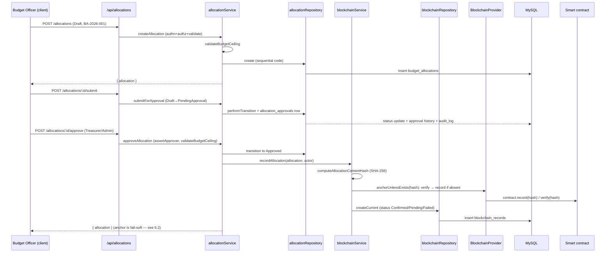
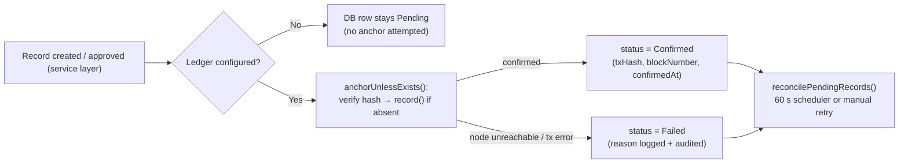
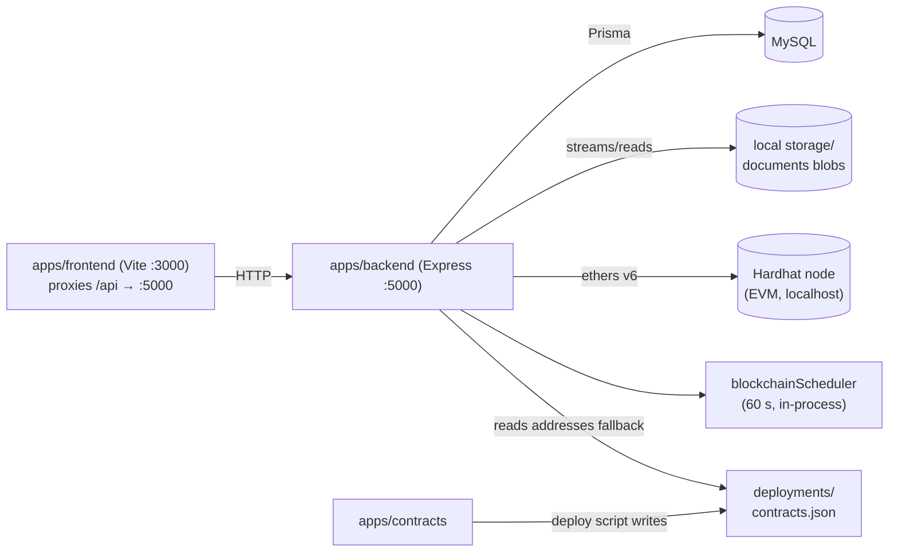

# Architecture — BudgetChain Monorepo

> **Scope:** end-to-end system architecture: repository topology, layered backend, frontend data flow, contracts, key runtime flows, and the local development topology.
> **Source of truth:** the implementation (`apps/backend`, `apps/frontend`, `apps/contracts`, `prisma/schema.prisma`). See `docs/INDEX.md` §6 for the resolution order. Anything not determinable from code is marked *unknown*.

---

## 1. System Context

BudgetChain is a blockchain-themed financial management platform: a university plans budget allocations, routes them through an approval workflow, attaches versioned evidence documents, and anchors tamper-evident proof of records and events on an EVM ledger. It is a three-workspace npm monorepo:

| Workspace | Stack | Role |
|-----------|-------|------|
| `apps/backend` | Express 4 + Prisma 5 + MySQL, ESM | All business logic, REST API on `:5000` |
| `apps/frontend` | React 19 + Vite 6 + TypeScript | SPA on `:3000` (dev), proxies `/api` → backend |
| `apps/contracts` | Hardhat 2 + Solidity 0.8.24 | Immutable on-chain ledgers (BudgetLedger, AuditLedger) |

`packages/shared` exists as a workspace but is a placeholder (README only, no code — *no imports of it were found in any workspace*).

```
┌────────────┐   HTTP /api (JWT)   ┌───────────────────┐   ethers v6   ┌────────────────────┐
│  Frontend  │ ──────────────────► │      Backend      │ ────────────► │   EVM contracts    │
│  React 19  │   Vite proxy 3000   │  Express + Prisma │   record/     │  BudgetLedger /    │
│  (SPA)     │   → 5000            │  (MySQL + local   │   verify      │  AuditLedger       │
└────────────┘                     │   file storage)   │ ◄──────────── │  (Hardhat node)    │
                                   └───────────────────┘
```

---

## 2. Repository Topology

```
capstone/                     (npm workspaces, root package.json:1)
├── apps/
│   ├── backend/              ESM Express API — business logic
│   │   ├── app.js            Express app assembly
│   │   ├── server.js         Bootstrap + blockchain scheduler lifecycle
│   │   ├── config/           env fail-fast, helmet, cors, blockchain, storage, ABI
│   │   ├── constants/        UPPER_SNAKE mirrors of Prisma enums
│   │   ├── controllers/      thin HTTP handlers (JSON envelope)
│   │   ├── errors/           AppError + typed API/Prisma errors
│   │   ├── middleware/       auth, rbac, validate, rate-limit, upload, audit, error
│   │   ├── models/           prismaClient.js
│   │   ├── repositories/     Prisma data access
│   │   ├── routes/           per-module routers, mounted in apiRouter.js
│   │   ├── services/         business logic (incl. blockchain scheduler)
│   │   ├── utils/            jwt, audit, hashing, amounts, responses, file utils
│   │   ├── validators/       Zod schemas + validateRequest middleware
│   │   ├── prisma/           schema.prisma + migrations + seed
│   │   └── tests/            plain node:assert scripts (no test runner)
│   ├── frontend/             React 19 SPA (see §4)
│   └── contracts/            Hardhat project (see §5)
├── packages/shared/          placeholder, no code
└── docs/                     this documentation set
```

---

## 3. Backend Architecture

### 3.1 Layered request pipeline

Every endpoint is assembled in the same strict order: **authentication → authorization → validation**, then a **thin controller → service → repository → Prisma** stack. Router files are the enforcement point.

```
┌────────────────────────────── HTTP request ──────────────────────────────┐
│                                                                          │
│  routes/<module>Routes.js                                                │
│    │                                                                    │
│    ├─▶ authenticate          JWT verify + re-validate user in DB         │
│    │                         (authMiddleware.js:15)                      │
│    ├─▶ authorize(...roles)   RBAC check on req.user.role                 │
│    │                         (rbacMiddleware.js:11)                      │
│    ├─▶ validateRequest(zod,  Zod safeParse of body/query/params          │
│    │        'body'|'query'|  (validateRequest.js:11)                     │
│    │        'params')                                                    │
│    ├─▶ controllers/          thin; calls one service; formats envelope   │
│    ├─▶ services/             business logic, invariants, orchestration   │
│    ├─▶ repositories/         Prisma queries, mapping, soft-delete,       │
│    │                         sequential code generation                  │
│    └─▶ Prisma / MySQL                                                    │
│                                                                          │
│  Responses are standardized via formatSuccessResponse / formatErrorResponse
│  (utils/responseFormatter.js): { success, message, data } and
│  { success, message, errors }.
└──────────────────────────────────────────────────────────────────────────┘
```

- All routers mount in `routes/apiRouter.js:19` under `/api`; a global rate limiter wraps the whole mount (`app.js:37`).
- A module-level `router.use(authenticate)` guards every route; public auth routes (`/auth/login`, `/auth/refresh`) use targeted rate limiters instead (`authRoutes.js:21`).
- Unmatched routes → `middleware/notFoundHandler.js`; errors → central `middleware/errorHandler.js` (normalizes Prisma errors, hides internals in production).

### 3.2 Module inventory

#### Routes → controllers → services → repositories

| Feature | Routes | Controller | Service(s) | Repository(ies) |
|---------|--------|------------|------------|-----------------|
| Auth | `routes/authRoutes.js` | `authController.js` | `services/authService.js` | `userRepository.js`, `refreshTokenRepository.js` |
| Users (Admin) | `routes/userRoutes.js` | `userController.js` | `services/userService.js` | `userRepository.js` |
| Dashboard | `routes/dashboardRoutes.js` | `dashboardController.js` | `services/dashboardService.js` | (cross-repo aggregations) |
| Master data (FY/fund/dept/category/program) | `fiscalYearRoutes.js`, `fundSourceRoutes.js`, `departmentRoutes.js`, `budgetCategoryRoutes.js`, `budgetProgramRoutes.js` | matching controllers | matching services | matching repositories |
| Allocations | `allocationRoutes.js` | `allocationController.js` | `services/allocationService.js` | `allocationRepository.js`, `allocationApprovalRepository.js` |
| Blockchain | `blockchainRoutes.js` | `blockchainController.js` | `blockchainService.js`, `blockchainHistoryService.js`, `blockchainScheduler.js` | `blockchainRepository.js` |
| Documents | `documentRoutes.js` | `documentController.js` | `documentService.js`, `documentStorageService.js`, `documentBlockchainService.js` | `documentRepository.js` |
| Audit | `auditLogRoutes.js` | `auditLogController.js` | `auditLogService.js`, `auditEventBlockchainService.js` | `auditLogRepository.js` |
| Verification | `verificationRoutes.js` | — | `documentBlockchainService.verifyExternalFile` | (streams + hash, no DB write) |
| Timeline | `timelineRoutes.js` | `timelineController.js` | `services/timelineService.js` | (read-time union) |

#### Cross-cutting concerns

| Concern | Files | Behavior |
|---------|-------|----------|
| Env config | `config/env.js` | Loads `.env`, **fails fast** on weak `JWT_SECRET` (< 32 chars), invalid blockchain URL/address/private key, invalid `STORAGE_DRIVER`, invalid `AUDIT_LOG_DB_ENABLED`. Exposes typed `config` object (ports, JWT, CORS, rate limits, blockchain, storage, audit). |
| HTTP hardening | `config/helmet.js`, `config/cors.js`, `middleware/requestLogger.js` | Helmet + CORS + per-request logging; `app.set('trust proxy', 1)` (`app.js:14`) for accurate client IPs. |
| Rate limiting | `middleware/rateLimiter.js` | Global API (100/15 min), auth login (5/15 min), sensitive routes (10/1 h), uploads (20/15 min); all from `config.rateLimit`. |
| Validation | `validators/*.js` + `validators/validateRequest.js` | Zod schemas per module; `validateRequest(schema, target)` normalizes errors to `{ field, message }`. |
| Errors | `errors/appError.js`, `errors/apiError.js`, `errors/prismaError.js` | `AppError` base with `statusCode`/`isOperational`; typed `ValidationError`/`ForbiddenError`/`UnauthorizedError`; Prisma→HTTP mapping in `errorHandler.js`. |
| Authn/Authz | `middleware/authMiddleware.js`, `middleware/rbacMiddleware.js` | JWT verify (signature/exp/issuer/audience) + **DB re-validation** of the account each request so deactivated/deleted users lose access immediately. |
| Audit | `utils/auditLogger.js`, `utils/auditPersistence.js`, `middleware/auditMiddleware.js` | Structured console output + append-only `audit_logs` table (toggle `AUDIT_LOG_DB_ENABLED`, default true); auto-redacts password/token fields; `auditRoute()` wraps endpoints. |
| Money | `utils/amountUtils.js` | `Decimal(14,2)` in MySQL → plain numbers at the API boundary via `toNumber()`. |
| Hashing | `utils/hashUtils.js` | Canonical SHA-256 over all meaning-changing allocation fields; any edit breaks `verify`. |

### 3.3 Config-driven blockchain adapter

`config/blockchain.js` (`BlockchainProvider`) is the single EVM adapter:
- Lazily builds a shared ethers v6 `JsonRpcProvider` + `Wallet` (from `BLOCKCHAIN_PRIVATE_KEY`) and two contract instances (`BudgetLedger` + `AuditLedger`), caching them (`config/blockchain.js:151`).
- Contract addresses resolve from env with fallback to `apps/contracts/deployments/contracts.json` (`config/blockchain.js:106`).
- `isConfigured()` / `isAuditConfigured()` decide whether anchoring is even attempted; `getStatus()` / `getAuditLedgerStatus()` probe connectivity for dashboards without throwing.
- Reads (`verify`, `auditVerify`) need only an RPC URL; writes (`record`, `auditRecord`) additionally require the private key.

### 3.4 Allocation workflow (money of record)

Lifecycle transitions are governed by `constants/allocationStatus.js:33` (`Draft → PendingApproval → Approved | Rejected`, `Approved → Archived`, `PendingApproval/Rejected → Draft`). Key invariants live in `services/allocationService.js`:

- **Budget ceiling** — `validateBudgetCeiling` (`allocationService.js:769`) rejects create/update/approve that would push the fiscal year's *approved* sum over `FiscalYear.budgetAmount`.
- **Separation of duties** — `assertApprover` (`allocationService.js:431`) blocks a user from reviewing their own allocation.
- **History** — every transition writes an `allocation_approvals` row (Submitted/Approved/Rejected/Returned) plus an audit entry.
- **On-chain anchoring** — `performTransition` (`allocationService.js:457`) triggers `blockchainService.recordAllocation` on approval (fail-soft, see §6.2).
- Codes are sequential per fiscal year: `BA-<year>-<NNN>` via `allocationRepository.js:234` (`ALLOCATION_CODE_PREFIX = 'BA'`, `constants/allocationStatus.js:28`).

> **Discrepancy note:** `AGENTS.md` and early INDEX drafts describe the code format as `ALC-2026-0001`. The implementation generates `BA-2026-001` (`padStart(3)`), which this document follows.

---

## 4. Frontend Architecture

### 4.1 Provider hierarchy and bootstrapping

`main.tsx` mounts `App.tsx`, which wraps everything in `QueryClientProvider` (TanStack Query) → `BrowserRouter` → `AuthProvider` → `ToastProvider` → `AppRoutes` (`App.tsx:16`). `AuthProvider` (`context/AuthContext.tsx`) restores the session from `localStorage`, validates it against `GET /api/auth/me` on boot, and exposes `user`, `login`, `logout`, `hasRole`.

### 4.2 Routing

`routes/AppRoutes.tsx` defines the route tree:
- `/login` behind `PublicRoute`; everything else behind `ProtectedRoute` + `DashboardLayout` (sidebar/top nav).
- Per-route role guards (`ProtectedRoute roles={[...]}`), e.g. user management is Administrator-only (`AppRoutes.tsx:59`).
- Legacy path aliases redirect to the new `/budget-allocation/*` URLs (`AppRoutes.tsx:164`).
- **Placeholders (planned, not implemented):** `/budget-allocation/approval-workflow` and `/expense-tracking` render static "Planned feature" panels (`AppRoutes.tsx:109`, `:173`) and are marked `status: 'Planned'` in `components/layout/sidebar/sidebarConfig.ts:102`.

### 4.3 Data flow

```
pages/  ──►  hooks/ (use* — TanStack Query)  ──►  services/*.ts  ──►  api/axios.ts
  ▲                │                                                        │
  │                │ invalidate on mutation success                         │ axios instance
  └────────────────┴────────────────────────────────────────────────────────┘ baseURL '/api'
```

1. **`src/api/axios.ts`** — single axios instance, baseURL `/api`, 30 s timeout. Request interceptor attaches `Bearer` token from `localStorage`; response interceptor performs **single-flight token refresh** on 401 (queues concurrent 401s, replays them with the new token; clears session and redirects to `/login` on failure) (`axios.ts:45`).
2. **`src/services/*.ts`** — thin typed wrappers per resource (allocation, document, blockchain, audit, verification, master data, dashboard).
3. **`src/hooks/*.ts`** — TanStack Query hooks with typed `select` (e.g. `useAllocations.ts:35`), mutations that invalidate related query keys and surface errors via the Toast context.
4. **`src/pages/` + `src/components/`** — feature pages compose hand-rolled UI primitives in `components/ui/` (some Radix-based: Dialog, Select, DropdownMenu) and feature-specific components.

> **Note:** `pages/Dashboard.tsx` bypasses the hooks layer and calls `apiClient` directly with local `useState` for its four fetches (`Dashboard.tsx:34`). This predates the hooks pattern; new pages should follow §4.3.

### 4.4 Styling

Hybrid approach: Tailwind CSS v4 utilities (newer components), Bootstrap 5 classes (`form-control`, `card`, `.btn-*`), and a CSS-variable theme in `src/index.css` (navy `#1B3A5C` → `--color-primary`, gold `#D4A843` → `--color-accent`).

---

## 5. Contracts Architecture

`apps/contracts` is a Hardhat 2 project (Solidity `^0.8.24`), two owner-only ledgers:

| Contract | Storage | API | Guardrails |
|----------|---------|-----|------------|
| `contracts/BudgetLedger.sol` | `mapping(bytes32 → Record)` (contentHash → {anchoredBy, anchoredAt, blockNumber}) + `_recordCount` | `record`, `verify`, `getRecord`, `recordCount`, `owner` | `NotOwner()`, `HashAlreadyRecorded()` — reverts on duplicate hash |
| `contracts/AuditLedger.sol` | `mapping(bytes32 → AuditEvent)` (eventHash → {category, anchoredBy, anchoredAt, blockNumber}) + per-category + total counters | `recordEvent`, `verifyEvent`, `getAuditEvent`, `eventCount`, `totalEvents`, `owner` | `NotOwner()`, `InvalidCategory()`, `EventAlreadyRecorded()` |

Both anchor SHA-256 digests only — no PII or financial data is stored on-chain. Duplicate-hash reverts make re-anchoring idempotent, which the backend exploits in its crash-window recovery (`anchorUnlessExists`, `blockchainService.js:337`).

### Deployment flow

`npm run blockchain:deploy` (root `package.json:21`) runs `apps/contracts/scripts/deploy.js`, which deploys both contracts and writes `{ address, auditLedgerAddress, abi, network, chainId, ... }` to `apps/contracts/deployments/contracts.json`. The backend reads that file as a fallback for both addresses (`config/blockchain.js:29`). Smoke/test scripts: `scripts/smoke.js`, `test/BudgetLedger.test.js`, `test/AuditLedger.test.js`.

---

## 6. Key Runtime Flows

### 6.1 Allocation create → approve → anchor



### 6.2 Blockchain anchoring — fail-soft by design

Anchoring must never break the allocation/document/audit lifecycle. The DB mirror (`blockchain_records`, `document_versions.blockchainStatus`, `audit_logs.anchorStatus`) records `Pending` / `Confirmed` / `Failed`:



- **Crash-window safety** — if an on-chain write succeeded but the DB mirror never persisted, re-submitting would revert with `HashAlreadyRecorded`; `anchorUnlessExists` (`blockchainService.js:337`) recovers `txHash`/`blockNumber`/`anchoredAt` from the contract instead.
- **No duplicate anchors** — `contentHash` and `eventHash` are `@unique` in MySQL and the contracts revert on duplicates.
- **Supersession** — a new approval after a return-to-draft marks the prior live `BlockchainRecord` superseded (`supersededAt`) rather than accumulating stale current records (`blockchainService.js:37`).
- **Scheduler** — `services/blockchainScheduler.js` runs in-process every 60 s (`start()`, default 60000 ms), started from `server.js:15`, stopped on graceful shutdown. It retries unconfirmed allocation records, document versions, and audit anchors with a synthetic `System` actor; guarded against overlapping runs (`isProcessing`).

Three anchor sources feed three statuses and merge at read time in `services/blockchainHistoryService.js` into a single type-aware ledger history (`recordType: Allocation | Document | Audit`), paginated in memory.

### 6.3 Document lifecycle

- **Upload** — `middleware/uploadMiddleware.js` (multer + MIME/ext/magic-byte checks, configurable size limit) → `documentService.uploadDocument` validates references (fiscal year, department, allocation), streams bytes to the local driver hashing in the same pass (`documentStorageService.js:56`), rejects byte-identical duplicates (SHA-256), then persists document + version atomically and records `UPLOAD` activity.
- **Replace** — creates a new immutable version (previous versions stay stored/downloadable), enforces `MAX_DOCUMENT_VERSIONS` (default 50), records `REPLACE` activity.
- **Download/preview** — attachment for anything; inline for PDFs/images only (`documentService.js:27`).
- **Anchor** — each version is anchored on BudgetLedger via `documentBlockchainService` (fail-soft, scheduler-retryable).
- **Archive/soft-delete** — keeps all versions and blobs (chain of evidence); ownership rules in `assertCanModify` (`documentService.js:517`): Administrators may modify any document, other roles only their own.
- **External verification** — `documentBlockchainService.verifyExternalFile` streams an uploaded file, hashes it, **never stores it**, then matches against stored document hashes and the on-chain ledger; reports `verifiedAgainst: 'blockchain' | 'database' | 'none'`.

### 6.4 Audit trail

`utils/auditLogger.js` produces structured logs with actor/IP/resource/details and redacts passwords/tokens (case- and separator-insensitive key match). Entries are (optionally) persisted to the append-only `audit_logs` table and each gets a unique `eventHash` anchored on AuditLedger via `auditEventBlockchainService`. Queryable through `auditLogRoutes.js` with filters, summaries, and per-entry re-anchoring.

### 6.5 Unified read models (dashboard)

Both the **financial activity timeline** (`services/timelineService.js`) and the **ledger history** (`services/blockchainHistoryService.js`) are read-time unions over existing tables — they never duplicate data:
- Timeline: allocation approvals ∪ document activities ∪ audit logs ∪ blockchain anchors, normalized to one shape, sorted, paginated (max 100).
- Ledger history: allocation anchors ∪ document anchors ∪ audit anchors, merged and sorted, paginated (max 100).

---

## 7. Cross-Cutting Design Decisions

- **ESM everywhere in backend** — `"type": "module"`; local imports require the `.js` extension.
- **Prisma as the only DB access path** — repositories own all queries; migrations are append-only in `prisma/migrations/` (8 migrations: init → master data → allocations → approval workflow → blockchain records → supersededAt → document management → audit logs).
- **Enums are PascalCase in Prisma** (`Administrator`, `PendingApproval`) and mirrored as UPPER_SNAKE constants in `apps/backend/constants/`.
- **Money is Decimal(14,2)** in the DB and plain numbers at the API boundary (`toNumber`).
- **Soft deletes** — allocations (`deletedAt`), documents (`deletedAt`), archived documents and archived allocations excluded from budget sums.
- **Fail-fast config** — `config/env.js` aborts startup on a weak `JWT_SECRET` or malformed blockchain/storage/audit settings rather than degrading silently.
- **Fail-soft writes** — blockchain anchoring and document blob storage never break the primary DB transaction; failures are logged/audited and recoverable.

---

## 8. Development / Deployment Topology



- Local dev only: `npm run dev:backend` (backend :5000, `node --watch`), `npm run dev:frontend` (Vite :3000 with `/api` proxy). Dev requires a running MySQL DB and `apps/backend/.env` (`JWT_SECRET` ≥ 32 chars).
- **No Docker/Kubernetes/CI/deployment config exists in the repo** — production deployment topology is *unknown*.
- Contract deployment is manual: `blockchain:node` (Hardhat node) then `blockchain:deploy`, then the backend picks up `contracts.json` (or explicit env vars).
- Backend tests need no DB and no test runner (plain `node:assert` scripts with monkey-patched repositories); frontend tests use Vitest + Testing Library; contract tests use Hardhat.

---

## 9. Discrepancies / Notes vs. Prose

- **Allocation code format** — `AGENTS.md`/stale INDEX text says `ALC-2026-0001`; code generates `BA-2026-001` (`constants/allocationStatus.js:28`, `repositories/allocationRepository.js:234`).
- **S3 storage** — `STORAGE_DRIVER=s3` is validated (`config/env.js:64`) but no S3 implementation exists; only `local` is implemented, so `s3` fails at runtime (service-layer 503). See `documentStorageService.js:14`.
- **Audit DB persistence** — `AUDIT_LOG_DB_ENABLED` defaults to `true` (`config/env.js:138`); whether it was ever disabled in a real deployment is *unknown*.
- **Dashboard page** — `pages/Dashboard.tsx` uses direct `apiClient` calls + `useState` rather than the TanStack Query hooks pattern (historical; new code follows the hooks pattern).
- **Unified history pagination** — the ledger-history and timeline unions fetch full filtered sets per source and paginate in memory (capped at 100/page); documented in code comments in `blockchainHistoryService.js:16` and `timelineService.js:11`.

---

## 10. Related Documentation

- `docs/PROJECT_OVERVIEW.md` — purpose, features, users, workflows, technology.
- `docs/INDEX.md` — navigation, source-of-truth hierarchy, maintenance guidelines.
- Topic docs (backend, database, api, frontend, contracts, blockchain, testing) — see `docs/INDEX.md` §8.
