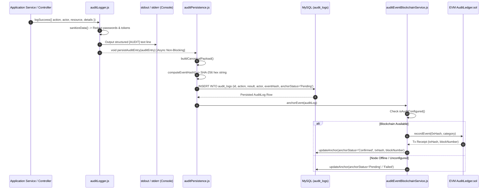
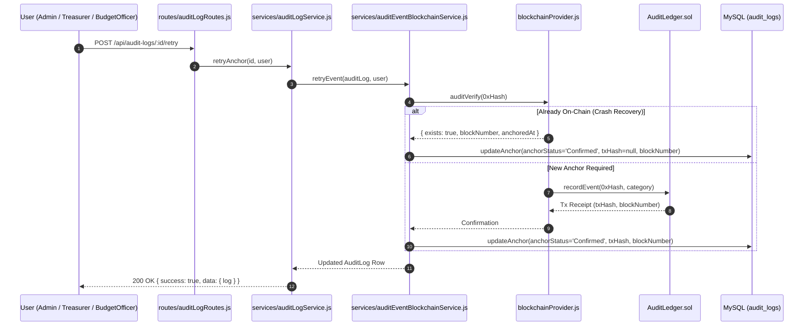

# Audit Logs — BudgetChain

> **Scope:** complete technical reference for structured audit logging, automatic sensitive data redaction, fire-and-forget database persistence, canonical SHA-256 event hashing, EVM smart contract anchoring (`AuditLedger`), and REST APIs in BudgetChain.  
> **Source of truth:** the implementation (`apps/backend/routes/auditLogRoutes.js`, `apps/backend/controllers/auditLogController.js`, `apps/backend/services/auditLogService.js`, `apps/backend/services/auditEventBlockchainService.js`, `apps/backend/repositories/auditLogRepository.js`, `apps/backend/validators/auditLogValidator.js`, `apps/backend/utils/auditLogger.js`, `apps/backend/utils/auditPersistence.js`, `apps/backend/constants/auditActions.js`, `apps/backend/prisma/schema.prisma`).

---

## 1. Purpose

The **Audit Logs** module provides an immutable, tamper-evident audit trail of all security, authentication, user administration, master data, budget allocation, and document management activities across BudgetChain.

Key responsibilities:
- **Dual-Destination Event Logging:** Emitting structured console logs for real-time monitoring while asynchronously persisting immutable rows into MySQL (`audit_logs`).
- **Sensitive Data Redaction:** Automatically stripping passwords, tokens, secrets, and authorization headers from event details.
- **Canonical Cryptographic Hashing:** Computing a 64-character SHA-256 hash (`eventHash`) for every audit event payload.
- **On-Chain Event Anchoring:** Fail-soft anchoring of event hashes on the `AuditLedger` EVM smart contract.
- **Audit Verification & Recovery:** Providing summary metrics, status filtering, and manual/scheduler re-anchoring for pending or failed ledger anchors.

---

## 2. Features

- **Automated Parameter Redaction:** `sanitizeData` recursively inspects event details and replaces sensitive keys (`password`, `token`, `refreshtoken`, `secret`, `authorization`) with `[REDACTED]`.
- **Non-Blocking Fire-and-Forget Persistence:** `auditLogger.log()` fires `void persistAuditEntry(auditEntry)`. Database writes run asynchronously outside the HTTP request path so logging errors never block or abort operational workflows.
- **Immutable Append-Only Database Model:** The `AuditLogRepository` exposes only `create`, `findById`, `findMany`, `count`, and `updateAnchor` methods. Audit content columns (`action`, `actorId`, `details`, `eventHash`) cannot be modified or deleted.
- **Canonical SHA-256 Event Hashing:** `buildCanonicalPayload` formats event attributes into a fixed-structure payload, generating a unique, reproducible `eventHash`.
- **Fail-Soft EVM Ledger Anchoring:** Freshly persisted audit events trigger `auditEventBlockchainService.anchorEvent`. If the blockchain node is offline or unconfigured, the row remains `Pending` or `Failed` without rolling back the DB record.
- **Verify-Before-Record Crash Recovery:** Before submitting a transaction to `AuditLedger.sol`, `anchorUnlessExists` queries `blockchainProvider.auditVerify(hexHash)`. If a crash occurred after on-chain mining but before DB update, the system recovers the existing on-chain receipt without triggering a contract revert.
- **Recursion Loop Protection:** The persistence sink explicitly bypasses `AUDIT_ANCHOR_RETRY` actions to prevent infinite self-referential logging loops.

---

## 3. Workflow & Architecture

### 3.1 Dual-Destination Audit Logging Pipeline



### 3.2 Audit Re-Anchoring Pipeline



---

## 4. Controllers

The controller layer lives in [`apps/backend/controllers/auditLogController.js`](file:///d:/Ramisys%20files/Projects/capstone/apps/backend/controllers/auditLogController.js).

### Controller Methods Summary

| Method | Target Service Method | Status Code | Audit Action | Description |
|--------|-----------------------|-------------|--------------|-------------|
| `getLogs` [`line 12`](file:///d:/Ramisys%20files/Projects/capstone/apps/backend/controllers/auditLogController.js#L12) | `auditLogService.getLogs` | `200 OK` | N/A | Returns paginated, filtered audit logs. |
| `getLogById` [`line 49`](file:///d:/Ramisys%20files/Projects/capstone/apps/backend/controllers/auditLogController.js#L49) | `auditLogService.getLogById` | `200 OK` | N/A | Returns single audit log by ID. |
| `getSummary` [`line 67`](file:///d:/Ramisys%20files/Projects/capstone/apps/backend/controllers/auditLogController.js#L67) | `auditLogService.getSummary` | `200 OK` | N/A | Returns total, success/failure, and pending anchor counts. |
| `retryAnchor` [`line 84`](file:///d:/Ramisys%20files/Projects/capstone/apps/backend/controllers/auditLogController.js#L84) | `auditLogService.retryAnchor` | `200 OK` | `AUDIT_ANCHOR_RETRY` | Re-anchors a `Pending`/`Failed` audit log entry on EVM ledger. |

---

## 5. Services

### 5.1 `AuditLogService` ([`apps/backend/services/auditLogService.js`](file:///d:/Ramisys%20files/Projects/capstone/apps/backend/services/auditLogService.js))
- **`getLogs(filters, pagination, ordering)`**: Retrieves filtered audit log rows and total counts; converts BigInt `blockNumber` values to numbers and appends block explorer URLs (`txExplorerUrl`).
- **`getLogById(id)`**: Fetches single entry by ID; throws `404 Not Found` if missing.
- **`getSummary()`**: Aggregates total logs, success count, failure count, pending anchor count, and breakdown by action.
- **`retryAnchor(id, actor)`**: Resolves log entry and invokes `auditEventBlockchainService.retryEvent`.

### 5.2 `AuditEventBlockchainService` ([`apps/backend/services/auditEventBlockchainService.js`](file:///d:/Ramisys%20files/Projects/capstone/apps/backend/services/auditEventBlockchainService.js))
- **`anchorEvent(auditLog)`**: Fail-soft anchor called during event persistence. Returns un-updated log if unconfigured or already confirmed.
- **`retryEvent(auditLog, actor)`**: Re-anchors log entry on `AuditLedger`. Throws `503 Service Unavailable` if ledger is unconfigured or call fails.
- **`anchorUnlessExists(eventHash, category)`**: Checks `blockchainProvider.auditVerify(0xHash)` first to prevent duplicate recording reverts.

### 5.3 `AuditLogger` & `AuditPersistence` ([`auditLogger.js`](file:///d:/Ramisys%20files/Projects/capstone/apps/backend/utils/auditLogger.js) & [`auditPersistence.js`](file:///d:/Ramisys%20files/Projects/capstone/apps/backend/utils/auditPersistence.js))
- **`sanitizeData(data)`**: Recursively replaces sensitive parameter values with `[REDACTED]`.
- **`buildCanonicalPayload(entry, id)`**: Formats event attributes into a deterministic JSON object.
- **`computeEventHash(payload)`**: Calculates `crypto.createHash('sha256').update(JSON.stringify(payload)).digest('hex')`.

---

## 6. Database & Schema

### 6.1 Prisma Models

Defined in [`apps/backend/prisma/schema.prisma`](file:///d:/Ramisys%20files/Projects/capstone/apps/backend/prisma/schema.prisma#L260-L293):

```prisma
enum AuditResult {
  Success
  Failure
}

enum AuditAnchorStatus {
  Pending
  Confirmed
  Failed
}

model AuditLog {
  id           String            @id @default(uuid())
  action       String            @db.VarChar(100)
  result       AuditResult       @default(Success)
  actorId      String?
  actorEmail   String?           @db.VarChar(255)
  actorName    String?           @db.VarChar(255)
  actorRole    String?           @db.VarChar(50)
  ip           String?           @db.VarChar(45)
  resourceType String?           @db.VarChar(100)
  resourceId   String?
  resourceCode String?           @db.VarChar(100)
  details      Json?
  eventHash    String?           @unique
  anchorStatus AuditAnchorStatus @default(Pending)
  txHash       String?           @unique
  blockNumber  BigInt?
  network      String?
  confirmedAt  DateTime?
  createdAt    DateTime          @default(now())

  @@index([action])
  @@index([result])
  @@index([actorId])
  @@index([resourceType])
  @@index([resourceId])
  @@index([anchorStatus])
  @@index([createdAt])
  @@map("audit_logs")
}
```

### 6.2 Data Repository

Implemented in [`apps/backend/repositories/auditLogRepository.js`](file:///d:/Ramisys%20files/Projects/capstone/apps/backend/repositories/auditLogRepository.js):
- **`create(data)`**: Appends a new immutable audit log row.
- **`updateAnchor(id, data)`**: Modifies only `anchorStatus`, `txHash`, `blockNumber`, `network`, and `confirmedAt`.
- **`findUnconfirmed(limit)`**: Fetches pending anchor rows ordered by `createdAt asc` for the background scheduler.

---

## 7. APIs

Mounted under `/api/audit-logs` in [`apps/backend/routes/auditLogRoutes.js`](file:///d:/Ramisys%20files/Projects/capstone/apps/backend/routes/auditLogRoutes.js). All endpoints require authentication (`authenticate`).

### API Endpoints Reference

| Method | Route Path | Access Permission | Validation Schema | Description |
|--------|------------|-------------------|-------------------|-------------|
| `GET` | `/api/audit-logs` | Private (All Roles) | `auditLogQuerySchema` | Paginated audit log list with filters |
| `GET` | `/api/audit-logs/summary` | Private (All Roles) | N/A | Summary counts (total, success/failure, pending anchors) |
| `GET` | `/api/audit-logs/:id` | Private (All Roles) | `auditLogIdParamSchema` | Fetch single audit log entry by ID |
| `POST` | `/api/audit-logs/:id/retry` | Private (Admin, Treasurer, BudgetOfficer) | `auditLogIdParamSchema` | Re-anchor `Pending`/`Failed` entry on `AuditLedger` |

---

## 8. Permissions & RBAC

### Authorization Matrix

| Endpoint / Operation | Administrator | Treasurer | BudgetOfficer | Auditor |
|----------------------|:-------------:|:---------:|:-------------:|:-------:|
| Read Logs (`GET /api/audit-logs*`) | ✅ Allowed | ✅ Allowed | ✅ Allowed | ✅ Allowed |
| Retry Anchor (`POST /api/audit-logs/:id/retry`) | ✅ Allowed | ✅ Allowed | ✅ Allowed | ❌ 403 Forbidden |

---

## 9. Business Rules & Integrity Constraints

### Rule 1: Automated Parameter Redaction
- **Enforcement:** `auditLogger.sanitizeData` ([`auditLogger.js:24`](file:///d:/Ramisys%20files/Projects/capstone/apps/backend/utils/auditLogger.js#L24)).
- **Constraint:** Any key matching `password`, `passwordconfirm`, `token`, `refreshtoken`, `accesstoken`, `secret`, or `authorization` is replaced with `[REDACTED]`.

### Rule 2: Non-Blocking Fire-and-Forget Persistence
- **Enforcement:** `auditLogger.log` ([`auditLogger.js:163`](file:///d:/Ramisys%20files/Projects/capstone/apps/backend/utils/auditLogger.js#L163)).
- **Constraint:** `void persistAuditEntry(auditEntry)` runs asynchronously without `await`. Database persistence errors log to `stderr` and never fail the HTTP request.

### Rule 3: Content Immutability
- **Enforcement:** `AuditLogRepository` ([`auditLogRepository.js:10`](file:///d:/Ramisys%20files/Projects/capstone/apps/backend/repositories/auditLogRepository.js#L10)).
- **Constraint:** Audit content columns (`action`, `result`, `actorId`, `details`, `eventHash`) cannot be edited or deleted. Only blockchain anchoring metadata can be updated via `updateAnchor`.

### Rule 4: Recursion Loop Prevention
- **Enforcement:** `persistAuditEntry` ([`auditPersistence.js:110`](file:///d:/Ramisys%20files/Projects/capstone/apps/backend/utils/auditPersistence.js#L110)).
- **Constraint:** Entries with action `AUDIT_ANCHOR_RETRY` are excluded from DB persistence to avoid self-sustaining infinite logging loops.

### Rule 5: Verify-Before-Record Crash Recovery
- **Enforcement:** `auditEventBlockchainService.anchorUnlessExists` ([`auditEventBlockchainService.js:150`](file:///d:/Ramisys%20files/Projects/capstone/apps/backend/services/auditEventBlockchainService.js#L150)).
- **Constraint:** Before invoking `AuditLedger.recordEvent`, the service queries `blockchainProvider.auditVerify(hexHash)`. If the hash exists on-chain, the receipt is recovered without making a duplicate transaction call.
