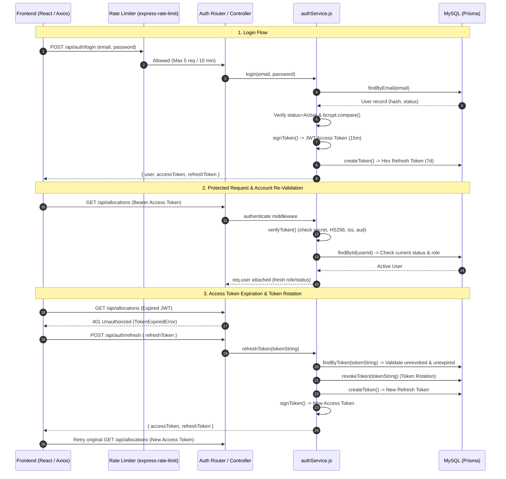
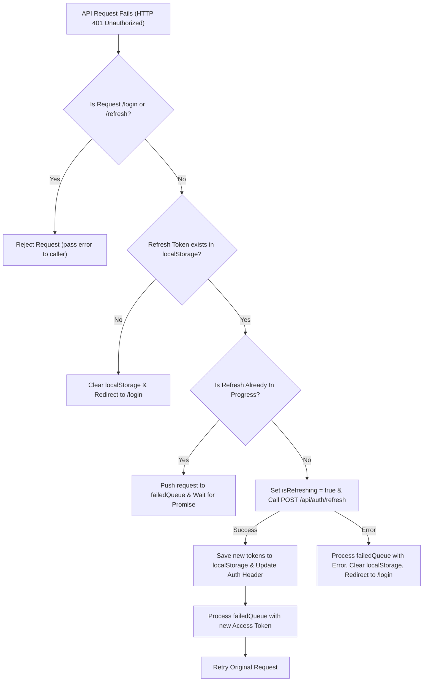

# Authentication & Session Security — BudgetChain

> **Scope:** complete technical reference for user authentication, authorization, session management, JWT lifecycles, password security, middleware, and rate limiting in BudgetChain.  
> **Source of truth:** the implementation (`apps/backend/services/authService.js`, `apps/backend/middleware/authMiddleware.js`, `apps/backend/utils/jwt.js`, `apps/backend/utils/password.js`, `apps/frontend/src/context/AuthContext.tsx`, `apps/frontend/src/api/axios.ts`).

---

## 1. Architecture & Security Overview

BudgetChain uses a **stateless access token + stateful refresh token** security model coupled with database re-validation on every request.



Key features of this design:
- **Instant Revocation**: Because `authenticate` re-queries the user status from MySQL on every request, deactivating or deleting a user revokes API access instantly, without waiting for the 15-minute access token to expire.
- **Token Rotation**: Using a refresh token invalidates it immediately and issues a fresh pair, preventing replay attacks if a refresh token is leaked.
- **Fail-Fast Secret Validation**: The backend refuses to start if `JWT_SECRET` is omitted or contains fewer than 32 characters (`apps/backend/config/env.js:9-14`).

---

## 2. Login

### 2.1 Route & Endpoint Definition
- **Route**: `POST /api/auth/login` (`apps/backend/routes/authRoutes.js:21`)
- **Access**: Public, protected by `authLoginLimiter` (5 attempts per 15-minute window per IP).
- **Validation**: Request body validated against `loginSchema` (`apps/backend/validators/authValidator.js:6-14`).

```json
// Request Body
{
  "email": "admin@university.edu",
  "password": "AdminPassword123!"
}
```

### 2.2 Controller & Service Pipeline
1. `validateRequest(loginSchema)` validates email format and non-empty password.
2. `authService.login(email, password)` (`apps/backend/services/authService.js:16`):
   - Queries `userRepository.findByEmail(email)`.
   - If user does not exist: throws `UnauthorizedError('Invalid credentials')` (HTTP 401).
   - If `user.status !== 'Active'`: throws `ForbiddenError('Account is inactive. Please contact the administrator.')` (HTTP 403).
   - Verifies password hash using `comparePassword(password, user.password)`. If mismatched: throws `UnauthorizedError('Invalid credentials')` (HTTP 401).
   - Issues a signed JWT access token (`signToken`) containing `id`, `email`, and `role`.
   - Generates a cryptographically random refresh token (`generateRefreshToken`) and persists it in `refresh_tokens` table via `refreshTokenRepository.createToken`.
   - Strips `password` from the returned user object (`const { password: _, ...userWithoutPassword } = user`).
3. Logs audit entry (`AUDIT_ACTIONS.AUTH_LOGIN`) with result (`SUCCESS` or `FAILURE`), actor, and resource info (`apps/backend/controllers/authController.js:20-46`).

### 2.3 Success Response Envelope
```json
{
  "success": true,
  "message": "Login successful",
  "data": {
    "user": {
      "id": "c1f7a074-7a32-4d0d-9b5d-1f6b864a7812",
      "fullName": "Admin User",
      "email": "admin@university.edu",
      "role": "Administrator",
      "status": "Active",
      "createdAt": "2026-08-01T00:00:00.000Z",
      "updatedAt": "2026-08-01T00:00:00.000Z"
    },
    "token": "eyJhbGciOiJIUzI1NiIsInR5cCI6IkpXVCJ9...",
    "accessToken": "eyJhbGciOiJIUzI1NiIsInR5cCI6IkpXVCJ9...",
    "refreshToken": "4a7f0e...5c91b2"
  }
}
```

---

## 3. Logout

### 3.1 Route & Endpoint Definition
- **Route**: `POST /api/auth/logout` (`apps/backend/routes/authRoutes.js:39`)
- **Access**: Public / Private (uses `optionalAuth` middleware; accepts request even if access token is expired).

### 3.2 Invalidation & Cleanup Steps
1. **Server-Side Revocation** (`apps/backend/services/authService.js:106-114`):
   - If `refreshToken` is provided in `req.body`, it is marked as revoked (`revokedAt = new Date()`) in database via `refreshTokenRepository.revokeToken`.
   - If `req.user` is present, `refreshTokenRepository.revokeAllUserTokens(userId)` revokes *all* active refresh tokens belonging to that user.
2. **Audit Trail**: Logs `AUDIT_ACTIONS.AUTH_LOGOUT` (`apps/backend/controllers/authController.js:99`).
3. **Client-Side State Cleanup** (`apps/frontend/src/context/AuthContext.tsx:24-36`):
   - `AuthContext.logout()` clears local storage keys: `auth_token`, `refresh_token`, `auth_user`.
   - Resets context user state to `null`.

---

## 4. Sessions & State Management

### 4.1 Hybrid Session Model
- **Client Session**: Stateless JWT access token sent in HTTP header `Authorization: Bearer <token>`.
- **Database Session**: Persisted in MySQL (`refresh_tokens` table).

```prisma
model RefreshToken {
  id        String    @id @default(uuid())
  token     String    @unique
  userId    String
  user      User      @relation(fields: [userId], references: [id], onDelete: Cascade)
  expiresAt DateTime
  revokedAt DateTime?
  createdAt DateTime  @default(now())
  updatedAt DateTime  @updatedAt

  @@index([token])
  @@index([userId])
  @@index([expiresAt])
  @@map("refresh_tokens")
}
```

### 4.2 Current Profile (`/api/auth/me`)
- **Endpoint**: `GET /api/auth/me` (`apps/backend/routes/authRoutes.js:48`)
- **Access**: Authenticated (`authenticate` middleware).
- **Behavior**: Retrieves fresh user profile from DB excluding password (`authService.getCurrentUserProfile`).
- **Frontend Initialization**: On app mount, `AuthProvider` calls `authApi.me()` to verify the token validity and hydrate current user state (`apps/frontend/src/context/AuthContext.tsx:56-103`).

---

## 5. JWT Implementation

### 5.1 Configuration & Defaults
Environment settings loaded in `apps/backend/config/env.js:99-105`:

| Parameter | Environment Variable | Default Value | Description |
|-----------|----------------------|---------------|-------------|
| Secret Key | `JWT_SECRET` | *(Required)* | Min 32 chars random string; fails server startup if missing/short |
| Access Expiry | `JWT_EXPIRES_IN` | `15m` | Lifetime of short-lived access token |
| Refresh Expiry | `JWT_REFRESH_EXPIRES_IN` | `7d` | Lifetime of database refresh token |
| Issuer | `JWT_ISSUER` | `budgetchain-api` | `iss` claim inserted and verified in token |
| Audience | `JWT_AUDIENCE` | `budgetchain-web` | `aud` claim inserted and verified in token |

### 5.2 Token Payload & Signing
Access tokens are signed using `HS256` in `apps/backend/utils/jwt.js:15-23`:

```javascript
// Payload Structure
{
  "id": "c1f7a074-7a32-4d0d-9b5d-1f6b864a7812",
  "email": "admin@university.edu",
  "role": "Administrator",
  "iss": "budgetchain-api",
  "aud": "budgetchain-web",
  "jti": "5a9d8212-4c28-4e1a-8f72-9b380b2a8d11", // Unique UUID per token
  "iat": 1754450000,
  "exp": 1754450900
}
```

### 5.3 Cryptographic Rules & Verification
- `jwt.sign()` pins algorithm to `HS256` explicitly.
- `jwt.verify()` enforces `algorithms: ['HS256']`, `issuer`, and `audience` (`apps/backend/utils/jwt.js:35-41`). Requests with mismatched claims or forged signatures throw `UnauthorizedError`.

---

## 6. Password Handling

### 6.1 Hashing & Verification
Passwords are hashed using `bcryptjs` with **10 salt rounds** (`apps/backend/utils/password.js:3`).

```javascript
// apps/backend/utils/password.js
export const hashPassword = async (password) => {
  return await bcrypt.hash(password, SALT_ROUNDS);
};

export const comparePassword = async (password, hashedPassword) => {
  return await bcrypt.compare(password, hashedPassword);
};
```

### 6.2 Data Sanitation & Redaction
- **Database Model**: User model stores bcrypt string in `password` field (`apps/backend/prisma/schema.prisma:261`).
- **Service Layer**: Every user-returning method destructures and excludes password before sending to controller/client (`const { password: _, ...userWithoutPassword } = user`).
- **Audit Logger**: `auditLogger.js` automatically strips `password`, `token`, and `refreshToken` fields before writing log output to prevent secret leakage in server logs.

---

## 7. Token Lifecycle & Axios Interceptor Flow

### 7.1 Refresh Token Generation
Refresh tokens are 64-character hex strings generated from two concatenated Node.js `crypto.randomUUID()` values with dashes removed (`apps/backend/utils/jwt.js:68-73`).

### 7.2 Token Rotation Procedure (`POST /api/auth/refresh`)
1. Client sends `{ refreshToken }` to `/api/auth/refresh`.
2. Service looks up token record in `refresh_tokens` table (`refreshTokenRepository.findByToken`).
3. Validates:
   - Token exists.
   - `revokedAt` is null.
   - `expiresAt > new Date()`.
   - Associated user is active (`user.status === 'Active'`).
4. **Rotates Token**: Calls `refreshTokenRepository.revokeToken(oldToken)` to set `revokedAt = new Date()`.
5. Creates a brand new refresh token in DB (`createToken`) and signs a new access token (`signToken`).
6. Returns new token pair to caller.

### 7.3 Axios Interceptor Queueing Flow (`apps/frontend/src/api/axios.ts`)
The React frontend handles token expiry transparently without interrupting the user:



---

## 8. Middleware Reference

### 8.1 Authentication Middleware (`authenticate`)
- **File**: `apps/backend/middleware/authMiddleware.js:15`
- **Responsibilities**:
  1. Extracts `Bearer` token from `Authorization` header.
  2. Verifies JWT signature and expiry via `verifyToken(token)`.
  3. Queries database for current user record (`userRepository.findById(decoded.id)`).
  4. Checks user `status === 'Active'`.
  5. Attaches sanitized payload to `req.user` (`{ id, email, fullName, role, status }`).

### 8.2 Authorization Middleware (`authorize`)
- **File**: `apps/backend/middleware/rbacMiddleware.js:11`
- **Usage**: `authorize('Administrator', 'Treasurer')`
- **Behavior**: Verifies `req.user.role` is in the allowed arguments list. If missing or unauthorized, logs warning and returns HTTP 403 `ForbiddenError`.

### 8.3 Rate Limiting Middleware (`express-rate-limit`)
- **File**: `apps/backend/middleware/rateLimiter.js`
- **Key Limiters**:
  - `authLoginLimiter`: Applied to `POST /api/auth/login` (5 requests / 15 min per IP).
  - `globalLimiter`: Applied to `/api/*` (100 requests / 15 min per IP).
  - `sensitiveRouteLimiter`: 10 requests / 1 hour per IP.

---

## 9. Security Matrix

| Threat Model | Defensive Controls | Source Code Location |
|--------------|-------------------|----------------------|
| **Brute-Force Login** | Strict per-IP rate limiting (5 req / 15 min) + generic error messages ("Invalid credentials") | `apps/backend/middleware/rateLimiter.js:44`, `apps/backend/services/authService.js:20` |
| **Weak JWT Secret** | Mandatory 32+ char random string validation on backend startup | `apps/backend/config/env.js:9-14` |
| **Algorithm Confusion (`alg: none`)** | Access token verification explicitly restricts allowed algorithm to `HS256` | `apps/backend/utils/jwt.js:37` |
| **Token Theft / Stolen Access Token** | Short token lifespan (15m) + DB user re-validation on every request (immediate cutoff on status change) | `apps/backend/middleware/authMiddleware.js:39-47` |
| **Refresh Token Replay** | Refresh Token Rotation (revoked immediately on use, new token issued) | `apps/backend/services/authService.js:77-90` |
| **Credential Leakage in Logs** | Automatic redaction of `password`, `token`, `refreshToken` in audit log utility | `apps/backend/utils/auditLogger.js` |
| **Stale Session Claims** | DB lookup in `authenticate` attaches fresh user role from DB rather than trusting decoded token payload | `apps/backend/middleware/authMiddleware.js:49-55` |
| **Privilege Escalation** | Endpoint-level `authorize(...roles)` middleware enforcing RBAC before controller execution | `apps/backend/middleware/rbacMiddleware.js:11` |

---

## 10. Summary of Auth Endpoints

| Endpoint | Method | Middleware Stack | Purpose |
|----------|--------|------------------|---------|
| `/api/auth/login` | `POST` | `authLoginLimiter`, `validateRequest(loginSchema)` | Authenticates credentials, returns user profile + token pair |
| `/api/auth/refresh` | `POST` | `validateRequest(refreshTokenSchema)` | Rotates refresh token, issues new access token |
| `/api/auth/logout` | `POST` | `optionalAuth` | Revokes refresh tokens server-side, cleans session |
| `/api/auth/me` | `GET` | `authenticate` | Returns authenticated user profile from DB |
