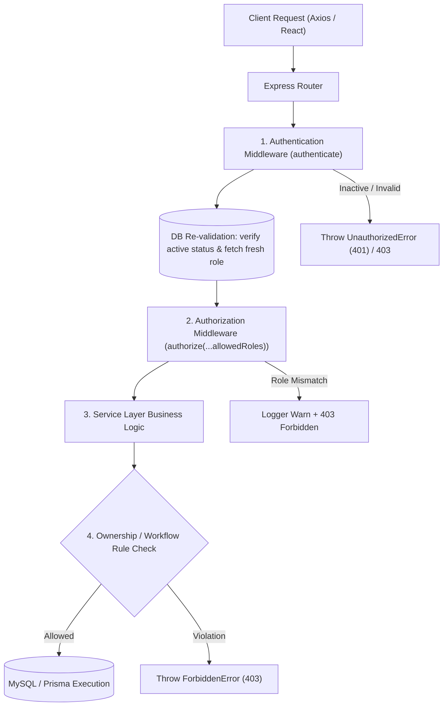

# Authorization & Access Control — BudgetChain

> **Scope:** technical reference for Role-Based Access Control (RBAC), permission matrices, route protection, authorization middleware, service-layer ownership rules, and frontend access guards in BudgetChain.  
> **Source of truth:** the implementation (`apps/backend/middleware/rbacMiddleware.js`, `apps/backend/middleware/authMiddleware.js`, `apps/backend/routes/`, `apps/backend/services/`, `apps/frontend/src/components/guards/ProtectedRoute.tsx`, `apps/frontend/src/routes/AppRoutes.tsx`).

---

## 1. Overview & Architecture

BudgetChain enforces a multi-layered access control model combining **Role-Based Access Control (RBAC)** at the HTTP route level with **Service-Layer Ownership & Business Rule Enforcement** in backend services, accompanied by **Client-Side Route Guarding & UI Trimming** on the frontend.



### Key Security Principles

1. **Defense-in-Depth:** Route-level RBAC (`authorize`) filters requests early by institutional role. Services then execute fine-grained business logic (e.g. self-approval prevention, document upload ownership, last administrator protection).
2. **Fresh DB Re-Validation:** On every request, `authenticate` queries the user from MySQL. Deactivating or demoting a user revokes permissions immediately across all endpoints without waiting for JWT expiration.
3. **Explicit Role Whitelisting:** Endpoints explicitly enumerate allowed roles via `authorize(ROLES.ADMINISTRATOR, ROLES.TREASURER)`. Unhandled routes or unauthenticated requests default to denial.
4. **Structured Audit Attribution:** Every authorization decision and mutating action is tied to `req.user.id` and `req.user.role`, recorded via `auditLogger`.

---

## 2. Institutional Roles

System roles are defined as string constants in [`apps/backend/constants/roles.js`](file:///d:/Ramisys%20files/Projects/capstone/apps/backend/constants/roles.js) and mirrored as a TypeScript enum in [`apps/frontend/src/constants/roles.ts`](file:///d:/Ramisys%20files/Projects/capstone/apps/frontend/src/constants/roles.ts) and Prisma enum in [`apps/backend/prisma/schema.prisma:10-15`](file:///d:/Ramisys%20files/Projects/capstone/apps/backend/prisma/schema.prisma#L10-L15).

```javascript
// apps/backend/constants/roles.js
export const ROLES = {
  ADMINISTRATOR: 'Administrator',
  TREASURER: 'Treasurer',
  BUDGET_OFFICER: 'BudgetOfficer',
  AUDITOR: 'Auditor',
};
```

### Role Breakdown & Responsibilities

| Role | String Key | System Scope & Institutional Responsibilities |
|------|------------|-----------------------------------------------|
| **Administrator** | `Administrator` | Full system governance. Manages user accounts, configures master data (fiscal years, fund sources, departments, categories, programs), creates allocations, reviews allocations, manages documents, retries failed blockchain/audit anchors. |
| **Treasurer** | `Treasurer` | Financial oversight officer. Reviews (approves/rejects/returns) budget allocations, monitors budget ceilings, manages documents, views analytics, retries failed blockchain/audit anchors. Cannot create new allocation proposals or manage user accounts. |
| **BudgetOfficer** | `BudgetOfficer` | Operational budget planner. Creates, updates, soft-deletes, and submits allocation proposals for approval. Uploads and replaces documents, retries ledger anchors. Cannot approve allocations or manage user accounts or master data. |
| **Auditor** | `Auditor` | Independent compliance observer. Read-only access across allocations, approval histories, documents, version timelines, blockchain transactions, on-chain verification, and audit logs. Cannot perform any mutating or administrative operations. |

---

## 3. Authorization Middleware

### 3.1 `authenticate` Middleware

Located in [`apps/backend/middleware/authMiddleware.js`](file:///d:/Ramisys%20files/Projects/capstone/apps/backend/middleware/authMiddleware.js#L15-L61). Re-validates account status on every request and populates `req.user`:

```javascript
req.user = {
  id: user.id,
  email: user.email,
  fullName: user.fullName,
  role: user.role,
  status: user.status,
};
```

If `user.status !== 'Active'`, throws `ForbiddenError('Account is inactive. Please contact the administrator.')` (HTTP 403).

### 3.2 `authorize(...allowedRoles)` Middleware Factory

Located in [`apps/backend/middleware/rbacMiddleware.js`](file:///d:/Ramisys%20files/Projects/capstone/apps/backend/middleware/rbacMiddleware.js#L11-L30):

```javascript
export const authorize = (...allowedRoles) => {
  return (req, res, next) => {
    if (!req.user) {
      return next(new UnauthorizedError('User authentication required before authorization check'));
    }

    if (allowedRoles.length > 0 && !allowedRoles.includes(req.user.role)) {
      logger.warn(
        `Unauthorized access attempt: user ${req.user.id} (${req.user.role}) on ${req.method} ${req.originalUrl}`
      );
      return next(
        new ForbiddenError('You do not have permission to access this resource', [
          `Required role(s): ${allowedRoles.join(', ')}. Your role: ${req.user.role}`,
        ])
      );
    }

    next();
  };
};
```

- **Behavior:**
  - Unauthenticated requests yield `401 Unauthorized`.
  - Authenticated users whose `req.user.role` is not present in `allowedRoles` yield `403 Forbidden` with a detailed error payload and trigger a security warning log (`logger.warn`).
  - Empty `allowedRoles` list allows any authenticated user.

---

## 4. Route Protection & Endpoint Matrix

All REST routes are registered in [`apps/backend/routes/apiRouter.js`](file:///d:/Ramisys%20files/Projects/capstone/apps/backend/routes/apiRouter.js) under `/api`. Below is the complete permission matrix across all 14 router modules.

### Legend
- 🟢 **Full Access**
- 🟡 **Conditional Access** (subject to service-layer ownership or workflow rules)
- 🔴 **Forbidden (403)**

| Module / Endpoint Group | Admin | Treasurer | BudgetOfficer | Auditor | Middleware & Route File |
|-------------------------|:-----:|:---------:|:-------------:|:-------:|-------------------------|
| **User Management** (`/api/users*`) | 🟢 | 🔴 | 🔴 | 🔴 | `authorize(ROLES.ADMINISTRATOR)` in [`userRoutes.js:19-91`](file:///d:/Ramisys%20files/Projects/capstone/apps/backend/routes/userRoutes.js#L19-L91) |
| **Master Data Read** (`GET /api/fiscal-years*`, `/fund-sources*`, `/departments*`, `/budget-categories*`, `/budget-programs*`) | 🟢 | 🟢 | 🟢 | 🟢 | `authorize(...Object.values(ROLES))` in master data routes |
| **Master Data Write** (`POST`, `PUT`, `DELETE`, `PATCH /api/fiscal-years*`, etc.) | 🟢 | 🔴 | 🔴 | 🔴 | `authorize(ROLES.ADMINISTRATOR)` in master data routes |
| **Allocation Read** (`GET /api/allocations*`, `/statistics`, `/remaining-budget`, `/:id/approvals`) | 🟢 | 🟢 | 🟢 | 🟢 | `authorize(...READ_ROLES)` in [`allocationRoutes.js:23-28`](file:///d:/Ramisys%20files/Projects/capstone/apps/backend/routes/allocationRoutes.js#L23-L28) |
| **Allocation Write** (`POST /api/allocations`, `PUT /:id`, `DELETE /:id`, `POST /:id/submit`) | 🟢 | 🔴 | 🟢 | 🔴 | `authorize(...WRITE_ROLES)` (`Admin`, `BudgetOfficer`) in [`allocationRoutes.js:30`](file:///d:/Ramisys%20files/Projects/capstone/apps/backend/routes/allocationRoutes.js#L30) |
| **Allocation Review** (`POST /api/allocations/:id/approve`, `/:id/reject`) | 🟡 | 🟡 | 🔴 | 🔴 | `authorize(...APPROVAL_ROLES)` (`Admin`, `Treasurer`) + Service check: creator cannot review own allocation in [`allocationRoutes.js:32`](file:///d:/Ramisys%20files/Projects/capstone/apps/backend/routes/allocationRoutes.js#L32) |
| **Allocation Return** (`POST /api/allocations/:id/return`) | 🟢 | 🟢 | 🟡 | 🔴 | `authorize(Admin, Treasurer, BudgetOfficer)` + Service check: BudgetOfficer can return only if creator of rejected allocation in [`allocationRoutes.js:163`](file:///d:/Ramisys%20files/Projects/capstone/apps/backend/routes/allocationRoutes.js#L163) |
| **Document Read & Verify** (`GET /api/documents*`, `/download`, `/preview`, `/versions`, `/activity`, `/verify`) | 🟢 | 🟢 | 🟢 | 🟢 | `authorize(...READ_ROLES)` in [`documentRoutes.js:23-28`](file:///d:/Ramisys%20files/Projects/capstone/apps/backend/routes/documentRoutes.js#L23-L28) |
| **Document Upload & Write** (`POST /api/documents`, `POST /:id/replace`, `PUT /:id`, `DELETE /:id`) | 🟢 | 🟡 | 🟡 | 🔴 | `authorize(...WRITE_ROLES)` + Service ownership: Admin acts on any doc; Treasurer/BudgetOfficer limited to own uploads in [`documentRoutes.js:30-34`](file:///d:/Ramisys%20files/Projects/capstone/apps/backend/routes/documentRoutes.js#L30-L34) |
| **Document Anchor Retry** (`POST /api/documents/:id/retry`) | 🟢 | 🟢 | 🟢 | 🔴 | `authorize(...RETRY_ROLES)` in [`documentRoutes.js:36-40`](file:///d:/Ramisys%20files/Projects/capstone/apps/backend/routes/documentRoutes.js#L36-L40) |
| **Blockchain Status & Read** (`GET /api/blockchain/status`, `/transactions`, `/history`, `/allocations/:id`, `POST /allocations/:id/verify`) | 🟢 | 🟢 | 🟢 | 🟢 | `authorize(...READ_ROLES)` in [`blockchainRoutes.js:19-24`](file:///d:/Ramisys%20files/Projects/capstone/apps/backend/routes/blockchainRoutes.js#L19-L24) |
| **Blockchain Record Retry** (`POST /api/blockchain/allocations/:id/retry`) | 🟢 | 🟢 | 🟢 | 🔴 | `authorize(...RETRY_ROLES)` in [`blockchainRoutes.js:26`](file:///d:/Ramisys%20files/Projects/capstone/apps/backend/routes/blockchainRoutes.js#L26) |
| **Audit Log Read** (`GET /api/audit-logs*`, `/summary`, `/:id`) | 🟢 | 🟢 | 🟢 | 🟢 | `authorize(...READ_ROLES)` in [`auditLogRoutes.js:13-18`](file:///d:/Ramisys%20files/Projects/capstone/apps/backend/routes/auditLogRoutes.js#L13-L18) |
| **Audit Log Anchor Retry** (`POST /api/audit-logs/:id/retry`) | 🟢 | 🟢 | 🟢 | 🔴 | `authorize(...RETRY_ROLES)` in [`auditLogRoutes.js:20`](file:///d:/Ramisys%20files/Projects/capstone/apps/backend/routes/auditLogRoutes.js#L20) |
| **External Verification** (`POST /api/verification/documents`) | 🟢 | 🟢 | 🟢 | 🟢 | `authorize(...READ_ROLES)` in [`verificationRoutes.js:14-19`](file:///d:/Ramisys%20files/Projects/capstone/apps/backend/routes/verificationRoutes.js#L14-L19) |
| **Dashboard Views** (`GET /api/dashboard/*`, `/timeline`) | 🟢 | 🟢 | 🟢 | 🟢 | `router.use(authorize(Admin, Treasurer, BudgetOfficer, Auditor))` in [`dashboardRoutes.js:21-26`](file:///d:/Ramisys%20files/Projects/capstone/apps/backend/routes/dashboardRoutes.js#L21-L26) |
| **Auth Session** (`GET /api/auth/me`, `POST /api/auth/logout`) | 🟢 | 🟢 | 🟢 | 🟢 | `authenticate` in [`authRoutes.js:28-44`](file:///d:/Ramisys%20files/Projects/capstone/apps/backend/routes/authRoutes.js#L28-L44) |

---

## 5. Service-Layer Access Control Rules

Beyond route RBAC, backend services enforce contextual business safety and ownership rules:

### 5.1 Self-Approval Prevention
- **Enforcement:** `assertApprover` in [`apps/backend/services/allocationService.js:431-438`](file:///d:/Ramisys%20files/Projects/capstone/apps/backend/services/allocationService.js#L431-L438).
- **Rule:** Even if a user possesses the `Administrator` or `Treasurer` role, they **cannot approve or reject allocations that they created**.
- **Code:**
  ```javascript
  assertApprover(existing, actor) {
    if (!APPROVAL_ROLES.includes(actor.role)) {
      throw new ForbiddenError('Only Administrators and Treasurers can review allocations');
    }
    if (existing.createdBy === actor.id) {
      throw new ForbiddenError('Users cannot review their own allocations');
    }
  }
  ```

### 5.2 Allocation Return Ownership Check
- **Enforcement:** `returnToDraft` in [`apps/backend/services/allocationService.js:382-388`](file:///d:/Ramisys%20files/Projects/capstone/apps/backend/services/allocationService.js#L382-L388).
- **Rule:** A `Rejected` allocation can only be returned to `Draft` by an approver (`Administrator`, `Treasurer`) or by the allocation's original creator (`existing.createdBy === actor.id`).

### 5.3 Document Ownership Control
- **Enforcement:** `assertCanModify` in [`apps/backend/services/documentService.js:517-524`](file:///d:/Ramisys%20files/Projects/capstone/apps/backend/services/documentService.js#L517-L524).
- **Rule:** Administrators may modify, replace, or archive any document. `Treasurer` and `BudgetOfficer` users are restricted to modifying documents where `existing.uploadedBy === actor.id`.
- **Code:**
  ```javascript
  assertCanModify(existing, actor) {
    if (actor.role === ROLES.ADMINISTRATOR) {
      return;
    }
    if (existing.uploadedBy !== actor.id) {
      throw new ForbiddenError('You can only modify documents you uploaded');
    }
  }
  ```

### 5.4 Last Active Administrator Safeguard
- **Enforcement:** `userService.updateUser` [`line 134`](file:///d:/Ramisys%20files/Projects/capstone/apps/backend/services/userService.js#L134-L153) and `userService.deleteUser` [`line 201`](file:///d:/Ramisys%20files/Projects/capstone/apps/backend/services/userService.js#L201-L215).
- **Rule:** Prevents demoting, deactivating, or deleting the sole active Administrator account in MySQL.

### 5.5 Self-Account Deletion Safeguard
- **Enforcement:** `userService.deleteUser` [`line 193`](file:///d:/Ramisys%20files/Projects/capstone/apps/backend/services/userService.js#L193-L198).
- **Rule:** Prevents an administrator from performing `DELETE /api/users/:id` on their own user ID (`id === currentUserId`).

---

## 6. Frontend Authorization & UI Guarding

### 6.1 Route Guarding (`ProtectedRoute.tsx`)

Client-side routes in [`apps/frontend/src/routes/AppRoutes.tsx`](file:///d:/Ramisys%20files/Projects/capstone/apps/frontend/src/routes/AppRoutes.tsx) are protected by `<ProtectedRoute roles={[...]} />` ([`apps/frontend/src/components/guards/ProtectedRoute.tsx`](file:///d:/Ramisys%20files/Projects/capstone/apps/frontend/src/components/guards/ProtectedRoute.tsx#L12-L29)):

```tsx
export function ProtectedRoute({ children, roles }: ProtectedRouteProps) {
  const { isAuthenticated, loading, initializing, user } = useAuth();
  const location = useLocation();

  if (initializing || loading) {
    return <PageSpinner />;
  }

  if (!isAuthenticated) {
    return <Navigate to="/login" state={{ from: location }} replace />;
  }

  if (roles && roles.length > 0 && user && !roles.includes(user.role)) {
    return <Navigate to="/403" replace />;
  }

  return children;
}
```

- If unauthenticated: redirects to `/login`.
- If role mismatched: redirects to `/403` ([`apps/frontend/src/pages/Forbidden.tsx`](file:///d:/Ramisys%20files/Projects/capstone/apps/frontend/src/pages/Forbidden.tsx)).

### 6.2 `hasRole` Context Helper

Exposed via `useAuth()` hook in [`apps/frontend/src/context/AuthContext.tsx:111`](file:///d:/Ramisys%20files/Projects/capstone/apps/frontend/src/context/AuthContext.tsx#L111):

```typescript
const hasRole = useCallback((...roles: string[]) => !!user && roles.includes(user.role), [user]);
```

Components use `hasRole` to conditionally render action buttons (e.g. "Approve", "Reject", "Create Allocation", "Manage Users").

### 6.3 Sidebar Navigation Filtering

In [`apps/frontend/src/components/layout/sidebar/sidebarConfig.ts:159-169`](file:///d:/Ramisys%20files/Projects/capstone/apps/frontend/src/components/layout/sidebar/sidebarConfig.ts#L159-L169), the `ADMINISTRATION` section is marked `adminOnly: true`. [`Sidebar.tsx`](file:///d:/Ramisys%20files/Projects/capstone/apps/frontend/src/components/layout/Sidebar.tsx) hides this section entirely for non-administrator roles.

---

## 7. Security Matrix & Response Summary

| Authorization Failure Scenario | HTTP Code | Error Class | Response Envelope Payload |
|--------------------------------|:---------:|-------------|---------------------------|
| Missing `Authorization` Header | `401` | `UnauthorizedError` | `{ "success": false, "message": "Authentication token is required" }` |
| Invalid / Expired JWT Token | `401` | `UnauthorizedError` | `{ "success": false, "message": "Authentication token has expired" }` |
| User Inactive in Database | `403` | `ForbiddenError` | `{ "success": false, "message": "Account is inactive. Please contact the administrator." }` |
| Insufficient Route Role | `403` | `ForbiddenError` | `{ "success": false, "message": "You do not have permission to access this resource", "errors": ["Required role(s): Administrator. Your role: BudgetOfficer"] }` |
| Attempting Self-Approval | `403` | `ForbiddenError` | `{ "success": false, "message": "Users cannot review their own allocations" }` |
| Modifying Unowned Document | `403` | `ForbiddenError` | `{ "success": false, "message": "You can only modify documents you uploaded" }` |
| Demoting Last Administrator | `400` | `AppError` | `{ "success": false, "message": "Operation failed. Cannot demote or deactivate the last active administrator account." }` |
