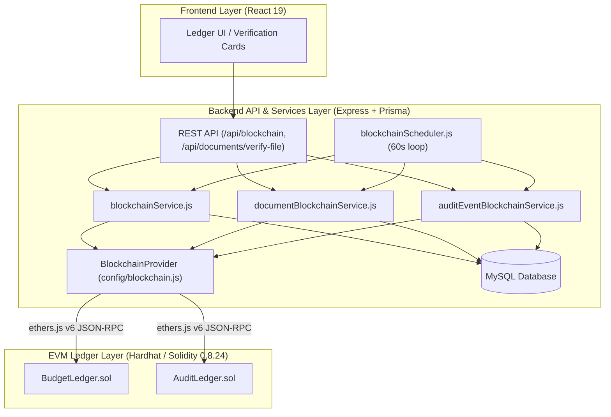
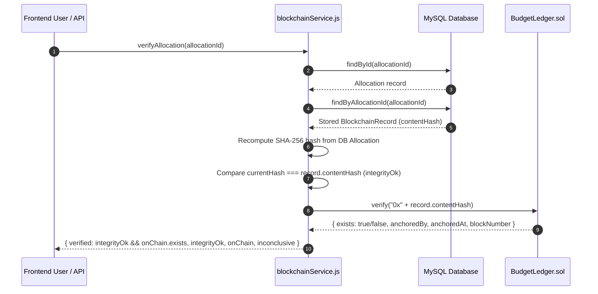
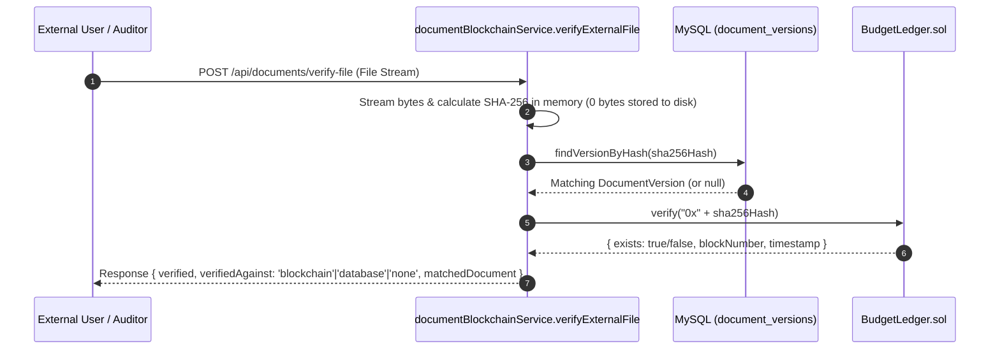

# Blockchain Integration & On-Chain Ledger — BudgetChain

> **Scope:** comprehensive technical reference for the EVM smart contracts, transaction lifecycle, key management, cryptographic content hashing, background scheduler, and verification workflows in BudgetChain.  
> **Source of truth:** implementation in `apps/contracts/`, `apps/backend/config/blockchain.js`, `apps/backend/services/*blockchain*.js`, `apps/backend/utils/hashUtils.js`.

---

## 1. Overview & Architecture

BudgetChain integrates an **EVM-compatible blockchain ledger layer** to provide immutable, tamper-evident proof for three core asset classes:
1. **Budget Allocations**: Anchored on contract `BudgetLedger.sol` upon approval.
2. **Managed Document Versions**: SHA-256 file digests anchored on contract `BudgetLedger.sol` upon upload/replacement.
3. **Security Audit Log Events**: Event hashes anchored on contract `AuditLedger.sol`.



---

## 2. Core Architectural Principles

### 2.1 Dual Smart Contract Strategy
To separate concerns, the system uses two distinct Solidity smart contracts:
- **`BudgetLedger.sol`**: Dedicated to **content integrity** (financial allocations and uploaded document file digests).
- **`AuditLedger.sol`**: Dedicated to **activity integrity** (structured audit events, state transitions, and administrative actions).

### 2.2 Fail-Soft & Eventual Consistency
Financial and administrative operations in BudgetChain are **fail-soft by design**:
- Primary business workflows (approving allocations, uploading documents, writing audit logs) commit to MySQL regardless of blockchain node availability.
- If the node is offline, unconfigured, or out of gas, database mirror records are saved with status `Pending` or `Failed`.
- The background **`blockchainScheduler`** (`apps/backend/services/blockchainScheduler.js:126`) runs every **60 seconds** to poll `Pending`/`Failed` anchors and re-attempt EVM transactions.

### 2.3 Crash-Window Safety (`anchorUnlessExists`)
If a transaction succeeds on-chain but the backend process crashes before saving the transaction hash to MySQL, re-submitting the same hash would cause the contract to revert with `HashAlreadyRecorded` or `EventAlreadyRecorded`.

To handle this, services call `anchorUnlessExists()` (`apps/backend/services/blockchainService.js:337`):
1. Queries the contract `verify(hash)` first.
2. If `exists == true` on-chain, reads the existing `blockNumber` and `anchoredAt` timestamp from the ledger and updates MySQL as `Confirmed` without submitting a new transaction.
3. If `exists == false`, submits the `record()` transaction.

---

## 3. Network & Configuration

### 3.1 Network Environment Options
Configuration parameters are parsed and validated at backend startup in `apps/backend/config/env.js:19-57`:

| Environment Variable | Description | Default Value / Local Fallback |
|----------------------|-------------|--------------------------------|
| `BLOCKCHAIN_RPC_URL` | JSON-RPC HTTP/WS endpoint URL | `http://127.0.0.1:8545` (Hardhat node) |
| `BLOCKCHAIN_NETWORK` | Network label (e.g. `localhost`, `sepolia`) | `localhost` |
| `BLOCKCHAIN_CHAIN_ID` | EVM Chain ID | `31337` |
| `BLOCKCHAIN_CONTRACT_ADDRESS` | Deployed `BudgetLedger` 0x address | Auto-read from `apps/contracts/deployments/contracts.json` |
| `BLOCKCHAIN_AUDIT_LEDGER_ADDRESS` | Deployed `AuditLedger` 0x address | Auto-read from `apps/contracts/deployments/contracts.json` |
| `BLOCKCHAIN_PRIVATE_KEY` | 32-byte hex private key for transaction signing | Deployer account private key |
| `BLOCKCHAIN_RPC_TIMEOUT_MS` | Timeout for RPC network calls | `5000` ms |
| `BLOCKCHAIN_EXPLORER_URL` | Block explorer base URL (e.g. Etherscan) | Optional (e.g. `http://localhost:8545`) |

### 3.2 Deployment Artifact Auto-Discovery
If `BLOCKCHAIN_CONTRACT_ADDRESS` or `BLOCKCHAIN_AUDIT_LEDGER_ADDRESS` are not explicitly defined in `.env`, `apps/backend/config/blockchain.js:29-55` reads `apps/contracts/deployments/contracts.json`, which is generated automatically by running `npm run blockchain:deploy`.

---

## 4. Wallets & Key Management

### 4.1 Owner-Only Anchoring Role
Both smart contracts enforce restrictive access control:
- Only the contract `_owner` address (the address that deployed the contracts or holds `BLOCKCHAIN_PRIVATE_KEY`) can call write functions (`record` and `recordEvent`).
- Unauthorized callers attempting to anchor hashes receive custom revert error `NotOwner()`.

### 4.2 Ethers.js Adapter (`BlockchainProvider`)
`apps/backend/config/blockchain.js` acts as the single EVM adapter using **ethers v6**:

```javascript
// Lazy initialization of Provider and Signer
const provider = new ethers.JsonRpcProvider(fetchReq, chainId);
const signer = new ethers.Wallet(config.blockchain.privateKey, provider);
const contract = new ethers.Contract(contractAddress, BUDGET_LEDGER_ABI, signer || provider);
```

- **Read Operations** (`verify`, `getRecord`, `verifyEvent`, `totalEvents`): Executed using the `JsonRpcProvider` without gas cost or private key requirement.
- **Write Operations** (`record`, `auditRecord`): Executed via `Wallet` signer using `BLOCKCHAIN_PRIVATE_KEY`.

---

## 5. Smart Contracts Specification

### 5.1 `BudgetLedger.sol`
- **File**: `apps/contracts/contracts/BudgetLedger.sol`
- **Solidity Version**: `^0.8.24` (optimizer enabled, 200 runs)

#### State & Data Models
```solidity
struct Record {
    bytes32 contentHash;  // 32-byte SHA-256 digest
    address anchoredBy;   // Signer address that submitted the anchor
    uint256 anchoredAt;   // Block timestamp (block.timestamp)
    uint256 blockNumber;  // Block number (block.number)
}

address private _owner;
mapping(bytes32 => Record) private _records;
uint256 private _recordCount;
```

#### Functions & Events
- `record(bytes32 contentHash) external returns (uint256)`: Anchors a new 32-byte content hash. Reverts with `NotOwner()` if `msg.sender != _owner`, or `HashAlreadyRecorded(contentHash)` if already anchored.
- `verify(bytes32 contentHash) external view returns (bool exists, address anchoredBy, uint256 anchoredAt, uint256 blockNumber)`: Returns verification state.
- `getRecord(bytes32 contentHash) external view returns (Record memory)`: Returns full struct.
- `event Recorded(bytes32 indexed contentHash, address indexed anchoredBy, uint256 blockNumber, uint256 timestamp)`: Emitted upon successful anchor.

---

### 5.2 `AuditLedger.sol`
- **File**: `apps/contracts/contracts/AuditLedger.sol`
- **Solidity Version**: `^0.8.24`

#### State & Data Models
```solidity
struct AuditEvent {
    bytes32 eventHash;   // 32-byte SHA-256 event digest
    string category;     // Action category (e.g. ALLOCATION_APPROVE)
    address anchoredBy;  // Signer address
    uint256 anchoredAt;  // Block timestamp
    uint256 blockNumber; // Block number
}

address private _owner;
mapping(bytes32 => AuditEvent) private _events;
mapping(string => uint256) private _categoryCounts;
uint256 private _eventCount;
```

#### Functions & Events
- `recordEvent(bytes32 eventHash, string calldata category) external returns (uint256)`: Anchors an audit event under a category. Reverts with `NotOwner()`, `InvalidCategory()`, or `EventAlreadyRecorded(eventHash)`.
- `verifyEvent(bytes32 eventHash) external view returns (bool exists, string memory category, address anchoredBy, uint256 anchoredAt, uint256 blockNumber)`: Checks event existence.
- `getAuditEvent(bytes32 eventHash) external view returns (AuditEvent memory)`: Fetches event struct (named `getAuditEvent` to avoid ethers fragment name collisions).
- `event EventRecorded(bytes32 indexed eventHash, string indexed category, address indexed anchoredBy, uint256 blockNumber, uint256 timestamp)`: Emitted on anchor.

---

## 6. Cryptographic Hashing & Transactions

### 6.1 Canonical Allocation Hashing
To guarantee that any mutation invalidates the verified hash, `computeAllocationContentHash()` (`apps/backend/utils/hashUtils.js:15`) constructs a deterministic JSON string by sorting all keys before hashing with SHA-256:

```javascript
const canonical = {
  allocationCode: allocation.allocationCode,
  fiscalYearId: allocation.fiscalYearId,
  departmentId: allocation.departmentId,
  fundSourceId: allocation.fundSourceId,
  categoryId: allocation.categoryId,
  programId: allocation.programId,
  allocatedAmount: toNumber(allocation.allocatedAmount),
  description: allocation.description ?? null,
  status: allocation.status,
  submittedAt: allocation.submittedAt ? new Date(allocation.submittedAt).toISOString() : null,
  reviewedBy: allocation.reviewedBy ?? null,
  reviewedAt: allocation.reviewedAt ? new Date(allocation.reviewedAt).toISOString() : null,
  rejectionReason: allocation.rejectionReason ?? null,
  createdAt: new Date(allocation.createdAt).toISOString(),
};

const json = JSON.stringify(canonical, Object.keys(canonical).sort());
return crypto.createHash('sha256').update(json).digest('hex');
```

### 6.2 Document File Hashing
Uploaded file streams are piped directly through `crypto.createHash('sha256')` during storage (`apps/backend/services/documentStorageService.js:59`), generating an exact byte-level SHA-256 hex string.

---

## 7. Verification Workflows

### 7.1 Allocation Verification Sequence



### 7.2 Zero-Storage External File Verification
Users can upload any document file to `/api/documents/verify-file` to check whether it originates from BudgetChain without storing the file:



---

## 8. Security Matrix

| Security Threat | Mitigation Control | Source Implementation |
|-----------------|--------------------|-----------------------|
| **Unauthorized Ledger Mutation** | Smart contract `NotOwner()` modifier blocks writes from any key other than `BLOCKCHAIN_PRIVATE_KEY` | `BudgetLedger.sol:54`, `AuditLedger.sol:76` |
| **Record Tampering in Database** | Verification recomputes canonical SHA-256 hash from database fields; any modified field breaks `integrityOk` | `hashUtils.js:15`, `blockchainService.js:151` |
| **Replay / Duplicate Anchor Reverts** | `anchorUnlessExists` verifies on-chain existence before submitting tx, preventing contract reverts | `blockchainService.js:337` |
| **RPC Outage DoS** | Fail-soft service design returns `Pending`/`Failed` and schedules background retries every 60s without failing HTTP requests | `blockchainService.js:70`, `blockchainScheduler.js:126` |
| **File Exposure During External Verification** | Zero-storage streaming: file bytes are hashed in memory and immediately discarded | `documentBlockchainService.js:189` |
| **Privilege Escalation on Verification Routes** | Verification routes require `authenticate` and RBAC checks (`Auditor`, `Administrator`, `Treasurer`, `BudgetOfficer`) | `routes/verificationRoutes.js` |
