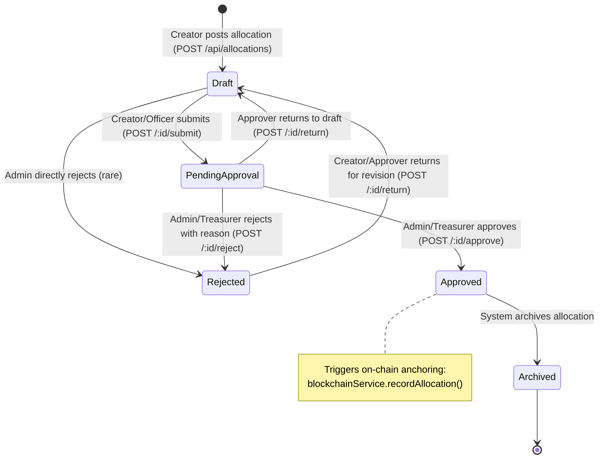
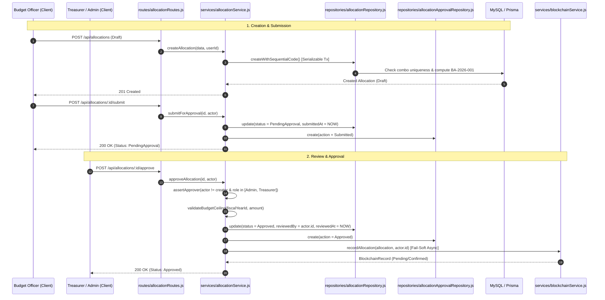

# Budget Allocation — BudgetChain

> **Scope:** complete technical reference for budget allocation creation, sequential code generation, budget ceiling enforcement, reference combination uniqueness, multi-tier approval workflow, audit trail recording, database models, and REST APIs in BudgetChain.  
> **Source of truth:** the implementation (`apps/backend/routes/allocationRoutes.js`, `apps/backend/controllers/allocationController.js`, `apps/backend/services/allocationService.js`, `apps/backend/repositories/allocationRepository.js`, `apps/backend/repositories/allocationApprovalRepository.js`, `apps/backend/validators/allocationValidator.js`, `apps/backend/constants/allocationStatus.js`, `apps/backend/prisma/schema.prisma`).

---

## 1. Purpose

The **Budget Allocation** module is the central financial management component of BudgetChain. It allows university personnel to plan, propose, review, approve, and track budget allocations distributed across fiscal years, academic departments, funding sources, budget categories, and budget programs.

Key responsibilities:
- **Allocation Lifecycle Management:** Provisioning, editing, submitting, approving, rejecting, returning, and soft-deleting allocation proposals.
- **Sequential Code Auto-Generation:** Thread-safe code generation (`BA-YYYY-XXX`) isolated per fiscal year using serializable database transactions.
- **Financial Risk Controls:** Budget ceiling validation against active fiscal year limits and 5-tuple reference uniqueness verification.
- **Multi-Role Governance:** Segregation of duties between Budget Officers (proposers) and Administrators/Treasurers (approvers), with strict self-approval prevention.
- **Audit & On-Chain Integration:** Recording immutable approval decision histories (`allocation_approvals`) and triggering fail-soft EVM blockchain ledger anchoring upon final approval.

---

## 2. Features

- **Sequential Allocation Coding:** Auto-generated codes matching `BA-YYYY-XXX` (e.g. `BA-2026-001`) generated inside serializable database transactions to prevent race conditions and duplicate codes.
- **5-Tuple Unique Combination Check:** Prevents duplicate live allocations sharing the same `(fiscalYearId, departmentId, fundSourceId, categoryId, programId)`. Rejected, Archived, and soft-deleted allocations are excluded from duplication checks.
- **Budget Ceiling Enforcement:** Validates that new or approved allocation amounts do not exceed the remaining available budget of the referenced fiscal year.
- **Structured Approval State Machine:** Enforces valid transitions between `Draft`, `PendingApproval`, `Approved`, `Rejected`, and `Archived` states.
- **Self-Approval Safeguard:** Prevents users from reviewing, approving, or rejecting their own allocation proposals.
- **Mandatory Rejection Tracking:** Requires an explicit rejection reason (up to 500 characters) when rejecting proposals, allowing submitters to revise and resubmit.
- **Approval History Trail:** Eagerly loads actor details and records every `Submitted`, `Approved`, `Rejected`, or `Returned` action in `allocation_approvals`.
- **Automatic Ledger Anchoring:** Upon allocation approval, the system generates a SHA-256 canonical hash of the allocation payload and anchors it asynchronously on the EVM `BudgetLedger` contract.
- **Soft Deletion:** Deletions set `deletedAt = NOW()`, preserving historical records and sequence integrity.
- **Decimal Precision:** Financial amounts stored as `Decimal(14,2)` in MySQL and converted via `toNumber()` to plain JavaScript numbers at API boundaries.

---

## 3. Workflow & Architecture

### 3.1 Allocation State Machine



### 3.2 End-to-End Approval Pipeline



---

## 4. Controllers

The controller layer lives in [`apps/backend/controllers/allocationController.js`](file:///d:/Ramisys%20files/Projects/capstone/apps/backend/controllers/allocationController.js). It handles HTTP request parsing, error propagation, response formatting, and audit logging.

### Controller Methods Summary

| Method | Target Service Method | Status Code | Audit Action | Description |
|--------|-----------------------|-------------|--------------|-------------|
| `createAllocation` [`line 14`](file:///d:/Ramisys%20files/Projects/capstone/apps/backend/controllers/allocationController.js#L14-L42) | `allocationService.createAllocation` | `201 Created` | `ALLOCATION_CREATE` | Creates a new allocation in `Draft` state. |
| `getAllocationById` [`line 50`](file:///d:/Ramisys%20files/Projects/capstone/apps/backend/controllers/allocationController.js#L50-L60) | `allocationService.getAllocationById` | `200 OK` | N/A | Fetches allocation with eagerly loaded relations. |
| `getAllocations` [`line 68`](file:///d:/Ramisys%20files/Projects/capstone/apps/backend/controllers/allocationController.js#L68-L104) | `allocationService.getAllocations` | `200 OK` | N/A | Returns filtered, paginated, and sorted allocations. |
| `updateAllocation` [`line 112`](file:///d:/Ramisys%20files/Projects/capstone/apps/backend/controllers/allocationController.js#L112-L136) | `allocationService.updateAllocation` | `200 OK` | `ALLOCATION_UPDATE` | Updates fields of a `Draft` allocation. |
| `deleteAllocation` [`line 144`](file:///d:/Ramisys%20files/Projects/capstone/apps/backend/controllers/allocationController.js#L144-L165) | `allocationService.deleteAllocation` | `200 OK` | `ALLOCATION_DELETE` | Soft-deletes a `Draft` or `Rejected` allocation. |
| `getAllocationStatistics` [`line 173`](file:///d:/Ramisys%20files/Projects/capstone/apps/backend/controllers/allocationController.js#L173-L187) | `allocationService.getAllocationStatistics` | `200 OK` | N/A | Returns summary counts and total amount aggregations. |
| `getRemainingBudget` [`line 195`](file:///d:/Ramisys%20files/Projects/capstone/apps/backend/controllers/allocationController.js#L195-L209) | `allocationService.getRemainingBudget` | `200 OK` | N/A | Calculates total, committed, and unallocated budget. |
| `submitForApproval` [`line 217`](file:///d:/Ramisys%20files/Projects/capstone/apps/backend/controllers/allocationController.js#L217-L242) | `allocationService.submitForApproval` | `200 OK` | `ALLOCATION_SUBMIT` | Transitions status `Draft` -> `PendingApproval`. |
| `approveAllocation` [`line 250`](file:///d:/Ramisys%20files/Projects/capstone/apps/backend/controllers/allocationController.js#L250-L273) | `allocationService.approveAllocation` | `200 OK` | `ALLOCATION_APPROVE` | Approves proposal and triggers on-chain anchor. |
| `rejectAllocation` [`line 281`](file:///d:/Ramisys%20files/Projects/capstone/apps/backend/controllers/allocationController.js#L281-L304) | `allocationService.rejectAllocation` | `200 OK` | `ALLOCATION_REJECT` | Rejects proposal with mandatory reason. |
| `returnAllocation` [`line 312`](file:///d:/Ramisys%20files/Projects/capstone/apps/backend/controllers/allocationController.js#L312-L337) | `allocationService.returnToDraft` | `200 OK` | `ALLOCATION_RETURN` | Returns allocation to `Draft` for revision. |
| `getApprovalHistory` [`line 345`](file:///d:/Ramisys%20files/Projects/capstone/apps/backend/controllers/allocationController.js#L345-L357) | `allocationService.getApprovalHistory` | `200 OK` | N/A | Retrieves `allocation_approvals` records. |

---

## 5. Services

Business logic lives in [`apps/backend/services/allocationService.js`](file:///d:/Ramisys%20files/Projects/capstone/apps/backend/services/allocationService.js).

### Key Service Operations

#### `createAllocation(allocationData, userId)` [`line 41`](file:///d:/Ramisys%20files/Projects/capstone/apps/backend/services/allocationService.js#L41-L105)
1. Validates amount ranges (`0 < amount <= 1,000,000,000,000.00`).
2. Validates master-data references (`fiscalYearId`, `departmentId`, `fundSourceId`, `categoryId`, `programId`). Active status required; fiscal year must not be `Archived`.
3. Validates budget ceiling against total fiscal year budget.
4. Checks combination uniqueness.
5. Invokes `allocationRepository.createWithSequentialCode` inside serializable transaction.
6. Returns serialized allocation object.

#### `approveAllocation(id, actor)` [`line 332`](file:///d:/Ramisys%20files/Projects/capstone/apps/backend/services/allocationService.js#L332-L340)
1. Validates existing allocation (throws `404` if deleted/missing).
2. Enforces approver rules via `assertApprover`:
   - `actor.role` must be `Administrator` or `Treasurer`.
   - `actor.id` cannot match `existing.createdBy` (Self-Approval Prevention).
3. Re-validates budget ceiling before committing.
4. Performs status transition to `Approved`, setting `reviewedBy = actor.id` and `reviewedAt = NOW()`.
5. Records `Approved` action in `allocation_approvals`.
6. Triggers `blockchainService.recordAllocation(allocation, actor.id)` asynchronously (fail-soft).

#### `rejectAllocation(id, actor, reason)` [`line 352`](file:///d:/Ramisys%20files/Projects/capstone/apps/backend/services/allocationService.js#L352-L365)
1. Validates non-empty `reason` string.
2. Enforces `assertApprover` checks.
3. Transitions status to `Rejected`, setting `rejectionReason = reason`, `reviewedBy = actor.id`, and `reviewedAt = NOW()`.
4. Records `Rejected` action in `allocation_approvals`.

#### `returnToDraft(id, actor, comment)` [`line 379`](file:///d:/Ramisys%20files/Projects/capstone/apps/backend/services/allocationService.js#L379-L395)
- If existing status is `Rejected`: permits either an approver (`Admin`/`Treasurer`) or the original creator (`existing.createdBy === actor.id`) to return to `Draft`.
- Otherwise: requires approver privileges via `assertApprover`.
- Transitions status to `Draft` and records `Returned` action in `allocation_approvals`.

#### `assertApprover(existing, actor)` [`line 431`](file:///d:/Ramisys%20files/Projects/capstone/apps/backend/services/allocationService.js#L431-L438)
```javascript
assertApprover(existing, actor) {
  if (!APPROVAL_ROLES.includes(actor.role)) {
    throw new ForbiddenError('Only Administrators and Treasurers can review allocations');
  }
  if (existing.createdBy === actor.id) {
    throw new ForbiddenError('Users cannot review their own allocations');
  }
}
```

---

## 6. Database & Data Access

### 6.1 Prisma Models

Defined in [`apps/backend/prisma/schema.prisma`](file:///d:/Ramisys%20files/Projects/capstone/apps/backend/prisma/schema.prisma#L170-L231):

```prisma
enum AllocationStatus {
  Draft
  PendingApproval
  Approved
  Rejected
  Archived
}

enum AllocationApprovalAction {
  Submitted
  Approved
  Rejected
  Returned
}

model BudgetAllocation {
  id              String           @id @default(uuid())
  allocationCode  String           @unique
  fiscalYearId    String
  departmentId    String
  fundSourceId    String
  categoryId      String
  programId       String
  allocatedAmount Decimal          @db.Decimal(14, 2)
  description     String?          @db.VarChar(500)
  status          AllocationStatus @default(Draft)
  submittedAt     DateTime?
  reviewedAt      DateTime?
  reviewedBy      String?
  rejectionReason String?          @db.VarChar(500)
  createdBy       String
  createdAt       DateTime         @default(now())
  updatedAt       DateTime         @updatedAt
  deletedAt       DateTime?

  fiscalYear FiscalYear     @relation(fields: [fiscalYearId], references: [id])
  department Department     @relation(fields: [departmentId], references: [id])
  fundSource FundSource     @relation(fields: [fundSourceId], references: [id])
  category   BudgetCategory @relation(fields: [categoryId], references: [id])
  program    BudgetProgram  @relation(fields: [programId], references: [id])
  creator    User           @relation("AllocationCreator", fields: [createdBy], references: [id])
  reviewer   User?          @relation("AllocationReviewer", fields: [reviewedBy], references: [id])

  approvals AllocationApproval[]
  records   BlockchainRecord[]
  documents ManagedDocument[]

  @@index([allocationCode])
  @@index([fiscalYearId])
  @@index([departmentId])
  @@index([fundSourceId])
  @@index([categoryId])
  @@index([programId])
  @@index([createdBy])
  @@index([reviewedBy])
  @@index([status])
  @@index([createdAt])
  @@index([deletedAt])
  @@map("budget_allocations")
}

model AllocationApproval {
  id           String                   @id @default(uuid())
  allocationId String
  action       AllocationApprovalAction
  comment      String?                  @db.VarChar(500)
  actorId      String
  createdAt    DateTime                 @default(now())

  allocation BudgetAllocation @relation(fields: [allocationId], references: [id], onDelete: Cascade)
  actor      User             @relation(fields: [actorId], references: [id])

  @@index([allocationId])
  @@index([actorId])
  @@index([createdAt])
  @@map("allocation_approvals")
}
```

### 6.2 Data Repositories

- [`allocationRepository.js`](file:///d:/Ramisys%20files/Projects/capstone/apps/backend/repositories/allocationRepository.js):
  - `createWithSequentialCode`: Serializable Prisma transaction computing `BA-YYYY-XXX`.
  - `duplicateExists`: Checks 5-tuple reference uniqueness excluding `Rejected`, `Archived`, and `deletedAt !== null`.
  - `aggregateApprovedAmount`: Sums committed amounts (`status === Approved` and `deletedAt === null`).
  - `softDelete`: Sets `deletedAt = NOW()`.
- [`allocationApprovalRepository.js`](file:///d:/Ramisys%20files/Projects/capstone/apps/backend/repositories/allocationApprovalRepository.js):
  - `create`: Persists workflow history entry with actor details.
  - `findManyByAllocationId`: Retrieves history timeline ordered by `createdAt desc`.

---

## 7. APIs

All endpoints mount under `/api/allocations` in [`apps/backend/routes/allocationRoutes.js`](file:///d:/Ramisys%20files/Projects/capstone/apps/backend/routes/allocationRoutes.js). All endpoints require authentication (`authenticate`).

### API Endpoints Reference

| Method | Route Path | Access Permission | Validation Schema | Description |
|--------|------------|-------------------|-------------------|-------------|
| `GET` | `/api/allocations` | All Roles | `allocationQuerySchema` | Paginated allocation list with search & filters |
| `GET` | `/api/allocations/statistics` | All Roles | `allocationStatisticsSchema` | Summary metrics & status counts |
| `GET` | `/api/allocations/remaining-budget` | All Roles | `remainingBudgetQuerySchema` | Total, committed, and available budget summary |
| `GET` | `/api/allocations/:id` | All Roles | `allocationIdParamSchema` | Single allocation detail with eager relations |
| `POST` | `/api/allocations` | Admin, BudgetOfficer | `createAllocationSchema` | Create allocation proposal (`Draft`) |
| `PUT` | `/api/allocations/:id` | Admin, BudgetOfficer | `updateAllocationSchema` | Update allocation proposal (`Draft` only) |
| `DELETE` | `/api/allocations/:id` | Admin, BudgetOfficer | `allocationIdParamSchema` | Soft-delete allocation proposal |
| `POST` | `/api/allocations/:id/submit` | Admin, BudgetOfficer | `allocationIdParamSchema` | Submit allocation (`Draft` -> `PendingApproval`) |
| `POST` | `/api/allocations/:id/approve` | Admin, Treasurer | `allocationIdParamSchema` | Approve proposal & trigger ledger anchor |
| `POST` | `/api/allocations/:id/reject` | Admin, Treasurer | `rejectAllocationSchema` | Reject proposal with reason |
| `POST` | `/api/allocations/:id/return` | Admin, Treasurer, BudgetOfficer | `returnAllocationSchema` | Return proposal to `Draft` for revision |
| `GET` | `/api/allocations/:id/approvals` | All Roles | `allocationIdParamSchema` | Fetch allocation approval decision history |

---

## 8. Permissions & RBAC

### 8.1 Module Authorization Matrix

| Action / Route Endpoint | Administrator | Treasurer | BudgetOfficer | Auditor |
|-------------------------|:-------------:|:---------:|:-------------:|:-------:|
| Read (`GET /api/allocations*`, `/:id/approvals`) | ✅ Allowed | ✅ Allowed | ✅ Allowed | ✅ Allowed |
| Create / Edit / Delete / Submit (`POST`, `PUT`, `DELETE`, `/:id/submit`) | ✅ Allowed | ❌ 403 Forbidden | ✅ Allowed | ❌ 403 Forbidden |
| Approve / Reject (`/:id/approve`, `/:id/reject`) | 🟡 Allowed* | 🟡 Allowed* | ❌ 403 Forbidden | ❌ 403 Forbidden |
| Return to Draft (`/:id/return`) | ✅ Allowed | ✅ Allowed | 🟡 Creator Only | ❌ 403 Forbidden |

*\* Subject to Self-Approval Prevention (`actor.id !== createdBy`).*

### 8.2 Frontend Component Action Controls

The frontend interface ([`AllocationList.tsx`](file:///d:/Ramisys%20files/Projects/capstone/apps/frontend/src/pages/budget-allocation/AllocationList.tsx)) consumes `useAuth()` to conditionally render workflow buttons:
- **"New Allocation" button:** Visible to `Administrator` and `BudgetOfficer`.
- **"Submit for Approval" button:** Visible to `Administrator` and `BudgetOfficer` on `Draft` allocations.
- **"Approve" / "Reject" buttons:** Visible to `Administrator` and `Treasurer` on `PendingApproval` allocations, hidden when `user.id === allocation.createdBy`.
- **"Edit" / "Delete" buttons:** Visible to `Administrator` and `BudgetOfficer` on `Draft` allocations.

---

## 9. Business Rules & Integrity Constraints

### Rule 1: Sequential Allocation Code Auto-Generation
- **Enforcement:** `allocationRepository.createWithSequentialCode` [`line 210-256`](file:///d:/Ramisys%20files/Projects/capstone/apps/backend/repositories/allocationRepository.js#L210-L256).
- **Format:** `${prefix}-${String(maxSequence + 1).padStart(3, '0')}`, e.g. `BA-2026-001`.
- **Isolation:** Executed inside a serializable Prisma transaction (`Prisma.TransactionIsolationLevel.Serializable`) to prevent race conditions. Soft-deleted records are included when calculating `maxSequence` to preserve unique codes.

### Rule 2: 5-Tuple Reference Uniqueness
- **Enforcement:** `allocationRepository.duplicateExists` [`line 174-191`](file:///d:/Ramisys%20files/Projects/capstone/apps/backend/repositories/allocationRepository.js#L174-L191).
- **Constraint:** No two active allocations (`Draft`, `PendingApproval`, `Approved`) can share the identical 5-tuple:
  `(fiscalYearId, departmentId, fundSourceId, categoryId, programId)`.
- **Exclusions:** `Rejected`, `Archived`, and soft-deleted (`deletedAt !== null`) allocations do not block new proposals.

### Rule 3: Budget Ceiling Protection
- **Enforcement:** `allocationService.validateBudgetCeiling` [`line 52, 475`](file:///d:/Ramisys%20files/Projects/capstone/apps/backend/services/allocationService.js#L52).
- **Constraint:** Total committed budget (`Approved` allocations) + proposed allocation amount must not exceed `fiscalYear.budgetAmount`. Re-validated upon approval.

### Rule 4: Self-Approval Prevention
- **Enforcement:** `allocationService.assertApprover` [`line 431-438`](file:///d:/Ramisys%20files/Projects/capstone/apps/backend/services/allocationService.js#L431-L438).
- **Constraint:** The authenticated user approving or rejecting an allocation cannot be the creator (`existing.createdBy !== actor.id`). Violations throw `403 Forbidden`.

### Rule 5: Rejection Reason Mandate
- **Enforcement:** `allocationService.rejectAllocation` [`line 352`](file:///d:/Ramisys%20files/Projects/capstone/apps/backend/services/allocationService.js#L352) & `rejectAllocationSchema`.
- **Constraint:** Rejecting an allocation requires a non-empty string up to 500 characters.

### Rule 6: Immutability of Non-Draft Allocations
- **Enforcement:** `allocationService.updateAllocation` and `updateAllocationSchema`.
- **Constraint:** Only allocations in `Draft` status can be edited or soft-deleted. Once `PendingApproval` or `Approved`, modification attempts throw `400 Bad Request`.

### Rule 7: Fail-Soft EVM Ledger Anchoring
- **Enforcement:** `blockchainService.recordAllocation` invoked upon approval.
- **Constraint:** Blockchain connection errors, provider timeouts, or unconfigured contract addresses log warnings and record status as `Pending` or `Failed` without rolling back the DB approval. Failed records are retried via the 60s background scheduler or manual retry endpoint (`POST /api/blockchain/allocations/:id/retry`).
