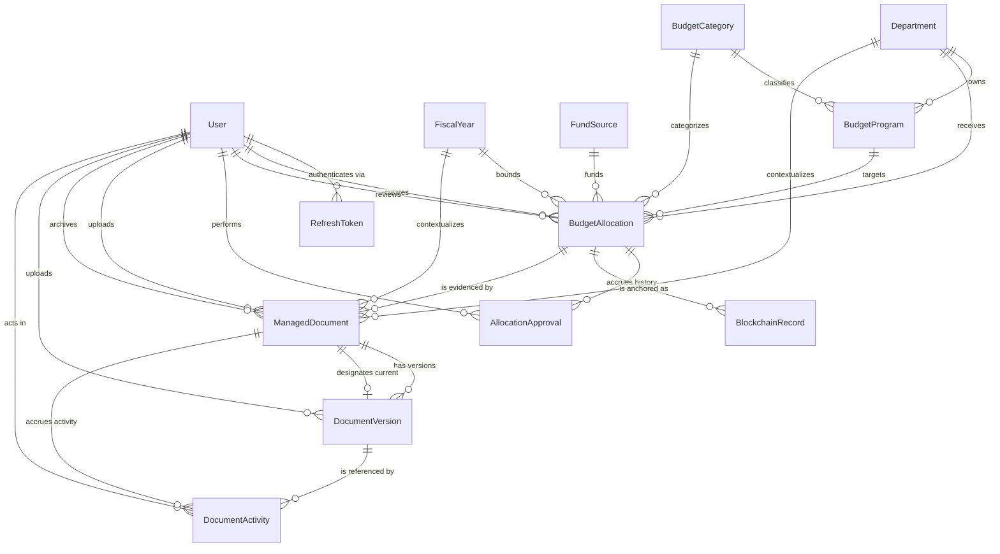
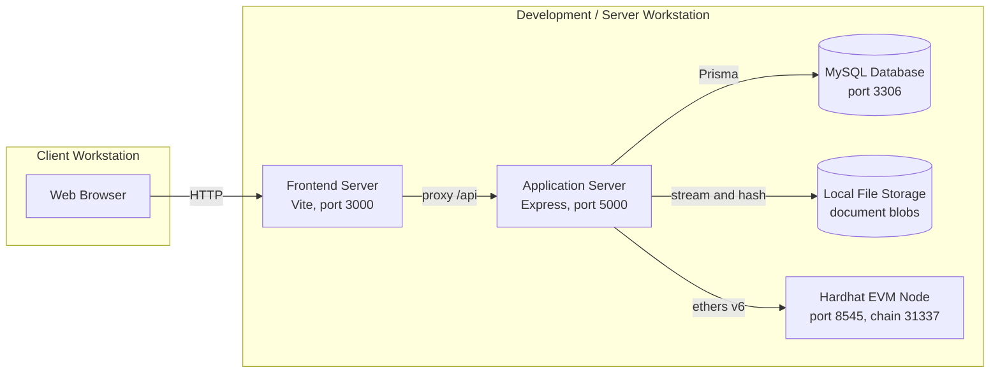
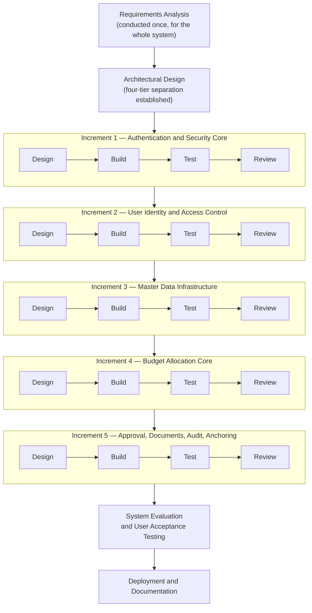
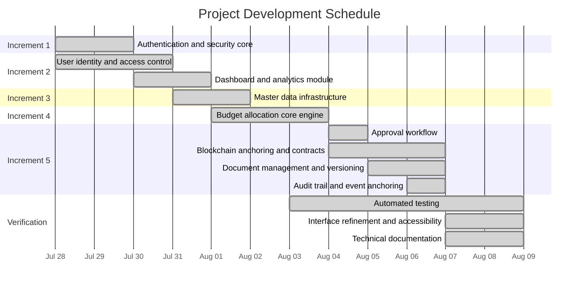
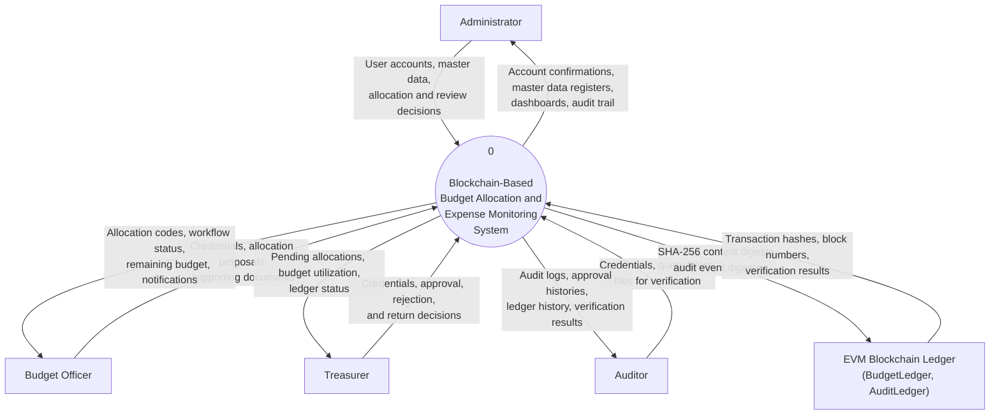
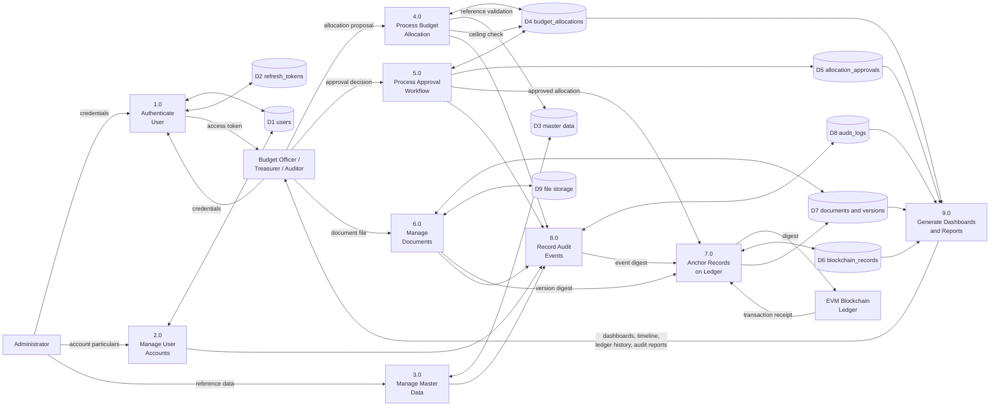
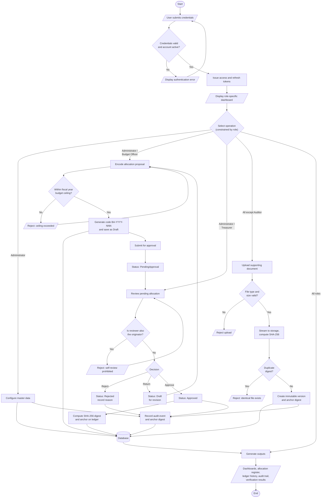
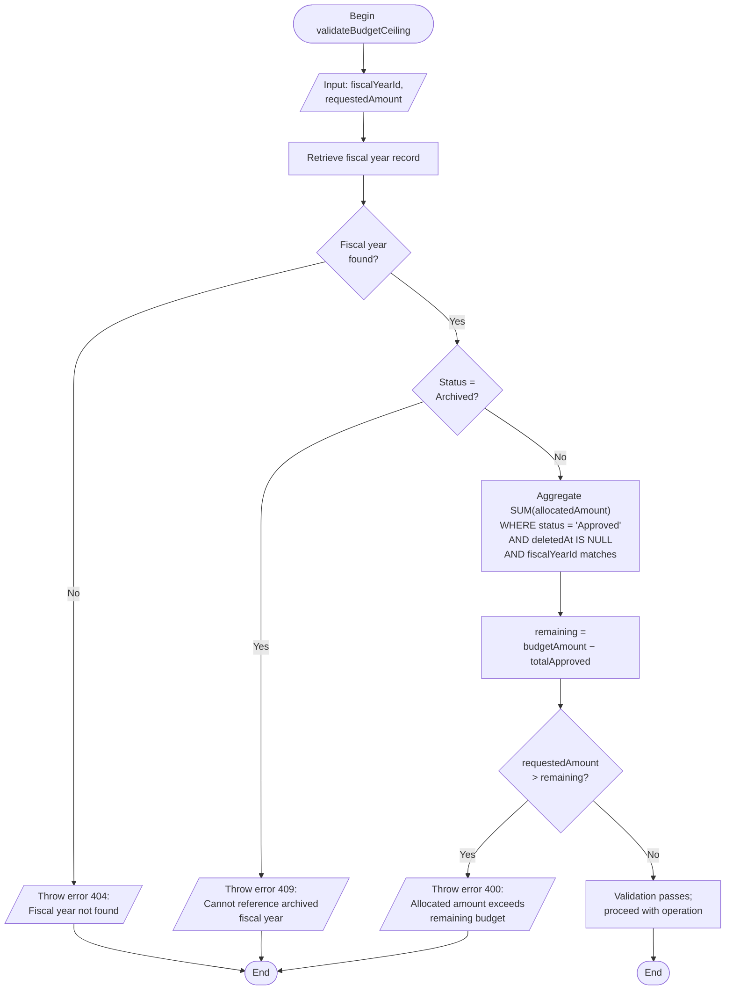
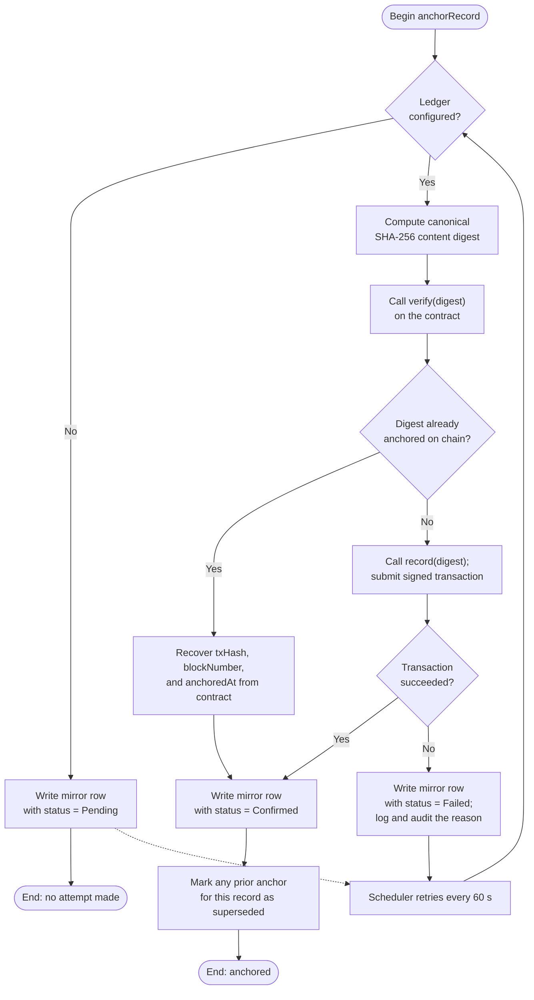
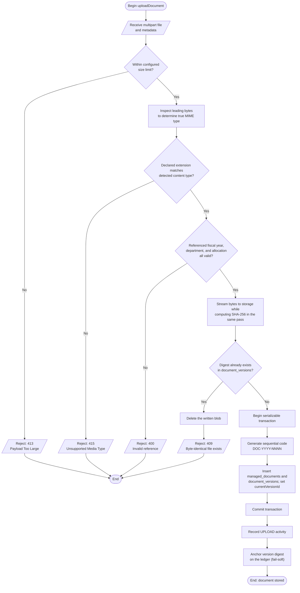

# Chapter III

# OPERATIONAL FRAMEWORK

This chapter presents the operational framework of the Blockchain-Based Budget Allocation and Expense Monitoring System. It is organized into two principal divisions in accordance with the prescribed manuscript structure. The first division, *Materials*, enumerates the software, hardware, financial resources, data, and systems environment that constituted the working materials of the project. The second division, *Methods*, describes the software development life cycle model adopted by the researchers, the procedures observed within each development phase, and the evaluation and testing regimen through which the resulting system was verified.

All technical specifications reported in this chapter were derived directly from the implemented artifacts of the project repository and were verified against the source code at the time of writing. Where a figure could not be established from the implementation — such as organizational data pertaining to the partner institution — the requirement is stated explicitly rather than estimated, and is marked for completion by the researchers.

---

## Materials

The materials of this project comprise the complete inventory of resources that the researchers assembled in order to design, construct, and validate the system. These resources fall into five categories: the software tools and libraries that constitute the technology stack, the hardware upon which development and testing were conducted, the financial outlay required to capitalize the project, the data that the system stores and processes, and the environment within which the system is intended to operate. Each category is presented in turn.

### Software

The system was constructed as a three-workspace monorepository, and each workspace draws upon a distinct set of software tools. The researchers selected an entirely open-source technology stack, which eliminated licensing expenditure and permitted unrestricted modification of the development environment. Table 3-1 enumerates every software tool employed, together with the version actually installed and the purpose it served.

**Table 3-1**

*Software Requirements for the Blockchain-Based Budget Allocation and Expense Monitoring System*

| Software / Tool | Recommended Version | Purpose / Usage |
|---|---|---|
| Windows 10 Pro (64-bit) | 10.0.19045 | Host operating system for development |
| Node.js | v24.16.0 | JavaScript runtime for the server and build tooling |
| npm | 11.13.0 | Package manager and workspace orchestrator |
| MySQL | 8.0 or higher | Relational database management system |
| Visual Studio Code | Latest stable | Integrated development environment |
| Git | Latest stable | Version control system |
| Express | ^4.19.2 | Backend web application framework |
| Prisma Client / Prisma CLI | ^5.19.1 | Object-relational mapper, schema migration, and data access |
| Zod | ^3.23.8 | Declarative request schema validation |
| jsonwebtoken | ^9.0.2 | Issuance and verification of access and refresh tokens |
| bcryptjs | ^2.4.3 | One-way adaptive password hashing |
| ethers | ^6.17.0 | Ethereum Virtual Machine provider, wallet, and contract client |
| multer | ^2.2.0 | Multipart form-data parsing for document uploads |
| helmet | ^7.1.0 | Hardening of HTTP response headers |
| cors | ^2.8.5 | Cross-origin resource sharing policy enforcement |
| express-rate-limit | ^8.6.1 | Request throttling and abuse mitigation |
| morgan | ^1.10.0 | HTTP access logging |
| dotenv | ^16.4.5 | Environment variable loading |
| React / React DOM | ^19.0.0 | Component-based user interface library |
| Vite | ^6.0.0 | Frontend development server and production bundler |
| TypeScript | ^5.9.3 | Static type system for the frontend |
| TanStack React Query | ^5.101.4 | Server-state caching, synchronization, and mutation management |
| axios | ^1.7.0 | HTTP client with request and response interceptors |
| react-router-dom | ^7.11.0 | Declarative client-side routing |
| react-hook-form | ^7.53.0 | Form state management and validation binding |
| Tailwind CSS | ^4.3.3 | Utility-first styling framework |
| Bootstrap | ^5.3.0 | Component styling framework |
| Radix UI | Various | Accessible unstyled user-interface primitives |
| recharts | ^3.10.1 | Statistical charting and data visualization |
| lucide-react | ^1.27.0 | Vector icon set |
| date-fns | ^4.4.0 | Date and time formatting |
| Solidity | ^0.8.24 | Smart contract programming language |
| Hardhat | 2.x | Smart contract compilation, local node, deployment, and testing |
| Vitest | ^4.1.10 | Frontend unit and component test runner |
| Testing Library (React) | ^16.3.2 | Component rendering and interaction testing |
| jsdom | ^30.0.1 | Virtual browser environment for frontend tests |

*Note.* Version numbers prefixed with a caret denote the minimum compatible version as declared in the respective package manifest. The entire stack is released under permissive open-source licenses, and no proprietary license was purchased.

The composition of this stack reflects three deliberate selection criteria. First, the researchers adopted a single programming language, JavaScript and its typed superset TypeScript, across all three workspaces, which reduced the cognitive overhead of context switching and permitted validation schemas to be expressed in a consistent idiom on both the client and the server. Second, every selected library is actively maintained and widely adopted, which mitigated the risk of encountering unresolved defects in an abandoned dependency. Third, the blockchain tooling was confined to a local Hardhat node, which permitted the ledger functionality to be developed and tested without incurring transaction fees on a public network.

Having established the software inventory, the discussion now turns to the physical computing resources upon which that software was executed.

### Hardware

Development, testing, and demonstration of the system were performed on a single workstation. Because the system is a web application composed of a database server, an application server, a frontend development server, and a local blockchain node — all of which run concurrently during development — the memory and storage requirements are appreciably higher for a development machine than for a client machine that merely accesses the deployed system through a browser. Table 3-2 therefore distinguishes the minimum specification from the recommended specification and reports the actual specification of the development workstation.

**Table 3-2**

*Minimum and Recommended Hardware Specifications*

| Item | Minimum Specification | Recommended Specification | Actual Development Unit |
|---|---|---|---|
| Processor | Intel Core i5 (4th generation) or equivalent | Intel Core i7 (7th generation) or higher | Intel Core i7-7700HQ @ 2.80 GHz (4 cores, 8 threads) |
| Memory (RAM) | 8 GB | 16 GB or more | 15.9 GB |
| Storage | 256 GB HDD | 512 GB SSD or larger | 932 GB HDD (Toshiba MQ01ABD100) |
| Graphics | Integrated graphics | Integrated graphics | Integrated graphics |
| Display | 1366 × 768 pixels | 1920 × 1080 pixels or higher | 1920 × 1080 pixels |
| Network | Broadband internet connection | Broadband internet connection | Broadband internet connection |
| Operating System | Windows 10 (64-bit) | Windows 10 or 11 (64-bit) | Windows 10 Pro 10.0.19045 (64-bit) |

*Note.* The specifications listed under Minimum and Recommended pertain to a development or server workstation. A client workstation accessing the deployed system requires only a modern web browser and a network connection, and is not bound by these specifications.

Two observations regarding the hardware merit discussion. The processor and memory of the development unit proved adequate throughout the project: the complete automated test suite executes in approximately twenty-two seconds for the frontend workspace and under one minute for the backend workspace, and the local blockchain node imposes negligible load because it maintains its state in memory. The mechanical hard disk drive, by contrast, was the principal performance constraint observed during development, since dependency installation and the Vite development server both perform a large volume of small file operations. The researchers accordingly recommend a solid-state drive for any subsequent development work, and this recommendation is reflected in the Recommended column of Table 3-2.

With the computing resources described, the financial cost of assembling those resources is presented next.

### Project Development Cost

Every resource acquired or utilized during the development phase carries a cost, whether that cost was borne directly by the researchers, absorbed through an academic waiver, or contributed as unremunerated labor. The itemization presented in Table 3-3 accounts for the one-time capital expenditure required to bring the system into existence. Consistent with standard capitalization practice, recurring operational expenditures — such as post-deployment hosting, ongoing maintenance, and end-user training — are excluded, since these do not contribute to the initial asset value of the system.

**Table 3-3**

*Estimated Project Development Budget*

| Item | Description / Purpose | Estimated Cost |
|---|---|---|
| **Hardware** | | |
| Development workstation | Intel Core i7-7700HQ laptop, 16 GB RAM, 932 GB storage; primary development, testing, and demonstration unit | ₱45,000.00 |
| External storage device | Backup of source code, database dumps, and manuscript revisions | ₱1,500.00 |
| **Software and Licenses** | | |
| Integrated development environment | Visual Studio Code; obtained free of charge under an open-source license | ₱2,000.00 |
| Database management system | MySQL Community Edition; obtained free of charge under an open-source license | ₱2,000.00 |
| Version control and repository hosting | Git and GitHub; obtained free of charge under the GitHub Student Developer Pack | ₱2,000.00 |
| Application framework stack | Node.js, Express, Prisma, React, Vite, Hardhat, and associated libraries; all obtained free of charge under permissive open-source licenses | ₱2,000.00 |
| **Utilities and Miscellaneous** | | |
| Internet connectivity | Broadband subscription for the development period (dependency retrieval, documentation, collaboration) | ₱6,000.00 |
| Electricity consumption | Estimated power consumption attributable to development activity | ₱3,000.00 |
| Printing and binding | Manuscript reproduction, documentation, and defense requirements | ₱4,000.00 |
| **Human Resources** | | |
| Developer labor | System design, implementation, and testing | ₱50,000.00 |
| **Total Cost** | | **₱117,500.00** |

> **⚠ REQUIRES RESEARCHER INPUT.** The figures reported in Table 3-3 are estimates constructed from prevailing market prices and the template's prescribed treatment of academically waived licenses. The researchers must substitute the actual amounts expended — supported by vendor receipts, subscription statements, and utility billings where these exist — before final submission. The developer labor figure in particular should be recomputed from the actual number of person-hours devoted to the project multiplied by a defensible hourly rate for entry-level software development.

#### Cost Justification and Estimation Methodology

Each item enumerated in Table 3-3 was critical to the successful engineering of the system, and the basis of each estimate is stated below.

The development workstation represents the single largest hardware expenditure and was indispensable, since the system requires four server processes to execute concurrently during development. Its cost was estimated from the prevailing retail price of a comparably specified laptop computer. The external storage device was necessary because the project maintains no cloud-hosted continuous integration infrastructure, and consequently the local repository and database constitute the only copies of the work product; its cost was derived from standard retail catalog pricing.

The software items warrant particular comment. Every software tool employed in this project was obtained at no monetary cost, either because it is released under a permissive open-source license or because it was made available through an academic waiver under the GitHub Student Developer Pack. In accordance with the prescribed costing guidelines, each such category has nevertheless been assigned a nominal value of ₱2,000.00. This treatment serves two purposes: it demonstrates the resourcefulness of the researchers in assembling a production-capable technology stack without licensing expenditure, while simultaneously maintaining financial completeness by acknowledging that these tools carry a genuine commercial value that a non-academic adopting organization would be required to pay. Were the system to be adopted by an institution not entitled to academic waivers, the equivalent commercial tooling would represent a real and recurring cost.

The utility and miscellaneous items were estimated proportionally. Internet connectivity and electricity were apportioned to the project on the basis of the development period, which spanned from the initial commit on July 28, 2026 to the present state of the repository, encompassing 124 recorded commits. Printing and binding costs were estimated from prevailing local reproduction rates for a manuscript of the anticipated length.

The developer labor figure represents the opportunity cost of the researchers' time. Although no salary was disbursed, professional practice requires that development effort be capitalized at its fair value, since the intellectual property produced possesses value independent of whether its creators were remunerated. The estimate follows the historic estimation model prescribed in the costing guidelines rather than an invoice-based method.

#### Capitalization as an Organizational Asset

The aggregate development cost of ₱117,500.00 establishes the baseline valuation of the system at the point of its transition from a development project into a deployed organizational asset. In professional engineering practice this valuation is distributed across two asset classes.

The custom codebase, the database schema, the smart contracts, and the accompanying technical documentation are capitalized as **intangible assets**. These artifacts constitute the intellectual property created by the project, and their carrying value comprises the software licenses (₱8,000.00), the developer labor (₱50,000.00), and the utility costs directly attributable to their creation (₱9,000.00), for a total of **₱67,000.00**. The development workstation and the external storage device, being physical equipment, are capitalized separately as **tangible assets** under property, plant, and equipment, for a total of **₱46,500.00**. The printing and binding cost of ₱4,000.00 is treated as a period expense rather than capitalized, since it produces no asset of continuing value to the adopting organization.

The two asset classes are subject to different write-down schedules. The intangible software asset would customarily be amortized on a straight-line basis over a useful life of three years, reflecting the interval over which a web application built upon the present framework versions may be expected to remain maintainable before a substantial modernization becomes necessary. The tangible hardware asset would be depreciated on a straight-line basis over a useful life of five years, consistent with the conventional treatment of computing equipment. Under these schedules the intangible component carries an annual amortization charge of ₱22,333.33 and the tangible component an annual depreciation charge of ₱9,300.00.

#### Cost-Benefit Analysis and Future Projections

The financial viability of the system is properly assessed by comparing its development cost against the manual operational cost it is designed to displace. Under a manual or spreadsheet-based budget process, the activities the system automates are performed by staff: the transcription of allocation particulars, the physical routing of approval papers between the originating office and the approving officer, the manual computation of remaining budget balances against the fiscal-year ceiling, the physical filing and retrieval of supporting documents, and the reconstruction of an audit trail from disparate records whenever an audit is conducted.

The system addresses each of these cost centers directly. Budget ceiling computation, which under a manual process requires an officer to aggregate approved allocations by hand and is therefore both slow and error-prone, is performed automatically at three separate control points — creation, modification, and approval — at no marginal cost per transaction. The approval workflow eliminates the physical routing of documents entirely, and records each transition together with its actor and timestamp, so that the approval history is a byproduct of the process rather than a separate clerical task. Document retrieval, which under a manual regime depends upon the integrity of a physical filing system, is reduced to an indexed query. Most consequentially, the audit trail is generated continuously and automatically, which eliminates the substantial staff effort ordinarily consumed in reconstructing records in preparation for an audit.

A conservative projection illustrates the return on investment. Should the system displace even four hours of clerical effort per week across the budget office, at an assumed loaded labor rate of ₱150.00 per hour, the annual saving approximates ₱31,200.00. Measured against the total development cost of ₱117,500.00, this yields a payback period of approximately three years and nine months. This projection excludes benefits that are real but not readily monetized: the reduction of computational error in ceiling enforcement, the prevention of unauthorized post-hoc alteration of approved allocations through cryptographic anchoring, and the improved audit posture arising from a complete and tamper-evident record of institutional financial activity. When these qualitative benefits are weighed alongside the quantified clerical saving, the system presents a defensible investment case for an adopting institution.

> **⚠ REQUIRES RESEARCHER INPUT.** The clerical hours displaced and the labor rate assumed in the foregoing projection must be substantiated by observation of, or interview with, the partner organization's budget office. These figures are presently illustrative.

Having accounted for the resources consumed in constructing the system, the discussion now turns to the data that the completed system stores and manipulates.

### Data

The data component of this project consists of the structured records the system persists, the classification of those records into entities, and the relationships that bind them. The researchers implemented the data layer as a MySQL relational database accessed exclusively through the Prisma object-relational mapper. The schema comprises **fourteen entities**, **ten enumerated data types**, and **nine sequential migrations**, and is defined declaratively in a single schema file that serves as the authoritative specification of the data model.

#### Data Design Conventions

Seven conventions were applied uniformly across the schema in order to ensure internal consistency and to support the integrity objectives of the study. Every entity employs a universally unique identifier as its primary key, which permits identifiers to be generated without a database round trip and avoids disclosing record counts. Entity names are expressed in Pascal case while the underlying physical tables are named in snake case. Monetary values are stored as fixed-point decimals of fourteen digits with two decimal places, and are converted to plain numeric values only at the boundary of the application programming interface, which prevents the accumulation of binary floating-point error. Creation timestamps are recorded on every entity, whereas modification timestamps are recorded only on entities whose rows are permitted to change; the deliberate omission of a modification timestamp is the schema's declaration that a table is append-only. Allocations and documents are deleted logically rather than physically, by means of a deletion timestamp, so that the evidentiary chain is never broken. Finally, indexes were placed on all foreign keys, business codes, status columns, and principal timestamps, yielding fifty-one indexes in total.

#### Entities of the Data Model

Table 3-4 enumerates the fourteen entities of the data model, grouped by functional domain, together with the purpose each serves within the system.

**Table 3-4**

*Database Entities and Their Functions*

| Domain | Entity | Physical Table | Function within the System |
|---|---|---|---|
| Identity | User | `users` | Represents an authenticated principal and anchors accountability for every mutating operation; the hub of the schema, bearing eight outbound relations |
| Identity | RefreshToken | `refresh_tokens` | Persists opaque refresh credentials, enabling token rotation and server-side session revocation |
| Master data | FiscalYear | `fiscal_years` | Defines the budget planning period and carries the institutional spending ceiling against which the budget discipline invariant is evaluated |
| Master data | FundSource | `fund_sources` | Enumerates the origins of budgetary funding, permitting allocations to be aggregated by funding source |
| Master data | Department | `departments` | Represents the organizational unit accountable for an allocation; supplies the organizational dimension of the budget |
| Master data | BudgetCategory | `budget_categories` | Provides the expenditure classification; supplies the expenditure-nature dimension of the budget |
| Master data | BudgetProgram | `budget_programs` | Intersection entity materializing valid department-and-category combinations into named spending programs |
| Allocation | BudgetAllocation | `budget_allocations` | The central financial record; commits a monetary amount from a fund source to a program and carries the complete approval workflow state |
| Allocation | AllocationApproval | `allocation_approvals` | Immutable history of workflow actions, preserving the sequence of states and the officer responsible for each transition |
| Anchoring | BlockchainRecord | `blockchain_records` | Relational mirror of an on-chain allocation anchor; records anchoring as a reconcilable tri-state process |
| Documents | ManagedDocument | `managed_documents` | Represents a logical item of supporting evidence as distinct from any particular file embodying it |
| Documents | DocumentVersion | `document_versions` | Immutable snapshot of file content; the unit of evidentiary integrity in the document subsystem |
| Documents | DocumentActivity | `document_activities` | Chronological timeline of operations performed upon a document |
| Audit | AuditLog | `audit_logs` | Append-only, system-wide record of security-relevant and lifecycle-relevant events; bears no foreign keys by design |

Three entities warrant elaboration because their design directly serves the integrity objectives of the study.

The **BudgetAllocation** entity is the subject of nearly every business invariant the system enforces. Its allocation code is generated sequentially within each fiscal year in the format `BA-<year>-NNN` inside a serializable transaction, which guarantees that concurrent creation cannot produce colliding codes. Its status traverses a constrained state machine rather than accepting arbitrary assignment. Its allocated amount participates in the budget ceiling invariant, under which the aggregate of approved, undeleted allocations must not exceed the fiscal year's ceiling. Finally, its canonical field set is the input to the cryptographic digest anchored on the ledger upon approval, so that any subsequent modification of a meaning-bearing field invalidates on-chain verification.

The **DocumentVersion** entity is the unit of evidentiary integrity. Four constraints jointly establish that property: a composite uniqueness constraint on document and version number guarantees monotonic version numbering; a uniqueness constraint on the content digest implements deduplication, so that uploading a byte-identical file is rejected; uniqueness constraints on the storage key and transaction hash prevent blob aliasing and duplicate anchoring respectively; and the absence of a modification timestamp declares that a version, once written, is never revised. Correction is effected by uploading a new version, not by amending an existing one.

The **AuditLog** entity declares no foreign keys whatsoever, and this isolation is deliberate. Actor identity is denormalized into four independent columns rather than referenced, which yields three properties: audit entries survive the deletion of the user they describe; the historical role is preserved as it stood at the moment of the event, rather than being resolved against the user's present role; and the audit trail may be queried, exported, or archived independently of the remainder of the schema.

#### Enumerated Data Types

Ten enumerated types constrain the permissible values of status and classification columns, thereby preventing invalid states from being represented in the database at all. Table 3-5 enumerates them.

**Table 3-5**

*Enumerated Data Types and Their Permissible Values*

| Enumerated Type | Permissible Values | Applied To |
|---|---|---|
| Role | Administrator, Treasurer, BudgetOfficer, Auditor | User |
| Status | Active, Inactive | User, FundSource, Department, BudgetCategory, BudgetProgram |
| FiscalYearStatus | Active, Inactive, Archived | FiscalYear |
| AllocationStatus | Draft, PendingApproval, Approved, Rejected, Archived | BudgetAllocation |
| AllocationApprovalAction | Submitted, Approved, Rejected, Returned | AllocationApproval |
| BlockchainRecordStatus | Pending, Confirmed, Failed | BlockchainRecord, DocumentVersion |
| AuditAnchorStatus | Pending, Confirmed, Failed | AuditLog |
| AuditResult | Success, Failure | AuditLog |
| DocumentType | PurchaseRequest, PurchaseOrder, Quotation, Receipt, Invoice, DisbursementVoucher, LiquidationReport, BudgetProposal, Contract, Other | ManagedDocument |
| DocumentStatus | Active, Archived | ManagedDocument |

#### Entity-Relationship Diagram

The relationships binding the fourteen entities are presented in Figure 3-1. Twenty-four foreign key relations are defined, of which twenty employ restricted deletion and four employ cascading deletion. The four cascading relations share a common characteristic: each dependent entity is meaningless in the absence of its parent — a refresh token without an account, an approval action without an allocation, a version or an activity without a document. Every reference to master data or to a user is restricted, so that reference data cannot be removed while records depend upon it.

*Figure 3-1.* Entity-Relationship Diagram of the Blockchain-Based Budget Allocation and Expense Monitoring System. The AuditLog entity is deliberately omitted from the diagram because it maintains no foreign key relationships, as discussed above.

#### Database Schema

The logical model presented in Figure 3-1 is realized physically as fourteen MySQL tables. Table 3-6 presents the complete schema specification, enumerating for every table its constituent columns, data types, key designations, and the meaning each column carries. The key designations employed are PK for primary key, FK for foreign key, UK for a unique constraint, and IX for an indexed column.

**Table 3-6**

*Database Schema Specification*

| Table | Column | Data Type | Key / Constraint | Description |
|---|---|---|---|---|
| **users** | id | VARCHAR(191) | PK | Universally unique identifier |
| | fullName | VARCHAR(191) | NOT NULL | Display name of the user |
| | email | VARCHAR(191) | UK, NOT NULL | Login credential |
| | password | VARCHAR(191) | NOT NULL | bcrypt password digest |
| | role | ENUM | NOT NULL | Administrator, Treasurer, BudgetOfficer, or Auditor |
| | status | ENUM | DEFAULT 'Active' | Active or Inactive |
| | createdAt | DATETIME(3) | DEFAULT now() | Record creation timestamp |
| | updatedAt | DATETIME(3) | ON UPDATE | Record modification timestamp |
| **refresh_tokens** | id | VARCHAR(191) | PK | Universally unique identifier |
| | token | VARCHAR(191) | UK, IX, NOT NULL | Opaque refresh credential |
| | userId | VARCHAR(191) | FK → users.id, IX, CASCADE | Owning user |
| | expiresAt | DATETIME(3) | IX, NOT NULL | Expiry instant |
| | revokedAt | DATETIME(3) | NULL | Revocation instant, set upon rotation |
| | createdAt | DATETIME(3) | DEFAULT now() | Issuance timestamp |
| | updatedAt | DATETIME(3) | ON UPDATE | Modification timestamp |
| **fiscal_years** | id | VARCHAR(191) | PK | Universally unique identifier |
| | code | VARCHAR(191) | UK, IX, NOT NULL | Business code, e.g. FY-2026 |
| | description | VARCHAR(191) | NOT NULL | Descriptive label of the period |
| | startDate | DATETIME(3) | IX, NOT NULL | Beginning of the planning period |
| | endDate | DATETIME(3) | IX, NOT NULL | End of the planning period |
| | budgetAmount | DECIMAL(14,2) | DEFAULT 0 | Institutional spending ceiling |
| | status | ENUM | DEFAULT 'Inactive' | Active, Inactive, or Archived |
| | isActive | TINYINT(1) | DEFAULT 0 | Designates the operative period |
| | createdAt | DATETIME(3) | DEFAULT now() | Record creation timestamp |
| | updatedAt | DATETIME(3) | ON UPDATE | Record modification timestamp |
| **fund_sources** | id | VARCHAR(191) | PK | Universally unique identifier |
| | code | VARCHAR(191) | UK, IX, NOT NULL | Business code, e.g. FS-GF |
| | name | VARCHAR(191) | NOT NULL | Name of the funding source |
| | description | VARCHAR(191) | NULL | Optional descriptive text |
| | status | ENUM | DEFAULT 'Active' | Active or Inactive |
| | createdAt | DATETIME(3) | DEFAULT now() | Record creation timestamp |
| | updatedAt | DATETIME(3) | ON UPDATE | Record modification timestamp |
| **departments** | id | VARCHAR(191) | PK | Universally unique identifier |
| | code | VARCHAR(191) | UK, IX, NOT NULL | Business code, e.g. DEPT-ENG |
| | name | VARCHAR(191) | UK, IX, NOT NULL | Name of the organizational unit |
| | officeHead | VARCHAR(191) | NULL | Name of the head of office |
| | contactNumber | VARCHAR(191) | NULL | Contact telephone number |
| | email | VARCHAR(191) | NULL | Office electronic mail address |
| | officeAddress | VARCHAR(191) | NULL | Physical office address |
| | status | ENUM | DEFAULT 'Active' | Active or Inactive |
| | createdAt | DATETIME(3) | DEFAULT now() | Record creation timestamp |
| | updatedAt | DATETIME(3) | ON UPDATE | Record modification timestamp |
| **budget_categories** | id | VARCHAR(191) | PK | Universally unique identifier |
| | code | VARCHAR(191) | UK, IX, NOT NULL | Business code, e.g. CAT-PS |
| | name | VARCHAR(191) | UK, IX, NOT NULL | Name of the expenditure class |
| | description | VARCHAR(191) | NULL | Optional descriptive text |
| | status | ENUM | DEFAULT 'Active' | Active or Inactive |
| | createdAt | DATETIME(3) | DEFAULT now() | Record creation timestamp |
| | updatedAt | DATETIME(3) | ON UPDATE | Record modification timestamp |
| **budget_programs** | id | VARCHAR(191) | PK | Universally unique identifier |
| | code | VARCHAR(191) | UK, IX, NOT NULL | Business code, e.g. PROG-ENG-INFRA |
| | name | VARCHAR(191) | NOT NULL | Name of the spending program |
| | description | VARCHAR(191) | NULL | Optional descriptive text |
| | departmentId | VARCHAR(191) | FK → departments.id, IX | Owning organizational unit |
| | budgetCategoryId | VARCHAR(191) | FK → budget_categories.id, IX | Governing expenditure class |
| | status | ENUM | DEFAULT 'Active' | Active or Inactive |
| | createdAt | DATETIME(3) | DEFAULT now() | Record creation timestamp |
| | updatedAt | DATETIME(3) | ON UPDATE | Record modification timestamp |
| **budget_allocations** | id | VARCHAR(191) | PK | Universally unique identifier |
| | allocationCode | VARCHAR(191) | UK, IX, NOT NULL | Sequential code, format BA-YYYY-NNN |
| | fiscalYearId | VARCHAR(191) | FK → fiscal_years.id, IX | Governing planning period |
| | departmentId | VARCHAR(191) | FK → departments.id, IX | Receiving organizational unit |
| | fundSourceId | VARCHAR(191) | FK → fund_sources.id, IX | Origin of the funds |
| | categoryId | VARCHAR(191) | FK → budget_categories.id, IX | Expenditure classification |
| | programId | VARCHAR(191) | FK → budget_programs.id, IX | Target spending program |
| | allocatedAmount | DECIMAL(14,2) | NOT NULL | Monetary amount committed |
| | description | VARCHAR(500) | NULL | Justification or particulars |
| | status | ENUM | DEFAULT 'Draft', IX | Workflow lifecycle state |
| | submittedAt | DATETIME(3) | NULL | Instant of submission for approval |
| | reviewedAt | DATETIME(3) | NULL | Instant of review |
| | reviewedBy | VARCHAR(191) | FK → users.id, IX, NULL | Reviewing officer |
| | rejectionReason | VARCHAR(500) | NULL | Reason recorded upon rejection |
| | createdBy | VARCHAR(191) | FK → users.id, IX | Originating officer |
| | createdAt | DATETIME(3) | DEFAULT now(), IX | Record creation timestamp |
| | updatedAt | DATETIME(3) | ON UPDATE | Record modification timestamp |
| | deletedAt | DATETIME(3) | IX, NULL | Logical deletion timestamp |
| **allocation_approvals** | id | VARCHAR(191) | PK | Universally unique identifier |
| | allocationId | VARCHAR(191) | FK → budget_allocations.id, IX, CASCADE | Parent allocation |
| | action | ENUM | NOT NULL | Submitted, Approved, Rejected, or Returned |
| | comment | VARCHAR(500) | NULL | Reviewer remark |
| | actorId | VARCHAR(191) | FK → users.id, IX | Officer performing the action |
| | createdAt | DATETIME(3) | DEFAULT now(), IX | Instant of the action |
| **blockchain_records** | id | VARCHAR(191) | PK | Universally unique identifier |
| | allocationId | VARCHAR(191) | FK → budget_allocations.id, IX | Anchored allocation |
| | allocationCode | VARCHAR(191) | NOT NULL | Denormalized code for display |
| | contentHash | VARCHAR(191) | UK, NOT NULL | SHA-256 digest of canonical fields |
| | txHash | VARCHAR(191) | UK, NULL | Blockchain transaction hash |
| | blockNumber | BIGINT | NULL | Block number of confirmation |
| | network | VARCHAR(191) | NOT NULL | Network identifier |
| | status | ENUM | DEFAULT 'Pending', IX | Pending, Confirmed, or Failed |
| | confirmedAt | DATETIME(3) | NULL | Instant of on-chain confirmation |
| | supersededAt | DATETIME(3) | NULL | Instant this anchor was superseded |
| | createdBy | VARCHAR(191) | NOT NULL | Actor who triggered the anchor |
| | createdAt | DATETIME(3) | DEFAULT now(), IX | Record creation timestamp |
| | updatedAt | DATETIME(3) | ON UPDATE | Record modification timestamp |
| **managed_documents** | id | VARCHAR(191) | PK | Universally unique identifier |
| | documentCode | VARCHAR(191) | UK, IX, NOT NULL | Sequential code, format DOC-YYYY-NNNN |
| | title | VARCHAR(200) | NOT NULL | Document title |
| | description | VARCHAR(1000) | NULL | Optional descriptive text |
| | documentType | ENUM | NOT NULL, IX | One of ten evidence classifications |
| | fiscalYearId | VARCHAR(191) | FK → fiscal_years.id, IX, NULL | Optional period reference |
| | departmentId | VARCHAR(191) | FK → departments.id, IX, NULL | Optional unit reference |
| | allocationId | VARCHAR(191) | FK → budget_allocations.id, IX, NULL | Optional allocation reference |
| | status | ENUM | DEFAULT 'Active', IX | Active or Archived |
| | currentVersionId | VARCHAR(191) | FK → document_versions.id, UK, NULL | Designated current version |
| | uploadedBy | VARCHAR(191) | FK → users.id, IX | Uploading officer |
| | archivedBy | VARCHAR(191) | FK → users.id, NULL | Archiving officer |
| | archivedAt | DATETIME(3) | NULL | Instant of archival |
| | deletedAt | DATETIME(3) | IX, NULL | Logical deletion timestamp |
| | createdAt | DATETIME(3) | DEFAULT now(), IX | Record creation timestamp |
| | updatedAt | DATETIME(3) | ON UPDATE | Record modification timestamp |
| **document_versions** | id | VARCHAR(191) | PK | Universally unique identifier |
| | documentId | VARCHAR(191) | FK → managed_documents.id, IX, CASCADE | Parent document |
| | versionNumber | INT | NOT NULL | Sequential number within the document |
| | originalFileName | VARCHAR(255) | NOT NULL | Client-supplied filename |
| | storageKey | VARCHAR(191) | UK, NOT NULL | Key of the blob in the storage driver |
| | mimeType | VARCHAR(100) | NOT NULL | Content type detected from magic bytes |
| | fileSizeBytes | BIGINT | NOT NULL | Size of the stored blob |
| | fileExtension | VARCHAR(10) | NOT NULL | File extension |
| | sha256Hash | VARCHAR(191) | UK, IX, NOT NULL | Content digest for deduplication and verification |
| | blockchainStatus | ENUM | DEFAULT 'Pending', IX | Pending, Confirmed, or Failed |
| | txHash | VARCHAR(191) | UK, NULL | Blockchain transaction hash |
| | blockNumber | BIGINT | NULL | Block number of confirmation |
| | network | VARCHAR(191) | NULL | Network identifier |
| | confirmedAt | DATETIME(3) | NULL | Instant of on-chain confirmation |
| | replaceReason | VARCHAR(500) | NULL | Reason recorded upon replacement |
| | uploadedBy | VARCHAR(191) | FK → users.id | Uploading officer |
| | uploadedAt | DATETIME(3) | DEFAULT now(), IX | Instant of upload |
| | createdAt | DATETIME(3) | DEFAULT now() | Record creation timestamp |
| | (composite) | — | UK (documentId, versionNumber) | Enforces one version number per document |
| **document_activities** | id | VARCHAR(191) | PK | Universally unique identifier |
| | documentId | VARCHAR(191) | FK → managed_documents.id, IX, CASCADE | Parent document |
| | versionId | VARCHAR(191) | FK → document_versions.id, NULL | Related version, where applicable |
| | actorId | VARCHAR(191) | FK → users.id, IX | Officer performing the action |
| | action | VARCHAR(50) | NOT NULL | Action name, e.g. UPLOAD, REPLACE, ARCHIVE |
| | details | JSON | NULL | Structured contextual payload |
| | createdAt | DATETIME(3) | DEFAULT now(), IX | Instant of the action |
| **audit_logs** | id | VARCHAR(191) | PK | Universally unique identifier |
| | action | VARCHAR(100) | NOT NULL, IX | Audit action name |
| | result | ENUM | DEFAULT 'Success', IX | Success or Failure |
| | actorId | VARCHAR(191) | IX, NULL | Acting user; null for system events |
| | actorEmail | VARCHAR(255) | NULL | Denormalized actor electronic mail address |
| | actorName | VARCHAR(255) | NULL | Denormalized actor display name |
| | actorRole | VARCHAR(50) | NULL | Denormalized role at the time of the event |
| | ip | VARCHAR(45) | NULL | Originating client address |
| | resourceType | VARCHAR(100) | IX, NULL | Type of the affected entity |
| | resourceId | VARCHAR(191) | IX, NULL | Identifier of the affected entity |
| | resourceCode | VARCHAR(255) | NULL | Business code of the affected entity |
| | details | JSON | NULL | Structured detail payload, automatically redacted |
| | eventHash | VARCHAR(191) | UK, NULL | SHA-256 digest anchored on the AuditLedger |
| | anchorStatus | ENUM | DEFAULT 'Pending', IX | Pending, Confirmed, or Failed |
| | txHash | VARCHAR(191) | UK, NULL | Blockchain transaction hash |
| | blockNumber | BIGINT | NULL | Block number of confirmation |
| | network | VARCHAR(191) | NULL | Network identifier |
| | confirmedAt | DATETIME(3) | NULL | Instant of on-chain confirmation |
| | createdAt | DATETIME(3) | DEFAULT now(), IX | Instant the event was recorded |

*Note.* VARCHAR(191) is the default string length generated for MySQL, chosen so that an indexed column remains within the maximum index key length under the `utf8mb4` character set. Columns marked ON UPDATE are maintained automatically by the object-relational mapper. Tables omitting an `updatedAt` column — `allocation_approvals`, `document_versions`, `document_activities`, and `audit_logs` — are append-only by design.

The schema comprises twenty unique constraints and fifty-one indexes in total. Four composite structures warrant particular note: the composite unique constraint on `document_versions` binding document to version number; the composite index on `fiscal_years` spanning the start and end dates, which supports period-bounded reporting; the composite index on `blockchain_records` spanning allocation and supersession, which resolves the current anchor efficiently; and the composite index on `audit_logs` spanning resource type and resource identifier, which retrieves the complete audit history of any given entity.

#### Data Sources and Test Data

The system does not ingest data from any external source; all records originate from user input through the application programming interface. For development and demonstration purposes the researchers implemented a seed script that populates the database with a representative dataset. Table 3-7 summarizes the seed data.

**Table 3-7**

*Seed Data Populated for Development and Demonstration*

| Entity | Quantity | Particulars |
|---|---|---|
| Users | 4 | One account for each institutional role |
| Fiscal Years | 2 | Current year (Active, ₱10,000,000.00 ceiling) and prior year (₱8,000,000.00 ceiling) |
| Departments | 3 | Representative organizational units |
| Fund Sources | 3 | General Fund, Special Education Fund, Trust Fund |
| Budget Categories | 3 | Personnel Services, Maintenance and Other Operating Expenses, Capital Outlay |
| Budget Programs | 4 | Programs distributed across the seeded departments and categories |
| Budget Allocations | 5 | Distributed across Draft, PendingApproval, Approved, and Rejected statuses |
| Managed Documents | 4 | Each bearing one version with a computed content digest and an upload activity record |

The seeded allocations were deliberately distributed across four distinct workflow statuses so that every branch of the approval state machine could be exercised during demonstration without first constructing the preceding states by hand.

#### Data Security and Privacy Considerations

Three measures govern the protection of data within the system. Passwords are never stored in recoverable form, being subjected to bcrypt adaptive hashing before persistence. Audit entries are automatically redacted, such that fields whose names denote a password or a token are replaced with a redaction marker before the entry is written, which prevents credentials from entering the audit trail by way of an unfiltered request body. Most significantly, **no personally identifiable information, monetary value, or document content is ever written to the blockchain**; only SHA-256 digests are anchored. This design decision confines all sensitive data to the institution's own database and file storage, where it remains subject to conventional access control and lawful erasure, while nonetheless preserving the tamper-evidence property that the ledger provides.

With the data model established, the environment within which the system operates is described next.

### Systems Environment

The systems environment encompasses the institutional setting in which the system is intended to operate, the population it serves, the present manner in which the work is performed, and the deficiencies of that present arrangement which the system seeks to remedy. This section also describes the technical deployment topology of the completed system.

#### Locale

> **⚠ REQUIRES RESEARCHER INPUT.** The specific partner institution, its geographic location, and the physical setting of its budget office cannot be determined from the project repository and must be supplied by the researchers. The seeded demonstration data employs a university electronic mail domain, which suggests a higher education institution, but no requirement document, memorandum of agreement, or organizational record within the repository identifies the actual partner organization. The researchers must state the name of the institution, its address, and a brief description of the office that will operate the system.

#### Organizational Chart and Profile

> **⚠ REQUIRES RESEARCHER INPUT.** The organizational chart of the partner institution's budget office, together with a profile describing its mandate, staffing complement, and reporting relationships, must be obtained from the institution and reproduced here as Figure 3-2. The four roles implemented in the system — Administrator, Treasurer, Budget Officer, and Auditor — should be mapped explicitly to the actual positions in that chart, so that the correspondence between the implemented access model and the institution's real separation of duties is demonstrable.

#### Population of the Study

The system is designed for the financial and administrative personnel of the adopting institution rather than for the general public; no unauthenticated or publicly accessible endpoint exists in the implementation. The population therefore consists of the officers who participate in the budget allocation process, distributed across the four institutional roles implemented in the system. Table 3-8 describes each role and the corresponding user group.

**Table 3-8**

*Institutional Roles and Corresponding User Groups*

| Role | Institutional Function | Operational Capabilities |
|---|---|---|
| Administrator | System governance | Complete access; administers user accounts and master data; originates, submits, reviews, and archives allocations; performs all document operations irrespective of ownership; initiates ledger re-anchoring |
| Treasurer | Financial oversight | Reviews allocations by approving, rejecting, or returning them; monitors budget ceilings and analytics; manages documents personally uploaded. Cannot originate allocations, administer users, or modify master data |
| Budget Officer | Operational budget planning | Creates, updates, deletes, and submits allocation proposals; uploads and replaces documents personally uploaded. Cannot approve or reject allocations, administer users, or modify master data |
| Auditor | Independent compliance observation | Read-only access across allocations, approval histories, documents, ledger records, verification facilities, and audit logs. Cannot perform any mutating operation |

The role structure implements **separation of duties**, which is the central control the study advances: the party that originates a budget allocation is structurally distinct from the party that authorizes it, and the party that observes the system for compliance possesses no authority to alter it. This separation is enforced not merely by the assignment of roles but by an additional service-layer rule under which a user holding an approving role may nevertheless not review an allocation that the same user created.

> **⚠ REQUIRES RESEARCHER INPUT.** The actual number of personnel occupying each role at the partner institution, together with the sampling procedure applied for the system evaluation, must be stated here. Should the evaluation employ a purposive or total enumeration sample, the researchers must justify that choice.

#### Description of the Present System

> **⚠ REQUIRES RESEARCHER INPUT AND VALIDATION.** The characterization presented below is derived from the problem statement recorded in the project's technical documentation. It represents the conditions the system was designed to remedy and must be validated against the partner institution's actual practice through interview or observation before final submission.

Under the present arrangement, the budget allocation process is conducted principally through manual and semi-automated means. Allocation particulars are recorded in spreadsheet workbooks or on paper forms maintained by the budget office. A proposed allocation is prepared by planning staff and routed physically to the approving officer, who signifies approval by signature. The remaining balance of the fiscal year's appropriation is computed manually by aggregating the approved allocations recorded to date and subtracting that aggregate from the total appropriation. Supporting documents — purchase requests, quotations, receipts, disbursement vouchers, and comparable evidence — are filed physically or stored as loose electronic files in shared folders, and are associated with their corresponding allocations by naming convention or by manual cross-reference. When an audit is conducted, the audit trail must be reconstructed after the fact by collating the spreadsheet, the signed forms, and the document files.

#### Limitations and Drawbacks of the Present System

Four deficiencies of the present arrangement motivated the development of the system, and each corresponds directly to a control implemented in the resulting design.

The first is an **oversight gap**. Where allocation and approval are not structurally separated, and where no automated control enforces the appropriation ceiling, it is possible for the aggregate of approved allocations to exceed the available appropriation before the excess is detected. Manual aggregation is both slow and susceptible to arithmetic error, and detection consequently occurs after the fact rather than at the point of commitment.

The second is a **risk of tampering**. Allocation amounts recorded in a spreadsheet and supporting documents held as ordinary files may be altered after approval without leaving any evidence that an alteration occurred. Because the record and the evidence of its integrity are the same artifact, an alteration of the record is simultaneously an alteration of the evidence.

The third is **poor auditability**. Where actions, approvals, and document changes are dispersed across several media, an auditor cannot readily reconstruct what occurred, when it occurred, and who was responsible. The effort of reconstruction is substantial, and the resulting reconstruction is only as complete as the least well-maintained of the constituent records.

The fourth is the **absence of a chain of evidence**. Where a supporting document is replaced or superseded, the prior version is customarily discarded or overwritten, so that the history of the evidence is not preserved. An auditor examining the file therefore sees only the current state, and cannot determine whether, when, or by whom the evidence was changed.

#### Technical Deployment Environment

The completed system is presently configured for a local development and demonstration topology, illustrated in Figure 3-3. The application server listens on port 5000; the frontend development server listens on port 3000 and proxies application programming interface requests to the application server; the MySQL database server listens on its default port 3306; and the local Hardhat blockchain node listens on port 8545 under chain identifier 31337.

*Figure 3-3.* Technical Deployment Topology of the Development and Demonstration Environment.

The system architecture itself follows a four-tier separation. The presentation tier is a React single-page application; the application tier is an Express representational state transfer interface exposing eighty-six endpoints across thirteen feature routers; the persistence tier comprises the MySQL database and a local file-storage driver; and the distributed ledger tier comprises two Solidity smart contracts. The application tier enforces a strict layered request pipeline in which every protected endpoint passes through authentication, authorization, and schema validation before reaching a thin controller, which delegates to a service that contains the business logic and to a repository that constitutes the sole path to the database.

The researchers acknowledge two limitations of the present environment. First, the repository contains **no containerization manifest, orchestration configuration, or continuous integration pipeline**, and consequently the production deployment topology has not been established. Second, contract deployment to the blockchain node is presently performed manually rather than automatically.

> **Note on documentary divergence.** The project repository contains three specification documents describing a permissioned appropriation and obligation monitoring system for a municipal budget office, encompassing ordinances, appropriation lines, allotments, obligations, and a statutory rule registry. None of these entities exists in the implemented schema, and the specification documents themselves state that they are specifications only and that no code, schema, migration, contract, or test was modified in producing them. This chapter accordingly describes the system as implemented. Should the municipal appropriation and obligation model be the intended subject of the study, the corresponding implementation work must precede any revision of this chapter.

Having described the materials assembled for the project, the discussion now proceeds to the methods by which those materials were applied.

---

## Methods

The methods of this project comprise the software development life cycle model that governed the sequencing of work, the procedures observed within each phase of that model, and the evaluation and testing regimen through which the resulting system was verified. Each is presented in turn.

### SDLC Model

The researchers adopted the **Incremental Model** of software development. Under this model the total functionality of the system is partitioned into a sequence of increments, each of which passes through its own analysis, design, implementation, and testing activities, and each of which delivers a working and demonstrable extension of the preceding increment. The model was selected in preference to the alternatives for three reasons grounded in the circumstances of this project.

First, the system exhibits a **strict dependency ordering** among its functional domains. Authentication must exist before user administration can be secured; user administration must exist before allocations can be attributed to an originator; master data must exist before an allocation can reference a fiscal year, department, fund source, category, or program; allocations must exist before an approval workflow can act upon them; and the approval workflow must exist before an approved allocation can be anchored on the ledger. This ordering is not a matter of preference but a structural property of the domain, and the Incremental Model accommodates it directly.

Second, the researchers required a **demonstrable artifact at each stage** of the project for the purposes of consultation and progress review. The Waterfall Model, which defers all integration and testing until after the whole of the implementation is complete, would have provided nothing demonstrable until very late in the schedule. The Incremental Model, by contrast, produced a working system after the first increment which was thereafter continuously extended.

Third, the **requirements were sufficiently well understood at the outset** that the full Agile apparatus of continuous requirements renegotiation was unwarranted, yet not so completely fixed that a purely sequential model was safe. The Incremental Model occupies the appropriate middle ground: the overall architecture was established at the beginning and remained stable, while the detailed design of each increment was settled immediately before that increment was built.

Figure 3-4 presents the model as it was applied to this project.

*Figure 3-4.* The Incremental Software Development Life Cycle Model as applied to the project. Each increment delivers a working extension of the preceding increment and passes through its own design, build, test, and review activities.

The application of this model is evidenced in the project's own development record. The database schema evolved through **nine sequential migrations**, each of which corresponds to a functional increment and none of which was ever edited after being applied. The version control history records **124 commits** distributed across the development period from July 28, 2026 onward. The ordering of the migrations reflects precisely the dependency structure described above: identity precedes reference data, reference data precedes allocations, allocations precede the approval workflow, the workflow precedes anchoring, and the audit trail is introduced last as a concern cutting across all preceding subsystems.

### Procedures for the Different Phases

The procedures observed within each phase are described below. Table 3-9 first summarizes the increments, their functional scope, and the principal deliverables each produced.

**Table 3-9**

*Development Increments, Functional Scope, and Deliverables*

| Increment | Functional Domain | Principal Deliverables | Status |
|---|---|---|---|
| 1 | Authentication and Security Core | Express server; Prisma client; centralized error handling; dual-token authentication with rotation; bcrypt hashing; rate limiting; security headers; React application shell with route guards | Completed |
| 2 | User Identity and Access Control | User entity with four roles; administrator-restricted account lifecycle; role-based access control middleware; last-administrator and self-deletion safeguards | Completed |
| 3 | Master Data Infrastructure | Five master data entities with unique codes and status flags; complete representational state transfer interfaces; management pages | Completed |
| 4 | Budget Allocation Core | Allocation entity with fixed-point amounts; sequential code generation; five-tuple uniqueness constraint; budget ceiling validation | Completed |
| 5 | Approval, Documents, Audit, and Anchoring | Approval workflow with immutable history and self-review prevention; document management with versioning and stream hashing; audit trail with redaction; two Solidity contracts with fail-soft anchoring and a sixty-second retry scheduler | Completed |
| 6 | Expense Tracking and Disbursement | Placeholder route and navigation entry only | Not implemented |

*Note.* Increment 6 and subsequent roadmap items exist as placeholders and are excluded from the operational description of the system. They are reported here for completeness of the development record.

#### Project Development Schedule

The sequencing of the increments over time is presented in Figure 3-5. The schedule reported is not an estimate but a reconstruction from the project's own version control history and database migration record, both of which carry authoritative timestamps. The implementation period spans from July 28, 2026, the date of the initial commit, to August 8, 2026, and encompasses 124 recorded commits. Each increment's start date corresponds to the first commit implementing that functional domain, and its end date to the last such commit or to the timestamp of the migration that completed its schema.

*Figure 3-5.* Gantt Chart of the System Implementation Schedule. Dates were reconstructed from the project's version control history and database migration timestamps.

Two characteristics of the schedule merit comment. First, the increments **overlap** rather than proceeding in strict succession. Increment 2 commenced before Increment 1 concluded, and the blockchain, document, and audit work of Increment 5 proceeded concurrently over a four-day period. This overlap is consistent with the Incremental Model, under which a subsequent increment may begin once the interface it depends upon has stabilized, without waiting for the whole of the preceding increment to be finalized. Second, **testing was not a terminal activity**. Automated test authoring commenced on August 3, concurrently with the fourth increment, and continued through to the conclusion of the implementation period, which reflects the practice of accompanying each increment with its own tests rather than deferring verification.

> **⚠ REQUIRES RESEARCHER INPUT.** Figure 3-5 documents the *implementation* schedule only, since that is the period for which authoritative timestamps exist in the repository. The complete project Gantt chart must additionally incorporate the activities preceding and following implementation — title proposal and approval, review of related literature, data gathering at the partner institution, instrument validation, user acceptance evaluation, manuscript writing and revision, and the pre-oral and final defense — together with their actual dates. The researchers should extend the chart accordingly before final submission.

#### Requirements Analysis

The researchers began by establishing the functional and non-functional requirements of the system. The functional requirements were derived from the budget allocation process as it is conventionally performed: the definition of reference data, the origination of allocation proposals, their routing for approval, the attachment of supporting evidence, and the production of an audit record. The non-functional requirements were dominated by the integrity objective that motivates the study, namely that the record of an approved allocation and of its supporting evidence must be resistant to undetected subsequent alteration. This requirement, more than any other, determined the architecture: it required cryptographic digests, an immutable ledger, an append-only audit trail, and immutable document versioning.

#### System Design

Architectural design was conducted once, at the outset, and the resulting four-tier separation remained stable throughout the project. The data model was designed entity by entity as the increments proceeded, but always in conformity with the seven schema conventions established at the beginning and described under *Data* above. The design activity produced five classes of artifact, each of which is presented below: a context diagram establishing the system boundary, a data flow diagram decomposing the system into its constituent processes, a system flowchart tracing the operational sequence, program flowcharts specifying the critical algorithms, and the database schema already presented as Table 3-6.

##### Context Diagram

The context diagram establishes the boundary of the system and identifies the external entities with which it exchanges data. Figure 3-6 presents the system as a single process bounded by five external entities: the four institutional user roles and the Ethereum Virtual Machine ledger, the last of which is external because it executes outside the application and persists data the application cannot alter.

*Figure 3-6.* Context Diagram of the Blockchain-Based Budget Allocation and Expense Monitoring System.

Two properties of the boundary merit emphasis. First, **no unauthenticated external entity exists**; every data flow into the system originates from an authenticated institutional role, since the implementation exposes no public endpoint. Second, the flow to the ledger carries **digests only** — no monetary value, no personally identifiable information, and no document content crosses that boundary, which confines all sensitive data within the institution's own infrastructure.

##### Data Flow Diagram

The data flow diagram decomposes the single process of the context diagram into its constituent sub-processes, together with the data stores each reads from and writes to. Figure 3-7 presents the first-level decomposition, comprising nine processes and nine data stores.

*Figure 3-7.* Data Flow Diagram (Level 1) of the Blockchain-Based Budget Allocation and Expense Monitoring System.

The decomposition exhibits three structural characteristics. Process 7.0 is the **sole point of contact with the ledger**, and receives digests from three distinct sources — approved allocations, document versions, and audit events — which is why anchoring logic is centralized rather than duplicated. Process 8.0 receives a flow from **every mutating process**, which reflects the requirement that the audit trail be comprehensive rather than selective. Process 9.0 reads from five data stores but writes to none, since dashboards and reports are computed at read time and never cached as authoritative state.

##### System Flowchart

The system flowchart traces the sequence of operations a user performs from authentication through to the production of system outputs. Figure 3-8 presents the operational flow.

*Figure 3-8.* System Flowchart of the Blockchain-Based Budget Allocation and Expense Monitoring System.

##### Program Flowcharts

Whereas the system flowchart traces the operational sequence, the program flowcharts specify the internal logic of the algorithms that enforce the system's critical invariants. Three such algorithms are presented, each corresponding to a control central to the objectives of the study.

The first is the **budget ceiling validation** routine, which enforces budget discipline. It is invoked at three separate control points — allocation creation, allocation modification, and allocation approval — so that an allocation cannot breach the appropriation ceiling at any stage of its lifecycle. Figure 3-9 presents its logic.

*Figure 3-9.* Program Flowchart of the Budget Ceiling Validation Algorithm.

The aggregation deliberately counts only allocations whose status is `Approved` and which have not been logically deleted. Allocations in `Draft` or `PendingApproval` status therefore do not commit budget, which permits multiple proposals to be prepared concurrently against the same remaining balance; the ceiling is enforced at the moment of approval, so that only the first approval to exhaust the balance succeeds and any subsequent approval is rejected.

The second is the **fail-soft anchoring** routine, which reconciles the differing failure characteristics of the database and the blockchain. Figure 3-10 presents its logic.

*Figure 3-10.* Program Flowchart of the Fail-Soft Blockchain Anchoring Algorithm.

The verify-before-record sequence is the mechanism by which the system survives a crash occurring between a successful on-chain write and the corresponding database write. Were the routine simply to resubmit, the contract would reject the duplicate digest and the record would be marked failed in perpetuity. By verifying first, the routine detects that the anchor already exists and recovers its provenance from the contract, thereby reconciling the database to the ledger rather than treating the condition as an error.

The third is the **document upload and deduplication** routine, which establishes the evidentiary integrity of stored documents. Figure 3-11 presents its logic.

*Figure 3-11.* Program Flowchart of the Document Upload and Deduplication Algorithm.

Two aspects of this routine warrant note. The content type is determined by **inspecting the leading bytes of the file** rather than by trusting its declared extension, which prevents a file of one type from being admitted under the guise of another. The digest is computed **during** the storage stream rather than in a subsequent pass, so that a file need not be read twice; the resulting digest serves simultaneously as the deduplication key, the verification reference, and the payload anchored on the ledger.

##### Database Schema Design

The database schema was designed incrementally alongside the functional increments, each increment contributing one migration. The complete physical specification is presented as Table 3-6 under *Materials*, and the logical relationships as Figure 3-1. No schema artifact is repeated here.

##### Output and User Interface Design

> **⚠ REQUIRES RESEARCHER INPUT.** The design of the system outputs and user interfaces must be documented in this section by the researchers, since it is presentational material that cannot be reproduced from source code in a form suitable for a manuscript. The following items are required.
>
> **Screen designs.** A labelled screenshot of each principal interface, accompanied by a brief description of its purpose, its constituent controls, and the role or roles permitted to access it. The implementation presently comprises nineteen pages: the login page; the dashboard; three budget allocation pages (register, allocation dashboard, and overview); five master data management pages (fiscal years, fund sources, departments, budget categories, and budget programs); three document pages (register, upload, and detail); the blockchain ledger page; the external verification page; the audit log page; the user profile page; and two error pages (forbidden access and page not found). The user management page, accessible only to the Administrator, should be documented alongside these.
>
> **Output designs.** A sample of each report or output the system produces, namely the dashboard statistics and charts, the allocation register with its filters, the remaining budget summary, the approval history of an allocation, the document version history and activity timeline, the unified ledger history, the file verification result, and the audit trail query results.
>
> **Input form designs.** The layout of each data entry form, together with its field-level validation rules and the error messages displayed upon violation.
>
> **Design rationale.** A narrative justifying the interface decisions taken. The implementation employs a persistent navigation sidebar filtered by role, tabular registers with filtering and pagination, modal dialogs for record creation and modification, and a colour scheme built upon navy and gold institutional tokens. The researchers should explain the reasoning behind these choices and relate them to the usability criterion evaluated in Table 3-11.
>
> Screenshots are to be reproduced in Appendix C in accordance with the prescribed manuscript structure, with representative figures embedded in this section and cross-referenced to that appendix.

#### Implementation

Implementation proceeded increment by increment. Within each increment the researchers observed a consistent order of construction, working from the database outward: the schema migration was authored and applied first, followed by the repository that mediates access to the new tables, then the service containing the business logic, then the validation schema, then the thin controller, then the router declaring the middleware chain and permitted roles, and finally the frontend service wrapper, query hook, and page. This ordering ensured that each layer was constructed against a stable layer beneath it.

Two implementation practices were observed throughout. First, **migrations were never edited after application**; every schema change was expressed as a new migration, which preserves the reproducibility of the database from an empty state. Second, **all database access was confined to the repository layer**; no service invokes the object-relational mapper directly, which preserves a single auditable path to the data.

#### Testing

Testing was conducted continuously rather than as a terminal phase, in accordance with the Incremental Model. Each increment was accompanied by the authoring of automated tests covering its business logic, and the complete accumulated suite was executed before each increment was considered complete. The testing regimen is described in detail in the following section.

#### Deployment and Documentation

The system was deployed to the local development topology described under *Systems Environment*. Technical documentation was produced concurrently with implementation and comprises a code-derived documentation set covering the architecture, the data model, the application programming interface, the authentication and authorization models, the business workflows, the smart contracts, and the testing strategy.

### Evaluation

The system was evaluated along two complementary dimensions. The first is **technical verification**, which establishes that the system behaves as specified, and which the researchers conducted by means of an automated test suite spanning all three workspaces. The second is **user acceptance evaluation**, which establishes that the system is acceptable to the personnel who will operate it, and which is conducted by administering a structured survey instrument to representative users.

#### Technical Verification: Automated Testing

The researchers implemented a multi-tier testing strategy tailored to the distinct architectural characteristics of the three workspaces. Backend business logic is tested by assertion scripts executing under the Node.js native strict assertion module, with repository and provider methods replaced in memory, which permits the entire backend suite to execute **without requiring a live database server**. Frontend components are tested with Vitest and the React Testing Library within a simulated browser environment, with components wrapped in a custom provider harness supplying query, routing, toast, and authentication contexts. Smart contracts are tested with the Hardhat test runner against an in-memory Ethereum Virtual Machine.

Table 3-10 reports the results of the complete automated test suite as executed against the present state of the repository.

**Table 3-10**

*Automated Test Suite Results*

| Workspace | Test Framework | Test Units | Assertions / Tests Executed | Passed | Failed | Pass Rate |
|---|---|---|---|---|---|---|
| Backend (`apps/backend`) | Node.js `assert/strict` | 38 test scripts | 512 | 512 | 0 | 100% |
| Frontend (`apps/frontend`) | Vitest v4 with Testing Library | 23 test files | 177 | 177 | 0 | 100% |
| Smart Contracts (`apps/contracts`) | Hardhat with Chai | 2 test files | 22 | 22 | 0 | 100% |
| **Total** | — | **63 test units** | **711** | **711** | **0** | **100%** |

*Note.* Results obtained by executing the complete test suite on the development workstation described in Table 3-2. Frontend suite execution time was 22.43 seconds.

The test suite gives particular attention to six scenarios that are critical to the integrity claims of the study. **Self-approval prevention** verifies that an allocation's creator is blocked from approving or rejecting it irrespective of the role held. **Sequential code race-condition isolation** verifies that allocation and document codes are generated within serializable transactions, so that concurrent creation cannot produce duplicates. **Magic-byte inspection** verifies that the true content type of an uploaded file is determined from its leading bytes rather than from its declared extension, and that a mismatch is rejected. **Zero-storage external verification** verifies that a file submitted for verification is streamed and hashed without ever being written to disk. **Fail-soft anchoring** verifies that an unreachable or unconfigured blockchain node leaves records in a pending or failed state without aborting the underlying financial transaction. **Last-administrator protection** verifies that the final active administrator account cannot be demoted, deactivated, or deleted.

Beyond the automated suite, the researchers conducted manual verification of the principal end-to-end workflows using the seeded demonstration accounts: authentication and session rotation; allocation creation, submission, and approval including the attempted self-approval that the system must reject; document upload including the attempted upload of a file whose extension misrepresents its content; external file verification; and blockchain anchoring together with manual re-anchoring of a pending record.

The researchers acknowledge one limitation of the present testing regimen: **no automated end-to-end browser testing suite exists**. Cross-browser user journeys are presently verified manually rather than by automation, and the introduction of such a suite is identified among the recommendations of this study.

#### User Acceptance Evaluation

The user acceptance evaluation employs a structured survey instrument administered to representative users drawn from the population described in Table 3-8. The instrument evaluates the system against selected quality characteristics of the ISO/IEC 25010 software product quality model, which the researchers selected because it is an established international standard and because its characteristics map naturally onto the objectives of the study. Table 3-11 presents the evaluation criteria.

**Table 3-11**

*System Evaluation Criteria*

| Quality Characteristic | Aspect Evaluated |
|---|---|
| Functional Suitability | The degree to which the system provides functions that meet the stated needs of budget allocation, approval, document management, and audit |
| Performance Efficiency | The responsiveness of the system under representative operating conditions |
| Usability | The ease with which users can learn, navigate, and operate the system |
| Reliability | The consistency with which the system performs its functions without failure |
| Security | The degree to which the system protects records and restricts access to authorized roles |
| Maintainability | The ease with which the system can be modified, corrected, or extended |

Responses are recorded on a five-point Likert scale. Table 3-12 presents the interpretation of the resulting weighted means.

**Table 3-12**

*Likert Scale and Interpretation of Weighted Means*

| Scale | Range | Verbal Interpretation |
|---|---|---|
| 5 | 4.20 – 5.00 | Highly Acceptable |
| 4 | 3.40 – 4.19 | Acceptable |
| 3 | 2.60 – 3.39 | Moderately Acceptable |
| 2 | 1.80 – 2.59 | Poorly Acceptable |
| 1 | 1.00 – 1.79 | Not Acceptable |

The weighted mean for each criterion is computed as the sum of the products of each response value and its frequency, divided by the total number of respondents. The overall acceptability of the system is expressed as the mean of the criterion weighted means, together with its standard deviation.

> **⚠ REQUIRES RESEARCHER INPUT.** The survey instrument itself must be reproduced in Appendix B. The number of respondents, the sampling procedure, the period of administration, and the manner of administration must be stated here. The results obtained are reported in Chapter IV, not in this chapter.

### Closing

This chapter has presented the operational framework of the study in two divisions. Under *Materials*, the software stack of thirty-six tools and libraries, the hardware specifications of the development workstation, and the estimated development cost of ₱117,500.00 were enumerated. The data component was documented in full, comprising a fourteen-entity model with ten enumerated types and twenty-four foreign key relations, expressed logically as an entity-relationship diagram and physically as a complete database schema specification of fourteen tables, twenty unique constraints, and fifty-one indexes. The systems environment of the adopting institution and the technical deployment topology were then described.

Under *Methods*, the Incremental Model of software development was justified and its application across five completed increments evidenced by nine sequential database migrations and 124 version control commits, with the schedule reconstructed from those authoritative timestamps and presented as a Gantt chart. The procedures observed within each phase were described, and the design activity documented through a context diagram establishing the system boundary, a first-level data flow diagram decomposing the system into nine processes and nine data stores, a system flowchart tracing the operational sequence, and three program flowcharts specifying the algorithms that enforce the study's critical controls — budget ceiling validation, fail-soft ledger anchoring, and document deduplication. The evaluation regimen was finally set out, comprising an automated test suite of 711 assertions which presently passes in its entirety, together with a structured user acceptance instrument evaluating the system against six quality characteristics of the ISO/IEC 25010 model.

The materials and methods described herein produced a working system whose features, modules, and evaluation results are presented and interpreted in the chapter that follows.

---

## Note to the Researchers on Chapter IV

The prescribed manuscript structure locates the detailed presentation of system features and modules in Chapter IV rather than in Chapter III. The following material, verified against the implementation, should therefore be developed under *System Features and Modules* in that chapter, with each module matched explicitly to the specific objective it fulfills:

- **The thirteen functional modules** — authentication, user management, dashboard and analytics, the five master data modules, budget allocation, blockchain ledger, document management, external verification, and audit trail — together with the eighty-six endpoints they expose.
- **The nineteen frontend pages**, accompanied by screenshots as required by the template.
- **The operational workflows**: the authentication and token rotation sequence; the budget allocation lifecycle and its constrained state machine; the fail-soft anchoring and sixty-second reconciliation cycle; the document upload, versioning, and archival workflow; the zero-storage external verification workflow; and the audit trail workflow.
- **The four-layer access control model** and its permission matrix across the thirteen routers.
- **The two smart contracts**, their storage layout, public interface, and guard conditions.
- **The evaluation results** obtained from administering the instrument described in Table 3-11.

A detailed, source-verified treatment of each of these subjects was prepared during the analysis underlying this chapter and remains available in the project's technical documentation set for adaptation into Chapter IV.
