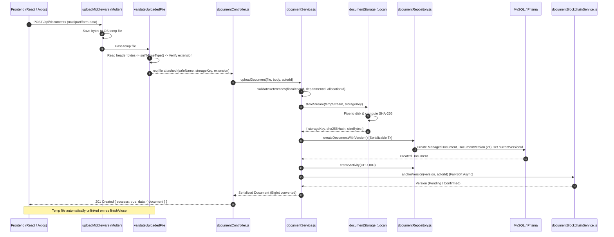
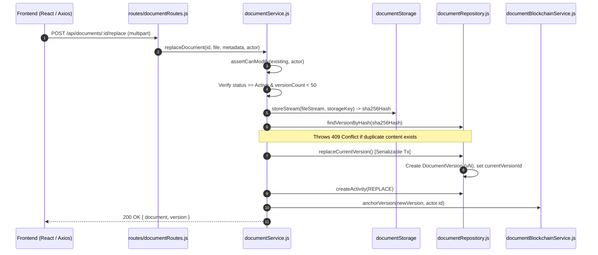
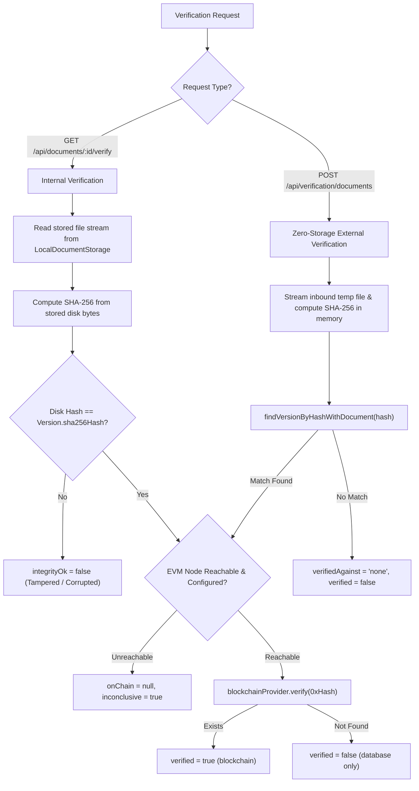

# Document Management — BudgetChain

> **Scope:** complete technical reference for document uploads, magic-byte file validation, stream hashing, version control, storage drivers, inline preview, attachment streaming, tamper verification, zero-storage external verification, and REST APIs in BudgetChain.  
> **Source of truth:** the implementation (`apps/backend/routes/documentRoutes.js`, `apps/backend/routes/verificationRoutes.js`, `apps/backend/controllers/documentController.js`, `apps/backend/services/documentService.js`, `apps/backend/services/documentStorageService.js`, `apps/backend/services/documentBlockchainService.js`, `apps/backend/repositories/documentRepository.js`, `apps/backend/middleware/uploadMiddleware.js`, `apps/backend/utils/fileUtils.js`, `apps/backend/prisma/schema.prisma`).

---

## 1. Purpose

The **Document Management** module handles financial documentation assets (purchase requests, purchase orders, quotations, receipts, invoices, disbursement vouchers, liquidation reports, budget proposals, contracts, and supporting documents) linked to budget allocations, departments, and fiscal years.

Key responsibilities:
- **Streaming Uploads & Secure Storage:** Inbound file streaming via OS temp directories, strict magic-byte MIME detection, UUID storage key resolution, and local disk driver persistence.
- **Atomic Multi-Version Control:** Sequential document code auto-generation (`DOC-YYYY-0001`), version bumping (up to 50 versions per document), replacement tracking with change reasons, and activity logging.
- **File Serving & Inline Preview:** Streaming downloads as attachments with RFC 5987 headers and inline preview for PDFs and image types.
- **Cryptographic Integrity & Verification:** Single-pass SHA-256 stream hashing, database hash comparisons, zero-storage external file verification, and fail-soft EVM ledger anchoring (`BudgetLedger`).
- **Service-Layer Access Control:** Segmenting modification permissions based on institutional roles (`Administrator` full access vs. `Treasurer`/`BudgetOfficer` own-upload access).

---

## 2. Features

- **Magic-Byte Sniffing:** Inbound files are inspected via magic bytes (`sniffMimeType`). Client-provided headers and extensions are not trusted. Extension/MIME mismatches or unsupported types yield `415 Unsupported Media Type`.
- **Constant Memory Disk Streaming:** Multer writes incoming bytes directly to OS temp files (`uploadMiddleware`). Streams pass through `crypto.createHash('sha256')` into the storage driver, keeping memory usage flat regardless of file size.
- **Path Traversal Defense:** Client file names are sanitized to base names (`sanitizeFileName`). Files are persisted using server-generated keys (`UUID.ext`) resolved strictly inside the storage root (`LocalDocumentStorage.resolveKey`).
- **Sequential Document Coding:** Auto-generated codes matching `DOC-YYYY-0001` (or `DOC-0001` without a fiscal year) generated inside serializable Prisma transactions.
- **Version Bumping & Cap:** Replaces current version, increments `versionNumber`, records `replaceReason`, and enforces a maximum cap of 50 versions per document (`MAX_DOCUMENT_VERSIONS = 50`). Duplicate version content hashes throw `409 Conflict`.
- **Activity History Timeline:** Eagerly loads actor details and records `UPLOAD`, `METADATA_UPDATE`, `REPLACE`, `ARCHIVE`, `VERIFY`, and `ANCHOR_RETRY` events in `document_activities`.
- **Inline Preview & Attachment Download:** Streamed responses set `Content-Type`, `X-Content-Type-Options: nosniff`, and `Content-Disposition`. Preview is restricted to PDFs and images; non-previewable formats yield `415`.
- **On-Demand & External Verification:** Internal verification compares disk hash, database hash, and blockchain anchor. Zero-storage external verification (`POST /api/verification/documents`) hashes an incoming stream without saving it to disk, checking if the file matches any registered document or blockchain anchor.
- **Fail-Soft Blockchain Anchoring:** Uploading or replacing a version triggers an asynchronous on-chain anchor on `BudgetLedger`. Blockchain errors mark the version `Failed` or leave it `Pending` without rolling back the DB transaction.

---

## 3. Workflow & Architecture

### 3.1 Document Upload & Initial Versioning Pipeline



### 3.2 Document Replacement Pipeline



### 3.3 Verification Workflow (Internal & Zero-Storage External)



---

## 4. Controllers

The controller layer lives in [`apps/backend/controllers/documentController.js`](file:///d:/Ramisys%20files/Projects/capstone/apps/backend/controllers/documentController.js).

### Controller Methods Summary

| Method | Target Service Method | Status Code | Audit Action | Description |
|--------|-----------------------|-------------|--------------|-------------|
| `uploadDocument` [`line 16`](file:///d:/Ramisys%20files/Projects/capstone/apps/backend/controllers/documentController.js#L16-L38) | `documentService.uploadDocument` | `201 Created` | `DOCUMENT_UPLOAD` | Handles multipart document upload. |
| `getDocumentById` [`line 46`](file:///d:/Ramisys%20files/Projects/capstone/apps/backend/controllers/documentController.js#L46-L56) | `documentService.getDocumentById` | `200 OK` | N/A | Fetches document details with current version & eager relations. |
| `getDocuments` [`line 64`](file:///d:/Ramisys%20files/Projects/capstone/apps/backend/controllers/documentController.js#L64-L100) | `documentService.getDocuments` | `200 OK` | N/A | Returns filtered, paginated, and sorted document list. |
| `updateDocument` [`line 108`](file:///d:/Ramisys%20files/Projects/capstone/apps/backend/controllers/documentController.js#L108-L132) | `documentService.updateDocument` | `200 OK` | `DOCUMENT_UPDATE` | Updates document metadata (title, type, description, references). |
| `replaceDocument` [`line 140`](file:///d:/Ramisys%20files/Projects/capstone/apps/backend/controllers/documentController.js#L140-L165) | `documentService.replaceDocument` | `200 OK` | `DOCUMENT_REPLACE` | Replaces current version with a new file and increments version number. |
| `getDocumentVersions` [`line 173`](file:///d:/Ramisys%20files/Projects/capstone/apps/backend/controllers/documentController.js#L173-L183) | `documentService.getDocumentVersions` | `200 OK` | N/A | Retrieves full version history of a document (newest first). |
| `getDocumentActivities` [`line 191`](file:///d:/Ramisys%20files/Projects/capstone/apps/backend/controllers/documentController.js#L191-L201) | `documentService.getDocumentActivities` | `200 OK` | N/A | Retrieves activity timeline of a document (newest first). |
| `downloadDocument` [`line 295`](file:///d:/Ramisys%20files/Projects/capstone/apps/backend/controllers/documentController.js#L295-L316) | `documentService.getDownloadFile` | `200 OK` | N/A | Streams file as attachment with RFC 5987 header. |
| `previewDocument` [`line 324`](file:///d:/Ramisys%20files/Projects/capstone/apps/backend/controllers/documentController.js#L324-L341) | `documentService.getPreviewFile` | `200 OK` | N/A | Streams inline preview for PDFs and image types. |
| `verifyDocument` [`line 209`](file:///d:/Ramisys%20files/Projects/capstone/apps/backend/controllers/documentController.js#L209-L219) | `documentBlockchainService.verifyDocument` | `200 OK` | `DOCUMENT_VERIFY` | Verifies stored disk file against DB hash and EVM ledger. |
| `verifyExternalDocument` [`line 227`](file:///d:/Ramisys%20files/Projects/capstone/apps/backend/controllers/documentController.js#L227-L236) | `documentBlockchainService.verifyExternalFile` | `200 OK` | `DOCUMENT_VERIFY` | Zero-storage verification of user-uploaded file. |
| `retryDocument` [`line 244`](file:///d:/Ramisys%20files/Projects/capstone/apps/backend/controllers/documentController.js#L244-L257) | `documentBlockchainService.retryDocumentVersion` | `200 OK` | `DOCUMENT_ANCHOR_RETRY` | Re-anchors a `Pending`/`Failed` document version on EVM ledger. |
| `deleteDocument` [`line 266`](file:///d:/Ramisys%20files/Projects/capstone/apps/backend/controllers/documentController.js#L266-L287) | `documentService.deleteDocument` | `200 OK` | `DOCUMENT_ARCHIVE` | Archives and soft-deletes document record. |

---

## 5. Services

### 5.1 `DocumentService` ([`apps/backend/services/documentService.js`](file:///d:/Ramisys%20files/Projects/capstone/apps/backend/services/documentService.js))

- **`uploadDocument(file, metadata, actorId)`**: Validates master data references, streams bytes to storage driver, creates document & version v1 in serializable transaction, logs `UPLOAD` activity, and initiates async `anchorVersion`.
- **`replaceDocument(id, file, metadata, actor)`**: Enforces `assertCanModify`, validates status is `Active` and version count < 50, checks duplicate hash, streams file to storage, creates version vN in serializable transaction, logs `REPLACE` activity, and anchors on-chain.
- **`updateDocument(id, metadata, actor)`**: Enforces `assertCanModify`, validates status is `Active`, updates metadata, and logs `METADATA_UPDATE` activity.
- **`deleteDocument(id, actor)`**: Enforces `assertCanModify`, sets `status = Archived` and `deletedAt = NOW()`, logs `ARCHIVE` activity. Stored file blobs are preserved on disk for audit retention.
- **`getDownloadFile(id, versionNumber)`**: Resolves target version and opens a read stream over `storageKey`.
- **`getPreviewFile(id)`**: Resolves current version and verifies `mimeType` is PDF or image (`application/pdf`, `image/jpeg`, `image/png`, `image/gif`, `image/tiff`, `image/webp`). Throws `415` if non-previewable.
- **`assertCanModify(existing, actor)`**: Enforces service ownership:
  ```javascript
  assertCanModify(existing, actor) {
    if (actor.role === ROLES.ADMINISTRATOR) {
      return;
    }
    if (existing.uploadedBy !== actor.id) {
      throw new ForbiddenError('You can only modify documents you uploaded');
    }
  }
  ```

### 5.2 `LocalDocumentStorage` ([`apps/backend/services/documentStorageService.js`](file:///d:/Ramisys%20files/Projects/capstone/apps/backend/services/documentStorageService.js))

- **`resolveKey(storageKey)`**: Resolves `path.resolve(this.root, storageKey)`. Throws `400 Bad Request` if path escapes storage root (Path Traversal Defense).
- **`storeStream(stream, storageKey)`**: Streams bytes to write stream while updating `crypto.createHash('sha256')`. Deletes target file on error.
- **`openReadStream(storageKey)`**: Checks file existence and returns `fs.createReadStream(path)`.
- **`removeBlob(storageKey)`**: Idempotently unlinks file (ignores `ENOENT`).

### 5.3 `DocumentBlockchainService` ([`apps/backend/services/documentBlockchainService.js`](file:///d:/Ramisys%20files/Projects/capstone/apps/backend/services/documentBlockchainService.js))

- **`anchorVersion(version, actor)`**: Calls `blockchainService.anchorUnlessExists(version.sha256Hash)`. Updates `blockchainStatus` (`Confirmed` or `Failed`), `txHash`, `blockNumber`, and `confirmedAt`.
- **`verifyDocument(id, versionNumber, actor)`**: Reads stored file from disk, computes SHA-256, compares with `version.sha256Hash`, and checks on-chain record via `blockchainProvider.verify`. Logs `VERIFY` activity.
- **`verifyExternalFile(file, actor)`**: Streams inbound temp file, computes SHA-256 in memory, queries `documentRepository.findVersionByHashWithDocument`. Reports `verifiedAgainst` (`'blockchain'`, `'database'`, or `'none'`).

---

## 6. Database & Data Access

### 6.1 Prisma Models

Defined in [`apps/backend/prisma/schema.prisma`](file:///d:/Ramisys%20files/Projects/capstone/apps/backend/prisma/schema.prisma#L295-L416):

```prisma
enum DocumentType {
  PurchaseRequest
  PurchaseOrder
  Quotation
  Receipt
  Invoice
  DisbursementVoucher
  LiquidationReport
  BudgetProposal
  Contract
  Other
}

enum DocumentStatus {
  Active
  Archived
}

model ManagedDocument {
  id               String         @id @default(uuid())
  documentCode     String         @unique
  title            String         @db.VarChar(200)
  description      String?        @db.VarChar(1000)
  documentType     DocumentType
  fiscalYearId     String?
  departmentId     String?
  allocationId     String?
  status           DocumentStatus @default(Active)
  currentVersionId String?        @unique
  uploadedBy       String
  archivedBy       String?
  archivedAt       DateTime?
  deletedAt        DateTime?
  createdAt        DateTime       @default(now())
  updatedAt        DateTime       @updatedAt

  fiscalYear     FiscalYear?       @relation(fields: [fiscalYearId], references: [id])
  department     Department?       @relation(fields: [departmentId], references: [id])
  allocation     BudgetAllocation? @relation(fields: [allocationId], references: [id])
  currentVersion DocumentVersion?  @relation("DocumentCurrentVersion", fields: [currentVersionId], references: [id])
  uploader       User              @relation("DocumentUploader", fields: [uploadedBy], references: [id])
  archiver       User?             @relation("DocumentArchiver", fields: [archivedBy], references: [id])

  versions   DocumentVersion[]
  activities DocumentActivity[]

  @@index([documentCode])
  @@index([allocationId])
  @@index([fiscalYearId])
  @@index([departmentId])
  @@index([documentType])
  @@index([status])
  @@index([uploadedBy])
  @@index([createdAt])
  @@index([deletedAt])
  @@map("managed_documents")
}

model DocumentVersion {
  id               String                 @id @default(uuid())
  documentId       String
  versionNumber    Int
  originalFileName String                 @db.VarChar(255)
  storageKey       String                 @unique
  mimeType         String                 @db.VarChar(100)
  fileSizeBytes    BigInt
  fileExtension    String                 @db.VarChar(10)
  sha256Hash       String                 @unique
  blockchainStatus BlockchainRecordStatus @default(Pending)
  txHash           String?                @unique
  blockNumber      BigInt?
  network          String?
  confirmedAt      DateTime?
  replaceReason    String?                @db.VarChar(500)
  uploadedBy       String
  createdAt        DateTime               @default(now())

  document ManagedDocument @relation(fields: [documentId], references: [id], onDelete: Cascade)
  uploader User            @relation("DocumentVersionUploader", fields: [uploadedBy], references: [id])

  @@unique([documentId, versionNumber])
  @@index([documentId])
  @@index([sha256Hash])
  @@index([storageKey])
  @@index([blockchainStatus])
  @@index([uploadedBy])
  @@index([createdAt])
  @@map("document_versions")
}

model DocumentActivity {
  id         String   @id @default(uuid())
  documentId String
  versionId  String?
  actorId    String
  action     String   @db.VarChar(50)
  details    Json?
  createdAt  DateTime @default(now())

  document ManagedDocument  @relation(fields: [documentId], references: [id], onDelete: Cascade)
  version  DocumentVersion? @relation(fields: [versionId], references: [id])
  actor    User             @relation("DocumentActivityActor", fields: [actorId], references: [id])

  @@index([documentId])
  @@index([actorId])
  @@index([createdAt])
  @@map("document_activities")
}
```

---

## 7. APIs

Endpoints mount under `/api/documents` in [`apps/backend/routes/documentRoutes.js`](file:///d:/Ramisys%20files/Projects/capstone/apps/backend/routes/documentRoutes.js) and `/api/verification` in [`apps/backend/routes/verificationRoutes.js`](file:///d:/Ramisys%20files/Projects/capstone/apps/backend/routes/verificationRoutes.js). All require authentication (`authenticate`).

### API Endpoints Reference

| Method | Route Path | Access Permission | Validation / Middleware | Description |
|--------|------------|-------------------|-------------------------|-------------|
| `GET` | `/api/documents` | All Roles | `documentQuerySchema` | Paginated list with filtering by type, status, date |
| `GET` | `/api/documents/:id` | All Roles | `documentIdParamSchema` | Single document detail with current version & eager relations |
| `GET` | `/api/documents/:id/download` | All Roles | `documentIdParamSchema`, `documentVersionQuerySchema` | Download version stream as attachment |
| `GET` | `/api/documents/:id/preview` | All Roles | `documentIdParamSchema` | Stream inline preview (PDFs and images only) |
| `GET` | `/api/documents/:id/versions` | All Roles | `documentIdParamSchema` | List all version records (newest first) |
| `GET` | `/api/documents/:id/activity` | All Roles | `documentIdParamSchema` | Fetch persisted activity timeline |
| `GET` | `/api/documents/:id/verify` | All Roles | `documentIdParamSchema`, `documentVersionQuerySchema` | Verify disk hash against DB & EVM ledger |
| `POST` | `/api/documents` | Admin, Treasurer, BudgetOfficer | `uploadLimiter`, `uploadMiddleware('file')`, `validateUploadedFile`, `createDocumentSchema` | Upload new document (multipart) |
| `POST` | `/api/documents/:id/replace` | Admin, Treasurer, BudgetOfficer | `uploadLimiter`, `uploadMiddleware('file')`, `validateUploadedFile`, `replaceDocumentSchema` | Replace current version with a new file |
| `PUT` | `/api/documents/:id` | Admin, Treasurer, BudgetOfficer | `documentIdParamSchema`, `updateDocumentSchema` | Update document metadata |
| `DELETE` | `/api/documents/:id` | Admin, Treasurer, BudgetOfficer | `documentIdParamSchema` | Archive + soft-delete document |
| `POST` | `/api/documents/:id/retry` | Admin, Treasurer, BudgetOfficer | `documentIdParamSchema`, `documentVersionQuerySchema` | Re-anchor `Pending`/`Failed` version on EVM ledger |
| `POST` | `/api/verification/documents` | All Roles | `uploadLimiter`, `uploadMiddleware('file')`, `validateUploadedFile` | Zero-storage external file verification |

---

## 8. Permissions & RBAC

### 8.1 Authorization Matrix

| Action / Route Endpoint | Administrator | Treasurer | BudgetOfficer | Auditor |
|-------------------------|:-------------:|:---------:|:-------------:|:-------:|
| Read / Preview / Download / History (`GET /api/documents*`) | ✅ Allowed | ✅ Allowed | ✅ Allowed | ✅ Allowed |
| Internal & External Verify (`GET /:id/verify`, `POST /api/verification/documents`) | ✅ Allowed | ✅ Allowed | ✅ Allowed | ✅ Allowed |
| Upload (`POST /api/documents`) | ✅ Allowed | ✅ Allowed | ✅ Allowed | ❌ 403 Forbidden |
| Replace Version (`POST /api/documents/:id/replace`) | 🟢 Allowed | 🟡 Own Only* | 🟡 Own Only* | ❌ 403 Forbidden |
| Update Metadata (`PUT /api/documents/:id`) | 🟢 Allowed | 🟡 Own Only* | 🟡 Own Only* | ❌ 403 Forbidden |
| Delete / Archive (`DELETE /api/documents/:id`) | 🟢 Allowed | 🟡 Own Only* | 🟡 Own Only* | ❌ 403 Forbidden |
| Anchor Retry (`POST /api/documents/:id/retry`) | ✅ Allowed | ✅ Allowed | ✅ Allowed | ❌ 403 Forbidden |

*\* Service-layer ownership constraint (`assertCanModify`) requires `existing.uploadedBy === actor.id` for non-Admin roles.*

---

## 9. Business Rules & Integrity Constraints

### Rule 1: Magic-Byte Inspection & Anti-Spoofing
- **Enforcement:** `validateUploadedFile` ([`uploadMiddleware.js:128`](file:///d:/Ramisys%20files/Projects/capstone/apps/backend/middleware/uploadMiddleware.js#L128)) and `validateUploadFile` ([`fileUtils.js:256`](file:///d:/Ramisys%20files/Projects/capstone/apps/backend/utils/fileUtils.js#L256)).
- **Constraint:** Client file name and MIME header are un-trusted. Real file type is sniffed via magic bytes (`sniffMimeType`). Extensions must match detected MIME type (`mimeMatchesExtension`). Unrecognized or un-allowed MIMEs/extensions yield HTTP `415 Unsupported Media Type`.

### Rule 2: Path Traversal & Collision-Safe Storage Keys
- **Enforcement:** `sanitizeFileName` ([`fileUtils.js:131`](file:///d:/Ramisys%20files/Projects/capstone/apps/backend/utils/fileUtils.js#L131)) and `LocalDocumentStorage.resolveKey` ([`documentStorageService.js:30`](file:///d:/Ramisys%20files/Projects/capstone/apps/backend/services/documentStorageService.js#L30)).
- **Constraint:** Files are stored using server-generated keys (`UUID.ext`). Client file names are stripped of path separators (`path.basename`). `resolveKey` rejects any key resolving outside `STORAGE_ROOT` (`400 Bad Request`).

### Rule 3: Single-Pass Constant Memory Streaming
- **Enforcement:** `uploadMiddleware` Multer disk storage ([`uploadMiddleware.js:20`](file:///d:/Ramisys%20files/Projects/capstone/apps/backend/middleware/uploadMiddleware.js#L20)) and `LocalDocumentStorage.storeStream` ([`documentStorageService.js:56`](file:///d:/Ramisys%20files/Projects/capstone/apps/backend/services/documentStorageService.js#L56)).
- **Constraint:** Incoming byte streams write to disk while updating `crypto.createHash('sha256')` in a single pass. Temp files are automatically unlinked on request finish or abort.

### Rule 4: Maximum Version Cap & Duplicate Hash Rejection
- **Enforcement:** `documentService.replaceDocument` ([`documentService.js:318, 333`](file:///d:/Ramisys%20files/Projects/capstone/apps/backend/services/documentService.js#L318)).
- **Constraint:** A document cannot exceed 50 versions (`MAX_DOCUMENT_VERSIONS = 50`). Uploading a replacement file whose SHA-256 hash matches an existing version throws HTTP `409 Conflict` (*"A version with the same content already exists"*).

### Rule 5: Ownership Isolation for Non-Administrators
- **Enforcement:** `documentService.assertCanModify` ([`documentService.js:517`](file:///d:/Ramisys%20files/Projects/capstone/apps/backend/services/documentService.js#L517)).
- **Constraint:** Administrators can modify, replace, or archive any document. `Treasurer` and `BudgetOfficer` users are restricted to modifying documents where `uploadedBy === actor.id`. Violations throw `403 Forbidden`.

### Rule 6: Format-Restricted Inline Preview
- **Enforcement:** `documentService.getPreviewFile` ([`documentService.js:446`](file:///d:/Ramisys%20files/Projects/capstone/apps/backend/services/documentService.js#L446)).
- **Constraint:** Inline preview streaming (`GET /api/documents/:id/preview`) is supported strictly for PDFs (`application/pdf`) and images (`image/jpeg`, `image/png`, `image/gif`, `image/tiff`, `image/webp`). Non-previewable documents yield HTTP `415 Unsupported Media Type`.

### Rule 7: Fail-Soft Ledger Anchoring
- **Enforcement:** `documentBlockchainService.anchorVersion` ([`documentBlockchainService.js:39`](file:///d:/Ramisys%20files/Projects/capstone/apps/backend/services/documentBlockchainService.js#L39)).
- **Constraint:** Uploading or replacing a document triggers an asynchronous EVM anchor on `BudgetLedger`. Unreachable blockchain nodes mark the version as `Failed` or leave it `Pending` without rolling back the DB document creation.
