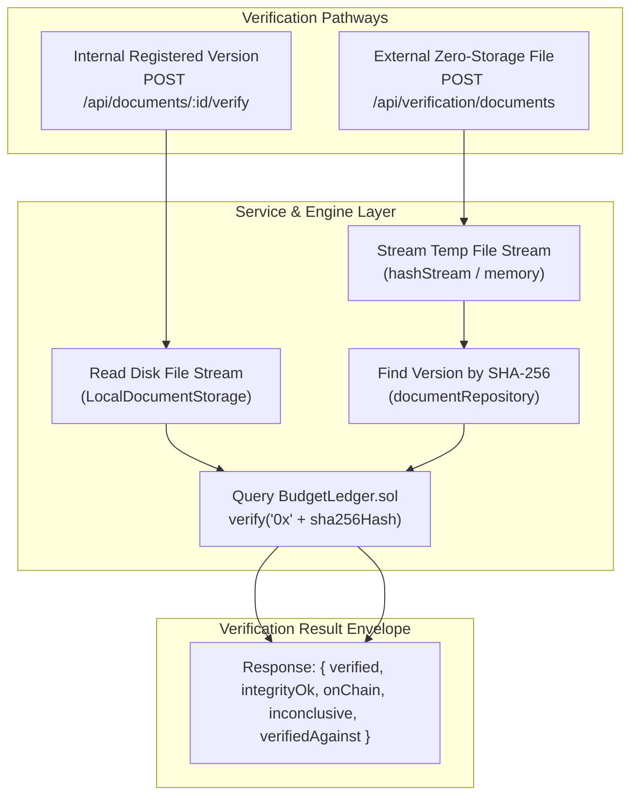
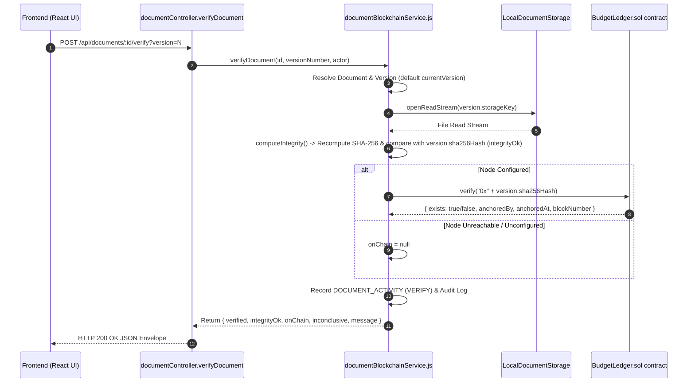
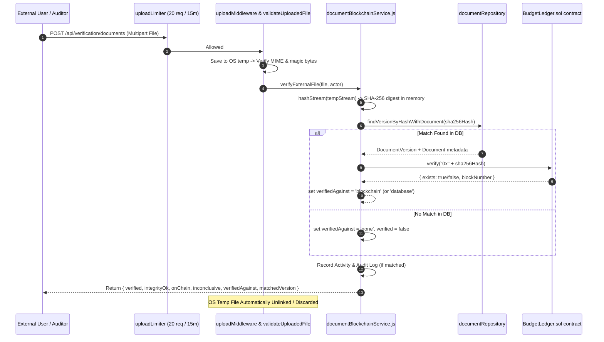
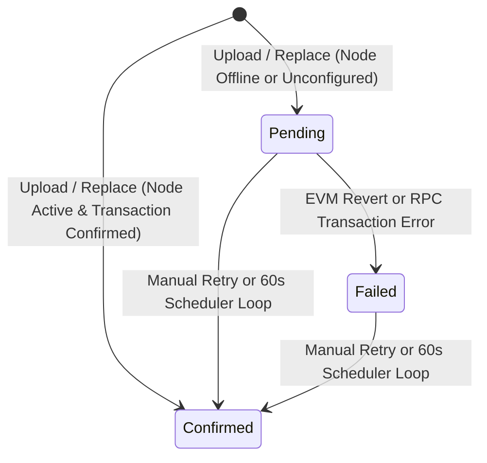

# Document Verification & Integrity Architecture — BudgetChain

> **Scope:** comprehensive technical reference for document verification workflows, internal version tamper checking, zero-storage external file verification, duplicate detection, blockchain ledger matching, status lifecycles, and error handling.  
> **Source of truth:** implementation in `apps/backend/services/documentBlockchainService.js`, `apps/backend/services/documentService.js`, `apps/backend/middleware/uploadMiddleware.js`, `apps/backend/routes/verificationRoutes.js`, `apps/backend/routes/documentRoutes.js`, and `apps/frontend/src/components/verification/FileVerificationCard.tsx`.

---

## 1. Overview & Verification Models

BudgetChain provides **two distinct document verification pathways** to ensure document authenticity, tamper-resistance, and evidentiary compliance:

1. **Internal Registered Document Verification** (`POST /api/documents/:id/verify?version=N`):
   Verifies an existing document version stored in the system. Checks that the physical file on disk matches its recorded upload SHA-256 hash (local tamper check) and confirms its on-chain anchor on `BudgetLedger.sol`.

2. **Zero-Storage External File Verification** (`POST /api/verification/documents`):
   Allows any authenticated user (Auditor, Administrator, Treasurer, Budget Officer) to drag-and-drop an external document file to verify its origin. The server streams the file in memory to compute its SHA-256 digest, checks for database and blockchain ledger matches, and **discards the temp file immediately without saving it to disk (0 bytes persisted)**.



---

## 2. Verification Workflows

### 2.1 Internal Document Version Verification Workflow
Used when inspecting a registered document in the system (e.g. from the Document Management UI).



---

### 2.2 Zero-Storage External File Verification Workflow
Used on the **File Verification** page (`/verify`) to test external file authenticity.



---

## 3. Blockchain Ledger Verification

Verification queries `BudgetLedger.sol` via `blockchainProvider.verify("0x" + sha256Hash)`.

### 3.1 Response Metrics & Standard Envelope

| Metric Field | Type | Description |
|--------------|------|-------------|
| `verified` | `boolean` | `true` only when local bytes match (`integrityOk == true`) AND on-chain record exists (`onChain.exists == true`) |
| `integrityOk` | `boolean` | `true` when recomputed SHA-256 matches stored upload digest. Detects physical file alteration |
| `onChain` | `object \| null` | `{ exists: boolean, anchoredBy: string, anchoredAt: number, blockNumber: number }` or `null` if node is offline |
| `inconclusive` | `boolean` | `true` when `integrityOk == true` BUT `onChain === null` (node unreachable). Prevents false tampering alarms |
| `verifiedAgainst` | `string` | Returned by external verification: `'blockchain'`, `'database'`, or `'none'` |

### 3.2 Result Message Mapping

```javascript
if (verified) {
  message = 'Document verified on the blockchain ledger.';
} else if (!integrityOk) {
  message = 'Document does not match its anchored hash — possible tampering.';
} else if (onChain === null) {
  message = 'On-chain verification is inconclusive — the blockchain node is unreachable, so the anchor could not be confirmed.';
} else {
  message = 'On-chain record not found; this version has not been anchored on this node.';
}
```

---

## 4. Duplicate Detection & Prevention

BudgetChain enforces strict file deduplication at upload and replacement boundaries:

### 4.1 Version Replacement Deduplication
When replacing a document version (`documentService.replaceDocument`):
1. The new file stream is written to disk and its SHA-256 digest is computed.
2. The service checks the new digest against **all previous versions** of that document (`findVersionsByDocumentId`).
3. If `newHash === existingVersion.sha256Hash`, the operation is aborted:
   - Throws `AppError('New file is identical to an existing version', HTTP_STATUS.CONFLICT)` (HTTP 409).
   - Unlinks the newly written temp file immediately.

### 4.2 Database Hash Lookup
For external verification, `documentRepository.findVersionByHashWithDocument(sha256Hash)` executes an indexed lookup on `document_versions(sha256Hash)` (`schema.prisma:347`), locating matching registered documents instantly across the system.

---

## 5. Status Lifecycles & State Transitions

### 5.1 Blockchain Anchor Status (`BLOCKCHAIN_RECORD_STATUS`)



- **`Pending`**: Version created; EVM anchor awaiting processing or node unconfigured.
- **`Confirmed`**: Anchored on `BudgetLedger.sol` (`txHash`, `blockNumber`, and `confirmedAt` populated).
- **`Failed`**: Anchoring transaction failed; queued for background retry.

### 5.2 Document Status (`DOCUMENT_STATUS`)
- **`Active`**: Live document version available for edit, download, and replacement.
- **`Archived`**: Archived document. Files and versions remain intact for verification and evidentiary proof, but replacement is disabled.

---

## 6. Error Handling & Edge Cases

| Scenario | HTTP Status | Exception / Error Message | System Behavior |
|----------|-------------|---------------------------|-----------------|
| **No file attached in request** | `400 Bad Request` | `A valid file is required` | Request rejected before processing |
| **Unsupported file type / extension** | `415 Unsupported Media Type` | `Unsupported file format` | Magic byte validator rejects upload; temp file unlinked |
| **Exceeded file size cap** | `400 Bad Request` | `File size exceeds maximum limit of 25MB` | Multer middleware truncates and rejects stream |
| **Identical replacement file** | `409 Conflict` | `New file is identical to an existing version` | Upload rejected; new blob removed from disk |
| **Exceeded version cap** | `409 Conflict` | `Maximum document version limit reached (50)` | Replacement blocked to prevent disk exhaustion |
| **Missing stored file on disk** | `404 Not Found` | `Stored file could not be read for verification` | Logged to event log; returns 404 |
| **EVM Node Unreachable** | `200 OK` (Fail-Soft) | N/A | Returns `inconclusive: true`, `onChain: null`, `verified: false`. API call succeeds |
| **Unregistered file verification** | `200 OK` | `No document in the system matches this file...` | Returns `verifiedAgainst: 'none'`, `verified: false` |
