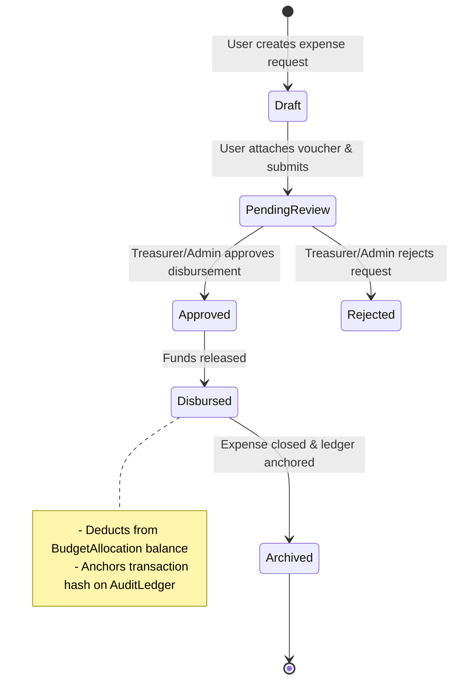
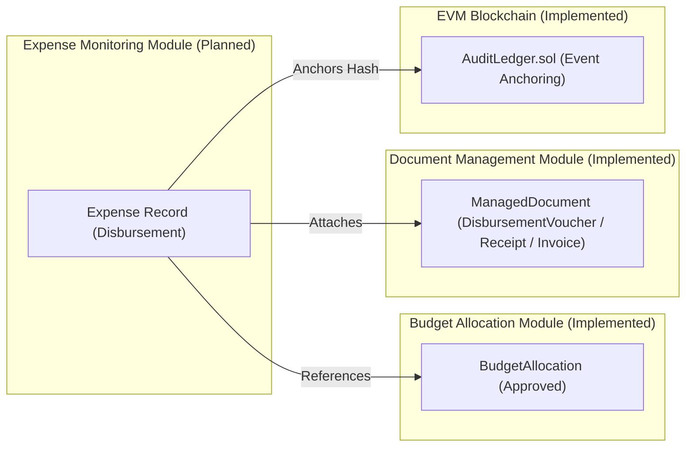

# Expense Monitoring — BudgetChain

> **Status:** 🚧 Planned / Placeholder Feature  
> **Scope:** technical reference for the planned Expense Monitoring module, detailing the current frontend placeholder implementation, architectural design, document voucher links, data model requirements, and planned REST APIs in BudgetChain.  
> **Source of truth:** the implementation (`apps/frontend/src/routes/AppRoutes.tsx`, `apps/frontend/src/components/layout/sidebar/sidebarConfig.ts`, `apps/backend/prisma/schema.prisma`, `apps/backend/routes/apiRouter.js`).

---

## 1. Purpose

The **Expense Monitoring** module is designed to provide end-to-end tracking of university operational expenditures, disbursements, purchase requests, and liquidation reports against committed budget allocations.

While Budget Allocations (`BudgetAllocation`) establish authorized spending ceilings per department, fund source, and program, Expense Monitoring will log actual financial outflows, verify supporting financial documents (vouchers, invoices, receipts), calculate live remaining allocation balances, and anchor expenditure audit events on the EVM blockchain ledger.

In the current repository snapshot, Expense Monitoring exists as a **planned feature** represented by a frontend UI placeholder route and navigation item.

---

## 2. Features

### Current Implementation (Placeholder)
- **Frontend UI Navigation:** Dedicated "Expense Tracking" item in the sidebar navigation under the `MANAGEMENT` section ([`apps/frontend/src/components/layout/sidebar/sidebarConfig.ts:108-119`](file:///d:/Ramisys%20files/Projects/capstone/apps/frontend/src/components/layout/sidebar/sidebarConfig.ts#L108-L119)) with `status: 'Planned'`.
- **Placeholder View:** Accessible via route `/expense-tracking` ([`apps/frontend/src/routes/AppRoutes.tsx:173-182`](file:///d:/Ramisys%20files/Projects/capstone/apps/frontend/src/routes/AppRoutes.tsx#L173-L182)), displaying an informational banner: *"Expense Tracking — Planned feature in Phase 4"*.
- **Document Voucher Infrastructure:** The Managed Documents module (`schema.prisma:60-71`) already supports document types specifically designated for expense monitoring: `PurchaseRequest`, `PurchaseOrder`, `Quotation`, `Receipt`, `Invoice`, `DisbursementVoucher`, `LiquidationReport`, and `Contract`.

### Planned Core Features
- **Expense Logging:** Recording individual disbursement transactions against approved budget allocations (`BudgetAllocation`).
- **Allocation Balance Depletion:** Automatically deducting validated expense amounts from the allocation's remaining balance.
- **Voucher Attachment & Verification:** Linking uploaded files (`ManagedDocument`) such as receipts and vouchers to specific expense entries with SHA-256 integrity verification.
- **On-Chain Audit Anchoring:** Anchoring expense event hashes on the `AuditLedger` EVM smart contract for tamper-evident expense auditing.

---

## 3. Workflow & Architecture

### 3.1 Planned Expenditure Lifecycle



### 3.2 Integration with Existing Architecture



---

## 4. Controllers

> 🚧 **Status:** Planned — No backend controller currently exists in `apps/backend/controllers/`.

When implemented, the expense controller (`expenseController.js`) will expose handlers matching the standard backend pipeline (`authenticate` → `authorize` → `validateRequest` → controller handler → service logic → response envelope).

### Planned Controller Methods

| Method | Target Endpoint | Description |
|--------|-----------------|-------------|
| `createExpense` | `POST /api/expenses` | Logs a new expense against an approved allocation. |
| `getExpenseById` | `GET /api/expenses/:id` | Retrieves single expense details with linked vouchers. |
| `getExpenses` | `GET /api/expenses` | Lists expenses with pagination, filtering, and date range filters. |
| `updateExpense` | `PUT /api/expenses/:id` | Updates draft expense details. |
| `approveExpense` | `POST /api/expenses/:id/approve` | Approves disbursement and deducts allocation balance. |
| `deleteExpense` | `DELETE /api/expenses/:id` | Cancels or soft-deletes an un-disbursed expense. |

---

## 5. Services

> 🚧 **Status:** Planned — No backend service currently exists in `apps/backend/services/`.

The future `expenseService.js` will encapsulate business logic for expense validation, allocation balance checks, voucher linking, and audit logging.

### Planned Service Operations
- **`validateAllocationBalance(allocationId, expenseAmount)`**: Ensures proposed expense amount does not exceed the remaining approved balance of `BudgetAllocation`.
- **`createExpense(expenseData, actorId)`**: Creates expense entry and links supporting `ManagedDocument` records.
- **`approveDisbursement(expenseId, approverId)`**: Updates status to `Disbursed`, deducts amount from allocation, and emits audit event.
- **`anchorExpenseLedger(expenseId)`**: Calls `auditEventBlockchainService` to record event hash on `AuditLedger`.

---

## 6. Database

> 🚧 **Status:** Planned model — `Expense` model is not yet present in `apps/backend/prisma/schema.prisma`.

### Current Supporting Schema

The database currently includes models that support the planned expense monitoring integration:

1. **`BudgetAllocation`** ([`apps/backend/prisma/schema.prisma:170`](file:///d:/Ramisys%20files/Projects/capstone/apps/backend/prisma/schema.prisma#L170)): Serves as the parent container holding allocated funds.
2. **`ManagedDocument`** ([`apps/backend/prisma/schema.prisma:295`](file:///d:/Ramisys%20files/Projects/capstone/apps/backend/prisma/schema.prisma#L295)): Documents linked to `allocationId` with types tailored for expense proof:
   - `PurchaseRequest`, `PurchaseOrder`, `Quotation`, `Receipt`, `Invoice`, `DisbursementVoucher`, `LiquidationReport`.

### Planned `Expense` Prisma Schema

```prisma
// Planned addition to schema.prisma
enum ExpenseStatus {
  Draft
  PendingApproval
  Approved
  Disbursed
  Rejected
}

model Expense {
  id              String        @id @default(uuid())
  expenseCode     String        @unique // e.g. EXP-2026-001
  allocationId    String
  amount          Decimal       @db.Decimal(14, 2)
  payee           String        @db.VarChar(200)
  description     String?       @db.VarChar(500)
  status          ExpenseStatus @default(Draft)
  disbursedAt     DateTime?
  createdBy       String
  approvedBy      String?
  createdAt       DateTime      @default(now())
  updatedAt       DateTime      @updatedAt
  deletedAt       DateTime?

  allocation BudgetAllocation @relation(fields: [allocationId], references: [id])
  creator    User             @relation("ExpenseCreator", fields: [createdBy], references: [id])
  approver   User?            @relation("ExpenseApprover", fields: [approvedBy], references: [id])
  documents  ManagedDocument[]

  @@index([expenseCode])
  @@index([allocationId])
  @@index([status])
  @@index([createdAt])
  @@map("expenses")
}
```

---

## 7. APIs

> 🚧 **Status:** Planned — No expense routes are currently mounted in [`apps/backend/routes/apiRouter.js`](file:///d:/Ramisys%20files/Projects/capstone/apps/backend/routes/apiRouter.js).

### Planned REST Endpoints

| Method | Endpoint Path | Access Level | Description |
|--------|---------------|--------------|-------------|
| `GET` | `/api/expenses` | Private (All Roles) | List expenses with filtering by allocation, status, date |
| `GET` | `/api/expenses/:id` | Private (All Roles) | Get expense details, voucher links, and status |
| `POST` | `/api/expenses` | Private (Admin, BudgetOfficer) | Create new expense request |
| `PUT` | `/api/expenses/:id` | Private (Admin, BudgetOfficer) | Update draft expense request |
| `POST` | `/api/expenses/:id/submit` | Private (Admin, BudgetOfficer) | Submit expense for disbursement approval |
| `POST` | `/api/expenses/:id/approve` | Private (Admin, Treasurer) | Approve disbursement & deduct allocation balance |
| `DELETE` | `/api/expenses/:id` | Private (Admin, BudgetOfficer) | Soft-delete draft expense |

---

## 8. Permissions & RBAC

### Planned Permission Matrix

| Action | Administrator | Treasurer | BudgetOfficer | Auditor |
|--------|:-------------:|:---------:|:-------------:|:-------:|
| Read Expenses (`GET /api/expenses*`) | ✅ Allowed | ✅ Allowed | ✅ Allowed | ✅ Allowed |
| Create / Submit Request (`POST /api/expenses`) | ✅ Allowed | ❌ Forbidden | ✅ Allowed | ❌ Forbidden |
| Approve Disbursement (`POST /api/expenses/:id/approve`) | 🟡 Allowed* | 🟡 Allowed* | ❌ Forbidden | ❌ Forbidden |
| Cancel / Delete (`DELETE /api/expenses/:id`) | ✅ Allowed | ❌ Forbidden | 🟡 Creator Only | ❌ Forbidden |

*\* Subject to Self-Approval Prevention (approver cannot be expense creator).*

---

## 9. Business Rules

1. **Allocation Fund Availability:** An expense cannot be approved or disbursed if `expenseAmount > remainingAllocationBalance`.
2. **Mandatory Supporting Voucher:** Disbursement approval requires at least one verified `ManagedDocument` attached (e.g. `DisbursementVoucher` or `Invoice`).
3. **Self-Disbursement Prevention:** The user who created the expense request cannot approve or disburse it (`createdBy !== approvedBy`).
4. **Immutable Disbursed Expenses:** Once an expense transitions to `Disbursed`, it becomes immutable and cannot be updated or deleted.
5. **Fail-Soft Blockchain Event Logging:** Disbursed expenses trigger an automatic audit event recorded on `AuditLedger`. Node unreachability will log a `Pending`/`Failed` anchor state without aborting the financial disbursement.
