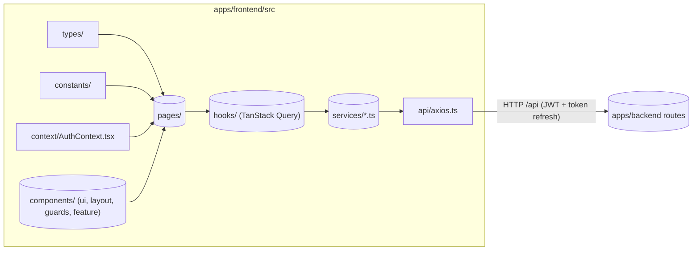
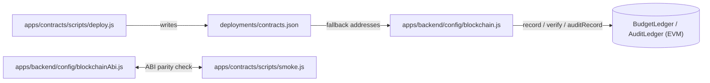

# File Structure — BudgetChain Monorepo

> **Scope:** the repository's directory and file organization: what lives where, what each directory/file is responsible for, how the modules relate, and the naming conventions in use.
> **Source of truth:** the implementation. This document is derived from the actual tree and source code (not from README/CLAUDE prose). Anything not determinable from code is marked *unknown*.

---

## 1. Repository Overview

BudgetChain is an npm-workspaces monorepo (`package.json:1`, name `capstone`) containing three real workspaces and one placeholder:

| Path | Stack | Role |
|------|-------|------|
| `apps/backend` | Express 4 + Prisma 5 + MySQL, ESM (`"type": "module"`) | All business logic; REST API on `:5000` |
| `apps/frontend` | React 19 + Vite 6 + TypeScript | SPA on `:3000` (dev), proxies `/api` → `:5000` |
| `apps/contracts` | Hardhat 2 + Solidity 0.8.24 | On-chain ledgers (BudgetLedger, AuditLedger) |
| `packages/shared` | — | Placeholder (README only, no code) |

Workspaces are declared in `package.json:4` (`apps/backend`, `apps/frontend`, `apps/contracts`, `packages/*`). Root scripts orchestrate the workspaces: `dev:backend`, `dev:frontend`, `test:backend`, `test:frontend`, `test`, `build:frontend`, `blockchain:compile`, `blockchain:node`, `blockchain:deploy` (`package.json:10`).

Layering is strict and consistent: backend traffic flows **routes → middleware → controllers → services → repositories → Prisma/MySQL**, with an optional side-effect branch into the blockchain adapter and the local document-storage driver. The frontend flows **pages → hooks (TanStack Query) → services → axios → `/api`**.

```
┌────────────┐   HTTP /api (JWT)   ┌──────────────────────┐   ethers v6   ┌────────────────────┐
│  frontend  │ ──────────────────► │        backend       │ ────────────► │  contracts         │
│  React 19  │   Vite proxy 3000   │  Express + Prisma +  │   record/     │  BudgetLedger /    │
│  (SPA)     │   → 5000            │  MySQL + local files │   verify      │  AuditLedger       │
└────────────┘                     └──────────────────────┘ ◄──────────── └────────────────────┘
```

---

## 2. Directory Hierarchy

```
capstone/                              npm workspaces monorepo
├── package.json                       workspaces + orchestration scripts
├── package-lock.json
├── AGENTS.md                          authoritative operational guide (commands/conventions)
├── README.md                          overview + setup (details partially stale)
├── CLAUDE.md                          legacy AI-guidance (not authoritative)
├── USER_MANAGEMENT_SUMMARY.md         legacy phase summary (not authoritative)
├── .gitignore                         node_modules, .env*, dist, storage/, .claude/
├── docs/                              this documentation set
│   ├── INDEX.md
│   ├── PROJECT_OVERVIEW.md
│   ├── ARCHITECTURE.md
│   └── FILE_STRUCTURE.md              (this file)
│
├── apps/
│   ├── backend/                       Express + Prisma + MySQL API (ESM)
│   │   ├── app.js                     Express app assembly
│   │   ├── server.js                  bootstrap + scheduler lifecycle + graceful shutdown
│   │   ├── .env / .env.example        runtime env (gitignored) / template
│   │   ├── README.md                  stale early-phase guide (not authoritative)
│   │   ├── config/                    env fail-fast, helmet, cors, blockchain, storage, ABIs
│   │   ├── constants/                 UPPER_SNAKE mirrors of Prisma enums + workflow maps
│   │   ├── controllers/               thin HTTP handlers (JSON envelope)
│   │   ├── errors/                    AppError base + typed API/Prisma errors
│   │   ├── middleware/                authn, authz, rate-limit, upload, audit, error, 404
│   │   ├── models/                    prismaClient.js (Prisma singleton)
│   │   ├── repositories/              Prisma data access (one per entity)
│   │   ├── routes/                    per-module routers, mounted under /api
│   │   ├── services/                  business logic (incl. blockchain + scheduler)
│   │   ├── utils/                     jwt, password, amounts, hashing, response, audit, files
│   │   ├── validators/                Zod schemas per module + validateRequest driver
│   │   ├── prisma/                    schema.prisma + migrations/ + seed.js
│   │   ├── tests/                     plain node:assert scripts (no test runner)
│   │   ├── docs/                      API_DOCUMENTATION.md (stale)
│   │   └── storage/                   runtime document blobs (gitignored, created on demand)
│   │
│   ├── frontend/                      React 19 + Vite + TS SPA
│   │   ├── index.html                 HTML entry (mounts #root)
│   │   ├── package.json               scripts: dev/build/typecheck/test
│   │   ├── tsconfig.json              lenient TS (strict:false, allowJs:true)
│   │   ├── vite.config.js             dev :3000 + /api proxy → :5000
│   │   ├── vitest.config.ts           jsdom + setup files
│   │   ├── dist/                      Vite build output (gitignored)
│   │   └── src/
│   │       ├── main.tsx               createRoot + StrictMode
│   │       ├── App.tsx                provider hierarchy + AppRoutes
│   │       ├── index.css              Tailwind v4 + Bootstrap + CSS-variable theme
│   │       ├── api/                   axios instance + interceptors, auth wrappers
│   │       ├── assets/                static assets (logo.svg)
│   │       ├── components/            ui primitives, layout, guards, feature components
│   │       ├── constants/             enum mirrors + UI label/variant maps
│   │       ├── context/               AuthContext (session state)
│   │       ├── hooks/                 TanStack Query hooks (use*)
│   │       ├── pages/                 route-level views
│   │       ├── routes/                AppRoutes.tsx (route tree)
│   │       ├── services/              typed API wrappers (one per resource)
│   │       ├── test/                  vitest setup + renderWithProviders
│   │       ├── types/                 domain types (per resource)
│   │       └── utils/                 shared helpers (format.ts)
│   │
│   └── contracts/                     Hardhat + Solidity
│       ├── hardhat.config.js          solc 0.8.24, localhost network
│       ├── package.json               compile/node/deploy/smoke/test
│       ├── README.md                  toolchain + commands
│       ├── contracts/                 BudgetLedger.sol, AuditLedger.sol
│       ├── scripts/                   deploy.js, smoke.js
│       ├── test/                      BudgetLedger.test.js, AuditLedger.test.js
│       └── deployments/               contracts.json (generated by deploy.js, gitignored)
│
└── packages/
    └── shared/                        placeholder workspace (README only)
```

---

## 3. Root-Level Files and Directories

| Path | Responsibility |
|------|----------------|
| `package.json` | Declares the `capstone` workspace set and the orchestration scripts used to drive all three workspaces from the root. |
| `package-lock.json` | npm lockfile. |
| `AGENTS.md` | **Authoritative** operational guide: commands, ESM `.js`-import rule, no-`@/` rule, backend test-list maintenance, Prisma workflow, seed credentials. |
| `README.md` | High-level overview and run instructions. Details are partially stale; treat as non-authoritative (see `docs/INDEX.md` §6). |
| `CLAUDE.md`, `USER_MANAGEMENT_SUMMARY.md` | Legacy/historical Markdown. **Not authoritative** — do not use as a spec. |
| `.gitignore` | Excludes `node_modules/`, all `.env*` (except `.env.example`), `dist/`, `build/`, `coverage/`, `apps/backend/storage/`, `.DS_Store`, `.agents/`, `.claude/`, `skills-lock.json`. |
| `docs/` | The documentation set (see §8). |
| `apps/`, `packages/` | Workspace directories (see §4–§7). |

---

## 4. Workspace: `apps/backend`

ESM Express API. All local imports require the `.js` extension. Code lives top-level (no `src/`).

### 4.1 Entry points

| File | Responsibility |
|------|----------------|
| `app.js` | Assembles the Express app: `trust proxy` (`app.js:14`), helmet, CORS, request logger, JSON/urlencoded parsing, `/health` probe, and mounts `apiRouter` under `/api` behind the global rate limiter (`app.js:37`), then `notFoundHandler` + `errorHandler`. Exports the app (testable without listening). |
| `server.js` | Bootstrap: reads `config.port`, starts listening, starts the blockchain retry scheduler (`server.js:15`), and wires SIGINT/SIGTERM graceful shutdown (stops scheduler, closes HTTP server, disconnects Prisma). |

### 4.2 `config/` — environment & infrastructure configuration

Fail-fast, env-driven configuration. Everything validates at startup rather than degrading silently.

| File | Responsibility |
|------|----------------|
| `env.js` | Loads `.env`; throws unless `JWT_SECRET` is ≥ 32 chars (`env.js:9`); validates blockchain env (RPC URL protocol, `0x`-hex contract/audit addresses, private-key length, explorer URL) (`env.js:19`); validates storage (`local`/`s3`, positive `MAX_FILE_SIZE_BYTES`/`MAX_DOCUMENT_VERSIONS`) (`env.js:64`); validates `AUDIT_LOG_DB_ENABLED` (`env.js:86`). Exports the typed `config` object (port, jwt, cors, rateLimit, blockchain, storage, auditLog). |
| `blockchain.js` | `BlockchainProvider`: the single EVM adapter. Lazily builds/caches the ethers v6 `JsonRpcProvider` + `Wallet` + both contract instances (`_loadBase` `:151`, `_load` `:186`, `_loadAudit` `:215`). Resolves contract addresses from env with fallback to `apps/contracts/deployments/contracts.json` (`:29`). Exposes `isConfigured`, `isAuditConfigured`, `hasSigner`, `record`, `verify`, `getRecordCount`, `auditRecord`, `auditVerify`, `getAuditEventCount`, and non-throwing `getStatus` / `getAuditLedgerStatus`. Exports a singleton `blockchainProvider`. |
| `blockchainAbi.js` | Static ABIs (`BUDGET_LEDGER_ABI`, `AUDIT_LEDGER_ABI`) mirroring the Solidity contracts so the backend needs no Hardhat artifact on disk. The contracts smoke script verifies ABI parity with these. |
| `cors.js` | CORS options (origin list from `CORS_ORIGIN`, methods, headers, credentials). |
| `helmet.js` | Helmet with CSP disabled (API server) and cross-origin resource policy. |
| `storage.js` | Resolves the absolute document-storage root (relative `STORAGE_ROOT` is resolved against the backend package root) and exports the `storageConfig` used by the storage service. |

### 4.3 `constants/` — canonical value sets

One file per domain, all `UPPER_SNAKE` exports. These mirror the PascalCase Prisma enums as string values and add workflow maps and shared enumerations.

| File | Responsibility |
|------|----------------|
| `allocationStatus.js` | `ALLOCATION_STATUS`, `ALLOWED_STATUS_TRANSITIONS` (`:33`), `ALLOCATION_APPROVAL_ACTIONS`, `ALLOCATION_CODE_PREFIX = 'BA'` (`:28`). |
| `roles.js` | `ROLES` (`Administrator`, `Treasurer`, `BudgetOfficer`, `Auditor`) + `ROLE_LIST`. |
| `status.js` | General user/account statuses. |
| `fiscalYearStatus.js` | Fiscal-year status enum values. |
| `documentStatus.js`, `documentType.js`, `documentActivityActions.js` | Document lifecycle values + `DOCUMENT_CODE_PREFIX = 'DOC'`. |
| `blockchainStatus.js`, `auditAnchorStatus.js`, `ledgerTypes.js` | Anchor statuses and ledger-record type discriminators. |
| `auditActions.js`, `auditAnchorStatus.js` | Audit action names + results. |
| `timelineKinds.js` | Discriminators for the merged financial timeline. |
| `httpStatus.js` | Shared HTTP status codes. |

### 4.4 `controllers/` — thin HTTP layer

One controller per feature. Handlers parse `req`, call a single service method, and format responses with `formatSuccessResponse` / `formatErrorResponse` (via `utils/responseFormatter.js`). No business rules live here.

Files: `authController`, `userController`, `dashboardController`, `timelineController`, `fiscalYearController`, `fundSourceController`, `departmentController`, `budgetCategoryController`, `budgetProgramController`, `allocationController`, `blockchainController`, `documentController`, `auditLogController` (13 files).

### 4.5 `errors/` — error classes

| File | Responsibility |
|------|----------------|
| `appError.js` | `AppError` base class (`statusCode`, `errors`, `isOperational`). |
| `apiError.js` | Typed API errors (`ValidationError`, `ForbiddenError`, `UnauthorizedError`, …) derived from `AppError`. |
| `prismaError.js` | `PrismaError.fromError` mapping Prisma error codes → HTTP status/messages. |

### 4.6 `middleware/` — cross-cutting HTTP concerns

| File | Responsibility |
|------|----------------|
| `authMiddleware.js` | `authenticate`: verifies the JWT (signature/exp/issuer/audience) **and re-loads the user from the DB** each request so deactivated/deleted users lose access immediately (`authMiddleware.js:15`). Sets `req.user`. |
| `rbacMiddleware.js` | `authorize(...roles)`: checks `req.user.role` against the allowed roles. |
| `rateLimiter.js` | `globalLimiter` (100/15 min), strict login limiter (5/15 min), sensitive-route limiter (10/1 h), upload limiter (20/15 min) — all configured from `config.rateLimit`. |
| `validateRequest` | Lives in `validators/validateRequest.js` (not here); the routing pipeline treats it as middleware. |
| `uploadMiddleware.js` | Multer-based multipart handling + MIME/extension/magic-byte validation + configurable size limit. |
| `auditMiddleware.js` | `auditRoute(action, extractors)`: wraps an endpoint and writes a structured audit entry on `res` finish. |
| `requestLogger.js` | Per-request logging (morgan-style). |
| `errorHandler.js` | Central error handler: normalizes Prisma errors via `PrismaError.fromError`, hides internals in production, formats `{ success, message, errors }`. |
| `notFoundHandler.js` | 404 for unmatched routes. |

### 4.7 `models/`

`prismaClient.js` — the singleton `PrismaClient` (`prismaClient.js:6`), logging queries only in development. This is the **only** place Prisma is instantiated; repositories import it from here.

### 4.8 `repositories/` — data access (Prisma)

One repository per entity. Own all Prisma queries, filtering/pagination/sorting, soft-delete semantics, and **sequential code generation**:

| File | Responsibility |
|------|----------------|
| `userRepository.js` | Users + refresh-token lookups. |
| `refreshTokenRepository.js` | Refresh-token storage/rotation/revocation. |
| `fiscalYearRepository.js`, `fundSourceRepository.js`, `departmentRepository.js`, `budgetCategoryRepository.js`, `budgetProgramRepository.js` | Master-data CRUD, `findByCode`, `codeExists`, status filters. |
| `allocationRepository.js` | Allocation CRUD + `createWithSequentialCode` generating `BA-<year>-<NNN>` (`allocationRepository.js:247`), budget sum queries. |
| `allocationApprovalRepository.js` | `allocation_approvals` history rows. |
| `blockchainRepository.js` | `blockchain_records` mirror + supersession of prior current records. |
| `documentRepository.js` | Documents + versions + activities; `createDocumentWithVersion` generating `DOC-<year>-<NNNN>` (`documentRepository.js:109`). |
| `auditLogRepository.js` | `audit_logs` persistence + query filters/summaries. |

### 4.9 `routes/` — HTTP surface

One router per feature plus the aggregator. All mount in `routes/apiRouter.js` under `/api` (first mount at `apiRouter.js:19`). Routers enforce the pipeline order `authenticate → authorize(...roles) → validateRequest(schema, source)`; public auth routes use targeted rate limiters instead.

| File | Mount path |
|------|-----------|
| `authRoutes.js` | `/auth` (public login/refresh) |
| `userRoutes.js` | `/users` (Administrator) |
| `dashboardRoutes.js` | `/dashboard` — **also hosts the timeline endpoint** `GET /dashboard/timeline` (`dashboardRoutes.js:78`) |
| `fiscalYearRoutes.js`, `fundSourceRoutes.js`, `departmentRoutes.js`, `budgetCategoryRoutes.js`, `budgetProgramRoutes.js` | `/fiscal-years`, `/fund-sources`, `/departments`, `/budget-categories`, `/budget-programs` |
| `allocationRoutes.js` | `/allocations` (CRUD + submit/approve/reject/return/approvals) |
| `blockchainRoutes.js` | `/blockchain` (status, records, history, retry) |
| `documentRoutes.js` | `/documents` (upload/version/download/preview/archive/verify) |
| `auditLogRoutes.js` | `/audit-logs` |
| `verificationRoutes.js` | `/verification` (external file verification) |

> **Note:** there is no `timelineRoutes.js` — the timeline is part of `dashboardRoutes.js`. This differs from an earlier prose description in `docs/ARCHITECTURE.md` §3.2; the implementation is authoritative.

### 4.10 `services/` — business logic

The core of the backend. Invariants, orchestration, and cross-cutting logic live here.

| File | Responsibility |
|------|----------------|
| `authService.js` | Login, token issuance/rotation/revocation, `/me`, bcrypt password hashing. |
| `userService.js` | Admin user CRUD (role/status changes). |
| `dashboardService.js` | Stats, charts, notifications, blockchain status aggregation. |
| `fiscalYearService.js`, `fundSourceService.js`, `departmentService.js`, `budgetCategoryService.js`, `budgetProgramService.js` | Master-data validation + CRUD. |
| `allocationService.js` | Allocation lifecycle: budget-ceiling enforcement (`validateBudgetCeiling` `:769`), separation-of-duties (`assertApprover` `:431`), transitions (`performTransition` `:457`), on-approval anchoring. |
| `blockchainService.js` | Anchoring orchestration: canonical SHA-256 content hashes, `anchorUnlessExists` crash-window recovery (`:337`), supersession. |
| `blockchainHistoryService.js` | Read-time union of Allocation/Document/Audit anchors into a type-aware ledger history. |
| `blockchainScheduler.js` | In-process retry loop (`start(intervalMs = 60000)` `:126`), guarded against overlap (`isProcessing`), retries Pending/Failed anchors with a synthetic `System` actor. |
| `documentService.js` | Upload/version/replace/download/preview/archive lifecycle + ownership rules (`assertCanModify` `:517`). |
| `documentStorageService.js` | Streams bytes to the local driver, hashing in one pass; `s3` is a validated-but-unimplemented option (`:134`). |
| `documentBlockchainService.js` | Per-version anchoring + `verifyExternalFile` (streamed, never stored). |
| `auditLogService.js` | Audit-log query filters, summaries, re-anchoring. |
| `auditEventBlockchainService.js` | Anchors `audit_logs` event hashes on the AuditLedger. |
| `timelineService.js` | Merged financial-activity feed (allocations ∪ documents ∪ audit ∪ anchors), paginated. |

### 4.11 `utils/` — shared helpers

| File | Responsibility |
|------|----------------|
| `jwt.js` | `signToken`, `verifyToken`, `parseDurationToMs`, `generateRefreshToken`. |
| `password.js` | `hashPassword` / `comparePassword` (bcrypt). |
| `amountUtils.js` | `toNumber` (Decimal → plain number) + `MAX_AMOUNT`. |
| `hashUtils.js` | `computeAllocationContentHash` — canonical SHA-256 over all meaning-changing fields. |
| `responseFormatter.js` | `formatSuccessResponse` / `formatErrorResponse` envelopes. |
| `logger.js` | Console logger used across the app. |
| `auditLogger.js` | Structured audit logging + auto-redaction of passwords/tokens + `logFromReq`. |
| `auditPersistence.js` | Canonical audit payload/hash construction + `persistAuditEntry` (append-only table). |
| `fileUtils.js` | Allowed MIME/extension sets, SHA-256 helpers (`computeSha256`, `hashStream`), filename sanitization, storage keys, magic-byte sniffing, upload validation. |

### 4.12 `validators/`

One Zod schema file per module (`authValidator.js`, `userValidator.js`, `allocationValidator.js`, `documentValidator.js`, `blockchainValidator.js`, `auditLogValidator.js`, `dashboardValidator.js`, `fiscalYearValidator.js`, `fundSourceValidator.js`, `departmentValidator.js`, `budgetCategoryValidator.js`, `budgetProgramValidator.js`) plus `validateRequest.js` — the middleware generator (`validateRequest(schema, target)` at `:11`) that normalizes Zod errors to `{ field, message }`.

### 4.13 `prisma/`

| Path | Responsibility |
|------|----------------|
| `schema.prisma` | Database contract: 10 enums + 14 models (FiscalYear, FundSource, Department, BudgetCategory, BudgetProgram, BudgetAllocation, AllocationApproval, BlockchainRecord, User, RefreshToken, ManagedDocument, DocumentVersion, DocumentActivity, AuditLog), snake_case `@@map`, `Decimal(14,2)` money, uuid ids, `createdAt`/`updatedAt`. |
| `migrations/` | 8 **append-only** migrations (init → master data → allocations → approval workflow → blockchain records → supersededAt → documents → audit logs) + `migration_lock.toml`. Never edit applied migrations. |
| `seed.js` | Seeds 4 demo users (Admin/Budget Officer/Treasurer/Auditor, `@university.edu`) and reference data. |

### 4.14 `tests/`

Plain `node:assert/strict` scripts, run **sequentially** by the hardcoded `test` script in `apps/backend/package.json:14` (38 entries). No test runner, no DB. Repositories/services are monkey-patched manually. Two files do not match `*.test.js`: `testAuthLogic.js`, `testRateLimiter.js`; `auditTestConfig.js` is a shared helper (not run directly). New test files must be appended to the `test` script list.

### 4.15 `docs/`, `.env`, `storage/`

- `docs/API_DOCUMENTATION.md` — **stale** early-phase API spec; not authoritative.
- `.env` — runtime env (gitignored; template `.env.example`).
- `storage/` — runtime directory for document blobs under the local storage driver (gitignored, created on demand; not committed).

---

## 5. Workspace: `apps/frontend`

React 19 + Vite 6 + TypeScript SPA. TS is lenient (`strict: false`, `allowJs: true`, `tsconfig.json:18`). **No `@/` alias** (it exists only in `vitest.config.ts:15` but nothing imports it; relative imports required).

### 5.1 Config / entry

| File | Responsibility |
|------|----------------|
| `index.html` | HTML shell; mounts `#root`; loads `src/main.tsx`. |
| `vite.config.js` | Dev server on `:3000`, proxies `/api` → `http://localhost:5000` (`vite.config.js:10`); build to `dist/`. |
| `vitest.config.ts` | Test config: jsdom environment, `src/test/setup.ts`, CSS enabled. |
| `tsconfig.json` | TS compiler options. |
| `main.tsx` | `createRoot` + `<StrictMode>` rendering `App`. |
| `App.tsx` | Provider hierarchy: `QueryClientProvider` → `BrowserRouter` → `AuthProvider` → `ToastProvider` → `AppRoutes` (`App.tsx:16`). |
| `index.css` | Hybrid styling: Tailwind v4, Bootstrap 5 classes, CSS-variable theme (navy `#1B3A5C` / gold `#D4A843`). |

### 5.2 `src/` subdirectories

| Directory | Responsibility |
|-----------|----------------|
| `api/` | HTTP layer. `axios.ts` — the single axios instance (baseURL `/api`, 30 s timeout) with the JWT request interceptor and the **single-flight token-refresh** response interceptor (`axios.ts:45`). `apiClient.ts` — re-exports `api`. `auth.ts` — typed login/refresh/logout/me wrappers. |
| `assets/` | Static assets (`logo.svg`). |
| `components/` | React components, three groups: `ui/` (hand-rolled primitives, some Radix-based: Dialog, Select, DropdownMenu, Toast), `layout/` (DashboardLayout, Sidebar, TopNav + `layout/sidebar/` config/badges), `guards/` (ProtectedRoute, PublicRoute), and feature folders (`allocations/`, `audit/`, `blockchain/`, `dashboard/`, `dialogs/`, `documents/`, `tables/`, `user/`, `verification/`). Component tests live in sibling `__tests__/` folders. |
| `constants/` | Mirror of backend enums + UI maps (`roles.ts`, `allocationStatus.ts`, `auditActions.ts`, `blockchainStatus.ts`, `documentStatus.ts`, `documentType.ts`, `ledger.ts`, `currency.ts`, `status.ts`, `timeline.ts`, `allocationApproval.ts`). |
| `context/` | `AuthContext.tsx` — session state restored from `localStorage`, validated against `GET /api/auth/me`, exposes `user`/`login`/`logout`/`hasRole`. |
| `hooks/` | TanStack Query hooks: per-resource query/mutation hooks (`useAllocations.ts`, `useDocuments.ts`, `useBlockchain.ts`, `useAuditLogs.ts`, `useBudgetCategories.ts`, `useBudgetPrograms.ts`, `useDepartments.ts`, `useFiscalYears.ts`, `useFundSources.ts`, `useFinancialTimeline.ts`, `useFileVerification.ts`), UI-state hooks (`useAllocationFilters.ts`, `useAllocationOptions.ts`, `useAuditLogFilters.ts`, `useDocumentFilters.ts`, `useDocumentOptions.ts`, `useDocumentUploaders.ts`, `useListControls.ts`), and `useAuth.ts`. Mutations invalidate related query keys and surface errors via the Toast context. |
| `pages/` | Route-level views. Feature folders: `budget-allocation/` (Overview, Dashboard, List), `fiscal-years/`, `fund-sources/`, `departments/`, `budget-categories/`, `budget-programs/`, `documents/` (List, Upload, Detail), `blockchain/` (Ledger), `audit/` (Logs), `verification/` (Verify). Top-level pages: `Dashboard.tsx`, `Login.tsx`, `Profile.tsx`, `Forbidden.tsx`, `NotFound.tsx`. |
| `routes/` | `AppRoutes.tsx` — the route tree with lazy-loaded pages, `PublicRoute` for `/login`, `ProtectedRoute` + `DashboardLayout` for the rest, per-route role guards, legacy path aliases, and two static "Planned" placeholder panels (`/budget-allocation/approval-workflow`, `/expense-tracking`) (`AppRoutes.tsx:109`, `:173`). |
| `services/` | Thin typed API wrappers, one per resource (`allocationService.ts`, `documentService.ts`, `blockchainService.ts`, `auditLogService.ts`, `verificationService.ts`, `dashboardService.ts`, `fiscalYearService.ts`, `fundSourceService.ts`, `departmentService.ts`, `budgetCategoryService.ts`, `budgetProgramService.ts`). Each exports an `xxxApi` object calling `apiClient`. |
| `test/` | `setup.ts` (polyfills matchMedia/ResizeObserver/PointerEvent, auto-cleanup) and `test-utils.tsx` (`renderWithProviders`, `createTestQueryClient`, `createTestAuthValue`). |
| `types/` | Domain types per resource: `allocation.ts`, `document.ts`, `blockchain.ts`, `audit.ts`, `verification.ts`, `timeline.ts`. |
| `utils/` | Shared helpers (`format.ts` — currency/date/number formatting). |

---

## 6. Workspace: `apps/contracts`

Hardhat 2 project (Solidity `^0.8.24`, `hardhat.config.js:5`), a CommonJS module (only workspace that is not ESM).

| Path | Responsibility |
|------|----------------|
| `hardhat.config.js` | solc 0.8.24 with optimizer; `localhost` network (`http://127.0.0.1:8545`). |
| `contracts/BudgetLedger.sol` | Immutable registry mapping `contentHash → Record` (anchoredBy/anchoredAt/blockNumber) with `record`/`verify`/`getRecord`/`recordCount`/`owner`; reverts `NotOwner` / `HashAlreadyRecorded`. |
| `contracts/AuditLedger.sol` | Immutable registry mapping `eventHash → AuditEvent` (category + timestamps) with `recordEvent`/`verifyEvent`/`getAuditEvent`/`eventCount`/`totalEvents`/`owner`; reverts `NotOwner` / `InvalidCategory` / `EventAlreadyRecorded`. |
| `scripts/deploy.js` | Deploys both contracts and writes `{ address, auditLedgerAddress, abi, network, chainId, deployedBy, deployedAt }` to `deployments/contracts.json` (`deploy.js:29`). |
| `scripts/smoke.js` | End-to-end ledger checks (record/verify/tamper/replay-guard/counters) and asserts the backend's `config/blockchainAbi.js` mirrors the deployed ABI exactly. |
| `test/BudgetLedger.test.js`, `test/AuditLedger.test.js` | Hardhat test suites. |
| `deployments/` | Generated output (gitignored via `apps/contracts/.gitignore:6`); `contracts.json` is written by `deploy.js` and read by the backend as a fallback for contract addresses. Empty until a deploy runs. |
| `artifacts/`, `cache/` | Hardhat build artifacts (gitignored). |

---

## 7. `packages/shared`

Placeholder workspace. Contains only a `README.md` describing an intended `constants/` + `utils/` layout. No code, no `package.json` scripts, and **no imports of it were found in any workspace** — its purpose beyond a stub is *unknown*.

---

## 8. `docs/`

The documentation set at the repo root (current files: `INDEX.md`, `PROJECT_OVERVIEW.md`, `ARCHITECTURE.md`, `FILE_STRUCTURE.md`). Conventions: `path/file:line` references, Mermaid diagrams, "Planned" only for placeholder features, code-derived facts, explicit unknowns. See `docs/INDEX.md` for the map and source-of-truth hierarchy.

---

## 9. Module Organization

### 9.1 Backend — feature → layers

| Feature | Routes | Controller | Service(s) | Repository(ies) |
|---------|--------|------------|------------|-----------------|
| Auth | `routes/authRoutes.js` | `authController.js` | `authService.js` | `userRepository.js`, `refreshTokenRepository.js` |
| Users | `routes/userRoutes.js` | `userController.js` | `userService.js` | `userRepository.js` |
| Dashboard | `routes/dashboardRoutes.js` | `dashboardController.js` | `dashboardService.js` | (cross-repo aggregations) |
| Timeline | `routes/dashboardRoutes.js:78` | `timelineController.js` | `timelineService.js` | (read-time union) |
| Fiscal years | `fiscalYearRoutes.js` | `fiscalYearController.js` | `fiscalYearService.js` | `fiscalYearRepository.js` |
| Fund sources | `fundSourceRoutes.js` | `fundSourceController.js` | `fundSourceService.js` | `fundSourceRepository.js` |
| Departments | `departmentRoutes.js` | `departmentController.js` | `departmentService.js` | `departmentRepository.js` |
| Budget categories | `budgetCategoryRoutes.js` | `budgetCategoryController.js` | `budgetCategoryService.js` | `budgetCategoryRepository.js` |
| Budget programs | `budgetProgramRoutes.js` | `budgetProgramController.js` | `budgetProgramService.js` | `budgetProgramRepository.js` |
| Allocations | `allocationRoutes.js` | `allocationController.js` | `allocationService.js` | `allocationRepository.js`, `allocationApprovalRepository.js` |
| Blockchain | `blockchainRoutes.js` | `blockchainController.js` | `blockchainService.js`, `blockchainHistoryService.js`, `blockchainScheduler.js` | `blockchainRepository.js` (+ `config/blockchain.js`) |
| Documents | `documentRoutes.js` | `documentController.js` | `documentService.js`, `documentStorageService.js`, `documentBlockchainService.js` | `documentRepository.js` |
| Audit | `auditLogRoutes.js` | `auditLogController.js` | `auditLogService.js`, `auditEventBlockchainService.js` | `auditLogRepository.js` (+ `utils/auditLogger.js`, `utils/auditPersistence.js`) |
| Verification | `verificationRoutes.js` | — | `documentBlockchainService.verifyExternalFile` | (streams + hash, no DB write) |

Cross-cutting backend concerns:

| Concern | Files |
|---------|-------|
| Config | `config/env.js`, `config/blockchain.js`, `config/blockchainAbi.js`, `config/cors.js`, `config/helmet.js`, `config/storage.js` |
| Security pipeline | `middleware/authMiddleware.js`, `middleware/rbacMiddleware.js`, `middleware/rateLimiter.js`, `validators/validateRequest.js` |
| Errors | `errors/appError.js`, `errors/apiError.js`, `errors/prismaError.js`, `middleware/errorHandler.js`, `middleware/notFoundHandler.js` |
| Audit | `utils/auditLogger.js`, `utils/auditPersistence.js`, `middleware/auditMiddleware.js` |
| Money / hashing / envelopes | `utils/amountUtils.js`, `utils/hashUtils.js`, `utils/responseFormatter.js` |
| Uploads | `middleware/uploadMiddleware.js`, `utils/fileUtils.js`, `services/documentStorageService.js` |

### 9.2 Frontend — module → data path

Each feature module uses the same vertical slice:

```
src/pages/<feature>/…          route-level views
   → src/hooks/use*<Feature>.ts   TanStack Query (queries + mutations)
   → src/services/<feature>Service.ts   typed axios wrappers
   → src/api/axios.ts               shared instance + interceptors
   → (HTTP) /api/<feature>
```

| Module | Service | Hooks | Pages | Types |
|--------|---------|-------|-------|-------|
| Auth | `api/auth.ts` | `useAuth.ts` | `Login.tsx`, `Profile.tsx` | (in `api/auth.ts`) |
| Dashboard / timeline | `dashboardService.ts` | `useFinancialTimeline.ts` | `Dashboard.tsx` | `timeline.ts` |
| Allocations | `allocationService.ts` | `useAllocations.ts`, `useAllocationFilters.ts`, `useAllocationOptions.ts` | `budget-allocation/*` | `allocation.ts` |
| Master data | `fiscalYearService.ts`, `fundSourceService.ts`, `departmentService.ts`, `budgetCategoryService.ts`, `budgetProgramService.ts` | matching `use*` hooks | `fiscal-years/`, `fund-sources/`, `departments/`, `budget-categories/`, `budget-programs/` | (inline / shared) |
| Documents | `documentService.ts` | `useDocuments.ts`, `useDocumentFilters.ts`, `useDocumentOptions.ts`, `useDocumentUploaders.ts` | `documents/*` | `document.ts` |
| Blockchain | `blockchainService.ts` | `useBlockchain.ts` | `blockchain/BlockchainLedger.tsx` | `blockchain.ts` |
| Audit | `auditLogService.ts` | `useAuditLogs.ts`, `useAuditLogFilters.ts` | `audit/AuditLogs.tsx` | `audit.ts` |
| Verification | `verificationService.ts` | `useFileVerification.ts` | `verification/VerifyDocument.tsx` | `verification.ts` |
| Shell / routing | — | — | `routes/AppRoutes.tsx`, `components/layout/*`, `components/guards/*`, `context/AuthContext.tsx` | — |

### 9.3 Contracts — module

| Concern | Files |
|---------|-------|
| Ledger source | `contracts/BudgetLedger.sol`, `contracts/AuditLedger.sol` |
| Deployment | `scripts/deploy.js` → `deployments/contracts.json` |
| Verification | `scripts/smoke.js`, `test/*.test.js` |
| Toolchain | `hardhat.config.js`, `package.json` |

---

## 10. Folder Relationships

### 10.1 Backend request pipeline

```mermaid
flowchart LR
    subgraph API["apps/backend"]
        direction TB
        R[("routes/ (14 routers)")] --> MW["middleware: authenticate → authorize → validateRequest"]
        MW --> CT[("controllers/ (thin)")]
        CT --> SV[("services/ (business logic)")]
        SV --> RP[("repositories/ (Prisma)")]
        RP --> PR["models/prismaClient.js"]
        PR --> DB[(("MySQL"))]
        SV --> BS["config/blockchain.js<br/>BlockchainProvider (ethers v6)"]
        SCH["services/blockchainScheduler.js (60 s)"] --> SV
    end
    VAL["validators/ (Zod)"] --> MW
    CNST["constants/"] --> SV
    ERR["errors/"] --> MW
    UT["utils/"] --> SV
```

All routers are aggregated by `routes/apiRouter.js` and mounted once in `app.js:37`. `config/` and `validators/` are referenced by the pipeline; `utils/` and `constants/` are referenced by services.

### 10.2 Frontend data flow



### 10.3 Cross-workspace contract wiring



The backend can run entirely without a ledger (anchoring is fail-soft); `deployments/contracts.json` exists only after a deploy, and env vars override it.

---

## 11. Naming Conventions

- **Backend files (per layer suffix):** `*Routes.js` (routes), `*Controller.js`, `*Service.js`, `*Repository.js`, `*Validator.js`, `*Middleware.js`, `*Error.js`. Feature name precedes the layer: `allocationService.js`, `allocationRepository.js`, `userRoutes.js`.
- **Backend ESM:** every local import uses the `.js` extension (enforced by `"type": "module"`).
- **Constants:** one file per domain, exported as `UPPER_SNAKE` objects (`ROLES`, `ALLOCATION_STATUS`, `HTTP_STATUS`, `ALLOCATION_CODE_PREFIX`). Values mirror Prisma's PascalCase enum strings verbatim (e.g. `'PendingApproval'`).
- **Money:** `Decimal(14,2)` in the DB → plain numbers at the API boundary via `toNumber()` (`utils/amountUtils.js`).
- **Sequential codes:** `BA-<year>-<NNN>` (padStart 3) for allocations (`allocationRepository.js:247`); `DOC-<year>-<NNNN>` (padStart 4) for documents (`documentRepository.js:109`).
- **Frontend files:** `PascalCase.tsx` for components and pages (`AllocationTable.tsx`, `DocumentList.tsx`); `camelCase.ts` for hooks/services/utils/types/constants (`useAllocations.ts`, `allocationService.ts`, `format.ts`); hooks always prefixed `use`.
- **Frontend directories:** lowercase; route-scoped page folders use kebab-case (`budget-allocation`, `fiscal-years`, `fund-sources`, `budget-categories`, `budget-programs`).
- **API URL segments:** kebab-case (`/fiscal-years`, `/budget-categories`, `/audit-logs`, `/remaining-budget`).
- **Tests:** backend `*.test.js` (+ `testAuthLogic.js`, `testRateLimiter.js` — non-conforming, included in the run list); frontend tests colocated in `__tests__/` siblings (`*.test.tsx`); contracts `*.test.js` in `apps/contracts/test/`.
- **Solc/Hardhat:** contracts are `PascalCase` files (`BudgetLedger.sol`, `AuditLedger.sol`).

---

## 12. Special / Generated Directories

| Path | Status | Purpose |
|------|--------|---------|
| `node_modules/` (root + per workspace) | Generated, gitignored | npm-installed dependencies. |
| `apps/backend/.env` | Local, gitignored | Runtime env; template at `.env.example`. |
| `apps/backend/storage/` | Runtime, gitignored | Document blob storage for the `local` driver (created on demand). |
| `apps/backend/prisma/migrations/` | Committed, **append-only** | Applied SQL migrations — never edited after application. |
| `apps/backend/docs/API_DOCUMENTATION.md` | Committed, stale | Legacy API spec — not authoritative. |
| `apps/frontend/dist/` | Build output, gitignored | Vite production build. |
| `apps/frontend/src/test/` | Committed | Test harness only (not shipped). |
| `apps/contracts/artifacts/`, `cache/` | Generated, gitignored | Hardhat compilation artifacts. |
| `apps/contracts/deployments/` | Generated, gitignored | `contracts.json` written by `deploy.js`; consumed by the backend as a fallback. |
| `.claude/`, `.agents/`, `skills-lock.json` | Tooling, gitignored | AI-agent configuration (not project code). |
| `packages/shared/` | Committed placeholder | Empty workspace (README only). |

---

## 13. Related Documentation

- `docs/INDEX.md` — navigation, source-of-truth hierarchy, reading order.
- `docs/PROJECT_OVERVIEW.md` — purpose, features, users, workflows, modules, technology.
- `docs/ARCHITECTURE.md` — end-to-end architecture, request flow, runtime flows, deployment topology.
