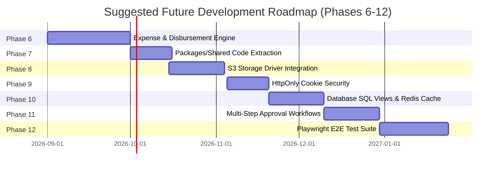

# Future Work, Enhancements & Roadmap — BudgetChain

> **Scope:** comprehensive technical guide for planned improvements, scalability enhancements, feature additions, UI/UX upgrades, performance optimizations, security hardening, maintainability recommendations, and development roadmap for BudgetChain.  
> **Source of truth:** the implementation (`apps/backend`, `apps/frontend`, `apps/contracts`, `packages/shared`, `docs/KNOWN_ISSUES.md`, `docs/PHASES.md`).

---

## 1. Context & Distinction Boundary

To maintain documentation integrity, all items in this document are explicitly categorized into:
- **Implemented Features (Current Baseline):** Features fully present and verified in source code today.
- **Future Recommendations (Proposed Roadmap):** Architectural, feature, or security improvements proposed for future development iterations.

```mermaid
flowchart LR
    subgraph CurrentBaseline ["Current Baseline (Phases 1-5)"]
        Auth["JWT Auth & User Identity"]
        Alloc["Budget Allocation Engine (BA-YYYY-XXX)"]
        Doc["Document Management & Magic-Byte Sniffing"]
        Audit["Dual-Destination Audit Logging"]
        Chain["Fail-Soft EVM Anchoring (BudgetLedger & AuditLedger)"]
    end

    subgraph FutureRoadmap ["Future Work & Recommendations (Phases 6-12)"]
        Expense["Phase 6: Expense Monitoring Module"]
        Shared["Phase 7: Packages/Shared Extraction"]
        S3["Phase 8: AWS S3 Cloud Storage Driver"]
        Cookie["Phase 9: HttpOnly Secure Cookie Refresh Tokens"]
        Views["Phase 10: DB Views & Redis Performance Caching"]
        Approval["Phase 11: Multi-Step Approval Workflows"]
        E2E["Phase 12: Playwright Automated E2E Testing"]
    end

    CurrentBaseline --> FutureRoadmap
```

---

## 2. Planned Feature Enhancements

### 2.1 Full Implementation of `EXPENSE_MONITORING` Module (Phase 6)
- **Current Baseline:** Route `/expense-tracking` in [`apps/frontend/src/routes/AppRoutes.tsx:173`](file:///d:/Ramisys%20files/Projects/capstone/apps/frontend/src/routes/AppRoutes.tsx#L173) renders a placeholder banner (*"Expense Tracking - Planned feature in Phase 4"*).
- **Recommendation:**
  - Create Prisma models `Expense` and `Disbursement` linked to `BudgetAllocation`.
  - Implement expense logging, disbursement approvals, and real-time allocation balance depletion (`allocatedAmount - totalExpenses`).
  - Add expense voucher attachment uploads utilizing the existing document management subsystem.

### 2.2 Shared Package Code Extraction (`packages/shared`)
- **Current Baseline:** `packages/shared` is an empty npm workspace containing only a placeholder `README.md`.
- **Recommendation:** Extract common domain resources into `packages/shared`:
  - TypeScript interfaces (`User`, `BudgetAllocation`, `Document`, `AuditLog`, `BlockchainRecord`).
  - Zod validation schemas shared between backend route validators and frontend react-hook-form resolvers.
  - Constant enums (`ROLES`, `ALLOCATION_STATUS`, `DOCUMENT_STATUS`, `AUDIT_ACTIONS`).

### 2.3 Customizable Multi-Step Approval Workflows
- **Current Baseline:** Approval workflow follows a single-step transition (`Draft` → `PendingApproval` → `Approved` / `Rejected`) reviewed by a Treasurer or Administrator.
- **Recommendation:** Implement configurable multi-tier approval chains (e.g. Department Head → Budget Officer → Treasurer → University Vice President) based on allocation threshold amounts.

---

## 3. Scalability & Architectural Enhancements

### 3.1 Production AWS S3 Object Storage Driver (`S3DocumentStorage`)
- **Current Baseline:** `LocalDocumentStorage` saves files to local disk (`apps/backend/uploads/`). `STORAGE_DRIVER=s3` throws HTTP 503 Service Unavailable.
- **Recommendation:** Implement `@aws-sdk/client-s3` inside `documentStorageService.js` supporting:
  - S3 bucket storage and multi-region replication.
  - Pre-signed S3 download URLs for direct client streaming.
  - Stateless backend deployment nodes without shared NAS dependencies.

### 3.2 Database-Level Read-Model Union & View Optimization
- **Current Baseline:** `timelineService.js` and `blockchainHistoryService.js` fetch all matching rows across 4 database tables into Node.js memory, sort in JavaScript, and apply array slicing.
- **Recommendation:** Create SQL database views or materialized view tables (`financial_activity_timeline_view`, `blockchain_ledger_history_view`) to perform unions, sorting, and pagination directly inside MySQL.

### 3.3 Redis In-Memory Caching Layer
- **Current Baseline:** All master data and dashboard statistics query MySQL directly on every request.
- **Recommendation:** Deploy Redis to cache:
  - Static master data (`FiscalYear`, `Department`, `FundSource`, `BudgetCategory`, `BudgetProgram`).
  - Aggregated dashboard counts (`getDashboardStats`, `getDashboardCharts`).

---

## 4. UI/UX & Analytics Upgrades

### 4.1 Dashboard Component Hook Standardization
- **Current Baseline:** [`apps/frontend/src/pages/Dashboard.tsx:34-87`](file:///d:/Ramisys%20files/Projects/capstone/apps/frontend/src/pages/Dashboard.tsx#L34-L87) uses direct `apiClient` Axios calls and local `useState` hooks.
- **Recommendation:** Refactor `Dashboard.tsx` to use custom TanStack Query hooks (`useDashboardStats`, `useDashboardCharts`, `useNotifications`, `useBlockchainStatus`) for consistent caching, refetching, and error handling.

### 4.2 Enhanced Financial Visualization & Export Tools
- **Current Baseline:** Recharts renders basic role/status distributions and activity timelines.
- **Recommendation:**
  - Add interactive date-range timeline scrubbers and category drill-downs.
  - Add export options for PDF financial summaries and CSV audit ledger downloads.

---

## 5. Performance & Security Optimizations

### 5.1 HttpOnly Cookie Refresh Token Security
- **Current Baseline:** Access and refresh tokens are stored in browser `localStorage` ([`src/api/apiClient.ts:40`](file:///d:/Ramisys%20files/Projects/capstone/apps/frontend/src/api/apiClient.ts#L40)).
- **Recommendation:** Transition refresh tokens to `httpOnly`, `SameSite=Strict`, `Secure` cookies to protect against XSS token theft.

### 5.2 Server-Side Blob Envelope Encryption
- **Current Baseline:** Local files are stored unencrypted in `apps/backend/uploads/`.
- **Recommendation:** Implement AES-256-GCM envelope encryption for stored document blobs on disk, deriving encryption keys from an environment master secret.

### 5.3 Database Index Fine-Tuning
- **Current Baseline:** Tables feature single-column indexes on queried fields.
- **Recommendation:** Add compound indexes for frequent multi-column filter queries:
  - `audit_logs`: `@@index([action, result, createdAt])`
  - `blockchain_records`: `@@index([recordType, status, createdAt])`

---

## 6. Maintainability & Developer Experience

### 6.1 Modern Backend Test Runner Migration
- **Current Baseline:** `npm run test:backend` executes a hardcoded 38-command string in `apps/backend/package.json:14`.
- **Recommendation:** Migrate backend tests to Node's native test runner (`node --test`) or Vitest for parallel execution, glob matching (`tests/**/*.test.js`), and automated coverage reporting (`vitest run --coverage`).

### 6.2 Strict Frontend TypeScript Checking
- **Current Baseline:** `apps/frontend/tsconfig.json` specifies `strict: false` and `allowJs: true`.
- **Recommendation:** Incrementally enable `strict: true` to eliminate implicit `any` types and catch edge-case bugs at compile time.

### 6.3 Automated Playwright End-to-End Suite
- **Current Baseline:** Unit and component integration tests exist, but no automated browser E2E test runner is installed.
- **Recommendation:** Integrate Playwright to automate end-to-end user journeys (User Login → Create Allocation → Submit → Approve → Upload Voucher → Verify File).

---

## 7. Recommended Future Technologies & Integrations

| Technology / Integration | Target Domain | Key Purpose & Benefits |
|--------------------------|---------------|------------------------|
| **EVM Layer-2 (Arbitrum / Polygon)** | Blockchain | Lower transaction gas costs and sub-second block confirmation times for ledger anchoring. |
| **AWS S3 SDK (`@aws-sdk/client-s3`)** | Document Storage | Scalable, redundant cloud object storage for document versions. |
| **Redis (`ioredis`)** | Caching | In-memory caching for master data entities and dashboard analytics. |
| **Playwright (`@playwright/test`)** | E2E Testing | Cross-browser automated end-to-end testing in CI/CD pipelines. |
| **OpenTelemetry APM** | Observability | Distributed tracing across Express routes, Prisma queries, and Ethers contract calls. |

---

## 8. Suggested Development Roadmap

1. **Phase 6: Expense Monitoring & Disbursement Engine:** Implement `Expense` & `Disbursement` Prisma models, CRUD endpoints, and balance depletion calculations.
2. **Phase 7: Monorepo Shared Package Code Extraction:** Extract `packages/shared` resources to eliminate code duplication across workspaces.
3. **Phase 8: Cloud AWS S3 Object Storage Driver:** Implement `@aws-sdk/client-s3` in `documentStorageService.js` supporting pre-signed URLs.
4. **Phase 9: HttpOnly Cookie Security:** Migrate refresh tokens to `httpOnly` secure cookies to prevent XSS token theft.
5. **Phase 10: Database SQL Read-Model Views & Redis Caching:** Replace Node.js in-memory array unions with MySQL views and deploy Redis caching.
6. **Phase 11: Multi-Step Configurable Approval Workflows:** Implement threshold-based multi-tier approval chains and delegation controls.
7. **Phase 12: Automated Playwright E2E Test Suite:** Add automated browser E2E tests for end-to-end user workflows in CI/CD.
