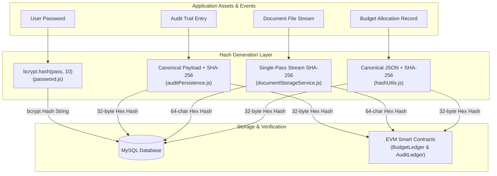
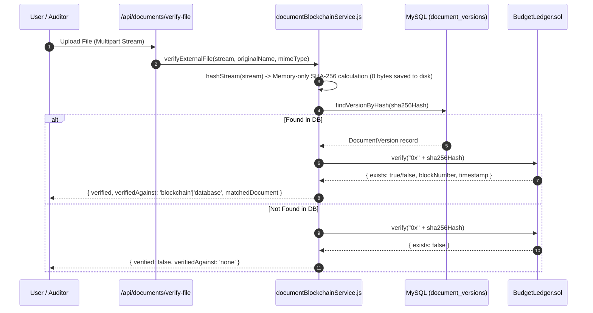

# Cryptographic Hashing & Data Integrity — BudgetChain

> **Scope:** comprehensive reference for cryptographic hashing across BudgetChain, covering algorithm selection, canonical payload generation, stream hashing, zero-storage verification, database storage indexing, and EVM contract anchoring.  
> **Source of truth:** implementation in `apps/backend/utils/hashUtils.js`, `apps/backend/utils/password.js`, `apps/backend/utils/fileUtils.js`, `apps/backend/utils/auditPersistence.js`, `apps/backend/services/documentStorageService.js`, `apps/backend/services/documentBlockchainService.js`, and `apps/contracts/contracts/`.

---

## 1. Overview & Architecture

Hashing serves two distinct security functions in BudgetChain:
1. **Cryptographic Proof of Integrity**: Deterministic SHA-256 digests are generated for budget allocations, uploaded evidence documents, and audit logs, creating tamper-evident anchors on the EVM blockchain.
2. **Password Security**: One-way adaptive salted hashing using `bcrypt` (10 rounds) protects user credentials against offline brute-force attacks.



---

## 2. Algorithm Matrix & Parameters

| Concern | Target Asset | Algorithm | Library / Engine | Output Format | Security Role |
|---------|--------------|-----------|------------------|---------------|---------------|
| **Allocation Integrity** | `BudgetAllocation` | SHA-256 | Node.js `node:crypto` | 64-char Hex String (`bytes32` on-chain) | Tamper detection across 13 core financial fields |
| **Document Integrity** | `DocumentVersion` | SHA-256 | Node.js `node:crypto` | 64-char Hex String (`bytes32` on-chain) | File byte alteration detection & upload deduplication |
| **Audit Log Integrity** | `AuditLog` | SHA-256 | Node.js `node:crypto` | 64-char Hex String (`bytes32` on-chain) | Event log alteration & sequence tampering defense |
| **External Verification** | External Upload Streams | SHA-256 | Node.js `node:crypto` | 64-char Hex String | Zero-storage streaming verification against ledger |
| **Password Protection** | `User.password` | bcrypt | `bcryptjs` (Cost 10) | Standard bcrypt hash string ($2a$10$...) | One-way password hashing with salt per user |

---

## 3. Hash Generation Implementations

### 3.1 Allocation Canonical Content Hashing
To prevent key-ordering inconsistencies across Node.js runtimes, `computeAllocationContentHash()` (`apps/backend/utils/hashUtils.js:15`) constructs a canonical JavaScript object, sorts all keys explicitly, stringifies it, and computes the SHA-256 digest:

```javascript
// apps/backend/utils/hashUtils.js
export function computeAllocationContentHash(allocation) {
  const canonical = {
    allocationCode: allocation.allocationCode,
    fiscalYearId: allocation.fiscalYearId,
    departmentId: allocation.departmentId,
    fundSourceId: allocation.fundSourceId,
    categoryId: allocation.categoryId,
    programId: allocation.programId,
    allocatedAmount: toNumber(allocation.allocatedAmount),
    description: allocation.description ?? null,
    status: allocation.status,
    submittedAt: allocation.submittedAt ? new Date(allocation.submittedAt).toISOString() : null,
    reviewedBy: allocation.reviewedBy ?? null,
    reviewedAt: allocation.reviewedAt ? new Date(allocation.reviewedAt).toISOString() : null,
    rejectionReason: allocation.rejectionReason ?? null,
    createdAt: new Date(allocation.createdAt).toISOString(),
  };

  const json = JSON.stringify(canonical, Object.keys(canonical).sort());
  return crypto.createHash('sha256').update(json).digest('hex');
}
```

- **Tamper Sensitivity**: Editing any field (e.g. altering `allocatedAmount` from 5000 to 50000) produces a completely different digest, causing verification against the stored/on-chain hash to fail.

---

### 3.2 Document File Stream Hashing
Physical document files are hashed in a **single pass** during disk writing to minimize I/O overhead (`apps/backend/services/documentStorageService.js:56`):

```javascript
// apps/backend/services/documentStorageService.js
async storeStream(stream, storageKey) {
  await this.ensureRoot();
  const target = this.resolveKey(storageKey);
  const hash = crypto.createHash('sha256');
  let sizeBytes = 0;

  await new Promise((resolve, reject) => {
    const out = fs.createWriteStream(target);
    stream.on('data', (chunk) => {
      sizeBytes += chunk.length;
      hash.update(chunk);
    });
    // ... handles pipe & errors ...
  });

  return { storageKey, sha256Hash: hash.digest('hex'), sizeBytes };
}
```

- **Deduplication Check**: When replacing a document (`documentService.replaceDocument`), the backend compares the new file's SHA-256 hash against the existing version's hash. If identical, the upload is rejected with a conflict error (`HTTP 409`) to prevent redundant storage.

---

### 3.3 Audit Event Hashing
Structured audit logs are converted into canonical payloads including a generated UUID and ISO timestamp before hashing (`apps/backend/utils/auditPersistence.js:18-59`):

```javascript
// apps/backend/utils/auditPersistence.js
export function buildCanonicalPayload(entry, id) {
  return {
    id,
    timestamp: entry.timestamp,
    action: entry.action,
    result: mapAuditResult(entry.result),
    actor: {
      id: entry.actor?.id ?? null,
      email: entry.actor?.email ?? null,
      name: entry.actor?.fullName ?? entry.actor?.name ?? null,
      role: entry.actor?.role ?? null,
    },
    ip: entry.ip === 'UNKNOWN' ? null : entry.ip,
    resource: {
      type: resource.type ?? null,
      id: resource.id ?? null,
      code: resource.code ?? null,
    },
    details: entry.details || null,
  };
}

export function computeEventHash(payload) {
  return createHash('sha256').update(JSON.stringify(payload)).digest('hex');
}
```

---

### 3.4 Password Hashing
User passwords are hashed using `bcryptjs` with 10 salt rounds (`apps/backend/utils/password.js`):

```javascript
// apps/backend/utils/password.js
const SALT_ROUNDS = 10;

export const hashPassword = async (password) => {
  return await bcrypt.hash(password, SALT_ROUNDS);
};

export const comparePassword = async (password, hashedPassword) => {
  return await bcrypt.compare(password, hashedPassword);
};
```

---

## 4. Integrity Checking & Verification Workflows

Integrity verification checks operate across a **3-tier verification model**:

```
 ┌─────────────────────────────────────────────────────────────┐
 │ Tier 1: Local Data Integrity                                │
 │ Compare recomputed hash against MySQL stored hash          │
 └──────────────────────────────┬──────────────────────────────┘
                                │
                                ▼
 ┌─────────────────────────────────────────────────────────────┐
 │ Tier 2: Storage Integrity (Documents Only)                  │
 │ Re-read file on disk & compute SHA-256 vs MySQL hash        │
 └──────────────────────────────┬──────────────────────────────┘
                                │
                                ▼
 ┌─────────────────────────────────────────────────────────────┐
 │ Tier 3: Immutable On-Chain Integrity                        │
 │ Call Smart Contract verify("0x" + hash) on EVM Node        │
 └─────────────────────────────────────────────────────────────┘
```

### 4.1 Verification Status Logic

| Condition | `integrityOk` | `onChain.exists` | Reported Status | Meaning |
|-----------|--------------|------------------|-----------------|---------|
| Current Hash == Stored Hash AND On-Chain Hash Exists | `true` | `true` | `verified: true` | Record is authentic and anchored on-chain |
| Current Hash != Stored Hash | `false` | Ignored | `verified: false` | **Tampering Detected**: DB row or physical file altered |
| Current Hash == Stored Hash BUT On-Chain Unreachable | `true` | `null` | `inconclusive: true` | Node unreachable; local data intact but unconfirmed on-chain |
| Current Hash == Stored Hash BUT Not Anchored | `true` | `false` | `verified: false` | Record not yet anchored or pending background retry |

---

### 4.2 Zero-Storage External File Verification Flow
External stakeholders can upload files to `/api/documents/verify-file` to check authenticity without storing the file on the server (`apps/backend/services/documentBlockchainService.js:189`):



---

## 5. Database Storage & EVM Conversion

### 5.1 MySQL Schema & Indexing
Hashes are indexed in MySQL (`apps/backend/prisma/schema.prisma`) for fast lookup and uniqueness enforcement:

| Table | Column | Type | Indexing | Purpose |
|-------|--------|------|----------|---------|
| `blockchain_records` | `contentHash` | `VARCHAR(191)` | `@unique` | Fast lookup of allocation content hashes |
| `document_versions` | `sha256Hash` | `VARCHAR(191)` | `@@index([sha256Hash])` | Deduplication & file matching |
| `audit_logs` | `eventHash` | `VARCHAR(191)` | `@unique` | Audit log sequence & uniqueness tracking |

### 5.2 EVM `bytes32` Formatting
Solidity contracts require 32-byte fixed arrays (`bytes32`). The backend formats hex digests by prepending `0x`:

```javascript
// Prepend 0x prefix to 64-character SHA-256 hex string
const hexHash = `0x${contentHash}`; 
await contract.record(hexHash);
```

---

## 6. Summary of Hashing Functions

| Utility Module | Function | Description |
|----------------|----------|-------------|
| `utils/hashUtils.js` | `computeAllocationContentHash(allocation)` | Sorts keys, serializes, computes SHA-256 for allocation records |
| `utils/fileUtils.js` | `computeSha256(buffer)` | Computes SHA-256 digest of a byte buffer |
| `utils/fileUtils.js` | `hashStream(stream)` | Streams a readable stream and computes SHA-256 digest + size in bytes |
| `utils/auditPersistence.js` | `buildCanonicalPayload(entry, id)` | Formats structured audit entry into fixed canonical JSON payload |
| `utils/auditPersistence.js` | `computeEventHash(payload)` | Computes SHA-256 hash of canonical audit payload |
| `utils/password.js` | `hashPassword(password)` | Hashes plain-text password using bcrypt (10 rounds) |
| `utils/password.js` | `comparePassword(plain, hashed)` | Compares plain-text password against stored bcrypt hash |
