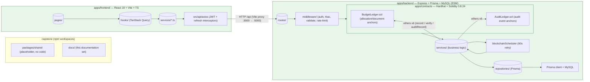
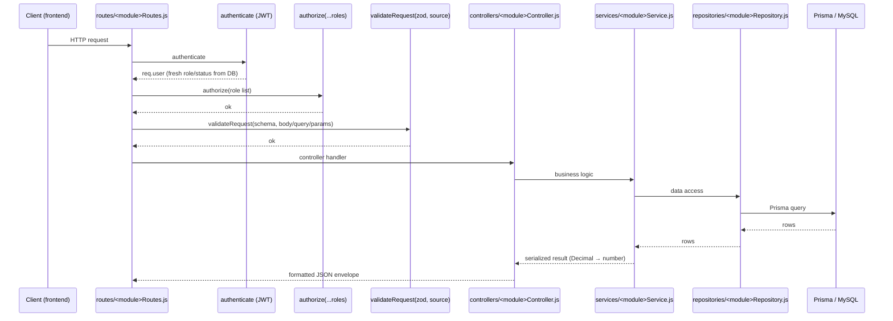
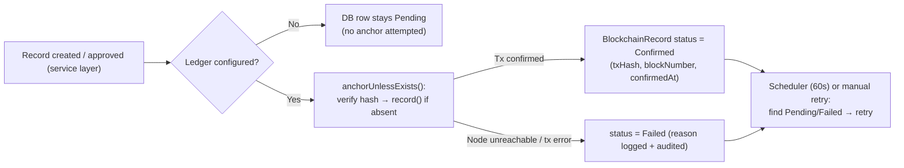

# Project Documentation — Index

**Project:** Blockchain-Based Budget Allocation and Expense Monitoring System (university capstone)
**Repository root:** `D:\Ramisys files\Projects\capstone`
**Generated:** from source-code analysis. The implementation is the single source of truth (see [Source of Truth Hierarchy](#6-source-of-truth-hierarchy)).

---

## 1. Purpose of the Documentation

This documentation set explains the architecture, data model, and workflows of the **BudgetChain** monorepo — a blockchain-themed government-style financial management platform that lets university staff plan budget allocations, get them approved, attach versioned documents, and anchor tamper-evident evidence (record hashes + audit events) on an EVM ledger.

It is written for **two audiences**:

- **Developers** — onboarding, understanding where to make changes, and how the pieces fit together.
- **AI agents** — a reliable, code-derived map of the repository so agents can navigate, modify, and test code without guessing or trusting stale prose.

The documentation deliberately excludes marketing-style roadmap narrative (phases, "improvements") and instead describes what actually exists in the code today. Planned features are called out explicitly as *planned*.

**Scope and exclusion note:** `docs/` content is produced by analyzing source code only. Pre-existing Markdown (root `README.md`, `CLAUDE.md`, `USER_MANAGEMENT_SUMMARY.md`, `apps/backend/docs/API_DOCUMENTATION.md`, per-workspace `README.md` files) was **not** treated as authoritative and is largely stale relative to the code (see [Section 6](#6-source-of-truth-hierarchy)).

---

## 2. Documentation Structure

The documentation lives in `docs/` at the repository root. Each document targets one concern:

| File | Concern | Status |
|------|---------|--------|
| `docs/INDEX.md` | Central navigation (this file) | ✅ Exists |
| `docs/PROJECT_OVERVIEW.md` | High-level purpose, features, users, workflow, technology | ✅ Exists |
| `docs/ARCHITECTURE.md` | End-to-end system architecture, request flow, module responsibilities | ✅ Exists |
| `docs/FILE_STRUCTURE.md` | Directory/file organization, module mapping, naming conventions | ✅ Exists |
| `docs/TECH_STACK.md` | Every technology, library, tool, and service with versions | ✅ Exists |
| `docs/AUTHENTICATION.md` | Login, logout, session model, JWT, password handling, token lifecycle, middleware | ✅ Exists |
| `docs/AUTHORIZATION.md` | System roles, RBAC permission matrix, route protection, middleware, service-layer ownership, access control | ✅ Exists |
| `docs/USER_MANAGEMENT.md` | Admin-only identity administration, account lifecycle, role assignment, status toggling, safety guards | ✅ Exists |
| `docs/BUDGET_ALLOCATION.md` | Budget allocation creation, sequential code generation, budget ceiling, multi-tier approval workflow, ledger anchoring | ✅ Exists |
| `docs/EXPENSE_MONITORING.md` | Expenditure tracking, disbursement logging, allocation balance depletion, supporting vouchers (planned/placeholder) | 🚧 Planned |
| `docs/DOCUMENT_MANAGEMENT.md` | Multipart uploads, magic-byte inspection, stream hashing, version control, inline preview, tamper verification | ✅ Exists |
| `docs/REPORTS.md` | System metrics aggregation, role/status charts, budget utilization, 4-source activity timeline synthesis | ✅ Exists |
| `docs/AUDIT_LOGS.md` | Dual-destination logging, sensitive parameter redaction, canonical SHA-256 hashing, AuditLedger anchoring | ✅ Exists |
| `docs/NOTIFICATIONS.md` | Read-time dynamic alert synthesis, risk factor monitoring, zero-storage model, client-side toast portal | ✅ Exists |
| `docs/SERVICES.md` | Business logic, service responsibilities, dependencies, module interactions | ✅ Exists |
| `docs/HASHING.md` | Cryptographic hashing, SHA-256 canonical payloads, stream digests, bcrypt, verification | ✅ Exists |
| `docs/DOCUMENT_VERIFICATION.md` | Verification workflows, zero-storage external file verification, duplicate detection, status flow, errors | ✅ Exists |
| `docs/TRANSACTIONS.md` | Transaction lifecycle, submission, confirmation receipts, fail-soft errors, recovery mechanisms | ✅ Exists |
| `docs/BACKEND.md` | Backend layout, layers, patterns, security model, audit logging | 🚧 Planned |
| `docs/API.md` | REST API reference — 86 endpoints, RBAC matrix, validation, errors | ✅ Exists |
| `docs/DATABASE.md` | Prisma schema, models, enums, migrations, seed data, relationships, constraints, indexes | ✅ Exists |
| `docs/FRONTEND.md` | Frontend structure, data flow, styling, routing, state management | 🚧 Planned |
| `docs/SMART_CONTRACTS.md` | Solidity smart contracts (BudgetLedger, AuditLedger), ABI, functions, events, storage, access control | ✅ Exists |
| `docs/BLOCKCHAIN.md` | On-chain anchoring, verification, retry scheduler, unified history, audit trail | ✅ Exists |
| `docs/TESTING.md` | Multi-tier test strategy, Node.js unit tests, Vitest UI testing, Hardhat smart contract suites, manual verification | ✅ Exists |
| `docs/PHASES.md` | Monorepo 12-phase implementation timeline, 42.5% overall system completion, completed & planned milestones, dependencies | ✅ Exists |
| `docs/KNOWN_ISSUES.md` | Verifiable system limitations, unimplemented features, technical debt, security considerations, recommendations | ✅ Exists |
| `docs/FUTURE_WORK.md` | Planned improvements, scalability, feature additions, UI/UX upgrades, security, maintainability, roadmap | ✅ Exists |
| `docs/CHANGELOG.md` | Chronological project changelog, migrations, API additions, smart contract deployments, doc milestones | ✅ Exists |

> **Status note:** `INDEX.md`, `PROJECT_OVERVIEW.md`, `ARCHITECTURE.md`, `FILE_STRUCTURE.md`, `TECH_STACK.md`, `AUTHENTICATION.md`, `AUTHORIZATION.md`, `USER_MANAGEMENT.md`, `BUDGET_ALLOCATION.md`, `EXPENSE_MONITORING.md`, `DOCUMENT_MANAGEMENT.md`, `REPORTS.md`, `AUDIT_LOGS.md`, `NOTIFICATIONS.md`, `SERVICES.md`, `HASHING.md`, `DOCUMENT_VERIFICATION.md`, `TRANSACTIONS.md`, `DATABASE.md`, `API.md`, `FRONTEND.md` (planned), `SMART_CONTRACTS.md`, `BLOCKCHAIN.md`, `TESTING.md`, `PHASES.md`, `KNOWN_ISSUES.md`, `FUTURE_WORK.md`, and `CHANGELOG.md` exist at this time (`EXPENSE_MONITORING.md` describes the planned feature and current placeholder UI). The planned files above are the intended documentation set; each describes a clearly bounded concern and should be written against the source code (never copied from stale Markdown).

Conventions for all docs in this set:

- Code references use `path/to/file:line` syntax (e.g. `apps/backend/services/blockchainService.js:37`).
- Diagrams use Mermaid.
- "Planned" is reserved for features that exist as placeholders/roadmap items only.
- Facts are verifiable in source; when something cannot be determined from code, it is stated explicitly rather than guessed.

---

## 3. Documentation Map

### 3.1 Repository topology

The repo is an npm-workspaces monorepo: `apps/backend`, `apps/frontend`, `apps/contracts`, and `packages/*` (only `packages/shared` exists, currently a placeholder with a README only — no code).

### 3.2 Backend request flow (endpoint pattern)

Every protected endpoint follows the same pipeline, enforced by the router files:

All routes mount in `apps/backend/routes/apiRouter.js:19` under `/api`. A central error handler (`middleware/errorHandler.js`) normalizes Prisma and operational errors; a 404 handler catches unmatched routes.

### 3.3 Blockchain anchoring flow (fail-soft)

The same pattern applies to three anchor sources: allocation records (`BlockchainRecord`), document hashes (`DocumentVersion.sha256Hash`), and audit events (`AuditLog.eventHash` on `AuditLedger`). Anchors are never duplicated: content/event hashes are unique in DB and the contracts revert on duplicate hashes (`HashAlreadyRecorded` / `EventAlreadyRecorded`).

---

## 4. Recommended Reading Order

### For developers (first time in the repo)

1. **`README.md`** (root) — high-level stack, install/run steps, seed credentials.
2. **`AGENTS.md`** (root) — *authoritative* operational guide: commands, conventions, gotchas.
3. **`docs/INDEX.md`** — this map.
4. **`docs/FILE_STRUCTURE.md`** — where everything lives (directory/file map, module tables, naming conventions).
5. **`docs/ARCHITECTURE.md`** — how the pieces fit together.
6. **`docs/TECH_STACK.md`** — every technology, version, and dependency.
7. **`docs/BACKEND.md`** — layering, security, audit logging.
8. **`docs/AUTHENTICATION.md`** — login/logout, JWT, password security, session lifecycle.
9. **`docs/AUTHORIZATION.md`** — institutional roles, RBAC matrix, route protection, middleware, service-layer ownership, frontend access control.
10. **`docs/USER_MANAGEMENT.md`** — admin-only user identity, account lifecycle, role management, status toggling, safety guards.
11. **`docs/BUDGET_ALLOCATION.md`** — allocation lifecycle, sequential code generation, budget ceiling enforcement, multi-tier approval workflow, ledger anchoring.
12. **`docs/EXPENSE_MONITORING.md`** — planned expenditure tracking, disbursement logging, allocation balance depletion, supporting vouchers.
13. **`docs/DOCUMENT_MANAGEMENT.md`** — multipart uploads, magic-byte inspection, stream hashing, version control, inline preview, tamper verification.
14. **`docs/REPORTS.md`** — system metrics aggregation, role/status chart analytics, remaining budget reporting, 4-source activity timeline.
15. **`docs/AUDIT_LOGS.md`** — dual-destination logging, sensitive parameter redaction, canonical SHA-256 hashing, AuditLedger anchoring.
16. **`docs/NOTIFICATIONS.md`** — read-time dynamic alert synthesis, risk factor monitoring, zero-storage model, client-side toast portal.
17. **`docs/SERVICES.md`** — business logic, service responsibilities, dependencies, module interactions.
18. **`docs/HASHING.md`** — SHA-256 canonical digests, stream hashing, zero-storage verification, bcrypt.
19. **`docs/DOCUMENT_VERIFICATION.md`** — internal & external verification workflows, duplicate detection, status flow.
20. **`docs/TRANSACTIONS.md`** — transaction lifecycle, submission, confirmation, recovery.
21. **`docs/DATABASE.md`** — schema and workflows.
22. **`docs/API.md`** — endpoints and RBAC.
23. **`docs/FRONTEND.md`** — UI structure and data flow.
24. **`docs/SMART_CONTRACTS.md`** → **`docs/BLOCKCHAIN.md`** → **`docs/TRANSACTIONS.md`** — the ledger contracts, integration, and transaction lifecycles.
25. **`docs/TESTING.md`** — how to verify changes.
26. **`docs/PHASES.md`** — 12-phase implementation timeline, 42.5% overall completion, completed & planned milestone breakdown.
27. **`docs/KNOWN_ISSUES.md`** — verifiable limitations, tech debt, security considerations, recommendations.
28. **`docs/FUTURE_WORK.md`** — planned improvements, scalability, UI/UX upgrades, security, roadmap.
29. **`docs/CHANGELOG.md`** — chronological project history, database migrations, API changes, contract deployments.

### For AI agents (task-oriented)

1. **`docs/INDEX.md`** — navigation + source-of-truth hierarchy.
2. **`AGENTS.md`** — command reference and hard rules (ESM `.js` imports, no `@/` alias, test list maintenance, Prisma workflow).
3. **`docs/FILE_STRUCTURE.md`** — the file map; start here to locate the code you need to touch.
4. **`docs/ARCHITECTURE.md`** — the mental model.
5. **`docs/TECH_STACK.md`** — dependency versions and toolchain reference.
6. The single topic doc matching the task (backend / frontend / contracts / database / api / blockchain / testing).
7. Verify with the test/lint commands documented in **`docs/TESTING.md`** and `AGENTS.md`.

---

## 5. AI Workflow

Guidelines for AI agents (and humans acting as one) working in this repo:

1. **Start here.** Read `docs/INDEX.md`, then `AGENTS.md`. `AGENTS.md` is the authoritative command/convention reference; this documentation set explains the *what* and *why*.
2. **Never trust stale prose.** Root `CLAUDE.md`, `USER_MANAGEMENT_SUMMARY.md`, `apps/backend/README.md`, and `apps/backend/docs/API_DOCUMENTATION.md` describe older snapshots. When prose conflicts with code, **code wins**.
3. **Follow the layer boundaries.** Backend logic belongs in `services/`, database access in `repositories/`, HTTP in `controllers/`+`routes/`, validation in `validators/` (Zod), and error classes in `errors/`. Do not add new modules in the wrong layer.
4. **New endpoints must follow the pipeline** `authenticate` → `authorize(...roles)` → `validateRequest(schema, source)`, and must be mounted in `routes/apiRouter.js`.
5. **ESM discipline (backend).** All local imports need the `.js` extension (`import x from '../services/foo.js'`).
6. **Frontend import discipline.** Use relative imports only; `@/` is not configured and breaks the Vite build.
7. **Enums are PascalCase in Prisma** (`Administrator`, `Draft`) and mirrored as UPPER_SNAKE constants in `apps/backend/constants/`. Keep them in sync.
8. **Migrations are append-only.** Never edit an applied migration; create a new one with `npx prisma migrate dev`.
9. **Money is `Decimal(14,2)`** in the DB and plain numbers at the API boundary via `utils/amountUtils.js` `toNumber()`.
10. **Adding a backend test file** requires adding it to the hardcoded `test` script list in `apps/backend/package.json`.
11. **Verify before finishing.** Run the relevant suites (see `docs/TESTING.md` and `AGENTS.md`). Backend tests need no DB; frontend tests use Vitest + Testing Library.
12. **When updating documentation**, update the relevant topic doc, this index if the map changed, and re-check the source-of-truth rules in [Section 6](#6-source-of-truth-hierarchy).

---

## 6. Source of Truth Hierarchy

When any two sources disagree, resolve in this order (highest first):

1. **Source code** — the actual implementation (highest authority).
   - `apps/backend/` — routes, controllers, services, repositories, middleware, validators, config, constants.
   - `apps/frontend/src/` — components, hooks, services, pages, types.
   - `apps/contracts/` — Solidity contracts and Hardhat scripts.
2. **`apps/backend/prisma/schema.prisma` + `prisma/migrations/`** — the database contract.
3. **`AGENTS.md`** (root) — operational instructions; describes the intended repo conventions and commands. Trusted, but verify exact behavior against code/tests when unsure.
4. **This documentation set (`docs/`)** — maintained to reflect 1–3. Update it when code changes.
5. **Root `README.md`** — useful overview and run instructions, but not authoritative for details.
6. **Unreliable / legacy Markdown** — treat as historical notes only; never as a spec:
   - `CLAUDE.md` (root)
   - `USER_MANAGEMENT_SUMMARY.md` (root)
   - `apps/backend/README.md`
   - `apps/backend/docs/API_DOCUMENTATION.md`
   - `.claude/` skill files and `skills-lock.json` (tooling config, not project docs)

**Explicitly unknown / not determinable from code** (do not guess):
- Why `packages/shared` is empty beyond a README (no usage found in any workspace).
- Deployment topology beyond local dev (no Docker/k8s config, no CI pipeline files present in the repo).
- Whether `AUDIT_LOG_DB_ENABLED=false` was ever used in a real environment (defaults to `true`).
- The `S3` storage driver path: `config/storage.js` validates the option but no S3 implementation exists; only `local` is implemented.

---

## 7. Documentation Maintenance Guidelines

- **Keep docs code-derived.** After every material change to behavior, update the affected topic doc. Never copy text from stale Markdown; re-derive from code.
- **Schema changes** require: a new Prisma migration, an update to `docs/DATABASE.md`, and a check that `apps/backend/constants/` mirrors any new enum values.
- **New/changed endpoints** require updates to `docs/API.md` and, if the route set changes, `docs/ARCHITECTURE.md`.
- **New backend modules** must follow the existing layering and the endpoint pipeline; document them in `docs/BACKEND.md`.
- **New contracts / ABI changes** require updates to `docs/CONTRACTS.md` and `docs/BLOCKCHAIN.md`, plus redeploy + regenerate `apps/contracts/deployments/contracts.json`.
- **Test changes** belong in `docs/TESTING.md`; remember the backend test-script list lives in `apps/backend/package.json`.
- **Update this index** whenever a doc is added, removed, or renamed, or when the documentation map changes.
- **Directory/file layout changes** (new directories, renames, new layer folders) require an update to `docs/FILE_STRUCTURE.md`, including its module tables, folder-relationship diagrams, and naming-convention notes.
- **Mark plans clearly.** Roadmap-only features (e.g. Phase 5 "Expense Tracking") appear as placeholders in the UI/routes; label them "planned" in docs and do not describe them as implemented.
- **Keep diagrams honest.** Mermaid diagrams must match the code (layers, flows, tables). Stale diagrams are worse than none.
- **State unknowns.** If a fact cannot be determined from code, say so explicitly (see the list in [Section 6](#6-source-of-truth-hierarchy)).

---

## 8. Links to Every Documentation File

### This documentation set (`docs/`)

| Document | Description |
|----------|-------------|
| [docs/INDEX.md](./INDEX.md) | **This file.** Central navigation, doc map, reading order, AI workflow, source-of-truth hierarchy. |
| [docs/PROJECT_OVERVIEW.md](./PROJECT_OVERVIEW.md) | ✅ Exists — purpose, features, users, workflow, modules, technology. |
| [docs/ARCHITECTURE.md](./ARCHITECTURE.md) | ✅ Exists — end-to-end architecture, repository topology, layered backend pipeline, frontend data flow, contracts, key runtime flows, dev topology, discrepancies. |
| [docs/FILE_STRUCTURE.md](./FILE_STRUCTURE.md) | ✅ Exists — directory/file organization, module-to-file tables, folder relationships, naming conventions, generated/special directories. |
| [docs/TECH_STACK.md](./TECH_STACK.md) | ✅ Exists — every technology, library, tool, and service with versions, roles, and full dependency inventory. |
| [docs/AUTHENTICATION.md](./AUTHENTICATION.md) | ✅ Exists — login/logout flows, session model, JWT signing & verification, token rotation lifecycle, bcrypt password handling, middleware, security matrix. |
| [docs/AUTHORIZATION.md](./AUTHORIZATION.md) | ✅ Exists — system roles, RBAC permission matrix across 86 endpoints, middleware, service-layer ownership, allocation self-review prevention, frontend route guards. |
| [docs/USER_MANAGEMENT.md](./USER_MANAGEMENT.md) | ✅ Exists — Admin-only user administration, account lifecycle, role management, safety constraints (last-admin & self-deletion protection), audit logging, REST APIs. |
| [docs/BUDGET_ALLOCATION.md](./BUDGET_ALLOCATION.md) | ✅ Exists — Allocation lifecycle, sequential code auto-generation (BA-YYYY-XXX), budget ceiling enforcement, 5-tuple uniqueness, approval workflow, on-chain anchoring. |
| [docs/EXPENSE_MONITORING.md](./EXPENSE_MONITORING.md) | 🚧 Planned — Planned expenditure tracking, allocation balance depletion, voucher attachments, planned REST APIs & Prisma model. |
| [docs/DOCUMENT_MANAGEMENT.md](./DOCUMENT_MANAGEMENT.md) | ✅ Exists — Multipart uploads, magic-byte inspection, stream hashing, version control, inline preview, tamper verification, zero-storage verification. |
| [docs/REPORTS.md](./REPORTS.md) | ✅ Exists — Real-time system metrics, role & status chart analytics, budget utilization summaries, 4-source activity timeline synthesis. |
| [docs/AUDIT_LOGS.md](./AUDIT_LOGS.md) | ✅ Exists — Dual-destination logging, automatic parameter redaction, canonical SHA-256 hashing, AuditLedger.sol anchoring. |
| [docs/NOTIFICATIONS.md](./NOTIFICATIONS.md) | ✅ Exists — Read-time dynamic alert synthesis, risk factor monitoring, zero-storage model, client-side toast portal. |
| [docs/SERVICES.md](./SERVICES.md) | ✅ Exists — business logic, service responsibilities, dependencies, module interaction sequence flows for all 18 backend services. |
| [docs/HASHING.md](./HASHING.md) | ✅ Exists — SHA-256 canonical allocation/audit payload hashing, single-pass file stream hashing, zero-storage external verification, bcrypt password security. |
| [docs/DOCUMENT_VERIFICATION.md](./DOCUMENT_VERIFICATION.md) | ✅ Exists — internal version verification, zero-storage external file verification, duplicate detection, blockchain matching, status lifecycles, error handling. |
| [docs/TRANSACTIONS.md](./TRANSACTIONS.md) | ✅ Exists — EVM transaction lifecycle, ethers v6 signing & submission, block receipts, fail-soft errors, manual retry endpoints, 60s background scheduler. |
| [docs/BACKEND.md](./BACKEND.md) | 🚧 Planned — backend structure, layering, security model, audit logging, scheduler. |
| [docs/API.md](./API.md) | ✅ Exists — 86 REST endpoints across 14 modules, RBAC matrix, validation schemas, request/response shapes, rate limiting, error codes. |
| [docs/DATABASE.md](./DATABASE.md) | ✅ Exists — Prisma schema, 14 models, 10 enums, relationships, constraints, indexes, migration history, seed data, data flow, ER diagram. |
| [docs/FRONTEND.md](./FRONTEND.md) | 🚧 Planned — frontend structure, data flow (services → hooks → pages), routing, styling. |
| [docs/SMART_CONTRACTS.md](./SMART_CONTRACTS.md) | ✅ Exists — Solidity contracts (BudgetLedger, AuditLedger), Hardhat toolchain, functions, events, storage layout, access control, deploy scripts, interaction flows. |
| [docs/BLOCKCHAIN.md](./BLOCKCHAIN.md) | ✅ Exists — EVM smart contracts (BudgetLedger, AuditLedger), network config, ethers.js wallet signing, canonical hashing, verification workflows, zero-storage file verification, security matrix. |
| [docs/TESTING.md](./TESTING.md) | ✅ Exists — Multi-tier test strategy across 3 workspaces, Node.js unit tests (38 suites), Vitest UI testing (22 suites / 174 tests), Hardhat contract tests, manual verification flows. |
| [docs/PHASES.md](./PHASES.md) | ✅ Exists — Code-derived timeline, 12-phase system roadmap, 42.5% overall system completion matrix, inter-phase dependencies, remaining scope. |
| [docs/KNOWN_ISSUES.md](./KNOWN_ISSUES.md) | ✅ Exists — Verifiable limitations, unimplemented S3 storage, technical debt, performance concerns, security considerations, refactoring recommendations. |
| [docs/FUTURE_WORK.md](./FUTURE_WORK.md) | ✅ Exists — Planned Phases 6–12 (Expense Monitoring, S3 storage driver, shared package code, HttpOnly cookie security, database views, E2E testing, roadmap). |
| [docs/CHANGELOG.md](./CHANGELOG.md) | ✅ Exists — Chronological project history, 8 database migrations, API evolution, smart contract deployments, documentation milestones. |

### Authoritative repo references (not part of `docs/`)

- `AGENTS.md` — command reference and repository conventions (trusted).
- `README.md` — overview and setup (partially trusted).

### Legacy / stale Markdown (do not use as a spec)

- `CLAUDE.md` — historical AI-guidance file.
- `USER_MANAGEMENT_SUMMARY.md` — phase-2 summary, superseded by code.
- `apps/backend/README.md` — early-phase backend guide.
- `apps/backend/docs/API_DOCUMENTATION.md` — stale API spec.
- `apps/contracts/README.md`, `packages/shared/README.md` — short workspace notes (check against code).
