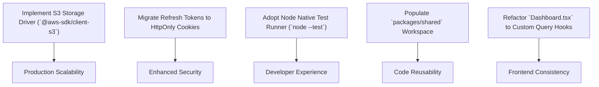

# Known Issues, Limitations & Technical Debt — BudgetChain

> **Scope:** comprehensive technical reference for verifiable limitations, known bugs, architectural discrepancies, technical debt, performance concerns, security considerations, areas requiring refactoring, temporary workarounds, and recommendations across the BudgetChain monorepo.  
> **Source of truth:** the implementation (`apps/backend`, `apps/frontend`, `apps/contracts`, `packages/shared`, `AGENTS.md`, `docs/ARCHITECTURE.md`).

---

## 1. Current Limitations

### 1.1 Unimplemented Cloud Blob Storage Driver (`STORAGE_DRIVER=s3`)
- **Location:** [`apps/backend/config/env.js:64`](file:///d:/Ramisys%20files/Projects/capstone/apps/backend/config/env.js#L64), [`apps/backend/services/documentStorageService.js:165`](file:///d:/Ramisys%20files/Projects/capstone/apps/backend/services/documentStorageService.js#L165).
- **Behavior:** `config/env.js` validates `STORAGE_DRIVER=s3` as an allowed environment setting. However, `createStorageDriver()` instantiates `S3DocumentStorage`, which throws `AppError('S3 storage driver is not implemented', 503)` on all stream operations (`storeStream`, `openReadStream`, `removeBlob`, `exists`).
- **Impact:** Only `STORAGE_DRIVER=local` functions at runtime. Setting `STORAGE_DRIVER=s3` causes document operations to fail with HTTP 503 Service Unavailable.

### 1.2 Unimplemented `EXPENSE_MONITORING` Module
- **Location:** [`apps/frontend/src/routes/AppRoutes.tsx:173-182`](file:///d:/Ramisys%20files/Projects/capstone/apps/frontend/src/routes/AppRoutes.tsx#L173-L182).
- **Behavior:** Expenditure tracking, disbursement logging, allocation balance depletion, and expense vouchers do not exist in backend routes, services, or Prisma schema.
- **Impact:** Navigating to `/expense-tracking` in the frontend renders a temporary banner (*"Expense Tracking - Planned feature in Phase 4"*).

### 1.3 Empty `packages/shared` Workspace
- **Location:** [`packages/shared/README.md`](file:///d:/Ramisys%20files/Projects/capstone/packages/shared/README.md).
- **Behavior:** Monorepo `package.json` includes `packages/*` in npm workspaces, but `packages/shared` contains no source files or exported modules.
- **Impact:** Domain enums, Zod validation schemas, and TypeScript interfaces are duplicated independently in `apps/backend` and `apps/frontend`.

### 1.4 Single-Server Local Storage Root
- **Location:** [`apps/backend/services/documentStorageService.js:17`](file:///d:/Ramisys%20files/Projects/capstone/apps/backend/services/documentStorageService.js#L17).
- **Behavior:** `LocalDocumentStorage` saves document blobs directly to local host disk (`apps/backend/uploads/`).
- **Impact:** Horizontally scaling the backend across multiple server instances without a shared network file system (NAS) will result in missing file errors on secondary nodes.

---

## 2. Known Bugs & Discrepancies

### 2.1 Allocation Code Format Prefix Mismatch
- **Location:** [`apps/backend/constants/allocationStatus.js:28`](file:///d:/Ramisys%20files/Projects/capstone/apps/backend/constants/allocationStatus.js#L28), [`apps/backend/repositories/allocationRepository.js:234`](file:///d:/Ramisys%20files/Projects/capstone/apps/backend/repositories/allocationRepository.js#L234).
- **Discrepancy:** Root `AGENTS.md` and historical documentation state allocation codes follow `ALC-YYYY-XXXX`. However, the repository implementation generates `BA-YYYY-XXX` (e.g. `BA-2026-001`).
- **Resolution:** The source code (`BA-YYYY-XXX`) is the single source of truth.

### 2.2 Unused `@/` Path Alias in Frontend Production Builds
- **Location:** [`apps/frontend/vitest.config.ts:14-16`](file:///d:/Ramisys%20files/Projects/capstone/apps/frontend/vitest.config.ts#L14-L16), [`AGENTS.md:40`](file:///d:/Ramisys%20files/Projects/capstone/AGENTS.md#L40).
- **Discrepancy:** `vitest.config.ts` configures path alias `@/` pointing to `./src`. However, `vite.config.ts` does not include this alias, causing `vite build` to fail if `@/` is used in production frontend code.
- **Rule:** All frontend imports must remain relative (e.g. `../../components/ui/Card`).

---

## 3. Technical Debt

### 3.1 Legacy Direct Axios Fetching in `Dashboard.tsx`
- **Location:** [`apps/frontend/src/pages/Dashboard.tsx:34-87`](file:///d:/Ramisys%20files/Projects/capstone/apps/frontend/src/pages/Dashboard.tsx#L34-L87).
- **Debt:** `Dashboard.tsx` invokes `apiClient.get()` directly inside `useEffect` with local `useState` hooks (`stats`, `chartsData`, `notifications`, `blockchainStatus`) rather than using TanStack Query hooks (`useQuery`) followed elsewhere in the frontend (`src/hooks/`).

### 3.2 Hardcoded Backend Test Script Chain
- **Location:** [`apps/backend/package.json:14`](file:///d:/Ramisys%20files/Projects/capstone/apps/backend/package.json#L14).
- **Debt:** `npm run test` executes a single hardcoded string of 38 `node tests/<file>.test.js` commands. It lacks a test runner framework, fails fast on the first failing file, cannot run tests in parallel, and requires manual editing to register new test files.

### 3.3 Lenient Frontend TypeScript Settings
- **Location:** [`apps/frontend/tsconfig.json:5-6`](file:///d:/Ramisys%20files/Projects/capstone/apps/frontend/tsconfig.json#L5-L6).
- **Debt:** `tsconfig.json` specifies `strict: false` and `allowJs: true`, allowing implicit `any` types and JavaScript files to pass compilation without type safety guarantees.

### 3.4 Decoupled Audit Logging & Non-Blocking DB Persistence
- **Location:** [`apps/backend/utils/auditLogger.js:163`](file:///d:/Ramisys%20files/Projects/capstone/apps/backend/utils/auditLogger.js#L163), [`apps/backend/utils/auditPersistence.js:100`](file:///d:/Ramisys%20files/Projects/capstone/apps/backend/utils/auditPersistence.js#L100).
- **Debt:** `auditLogger.log()` outputs structured console text and fires `void persistAuditEntry()` without awaiting completion. If MySQL experiences a transient write failure, console output succeeds while the `audit_logs` DB table misses the record.

---

## 4. Performance Concerns

### 4.1 In-Memory Multi-Table Union & Sorting
- **Location:** [`apps/backend/services/timelineService.js:11`](file:///d:/Ramisys%20files/Projects/capstone/apps/backend/services/timelineService.js#L11), [`apps/backend/services/blockchainHistoryService.js:16`](file:///d:/Ramisys%20files/Projects/capstone/apps/backend/services/blockchainHistoryService.js#L16).
- **Concern:** The activity timeline and unified blockchain history read models execute `Promise.all` across up to 4 underlying database tables (`allocation_approvals`, `document_activities`, `audit_logs`, `blockchain_records`), load all matching rows into Node.js memory, sort them in JavaScript, and apply array slicing (`slice(skip, skip + limit)`).
- **Impact:** Memory consumption and query latency grow linearly ($O(N \log N)$) as database record counts increase.

### 4.2 Full Table Scans for Summary Aggregations
- **Location:** [`apps/backend/repositories/auditLogRepository.js:104-121`](file:///d:/Ramisys%20files/Projects/capstone/apps/backend/repositories/auditLogRepository.js#L104-L121), [`apps/backend/repositories/userRepository.js:100-112`](file:///d:/Ramisys%20files/Projects/capstone/apps/backend/repositories/userRepository.js#L100-L112).
- **Concern:** Dashboard endpoints (`/api/dashboard/stats`, `/api/audit-logs/summary`) execute `prisma.groupBy()` across full `audit_logs` and `users` tables on every request without caching.

---

## 5. Security Considerations

### 5.1 Tokens Stored in Browser `localStorage`
- **Location:** [`apps/frontend/src/api/apiClient.ts:40-42`](file:///d:/Ramisys%20files/Projects/capstone/apps/frontend/src/api/apiClient.ts#L40-L42).
- **Risk:** JWT access tokens and refresh tokens are stored in browser `localStorage`, making them vulnerable to token theft if a Cross-Site Scripting (XSS) vulnerability exists.
- **Mitigation Requirement:** Refresh tokens should be migrated to `httpOnly`, `SameSite=Strict`, `Secure` cookies.

### 5.2 Default Hardhat Deployment Private Key
- **Location:** [`apps/backend/config/blockchain.js:15`](file:///d:/Ramisys%20files/Projects/capstone/apps/backend/config/blockchain.js#L15).
- **Risk:** When `BLOCKCHAIN_PRIVATE_KEY` is omitted from environment variables, the system defaults to Hardhat Account #0 (`0xac0974bec39a17e36ba4a6b4d238ff944bacb478cbed5efcae784d7bf4f2ff80`).
- **Mitigation Requirement:** Production environments must explicitly set `BLOCKCHAIN_PRIVATE_KEY` with a secure private key.

### 5.3 Absence of Application-Level File Encryption at Rest
- **Location:** [`apps/backend/services/documentStorageService.js:70`](file:///d:/Ramisys%20files/Projects/capstone/apps/backend/services/documentStorageService.js#L70).
- **Risk:** Local document storage writes unencrypted binary files directly to disk (`apps/backend/uploads/`). Access control is enforced solely at the HTTP API layer.

---

## 6. Temporary Workarounds

1. **Audit Persistence Disabling in Tests:** [`apps/backend/tests/auditTestConfig.js:10`](file:///d:/Ramisys%20files/Projects/capstone/apps/backend/tests/auditTestConfig.js#L10) sets `config.auditLog.persistEnabled = false` during test execution to prevent cluttering MySQL or throwing unhandled database errors during unit tests.
2. **JSDOM Browser Polyfills:** [`apps/frontend/src/test/setup.ts:10-73`](file:///d:/Ramisys%20files/Projects/capstone/apps/frontend/src/test/setup.ts#L10-L73) polyfills `window.matchMedia`, `ResizeObserver`, `DOMRect`, and `PointerEvent` methods to allow Radix UI dialogs and Recharts components to render in headless Vitest runs.

---

## 7. Recommendations for Future Improvements

1. **Implement `S3DocumentStorage` Driver:** Implement `@aws-sdk/client-s3` in `documentStorageService.js` to enable S3-compatible cloud object storage.
2. **Store Refresh Tokens in HttpOnly Cookies:** Update `authController.js` and `apiClient.ts` to issue refresh tokens via `httpOnly` secure cookies.
3. **Migrate Backend Tests to `node --test` or Vitest:** Replace hardcoded `package.json` test strings with glob matching (`tests/**/*.test.js`) and automated coverage reporting (`vitest run --coverage`).
4. **Consolidate Shared Domain Code:** Move shared TypeScript interfaces, Zod schemas, and role constants into `packages/shared`.
5. **Standardize `Dashboard.tsx` Hooks:** Refactor `Dashboard.tsx` to use custom TanStack Query hooks (`useDashboardStats`, `useDashboardCharts`, `useNotifications`).
