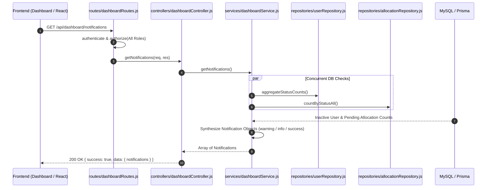
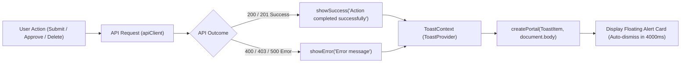

# Notifications & System Alerts — BudgetChain

> **Scope:** complete technical reference for dynamic system notifications, state-driven alerts (`GET /api/dashboard/notifications`), read-time database aggregations, and client-side UI toast notifications in BudgetChain.  
> **Source of truth:** the implementation (`apps/backend/routes/dashboardRoutes.js`, `apps/backend/controllers/dashboardController.js`, `apps/backend/services/dashboardService.js`, `apps/backend/validators/dashboardValidator.js`, `apps/frontend/src/components/ui/Toast.tsx`, `apps/frontend/src/pages/Dashboard.tsx`).

---

## 1. Purpose

The **Notifications & System Alerts** module provides real-time operational feedback, account status warnings, approval queue alerts, and system health updates across BudgetChain.

Key responsibilities:
- **Dynamic Read-Time Alerts:** Evaluating operational risk factors (inactive user accounts, pending budget allocation proposals) on-the-fly without database write overhead.
- **Zero-Storage Architecture:** Generating actionable notification payloads dynamically from live database state, avoiding stale rows and table bloat.
- **Client-Side Toast System:** Context-driven floating toast notifications providing immediate visual feedback for API actions, validation errors, and system events.

---

## 2. Features

- **Dynamic Account Monitoring:** Evaluates `users` status counts (`userRepository.aggregateStatusCounts`) and generates a `warning` notification if inactive user accounts are present ([`apps/backend/services/dashboardService.js:119-130`](file:///d:/Ramisys%20files/Projects/capstone/apps/backend/services/dashboardService.js#L119-L130)).
- **Approval Queue Tracking:** Queries `budget_allocations` status counts (`allocationRepository.countByStatusAll`) and generates an `info` notification when proposals await review ([`apps/backend/services/dashboardService.js:132-143`](file:///d:/Ramisys%20files/Projects/capstone/apps/backend/services/dashboardService.js#L132-L143)).
- **System Health Status:** Guarantees a default `success` status notice (*"All services are operating normally"*) to signal healthy system performance.
- **Context-Based Toast System:** React context provider (`ToastProvider`) rendering floating, auto-dismissing toast alerts (`success`, `error`, `info`) via React Portal (`createPortal`).
- **Parallel Query Aggregation:** Executes database checks concurrently using `Promise.all` to keep endpoint latency minimal.

---

## 3. Workflow & Architecture

### 3.1 Backend Dynamic Notification Pipeline

### 3.2 Frontend Toast Feedback Pipeline

---

## 4. Controllers

The controller handler is located in [`apps/backend/controllers/dashboardController.js`](file:///d:/Ramisys%20files/Projects/capstone/apps/backend/controllers/dashboardController.js).

### Controller Handler Summary

| Handler Method | Target Service Method | Response Shape | Description |
|----------------|-----------------------|----------------|-------------|
| `getNotifications` [`line 67`](file:///d:/Ramisys%20files/Projects/capstone/apps/backend/controllers/dashboardController.js#L67) | `dashboardService.getNotifications` | `{ notifications }` | Fetches dynamically synthesized system notifications. |

---

## 5. Services

### 5.1 Backend Service: `DashboardService.getNotifications` ([`dashboardService.js:111`](file:///d:/Ramisys%20files/Projects/capstone/apps/backend/services/dashboardService.js#L111))
- **Logic:** Calls `userRepository.aggregateStatusCounts()` and `allocationRepository.countByStatusAll()` in parallel. Synthesizes notification cards:
  - Inactive user accounts present → `{ title: 'Inactive Users', type: 'warning' }`.
  - Pending allocations present → `{ title: 'Pending Approvals', type: 'info' }`.
  - Always appends → `{ title: 'System Status', message: 'All services are operating normally.', type: 'success' }`.

### 5.2 Frontend Toast Service: `ToastProvider` ([`Toast.tsx:7`](file:///d:/Ramisys%20files/Projects/capstone/apps/frontend/src/components/ui/Toast.tsx#L7))
- Exposes `addToast`, `removeToast`, `showSuccess`, `showError`, `showInfo`, and `showToast`.
- Uses React Portals to render toasts at `z-10000` over `document.body` with 4-second auto-dismissal.

---

## 6. Database & Aggregation Model

The system allocates **zero database tables** for storing notification records. Instead, notifications are calculated on-the-fly over active data tables:

1. **`users` Table:** Evaluates `status === 'Inactive'` counts via `prisma.user.groupBy({ by: ['status'], _count: true })`.
2. **`budget_allocations` Table:** Evaluates `status === 'PendingApproval'` counts via `prisma.budgetAllocation.groupBy({ by: ['status'], where: { deletedAt: null }, _count: true })`.

---

## 7. APIs

Mounted under `/api/dashboard` in [`apps/backend/routes/dashboardRoutes.js`](file:///d:/Ramisys%20files/Projects/capstone/apps/backend/routes/dashboardRoutes.js). Requires authentication (`authenticate`).

### API Endpoint Reference

| Method | Route Path | Access Permission | Validation Schema | Description |
|--------|------------|-------------------|-------------------|-------------|
| `GET` | `/api/dashboard/notifications` | All Roles | `dashboardNotificationsSchema` | Returns active system notifications and status alerts |

---

## 8. Permissions & RBAC

### Authorization Matrix

| Endpoint | Administrator | Treasurer | BudgetOfficer | Auditor |
|----------|:-------------:|:---------:|:-------------:|:-------:|
| `GET /api/dashboard/notifications` | ✅ Allowed | ✅ Allowed | ✅ Allowed | ✅ Allowed |

---

## 9. Business Rules

1. **Zero Database Storage Overhead:** Notifications are never written to a dedicated `notifications` table. Computing notifications dynamically at read time guarantees zero table bloat and prevents stale alerts.
2. **Guaranteed System Status Fallback:** The notification service always includes a `success` type system status notification (*"All services are operating normally"*), ensuring the UI card renders cleanly even when no warning or info alerts are active.
3. **Parallel Status Execution:** Relational database counts run concurrently using `Promise.all` to keep request overhead negligible.
4. **Toast Provider Safety Net:** The client-side `useToast()` hook includes fallback handlers (`console.log`/`console.error`) so components calling toast helpers will not throw errors if rendered outside `ToastProvider`.
