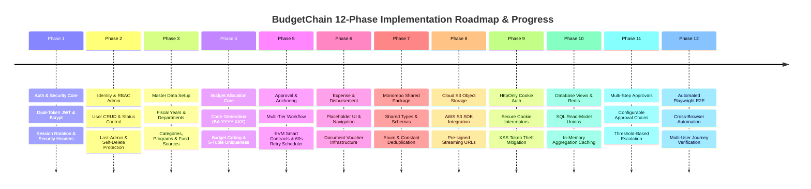
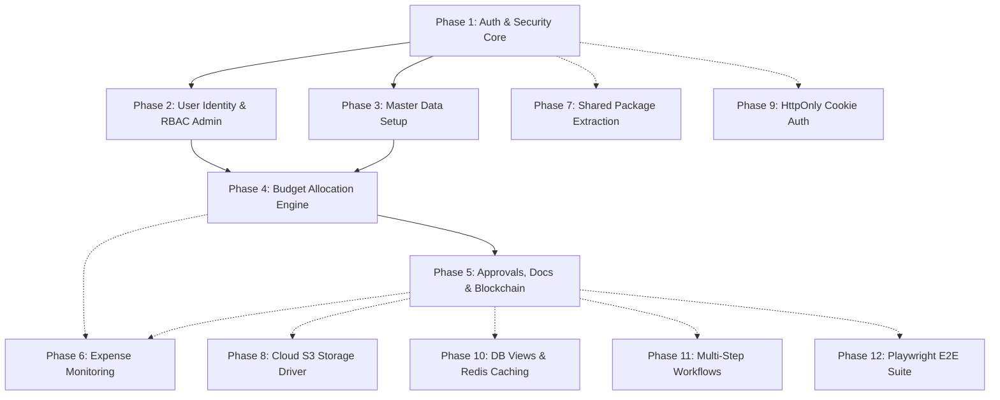

# Implementation Phases & Project Progress — BudgetChain

> **Scope:** complete, code-derived breakdown of 12 implementation phases, completed features, current progress, major milestones, inter-phase dependencies, and remaining implementation work across the BudgetChain monorepo.  
> **Source of truth:** the implementation (`apps/backend`, `apps/frontend`, `apps/contracts`, `packages/shared`, `apps/backend/prisma/schema.prisma`, `apps/frontend/src/routes/AppRoutes.tsx`).

---

## 1. Overview of 12 Implementation Phases

The **BudgetChain** system roadmap is structured into **12 distinct implementation phases**, encompassing completed baseline features, current in-progress placeholders, and planned architectural enhancements:

---

## 2. Completed Implementation Phases (Phases 1–5)

### 2.1 Phase 1: Foundation, Authentication & Security Core
- **Status:** ✅ 100% Complete
- **Backend Infrastructure:** Express ESM server (`apps/backend`), Prisma ORM client with MySQL, centralized error handling ([`middleware/errorHandler.js`](file:///d:/Ramisys%20files/Projects/capstone/apps/backend/middleware/errorHandler.js)), Zod request validation ([`middleware/validateRequest.js`](file:///d:/Ramisys%20files/Projects/capstone/apps/backend/middleware/validateRequest.js)).
- **Security & Session Model:** Dual-token JWT system (15m access token, 7d refresh token with rotation and DB tracking in `RefreshToken`), bcrypt password hashing (`saltRounds = 10`), rate limiting (`express-rate-limit`), security headers (`helmet`), CORS.
- **Frontend Core:** React 19 + Vite + TypeScript, hybrid styling (Tailwind CSS v4 + Bootstrap 5 + hand-written CSS variables), Axios interceptors for JWT injection and refresh, TanStack Query hooks, `AuthContext`, and route guards (`ProtectedRoute`, `PublicRoute`).

---

### 2.2 Phase 2: User Identity Administration & Access Control
- **Status:** ✅ 100% Complete
- **User Administration:** `User` model supporting 4 institutional roles (`Administrator`, `Treasurer`, `BudgetOfficer`, `Auditor`) and account statuses (`Active`, `Inactive`, `Suspended`). Admin-only identity administration APIs (`GET`, `POST`, `PUT`, `DELETE /api/users`).
- **Safety Guards:** Last-admin protection prevents removing the final active administrator; self-deletion protection prevents administrators from deleting their own account.
- **Role-Based Access Control:** RBAC middleware (`authorize(...roles)`) enforcing role boundaries across all API endpoints.

---

### 2.3 Phase 3: Master Data Infrastructure & Financial Classification
- **Status:** ✅ 100% Complete
- **Master Data Models:** `FiscalYear`, `Department`, `FundSource`, `BudgetCategory`, and `BudgetProgram` models with unique code constraints, description fields, status flags, and full REST APIs.
- **System Configuration:** Multi-entity relational baseline providing financial boundaries and operational scopes for all budget operations.

---

### 2.4 Phase 4: Budget Allocation Core Engine & Sequential Lifecycle
- **Status:** ✅ 100% Complete
- **Allocation Core Engine:** `BudgetAllocation` model featuring `Decimal(14,2)` amounts, sequential allocation code generation (`BA-YYYY-XXX`), and 5-tuple uniqueness constraint (`fiscalYearId`, `departmentId`, `fundSourceId`, `categoryId`, `programId`).
- **Ceiling Validation:** Automatic budget ceiling validation preventing department allocations from exceeding total fiscal year fund limits.

---

### 2.5 Phase 5: Approval Workflow, Document Management, Audit Logging & Blockchain Anchoring
- **Status:** ✅ 100% Complete
- **Multi-Tier Approval Workflow:** Status lifecycle (`Draft` → `PendingApproval` → `Approved` / `Rejected`) with `AllocationApproval` records, self-review prevention (`assertApprover`), and soft-deletion (`deletedAt`).
- **Document Management & Verification:** Multipart uploads (`multer`), magic-byte inspection (`sniffMimeType`), stream SHA-256 hashing, document versioning (up to 50 versions), and zero-storage external file verification.
- **Dual-Destination Audit Logs & Analytics:** Structured console output + DB persistence (`audit_logs`), sensitive parameter redaction, SHA-256 canonical event hashing, dashboard stats, 4-source activity timeline, and dynamic read-time alerts.
- **EVM Blockchain Anchoring:** Solidity 0.8.24 contracts (`BudgetLedger.sol`, `AuditLedger.sol`), fail-soft ethers v6 integration, 60s background retry scheduler (`blockchainScheduler`), manual retry endpoints, and block explorer link formatting.

---

## 3. In-Progress & Planned Implementation Phases (Phases 6–12)

### 3.1 Phase 6: Expense Tracking & Disbursement Monitoring
- **Status:** 🚧 10% In Progress (Planned Feature & Placeholder UI)
- **Current Baseline:** Dedicated UI route `/expense-tracking` displaying a planned feature banner ([`apps/frontend/src/routes/AppRoutes.tsx:173`](file:///d:/Ramisys%20files/Projects/capstone/apps/frontend/src/routes/AppRoutes.tsx#L173)); document management schema supporting expense voucher types (`DisbursementVoucher`, `Invoice`, `Receipt`).
- **Remaining Implementation:** Prisma `Expense` and `Disbursement` models, backend REST APIs (`/api/expenses`), disbursement approval logic, real-time allocation balance depletion (`allocatedAmount - totalExpenses`), and `AuditLedger` event anchoring.

---

### 3.2 Phase 7: Shared Monorepo Package Extraction (`packages/shared`)
- **Status:** 🚧 0% Planned
- **Current Baseline:** `packages/shared` workspace exists with a placeholder `README.md`.
- **Remaining Implementation:** Extract shared domain TypeScript types, Zod schemas, role enums, and API error constants into `packages/shared` to eliminate code duplication between backend and frontend.

---

### 3.3 Phase 8: Production AWS S3 Cloud Object Storage Driver
- **Status:** 🚧 0% Planned
- **Current Baseline:** Local storage driver (`LocalDocumentStorage`) persists files to local disk (`apps/backend/uploads/`). `STORAGE_DRIVER=s3` throws HTTP 503.
- **Remaining Implementation:** Integrate `@aws-sdk/client-s3` in `documentStorageService.js` supporting multi-region S3 storage, pre-signed download URLs, and stateless backend clustering.

---

### 3.4 Phase 9: HttpOnly Secure Cookie Refresh Token Authentication
- **Status:** 🚧 0% Planned
- **Current Baseline:** Access and refresh tokens are stored in browser `localStorage`.
- **Remaining Implementation:** Migrate refresh token issuance and rotation to `httpOnly`, `SameSite=Strict`, `Secure` cookies to protect against client-side XSS token theft.

---

### 3.5 Phase 10: Database Read-Model Views & Redis Performance Caching
- **Status:** 🚧 0% Planned
- **Current Baseline:** Timeline and history services merge multi-table rows in Node.js memory; dashboard queries hit MySQL on every request.
- **Remaining Implementation:** Implement SQL database views (`financial_activity_timeline_view`) for database-level sorting/unions and deploy Redis (`ioredis`) to cache master data and dashboard counters.

---

### 3.6 Phase 11: Multi-Step Configurable Approval Workflows
- **Status:** 🚧 0% Planned
- **Current Baseline:** Single-step approval transition reviewed by a Treasurer or Administrator.
- **Remaining Implementation:** Support configurable approval chains (Department Head → Budget Officer → Treasurer → Vice President) with threshold-based escalation rules.

---

### 3.7 Phase 12: Automated Playwright End-to-End (E2E) Test Suite & CI/CD
- **Status:** 🚧 0% Planned
- **Current Baseline:** Backend unit tests (38 scripts) and frontend Vitest component tests (22 suites / 174 tests) exist.
- **Remaining Implementation:** Integrate `@playwright/test` for multi-browser end-to-end user journey testing (User Login → Master Data Setup → Create Allocation → Approve → Upload Document → Anchoring Verification).

---

## 4. Inter-Phase Dependencies

---

## 5. Summary of System Progress (12 Phases)

| Phase | Functional Domain | Backend Status | Frontend Status | Contract Status | Completion | Progress Weight |
|-------|-------------------|----------------|-----------------|-----------------|------------|-----------------|
| **Phase 1** | Auth & Security Core | ✅ 100% | ✅ 100% | N/A | **100%** | 8.33% |
| **Phase 2** | User Identity & RBAC Admin | ✅ 100% | ✅ 100% | N/A | **100%** | 8.33% |
| **Phase 3** | Master Data Infrastructure | ✅ 100% | ✅ 100% | N/A | **100%** | 8.33% |
| **Phase 4** | Budget Allocation Core | ✅ 100% | ✅ 100% | N/A | **100%** | 8.33% |
| **Phase 5** | Approvals, Docs & Blockchain | ✅ 100% | ✅ 100% | ✅ 100% | **100%** | 8.33% |
| **Phase 6** | Expense Tracking & Disbursement | 🚧 0% | 🚧 10% (Placeholder) | N/A | **10%** | 0.83% |
| **Phase 7** | Shared Monorepo Package Code | 🚧 0% | 🚧 0% | N/A | **0%** | 0.00% |
| **Phase 8** | AWS S3 Cloud Storage Driver | 🚧 0% | 🚧 0% | N/A | **0%** | 0.00% |
| **Phase 9** | HttpOnly Cookie Security | 🚧 0% | 🚧 0% | N/A | **0%** | 0.00% |
| **Phase 10**| DB Read Views & Redis Caching | 🚧 0% | 🚧 0% | N/A | **0%** | 0.00% |
| **Phase 11**| Multi-Step Approval Workflows | 🚧 0% | 🚧 0% | N/A | **0%** | 0.00% |
| **Phase 12**| Playwright E2E Test Suite | 🚧 0% | 🚧 0% | N/A | **0%** | 0.00% |
| **TOTAL** | **Overall System Completion** | — | — | — | **42.5%** | **42.50%** |

> **Overall System Progress Calculation:**  
> $$\text{Overall Completion} = \frac{\sum \text{Phase Completion}}{12} = \frac{100\% + 100\% + 100\% + 100\% + 100\% + 10\% + 0\% + 0\% + 0\% + 0\% + 0\% + 0\%}{12} = \mathbf{42.5\%}$$
