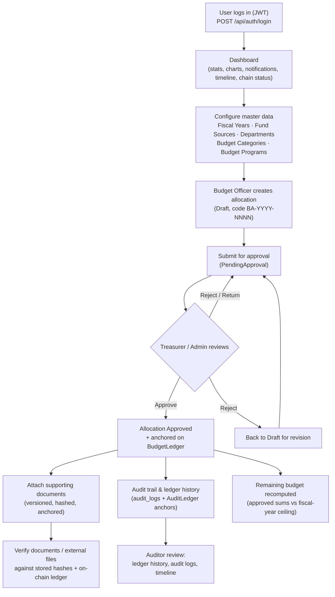
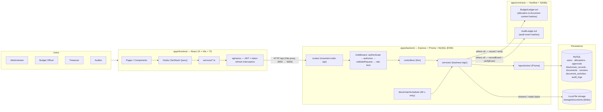

# Project Overview — Blockchain-Based Budget Allocation and Expense Monitoring System (BudgetChain)

> **Scope:** high-level project purpose, business problem, goals, features, users, workflow, modules, and technology.
> **Source of truth:** the implementation. This document is derived from source code only (`apps/backend`, `apps/frontend`, `apps/contracts`, `package.json`, `prisma/schema.prisma`). Anything not determinable from code is marked explicitly as *unknown*.

---

## 1. Project Purpose

BudgetChain is a blockchain-themed financial management platform that lets a university plan budget allocations, route them through an approval workflow, attach versioned evidence documents, and anchor tamper-evident proof of every record and event on an EVM (Ethereum Virtual Machine) ledger.

It is a monorepo (`capstone`, npm workspaces) with three real workspaces:

- **`apps/backend`** — REST API (`blockchain-budget-auth-system`), Express + Prisma + MySQL, all business logic.
- **`apps/frontend`** — React 19 SPA (Vite + TypeScript) that consumes the API.
- **`apps/contracts`** — Solidity smart contracts (Hardhat) that hold the immutable ledger.
- `packages/shared` exists but is a placeholder (README only, no code — *no usage of it was found in any workspace*).

The project is developed incrementally (git history is organized in "phases"); this overview describes what is implemented today, not aspirational phases.

---

## 2. Business Problem

Budget allocation in a university/government context is a high-stakes, multi-party process:

- **Oversight gap** — funds must be planned by one group and approved by another; without controls anyone could allocate more than the fiscal year's budget.
- **Tampering risk** — allocation amounts and supporting documents (purchase requests, receipts, vouchers) can be altered after the fact, destroying accountability.
- **Poor auditability** — actions, approvals, and document changes are scattered or lost, so auditors cannot reconstruct what happened, when, and by whom.
- **No chain of evidence** — documents are replaced or archived without a preserved, verifiable history.

The system addresses these with role-based separation of duties, budget-ceiling enforcement, a structured approval workflow, an append-only audit trail, and cryptographic anchoring of record hashes on a blockchain.

---

## 3. Goals

As evidenced by the implementation:

1. **Role-based access control (RBAC)** with four roles and per-endpoint authorization.
2. **Budget discipline** — enforce fiscal-year budget ceilings and compute remaining budget from approved allocations only.
3. **Separation of duties** — Budget Officers create/submit allocations but never approve their own; Administrators and Treasurers review.
4. **Tamper-evident records** — anchor SHA-256 content hashes of allocations and document versions on a blockchain ledger; any mutation breaks verification.
5. **Complete, immutable audit trail** — every security/lifecycle action is logged (structured) and persisted, and audit events are anchored on-chain.
6. **Document integrity** — versioned storage, per-version SHA-256 hashing, inline preview/download, and external file verification against the ledger.
7. **Transparency** — dashboards, a unified ledger history, a financial activity timeline, and on-chain status for stakeholders.

---

## 4. Core Features (implemented)

### 4.1 Authentication & authorization
- JWT access tokens (default 15 min) + refresh tokens (default 7 days) with token rotation and revocation (`apps/backend/services/authService.js`).
- `authenticate` middleware re-validates the user against the DB on every request (deleted/inactive accounts lose access immediately) — `apps/backend/middleware/authMiddleware.js:15`.
- `authorize(...roles)` RBAC middleware — `apps/backend/middleware/rbacMiddleware.js:11`.
- Rate limiting: global API limiter, strict login limiter (5/15 min), sensitive-route limiter, and upload limiter — `apps/backend/middleware/rateLimiter.js`.

### 4.2 User management (Administrator only)
- Create/update/delete users, change role and status; passwords hashed with bcrypt.

### 4.3 Master data management
- **Fiscal Years** (Active / Inactive / Archived, with `budgetAmount` ceiling).
- **Fund Sources**, **Departments**, **Budget Categories**, **Budget Programs** (programs belong to a department and a category).
- All master entities use sequential unique codes and can be deactivated (inactive entities cannot be referenced by allocations).

### 4.4 Budget allocation workflow
- Allocations reference fiscal year + department + fund source + category + program and always start as **Draft**.
- Lifecycle: `Draft → PendingApproval → Approved | Rejected`, `Approved → Archived`, with `Returned` back to Draft — transition map in `apps/backend/constants/allocationStatus.js:33`.
- Sequential codes per fiscal year (`BA-<year>-<n>`) via `apps/backend/repositories/allocationRepository.js`.
- **Budget ceiling enforcement**: an allocation cannot be created, updated, or approved if it would push the fiscal year's approved total above `budgetAmount` (`allocationService.validateBudgetCeiling`, `apps/backend/services/allocationService.js:769`).
- **Approval roles**: Administrators and Treasurers approve/reject/return; a user cannot review their own allocation (`assertApprover`, `allocationService.js:431`).
- Every workflow action writes a row to `allocation_approvals` (history) and to the audit trail.
- **On approval, the allocation is anchored on the BudgetLedger contract** (`performTransition`, `allocationService.js:502`).
- Soft-delete via `deletedAt`; archived allocations cannot be deleted.
- Remaining budget = fiscal-year ceiling(s) minus sum of **Approved** allocations; Draft/Pending don't commit budget; Rejected/Archived/deleted are excluded.

### 4.5 Blockchain ledger & verification
- Two Hardhat contracts (Solidity 0.8.24):
  - **`BudgetLedger.sol`** — anchors SHA-256 content hashes of allocations and document versions (`record` / `verify`).
  - **`AuditLedger.sol`** — anchors audit event hashes by category (`recordEvent` / `verifyEvent`).
- Content hash covers all meaning-changing fields of an allocation (`apps/backend/utils/hashUtils.js:15`), so any edit invalidates a previously verified hash.
- **Fail-soft by design**: if the ledger is unconfigured or the node is unreachable, DB mirror records stay `Pending`/`Failed` and are re-anchored later via manual retry or the background **scheduler** (every 60 s, `apps/backend/services/blockchainScheduler.js:126`).
- **Crash-window safe**: anchors are never duplicated — verify-before-record (`anchorUnlessExists`) recovers from the ledger when a DB mirror write failed after an on-chain write succeeded.
- Unified, type-aware ledger history merging Allocation / Document / Audit anchors at read time (`apps/backend/services/blockchainHistoryService.js`).
- Verification responses report `verified`, `integrityOk`, `onChain`, and `inconclusive` (when the node is unreachable).

### 4.6 Document management
- Multipart upload with MIME detection, extension/magic-byte validation, and configurable size limits (`apps/backend/middleware/uploadMiddleware.js`).
- Versioning: replace creates a new immutable version (previous versions stay stored and downloadable); byte-identical files are rejected by SHA-256 dedupe; max versions configurable (default 50) — `apps/backend/services/documentService.js:305`.
- Files are streamed to a **local storage driver** (`STORAGE_DRIVER=local`) and hashed in the same pass; an S3 driver is a fail-fast placeholder only (`apps/backend/services/documentStorageService.js:134`).
- Download (attachment), inline preview (PDFs/images only), version history, and a persisted per-document activity timeline.
- Each version is anchored on the BudgetLedger (fail-soft, retryable).
- Archive/soft-delete keeps all versions and blobs as the chain of evidence.
- Ownership rules: Administrators may modify any document; other roles only documents they uploaded (`assertCanModify`, `documentService.js:517`).

### 4.7 External file verification
- Users upload a file that is **streamed, hashed, and never stored**, then matched against stored document hashes and the on-chain ledger (`verifyExternalFile`, `apps/backend/services/documentBlockchainService.js:189`). Reports `verifiedAgainst: 'blockchain' | 'database' | 'none'`.

### 4.8 Audit trail
- Structured audit logging (`utils/auditLogger.js`) with automatic redaction of passwords/tokens, actor + IP + resource + details.
- Persisted to an append-only `audit_logs` table (toggleable via `AUDIT_LOG_DB_ENABLED`, default true) and **anchored on the AuditLedger** contract with a unique `eventHash`.
- Queryable audit API with filters, summary counts, and per-entry anchor re-anchoring.

### 4.9 Dashboard & analytics
- Stats (users, active/inactive, master-data counts), charts (users by role/status), derived notifications (inactive users, pending approvals), blockchain status, and a **financial activity timeline** that unions allocation approvals, document activities, audit log entries, and blockchain anchors (`apps/backend/services/timelineService.js`).

### 4.10 Planned (placeholders only — NOT implemented)
- **Expense Tracking** — placeholder route/page (`/expense-tracking`).
- **Approval Workflow UI page** — the *backend* approval actions are implemented, but the dedicated UI page is a placeholder; the allocation list UI drives the workflow today.

---

## 5. Target Users

Four seeded roles (`apps/backend/prisma/seed.js`, all with `@university.edu` demo accounts):

| Role | Primary responsibilities (derived from code) |
|------|----------------------------------------------|
| **Administrator** | Full access; user management; master data; create/submit/approve/reject allocations; all document operations; ledger retries. |
| **Budget Officer** | Create, edit, submit, and delete **own draft** allocations; upload/manage **own** documents; read-only everywhere else. |
| **Treasurer** | Approve/reject/return allocations (financial oversight); document management; ledger/audit visibility. |
| **Auditor** | Read-only across allocations, documents, ledger, audit logs, and verification. |

The system is aimed at university financial staff; external parties could use file verification, but no public/unauthenticated verification endpoint exists in the code.

---

## 6. High-Level Workflow

Approval actions may be repeated after a return-to-draft; previous on-chain anchors are preserved and the new approval anchors a new current record (prior records are superseded but kept) — `apps/backend/services/blockchainService.js:37`.

---

## 7. Major Modules

### 7.1 Backend (`apps/backend`) — layered, ESM
`routes/` → middleware → `controllers/` (thin) → `services/` (business logic) → `repositories/` (Prisma) → MySQL.

| Module | Key files | Purpose |
|--------|-----------|---------|
| API core | `app.js`, `server.js`, `routes/apiRouter.js:19` | Express app, security middleware, health check, mounts all routers under `/api` |
| Auth | `services/authService.js`, `routes/authRoutes.js` | Login, refresh, logout, `/me` |
| Users | `services/userService.js`, `routes/userRoutes.js` | Admin-only user CRUD |
| Dashboard | `services/dashboardService.js`, `routes/dashboardRoutes.js` | Stats, charts, notifications, blockchain status |
| Master data | `services/{fiscalYear,fundSource,department,budgetCategory,budgetProgram}Service.js` + routes | Reference-data CRUD |
| Allocations | `services/allocationService.js`, `services/../repositories/allocationRepository.js`, `routes/allocationRoutes.js` | Allocation CRUD + approval workflow + budget ceiling |
| Blockchain | `services/blockchainService.js`, `services/blockchainHistoryService.js`, `services/blockchainScheduler.js`, `config/blockchain.js`, `routes/blockchainRoutes.js` | Anchoring, verification, retry, unified history, 60 s scheduler |
| Documents | `services/documentService.js`, `services/documentStorageService.js`, `services/documentBlockchainService.js`, `routes/documentRoutes.js` | Upload/version/replace/download/preview/verify/archive |
| Verification | `routes/verificationRoutes.js` | External file verification (streamed, never stored) |
| Audit | `utils/auditLogger.js`, `utils/auditPersistence.js`, `services/auditLogService.js`, `services/auditEventBlockchainService.js`, `routes/auditLogRoutes.js` | Structured audit + persistence + on-chain anchoring + query API |
| Timeline | `services/timelineService.js`, `controllers/timelineController.js` | Merged financial activity feed |
| Cross-cutting | `middleware/{authMiddleware,rbacMiddleware,rateLimiter,errorHandler,uploadMiddleware,auditMiddleware}.js`, `validators/*` (Zod), `errors/*`, `utils/*` | Security, validation, error normalization, amounts, hashing, JWT |

### 7.2 Frontend (`apps/frontend`) — React 19 + Vite + TypeScript
Data flow: `src/api/axios` (JWT + token-refresh interceptors, `apps/frontend/src/api/axios.ts:45`) → `src/services/*.ts` → TanStack Query hooks in `src/hooks/` → `src/pages/`.

| Module | Key files | Purpose |
|--------|-----------|---------|
| Shell | `App.tsx`, `routes/AppRoutes.tsx`, `components/layout/*` | Routing, protected routes, sidebar/top-nav |
| Auth | `context/AuthContext.tsx`, `pages/Login.tsx` | Session state, login/logout, `hasRole` |
| Dashboard | `pages/Dashboard.tsx`, `components/dashboard/*` | Stats, charts, timeline, notifications, chain status |
| Budget allocation | `pages/budget-allocation/*`, `pages/{fiscal-years,fund-sources,departments,budget-categories,budget-programs}/*` | Master data + allocation list/dashboard |
| Blockchain | `pages/blockchain/BlockchainLedger.tsx`, `services/blockchainService.ts` | Ledger history, verification UI |
| Documents | `pages/documents/{DocumentList,DocumentUpload,DocumentDetail}.tsx` | Document lifecycle UI |
| Verification | `pages/verification/VerifyDocument.tsx` | External file verification UI |
| Audit | `pages/audit/AuditLogs.tsx` | Audit log query UI |

### 7.3 Contracts (`apps/contracts`) — Hardhat + Solidity
| Contract | Purpose |
|----------|---------|
| `contracts/BudgetLedger.sol` | Immutable registry of content hashes for allocations and document versions (`record`, `verify`, `getRecord`, `recordCount`); owner-only writes; reverts on duplicate hash. |
| `contracts/AuditLedger.sol` | Immutable registry of audit event hashes with category counters (`recordEvent`, `verifyEvent`, `getAuditEvent`, `eventCount`, `totalEvents`); reverts on duplicate event hash. |

Deployment is via Hardhat (`npm run blockchain:deploy` → `apps/contracts/deployments/contracts.json`), which the backend reads as a fallback for contract addresses.

---

## 8. System Overview Diagram

---

## 9. Technology Summary

### Backend (`apps/backend`)
- **Language/runtime:** Node.js, ESM (`"type": "module"`; local imports require `.js`).
- **Framework:** Express 4; `helmet`, `cors`, `morgan`, `express-rate-limit`.
- **ORM:** Prisma 5 + MySQL (`Decimal(14,2)` for money; money converted to plain numbers at the API boundary via `utils/amountUtils.js`).
- **Validation:** Zod 3 schemas in `validators/`.
- **Auth:** `jsonwebtoken` (access + refresh tokens), `bcryptjs`.
- **Uploads:** `multer` (multipart), SHA-256 hashing via `node:crypto`, local storage driver.
- **Blockchain:** `ethers` v6 (JsonRpcProvider + Wallet + Contract), ABI files in `config/blockchainAbi.js`.
- **Tests:** plain Node scripts (`node:assert/strict`) with manual monkey-patching of repositories — **no test runner, no DB required**; hardcoded list in `apps/backend/package.json`.

### Frontend (`apps/frontend`)
- **Language/tooling:** TypeScript 5 (`strict: false`, `allowJs: true`), Vite 6, React 19.
- **Data:** axios (baseURL `/api`, JWT + single-flight refresh interceptor), TanStack Query 5, react-hook-form + yup/zod.
- **Routing/UI:** React Router 7, Tailwind CSS v4 + Bootstrap 5 + custom CSS-variable theme, Radix UI primitives, lucide-react icons, recharts.
- **Tests:** Vitest + Testing Library (jsdom), `renderWithProviders` in `src/test/test-utils.tsx`.

### Contracts (`apps/contracts`)
- Solidity `^0.8.24`, Hardhat 2, `@nomicfoundation/hardhat-toolbox`; smoke/test scripts under `scripts/` and `test/`.

### Infrastructure / DevOps
- Local dev only: backend on `:5000`, frontend dev server on `:3000` proxying `/api` to `:5000`.
- **No Docker, Kubernetes, CI pipeline, or deployment config was found in the repository** (*unknown* how it is deployed in production).
- Backend config via environment variables with fail-fast validation (`config/env.js`), e.g. `JWT_SECRET` must be ≥ 32 chars, blockchain addresses/RPC URLs are validated at startup.

---

## 10. Known Unknowns (cannot be determined from code)

- **Production deployment topology** — no Docker/K8s/CI files exist in the repo.
- **S3 storage** — `STORAGE_DRIVER=s3` is validated but no S3 implementation exists (fails fast with 503); only `local` is implemented.
- **`packages/shared`** — placeholder with a README only; no code and no imports found in any workspace.
- **Whether expense tracking / dedicated approval-workflow UI will be built** — only placeholders exist (marked "Planned" in the UI).
- **Organizational reality** — the domain is clearly a university/government-style budget process (seed data uses `@university.edu`), but no external requirement documents exist in the repo.
