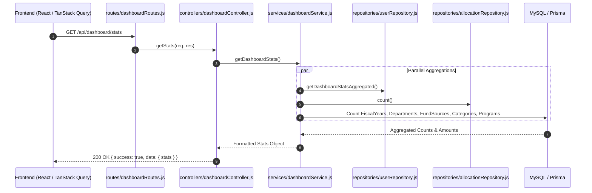
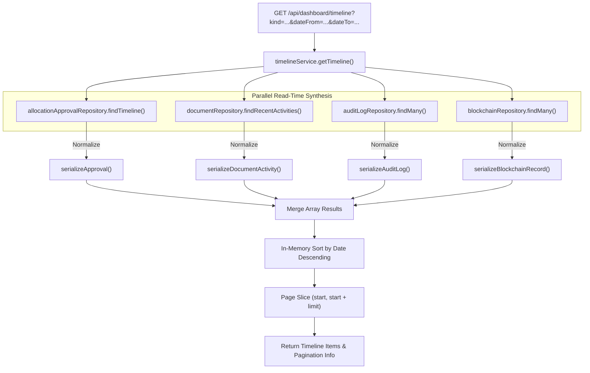

# Reports & Financial Analytics — BudgetChain

> **Scope:** technical reference for reporting, financial analytics aggregation, system metrics, merged activity timelines, budget summary calculations, and planned export features in BudgetChain.  
> **Source of truth:** the implementation (`apps/backend/routes/dashboardRoutes.js`, `apps/backend/controllers/dashboardController.js`, `apps/backend/controllers/timelineController.js`, `apps/backend/services/dashboardService.js`, `apps/backend/services/timelineService.js`, `apps/backend/services/allocationService.js`, `apps/backend/repositories/allocationRepository.js`, `apps/backend/repositories/userRepository.js`).

---

## 1. Purpose

The **Reports & Financial Analytics** module delivers high-level operational visibility, budget consumption analytics, and institutional audit timelines across BudgetChain.

Key responsibilities:
- **System Metrics & Aggregations:** Providing real-time counts and distributions across users, active fiscal years, funding sources, academic departments, budget categories, and budget programs.
- **Budget Utilization & Ceiling Summary:** Reporting committed versus remaining available funds per fiscal year, department, or funding source.
- **Unified Financial Activity Timeline:** Merging records from four distinct source tables (`allocation_approvals`, `document_activities`, `audit_logs`, `blockchain_records`) into a single time-ordered activity feed with in-memory sorting and pagination.
- **Actionable Notifications:** Generating real-time alerts for pending allocation approvals and account status warnings.
- **Planned Advanced Exports:** Providing custom report builders and PDF/Excel export capabilities for institutional compliance and external auditing.

---

## 2. Features

### Current Implementation
- **Dashboard Statistics Engine:** Executes parallel database aggregations (`userRepository.getDashboardStatsAggregated`, `fiscalYearRepository.count`, `departmentRepository.count`, etc.) to produce real-time totals ([`apps/backend/services/dashboardService.js:18-36`](file:///d:/Ramisys%20files/Projects/capstone/apps/backend/services/dashboardService.js#L18-L36)).
- **Role & Status Visual Breakdown:** Aggregates user populations by institutional role (`Administrator`, `Treasurer`, `BudgetOfficer`, `Auditor`) and status (`Active`, `Inactive`, `Pending`) for chart rendering.
- **Budget Utilization Summaries:** Computes `totalBudget`, `totalAllocated` (sum of `Approved` allocations), and `remainingBudget` (`totalBudget - totalAllocated`).
- **Unified 4-Source Activity Feed:** Combines allocation approvals, document lifecycle events, console audit logs, and on-chain blockchain anchor records into a standardized timeline (`timelineService.js`).
- **Blockchain Health Reporting:** Exposes node reachability, network configuration (`sepolia`/`hardhat`), latest block height, and contract deployment addresses (`BudgetLedger`, `AuditLedger`).
- **Real-Time Notification Feed:** Synthesizes actionable system notices for pending approval queues and inactive accounts.

### Planned Features
- **Custom Report Builder:** User-configurable date ranges, department breakdowns, and category filters.
- **Automated Document Exports:** Scheduled and on-demand PDF, CSV, and Excel export generation for financial reports.
- **Formal Audit Reports:** Specialized reporting packages combining on-chain transaction receipts with signed document verification chains.

---

## 3. Workflow & Architecture

### 3.1 Dashboard Reporting Aggregation Pipeline



### 3.2 Multi-Source Timeline Synthesis Pipeline



---

## 4. Controllers

Layered in [`apps/backend/controllers/dashboardController.js`](file:///d:/Ramisys%20files/Projects/capstone/apps/backend/controllers/dashboardController.js) and [`apps/backend/controllers/timelineController.js`](file:///d:/Ramisys%20files/Projects/capstone/apps/backend/controllers/timelineController.js).

### Controller Handlers Summary

| Handler Method | Target Service Method | Response Shape | Description |
|----------------|-----------------------|----------------|-------------|
| `dashboardController.getStats` [`line 14`](file:///d:/Ramisys%20files/Projects/capstone/apps/backend/controllers/dashboardController.js#L14) | `dashboardService.getDashboardStats` | `{ stats }` | High-level system counts & role totals. |
| `dashboardController.getCharts` [`line 31`](file:///d:/Ramisys%20files/Projects/capstone/apps/backend/controllers/dashboardController.js#L31) | `dashboardService.getDashboardCharts` | `{ charts: { usersByRole, usersByStatus } }` | Visual distribution chart metrics. |
| `dashboardController.getActivities` [`line 48`](file:///d:/Ramisys%20files/Projects/capstone/apps/backend/controllers/dashboardController.js#L48) | `dashboardService.getRecentActivities` | `{ activities }` | Combined user creation and allocation creation feed. |
| `dashboardController.getNotifications` [`line 67`](file:///d:/Ramisys%20files/Projects/capstone/apps/backend/controllers/dashboardController.js#L67) | `dashboardService.getNotifications` | `{ notifications }` | Actionable system alerts (pending approvals, inactive accounts). |
| `dashboardController.getBlockchainStatus` [`line 84`](file:///d:/Ramisys%20files/Projects/capstone/apps/backend/controllers/dashboardController.js#L84) | `dashboardService.getBlockchainStatus` | `{ blockchain }` | EVM network, contract addresses, & node health status. |
| `timelineController.getTimeline` [`line 12`](file:///d:/Ramisys%20files/Projects/capstone/apps/backend/controllers/timelineController.js#L12) | `timelineService.getTimeline` | `{ timeline, pagination }` | Merged 4-source activity timeline. |
| `allocationController.getAllocationStatistics` [`line 173`](file:///d:/Ramisys%20files/Projects/capstone/apps/backend/controllers/allocationController.js#L173) | `allocationService.getAllocationStatistics` | `{ statistics }` | Allocation status breakdown & totals. |
| `allocationController.getRemainingBudget` [`line 195`](file:///d:/Ramisys%20files/Projects/capstone/apps/backend/controllers/allocationController.js#L195) | `allocationService.getRemainingBudget` | `{ budget }` | Total, committed, and remaining budget totals. |

---

## 5. Services

### 5.1 `DashboardService` ([`apps/backend/services/dashboardService.js`](file:///d:/Ramisys%20files/Projects/capstone/apps/backend/services/dashboardService.js))
- **`getDashboardStats()`**: Executes 6 parallel count/aggregation queries using `Promise.all`.
- **`getDashboardCharts()`**: Retrieves `usersByRole` and `usersByStatus` grouped counts.
- **`getRecentActivities(limit)`**: Fetches recent users and recent allocations, normalizes shapes, sorts by timestamp descending, and trims to `limit`.
- **`getNotifications()`**: Checks inactive user counts and pending allocation approval counts to generate dynamic warning/info alerts.

### 5.2 `TimelineService` ([`apps/backend/services/timelineService.js`](file:///d:/Ramisys%20files/Projects/capstone/apps/backend/services/timelineService.js))
- **`getTimeline(filters, pagination, ordering)`**: Loads entries from `allocation_approvals`, `document_activities`, `audit_logs`, and `blockchain_records` based on `filters.kind` (`ALLOCATION_APPROVAL`, `DOCUMENT_ACTIVITY`, `AUDIT_LOG`, `BLOCKCHAIN_RECORD`).
- **Normalizers**:
  - `serializeApproval()`: Formats allocation approval actions.
  - `serializeDocumentActivity()`: Maps document actions (`UPLOAD`, `REPLACE`, `VERIFY`) to readable labels.
  - `serializeAuditLog()`: Formats system console audit events.
  - `serializeBlockchainRecord()`: Formats on-chain ledger anchor records.

---

## 6. Database & Aggregation Queries

Reporting queries use optimized Prisma aggregations to compute statistics without fetching full entity lists into memory:

### 6.1 User Aggregations ([`userRepository.js:125-180`](file:///d:/Ramisys%20files/Projects/capstone/apps/backend/repositories/userRepository.js#L125-L180))
```javascript
// Single parallel batch for dashboard stats
async getDashboardStatsAggregated() {
  const [totalUsers, activeUsers, inactiveUsers, pendingUsers] = await Promise.all([
    prisma.user.count(),
    prisma.user.count({ where: { status: USER_STATUS.ACTIVE } }),
    prisma.user.count({ where: { status: USER_STATUS.INACTIVE } }),
    prisma.user.count({ where: { status: USER_STATUS.PENDING } }),
  ]);
  return { totalUsers, activeUsers, inactiveUsers, pendingUsers };
}
```

### 6.2 Allocation Aggregations ([`allocationRepository.js:100-136`](file:///d:/Ramisys%20files/Projects/capstone/apps/backend/repositories/allocationRepository.js#L100-L136))
- **`aggregateApprovedAmount(scope)`**: Sums `allocatedAmount` where `status = Approved` and `deletedAt = null`.
- **`countByStatus(scope)`**: Groups non-deleted allocations by `status`.

---

## 7. APIs

All endpoints mount under `/api/dashboard` ([`apps/backend/routes/dashboardRoutes.js`](file:///d:/Ramisys%20files/Projects/capstone/apps/backend/routes/dashboardRoutes.js)) and `/api/allocations` ([`apps/backend/routes/allocationRoutes.js`](file:///d:/Ramisys%20files/Projects/capstone/apps/backend/routes/allocationRoutes.js)). All endpoints require authentication (`authenticate`).

### API Endpoints Reference

| Method | Route Path | Access Permission | Validation Schema | Description |
|--------|------------|-------------------|-------------------|-------------|
| `GET` | `/api/dashboard/stats` | All Roles | `dashboardStatsSchema` | Overall system metrics & resource counts |
| `GET` | `/api/dashboard/charts` | All Roles | `dashboardChartsSchema` | Role & status distribution chart data |
| `GET` | `/api/dashboard/activities` | All Roles | `dashboardActivitiesSchema` | Combined user & allocation creation feed |
| `GET` | `/api/dashboard/notifications` | All Roles | `dashboardNotificationsSchema` | Live alert notifications |
| `GET` | `/api/dashboard/blockchain` | All Roles | `dashboardBlockchainSchema` | EVM network, contract, & node status |
| `GET` | `/api/dashboard/timeline` | All Roles | `timelineQuerySchema` | Unified 4-source activity timeline feed |
| `GET` | `/api/allocations/statistics` | All Roles | `allocationStatisticsSchema` | Scoped allocation metrics & status counts |
| `GET` | `/api/allocations/remaining-budget` | All Roles | `remainingBudgetQuerySchema` | Fiscal year total, committed, & remaining budget |

---

## 8. Permissions & RBAC

### Authorization Matrix

| Endpoint | Administrator | Treasurer | BudgetOfficer | Auditor |
|----------|:-------------:|:---------:|:-------------:|:-------:|
| `GET /api/dashboard/stats` | ✅ Allowed | ✅ Allowed | ✅ Allowed | ✅ Allowed |
| `GET /api/dashboard/charts` | ✅ Allowed | ✅ Allowed | ✅ Allowed | ✅ Allowed |
| `GET /api/dashboard/activities` | ✅ Allowed | ✅ Allowed | ✅ Allowed | ✅ Allowed |
| `GET /api/dashboard/notifications` | ✅ Allowed | ✅ Allowed | ✅ Allowed | ✅ Allowed |
| `GET /api/dashboard/blockchain` | ✅ Allowed | ✅ Allowed | ✅ Allowed | ✅ Allowed |
| `GET /api/dashboard/timeline` | ✅ Allowed | ✅ Allowed | ✅ Allowed | ✅ Allowed |
| `GET /api/allocations/statistics` | ✅ Allowed | ✅ Allowed | ✅ Allowed | ✅ Allowed |
| `GET /api/allocations/remaining-budget` | ✅ Allowed | ✅ Allowed | ✅ Allowed | ✅ Allowed |

---

## 9. Business Rules

1. **Only Approved Allocations Commit Budget:** Remaining budget calculations (`remainingBudget = totalBudget - totalAllocated`) subtract only allocations in `Approved` status. `Draft`, `PendingApproval`, `Rejected`, and `Archived` allocations do not deduct from the available budget ceiling.
2. **In-Memory Multi-Source Timeline Sorting:** Because the activity timeline merges four distinct database tables (`allocation_approvals`, `document_activities`, `audit_logs`, `blockchain_records`), source queries run without a DB-level `LIMIT`. In-memory sorting and pagination (`MAX_LIMIT = 100`) guarantee accurate chronological ordering across tables.
3. **Fail-Soft Blockchain Health Reporting:** If the configured Ethereum/Hardhat RPC node is offline or unreachable, `/api/dashboard/blockchain` returns `{ configured: true, isConnected: false }` without throwing an unhandled exception or crashing HTTP handlers.
4. **Soft-Deleted Entity Exclusion:** All report aggregations and activity feeds automatically exclude soft-deleted records (`deletedAt !== null`).
