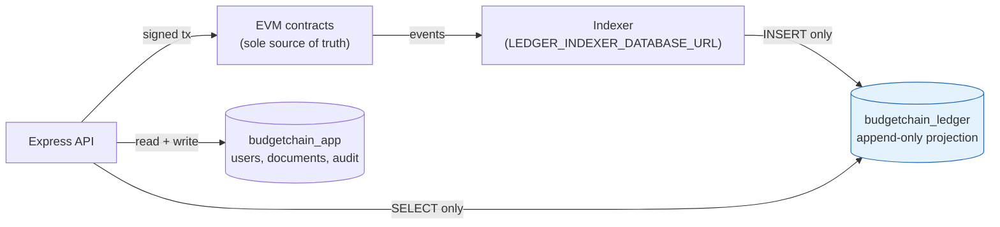

# Database Schema Alignment — `schema.prisma` vs. the Business Rules Catalog

**Date:** 2026-08-08
**Status:** Specification only. **No code, schema, migration, contract, or test was modified in producing this document.**
**Audited artifact:** `apps/backend/prisma/schema.prisma` (413 lines, 14 models, 10 enums, 9 migrations)
**Audited against:** `docs/BUSINESS_RULES.md` (BR-001 … BR-113)
**Companion documents:** `IMPLEMENTATION_PLAN.md` (work breakdown C1–C9, H1–H7, M1–M8, L1–L6), `docs/AUDIT_REPORT.md` (2026-08-07), `docs/DATABASE.md` (describes the *current* schema and remains accurate for it)

---

## 0. What this document is

This is the **target-state data model** for the database, derived rule-by-rule from the Business Rules Catalog. It answers one question: *if the catalog is the specification, what must the schema look like?*

It does **not** re-litigate the architecture. It assumes the decisions already escalated in `IMPLEMENTATION_PLAN.md` §2:

- **DECISION-1 = (A)** — the chain is authoritative for the pre-orals domain; the database is a projection (BR-100).
- **DECISION-2 = (b)** — `BudgetAllocation` survives as a Tier 4 planning view, asserting no enforcement.

If either decision is resolved differently, §6 states exactly which parts of this specification change.

### 0.1 The one structural fact that drives everything

BR-100 says the database is a projection and the chain is the sole source of truth. That single rule reclassifies **every table in this document**. A projection table is not a place where business rules are enforced — it is a place where the *outcome* of enforcement is recorded so it can be queried. Consequently:

| The schema **can** enforce (Tier 2) | The schema **cannot** enforce (Tier 1 only) |
|---|---|
| Uniqueness (BR-011, BR-044, BR-061/062) | Σ allotments ≤ appropriation (BR-030) |
| Amount > 0 via CHECK (BR-012, BR-031, BR-047) | Σ certified obligations ≤ Σ allotments (BR-040) |
| Append-only shape — no `updatedAt`, no update path (BR-013, BR-033, BR-055, BR-065) | Availability evaluated at certification (BR-041) |
| No mutable balance column (BR-102) | Certifier ≠ requester (BR-043) |
| Provenance columns on every projected row (BR-103) | Role conflict matrix (BR-003, BR-008) |
| No PII columns in the ledger schema (BR-090, BR-091) | Statutory floor protection (BR-053) |
| Referential integrity of the projection | Anything requiring a signature or a revert |

**A schema change alone never raises a rule to Tier 1.** Where this document proposes a table for a Tier 1 rule, that table is the *projection* of the contract's enforcement, not a substitute for it. This is stated per-rule in the traceability matrix (§5).

---

## 1. Gap Summary — current schema against the catalog

### 1.0 The system is an LGU Municipal Budget Office system, not a university system

The catalog is unambiguous: *"Permissioned Blockchain-Based Appropriation and Obligation Monitoring System for the **Municipal Budget Office**."* Every entity in it is a local-government construct — Sanggunian ordinances, provincial review under the Local Government Code, PAP codes, ORS numbers, COA expense classes, municipal income classes, statutorily mandated minimum allocations.

The repository is framed as a university system, and that framing is baked into data, not just prose:

| Artifact | Current (university) | Required (LGU / MBO) |
|---|---|---|
| `docs/PROJECT_OVERVIEW.md:10` | "lets a **university** plan budget allocations" | Municipal Budget Office appropriation and obligation monitoring |
| `prisma/seed.js` users | `admin@university.edu`, "University Treasurer" | Municipal Budget Officer, Department Head, Rule Admin, Observer (§3.2) |
| `Department` seed rows | `DEPT-ENG` "College of Engineering", `DEPT-CAS`, `DEPT-IT` | Implementing offices — Mayor's Office, MPDO, MHO, MEO, MSWDO, MAO, MTO |
| `Department` model name | Academic department | **`ImplementingOffice`** — the LGC term the catalog uses (BR-005, BR-014) |
| `BudgetCategory` | Free-form master data (`CAT-PS`, `CAT-MOOE`, `CAT-CO`) | Fixed statutory `ExpenseClass` enum — an office cannot invent one (§3.3) |
| `FundSource` seed rows | `FS-GF`, `FS-SEF`, `FS-TF` | **Already correct** — General Fund / SEF / Trust Fund are the LGU funds; only the model name changes to `Fund` (BR-054) |
| `FiscalYear.budgetAmount` | A single institutional ceiling | Ceilings are derived from enacted ordinances; the FY row holds *parameters* (income class), not a ceiling (§3.3) |

This matters for the schema in three concrete ways, all reflected in §3:

1. **`Department` becomes `ImplementingOffice`** and moves to the ledger database, because BR-005 (a department head may submit obligations only against their *own* office) and BR-014 (every line names its implementing office) are on-chain checks against it. An academic department is master data; an implementing office is an authorization scope.
2. **`BudgetCategory` becomes the `ExpenseClass` enum.** A university can define its own expenditure categories. A municipality cannot — PS / MOOE / CO / FE are fixed by COA, and BR-046 compares them across two tables.
3. **`FiscalYear.budgetAmount` is deleted, not converted.** A university has an institutional budget ceiling. A municipality's ceiling is the sum of its enacted appropriation lines, which is exactly what BR-030 aggregates. Keeping a stored ceiling column would violate BR-102.

`FundSource` is the one master-data table that is already right for an LGU; it is renamed and moved, not redesigned.

> The university framing also propagates into `docs/PROJECT_OVERVIEW.md`, `docs/DATABASE.md` §10, `docs/BUDGET_ALLOCATION.md`, and `README.md`. Correcting the prose is `IMPLEMENTATION_PLAN.md` L5; correcting the *data* is S4 and S9 in §6.

### 1.1 Domain coverage

The catalog's core domain objects have **zero** representation in the current schema.

| Catalog entity | Rules | Present in `schema.prisma`? |
|---|---|---|
| `Ordinance` (annual / supplemental / amending) | BR-010, 011, 016, 020–024, 050 | ❌ Absent |
| `FiscalYearParameters` | BR-015, 061, 062 | ❌ Absent (`FiscalYear` holds a single `budgetAmount`, not parameters) |
| `AppropriationLine` | BR-010–017 | ❌ Absent (`BudgetAllocation` is the nearest analog and is mutable) |
| `Allotment` + withdrawal event | BR-030–034 | ❌ Absent |
| `Obligation` (ORS) + status events | BR-040–049 | ❌ Absent |
| `Realignment` | BR-050–057 | ❌ Absent |
| `RuleVersion` (statutory registry) | BR-060–068 | ❌ Absent |
| `ComplianceFlag` / `Justification` | BR-070–075 | ❌ Absent |
| On-chain identity + `RoleGrant` | BR-001, 002, 007 | ❌ Absent (`User.role` is a DB enum, JWT-carried) |
| Role conflict matrix | BR-003, 008 | ❌ Absent |
| `PAP code` | BR-014 | ❌ Absent (`BudgetProgram` is a local construct, not a PAP code) |
| `ImplementingOffice` | BR-005, 014 | ⚠ Wrong construct — `Department` models an academic department, not an LGC implementing office, and lives in the API-writable database where BR-005 cannot use it |
| Expense class | BR-014, 046 | ⚠ Partial — `BudgetCategory` is free-form master data, not a fixed statutory classification |
| Payee opaque reference | BR-091 | ⚠ Unconstrained — no payee column exists yet, but `docs/EXPENSE_MONITORING.md:143` proposes `payee String @db.VarChar(200)`, which would violate BR-091 outright |
| Verification run record | BR-084 | ❌ Absent |
| Document supersession anchor | BR-081 | ⚠ DB-only (`currentVersionId`, `replaceReason`) — not tamper-evident |

### 1.2 Cross-cutting schema violations

These are defects in the **existing** tables, independent of the missing domain.

| # | Violation | Rule | Where | Severity |
|---|---|---|---|---|
| V1 | Money stored as `Decimal(14, 2)` and normalized to a JS `Number` at the API boundary | BR-110 | `schema.prisma:84` (`FiscalYear.budgetAmount`), `schema.prisma:178` (`BudgetAllocation.allocatedAmount`); `utils/amountUtils.js` `toNumber()` | 🚨 Blocking |
| V2 | No basis-point representation anywhere; no rate columns exist | BR-111 | — | 🚨 Blocking (blocks BR-060/068) |
| V3 | `BudgetAllocation` is mutable — `updatedAt`, `deletedAt` soft delete, editable Draft rows, status transitions in place | BR-013 | `schema.prisma:187–188` | 🚨 Violates |
| V4 | No `logIndex` on any anchored row; `BlockchainRecord` and `DocumentVersion` carry `txHash` + `blockNumber` but nothing to order two events in one transaction | BR-103, BR-104 | `schema.prisma:239`, `schema.prisma:346` | 🚨 Blocking (a rebuild cannot be made deterministic) |
| V5 | The API's database role has full write privilege on every table; there is no `ledger` schema and no read-only role | BR-101 | `datasource db { url = env("DATABASE_URL") }` — a single connection string | 🚨 Blocking |
| V6 | `blockNumber`/`txHash` are **nullable** on `BlockchainRecord` and `DocumentVersion` — a row can exist with no chain provenance at all (this is the fail-soft design working as intended, which is precisely the problem under BR-100) | BR-100, BR-103 | `schema.prisma:238–239`, `schema.prisma:346–347` | 🚨 Blocking |
| V7 | No CHECK constraints on any monetary column; amount > 0 lives only in Zod and the service layer | BR-012, 031, 047 | — | ⚠ Tier 2 gap |
| V8 | Role model has no `RULE_ADMIN`, no department head, no observer; `Treasurer` and `Auditor` have no catalog equivalent | BR-003, 005, 006, 008 | `schema.prisma:10–15` | 🚨 Blocking |
| V9 | `ManagedDocument.deletedAt` is a soft delete — a lawfully erased blob is indistinguishable from a present one, so BR-083's `unavailable` result cannot be produced | BR-083, BR-092 | `schema.prisma:309` | ⚠ |
| V10 | Document supersession is expressed by a mutable pointer (`currentVersionId`), not by an immutable supersession edge | BR-081 | `schema.prisma:305` | ⚠ |

### 1.3 What the current schema gets right — and must be preserved

`IMPLEMENTATION_PLAN.md` §1.3 identifies five defensible rules. Three of them are schema properties and are carried forward unchanged:

- **BR-080** — documents live off-chain; only `DocumentVersion.sha256Hash` is anchored. Correct.
- **BR-090** — no PII column exists on any anchored row. Correct, and §3.6 makes it a standing constraint.
- **BR-102** — **no mutable balance column exists anywhere in the schema.** Every total is aggregated at read time. This is the single most important property the current schema already satisfies, and §3.7 protects it explicitly.

Also carried forward: UUID primary keys, snake_case `@@map`, PascalCase enums, the `@unique` discipline on hashes, and the composite `[documentId, versionNumber]` pattern.

---

## 2. Physical layout — two databases, two roles

BR-101 requires the API role to hold **no write privilege** on the `ledger` schema. Two facts constrain how this is implemented:

1. **MySQL has no schemas within a database.** A MySQL "schema" *is* a database. `ledger` must therefore be a separate database (e.g. `budgetchain_ledger`), not a namespace inside the existing one.
2. **Prisma's `multiSchema` preview feature does not support MySQL.** One Prisma schema file cannot span both databases.

**Proposed layout:**

| Database | Prisma schema file | Written by | Read by |
|---|---|---|---|
| `budgetchain_ledger` | `apps/backend/prisma/ledger/schema.prisma` | **Indexer only**, via `LEDGER_INDEXER_DATABASE_URL` (a role with `INSERT`, `SELECT`) | API, via `LEDGER_READ_DATABASE_URL` (a role with **`SELECT` only**) |
| `budgetchain_app` | `apps/backend/prisma/schema.prisma` (existing file, reduced) | API, via `DATABASE_URL` | API |

This yields two generated clients (`prismaLedger`, `prismaApp`). BR-101's exit criterion in `IMPLEMENTATION_PLAN.md` §5.4 — "demonstrated by a failing write" — becomes a test that attempts `prismaLedger.obligation.create()` and asserts a MySQL privilege error.



> **Consequence for the service layer:** a write to the ledger domain is no longer a database call. It is a transaction submission followed by an event arriving in the projection. The fail-soft anchoring path (`blockchainService.js`) must be retired for these entities — `IMPLEMENTATION_PLAN.md` C7. A ledger write that does not confirm on-chain **did not happen**, and no projection row may exist for it.

---

## 3. Target ledger schema (`budgetchain_ledger`)

### 3.1 Conventions, applied to every table in this section

| Convention | Rule | Rationale |
|---|---|---|
| Money is `BigInt` centavos, column name suffixed `Centavos` | BR-110 | `Decimal` invites float conversion; the suffix makes a violation visible in review and greppable in CI |
| Rates are `Int` basis points, suffixed `Bps` | BR-111 | — |
| **No `updatedAt` on any table** | BR-013, 033, 055, 065 | An `@updatedAt` column is a declaration that rows change. None of these do. |
| **No `deletedAt` on any table** | BR-023, 033 | Retention is mandatory; state changes are new rows, never edits |
| Every row carries `blockNumber BigInt`, `txHash String`, `logIndex Int`, all **non-null** | BR-103 | V6 — a projected row without provenance is unprovenanced by definition |
| Every table has `@@unique([txHash, logIndex])` | BR-104 | The idempotency key that makes `rebuild --from-block 0` byte-identical to incremental indexing |
| Actors are on-chain addresses (`@db.Char(42)`), never `User.id` | BR-001, 090 | The ledger schema must not reference the identity database |
| Amount columns get a raw-SQL `CHECK (x > 0)` in the migration | BR-012, 031, 047 | Prisma cannot express CHECK; it goes in the migration body |

A shared fragment, repeated on every model below (written once here for brevity):

```prisma
// PROVENANCE — required on every ledger projection row (BR-103, BR-104)
  blockNumber BigInt
  txHash      String @db.Char(66)
  logIndex    Int
  blockTime   DateTime
  indexedAt   DateTime @default(now())
// @@unique([txHash, logIndex])
```

### 3.2 Identity and roles (BR-001 … BR-008)

```prisma
enum LedgerRole {
  BudgetOfficer
  DepartmentHead
  RuleAdmin
  Observer
}

enum RoleGrantAction {
  Granted
  Revoked
}

/// Append-only projection of RoleRegistry.sol grant/revoke transactions (BR-002).
/// Never updated. A revocation is a new row, so historical attribution survives (BR-007).
model RoleGrantEvent {
  id            String          @id @default(uuid())
  subject       String          @db.Char(42)   // address receiving/losing the role
  role          LedgerRole
  action        RoleGrantAction
  grantor       String          @db.Char(42)   // BR-002: grantor identity recorded
  officeCode    String?         @db.VarChar(20) // → ImplementingOffice.code; scopes DepartmentHead (BR-005)
  // + PROVENANCE
  @@index([subject, role])
  @@index([blockNumber, logIndex])
  @@map("role_grant_events")
}

/// Projection of the on-chain separation-of-duties matrix (BR-003, BR-008).
/// Read-only mirror; the contract is the enforcement point.
model RoleConflict {
  id       String     @id @default(uuid())
  roleA    LedgerRole
  roleB    LedgerRole
  citation String     @db.VarChar(500)
  // + PROVENANCE
  @@unique([roleA, roleB])
  @@map("role_conflicts")
}
```

**Notes.**
- The current-role-set of an address is a **query** over `RoleGrantEvent`, not a column. Materializing it would recreate the mutable-state problem BR-102 forbids in the monetary domain.
- BR-003 (`RULE_ADMIN` ⊥ `BUDGET_OFFICER`) and BR-008 (the full matrix) are enforced in `RoleRegistry.sol`. `RoleConflict` exists so the UI can *explain* a revert, never to pre-empt one.
- BR-006 (observers hold no write capability) has **no schema representation at all**. There is nothing to store: the guarantee is the absence of a code path in the contract. Recording it in the projection would be theatre.
- `LedgerRole` deliberately omits `Treasurer` and `Auditor`. Those remain in the *application* schema (§4) as login roles with no on-chain capability. This is DECISION-4 and must be ratified before this table is built.

### 3.3 Ordinance and appropriation (BR-010 … BR-017, BR-020 … BR-024)

```prisma
enum OrdinanceKind {
  Annual
  Supplemental
  Amending
}

enum OrdinanceReviewStatus {
  Enacted
  SubmittedForReview
  UnderReview
  Operative
  PartiallyInoperative
  Inoperative
}

enum ExpenseClass {
  PersonalServices
  MOOE
  CapitalOutlay
  FinancialExpenses
}

/// BR-010, BR-011, BR-016. Immutable once enacted.
model Ordinance {
  id               String        @id @default(uuid())
  ordinanceNumber  String        @db.VarChar(50)
  fiscalYear       Int
  kind             OrdinanceKind
  enactedDate      DateTime
  amendsOrdinanceId String?      // BR-016: required when kind != Annual
  basisDocumentHash String       @db.Char(66)   // BR-080: digest only
  // + PROVENANCE

  amends            Ordinance?  @relation("OrdinanceAmends", fields: [amendsOrdinanceId], references: [id])
  amendedBy         Ordinance[] @relation("OrdinanceAmends")
  appropriationLines AppropriationLine[]
  reviewTransitions OrdinanceReviewTransition[]
  realignments      Realignment[]

  @@unique([ordinanceNumber, fiscalYear])   // BR-011 — Tier 2 backstop
  @@index([fiscalYear])
  @@map("ordinances")
}

/// BR-020, BR-021. Append-only. Current status = latest row, never a column on Ordinance.
model OrdinanceReviewTransition {
  id                  String                @id @default(uuid())
  ordinanceId         String
  fromStatus          OrdinanceReviewStatus?
  toStatus            OrdinanceReviewStatus
  effectiveDate       DateTime                              // BR-021
  reviewDocumentHash  String?               @db.Char(66)    // BR-021
  actor               String                @db.Char(42)
  // + PROVENANCE

  ordinance Ordinance @relation(fields: [ordinanceId], references: [id])
  @@index([ordinanceId, blockNumber, logIndex])
  @@map("ordinance_review_transitions")
}

/// BR-012 … BR-015. IMMUTABLE — no updatedAt, no deletedAt, no update path (BR-013).
model AppropriationLine {
  id                  String       @id @default(uuid())
  ordinanceId         String
  fundId              String                              // BR-014
  implementingOfficeId String                             // BR-014, BR-005
  papCode             String       @db.VarChar(50)        // BR-014 — absent from the current schema
  expenseClass        ExpenseClass                        // BR-014, enforced against obligations by BR-046
  amountCentavos      BigInt                              // BR-012 (> 0) + BR-110
  fiscalYear          Int                                 // BR-015
  certifiedBy         String       @db.Char(42)           // BR-004
  // + PROVENANCE

  ordinance    Ordinance          @relation(fields: [ordinanceId], references: [id])
  fund         Fund               @relation(fields: [fundId], references: [id])
  office       ImplementingOffice @relation(fields: [implementingOfficeId], references: [id])
  allotments   Allotment[]
  obligations  Obligation[]
  inoperativeDeclarations InoperativeDeclaration[]
  realignmentSources Realignment[] @relation("RealignmentSource")
  realignmentTargets Realignment[] @relation("RealignmentTarget")

  @@index([ordinanceId])
  @@index([fiscalYear, implementingOfficeId])
  @@index([fundId])
  @@index([expenseClass])
  @@map("appropriation_lines")
  // MIGRATION BODY: ALTER TABLE appropriation_lines
  //   ADD CONSTRAINT chk_appropriation_amount_positive CHECK (amountCentavos > 0);
}

/// BR-017, BR-023, BR-024. A separate table because BR-013 forbids a mutable flag on the line.
model InoperativeDeclaration {
  id                  String   @id @default(uuid())
  appropriationLineId String
  ordinanceReviewTransitionId String            // the review action that caused it
  declaredDate        DateTime
  // + PROVENANCE

  appropriationLine AppropriationLine @relation(fields: [appropriationLineId], references: [id])
  @@index([appropriationLineId])
  @@map("inoperative_declarations")
}

/// BR-015. Precondition for recording any appropriation in a fiscal year.
model FiscalYearParameters {
  id            String   @id @default(uuid())
  fiscalYear    Int      @unique
  incomeClass   String   @db.VarChar(20)      // resolves BR-062 rule precedence
  effectiveFrom DateTime
  effectiveTo   DateTime
  // + PROVENANCE
  @@map("fiscal_year_parameters")
}

/// Master data, on-chain because BR-054 (no cross-fund realignment) is enforced against it.
/// Replaces `FundSource`. The seeded LGU funds (General Fund, SEF, Trust Fund) are already correct.
model Fund {
  id   String @id @default(uuid())
  code String @unique @db.VarChar(20)   // GF | SEF | TF
  name String @db.VarChar(200)
  // + PROVENANCE
  appropriationLines AppropriationLine[]
  @@map("funds")
}

/// Replaces `Department`. An LGC implementing office (Mayor's Office, MPDO, MHO, MEO, MSWDO…).
/// On-chain because BR-005 scopes a department head's write capability to their own office
/// and BR-014 requires every appropriation line to name one. NO PII (BR-090) — the current
/// `Department.officeHead` / `contactNumber` / `email` / `officeAddress` columns do NOT come across;
/// office contact details stay in the application database if they are needed at all.
model ImplementingOffice {
  id   String @id @default(uuid())
  code String @unique @db.VarChar(20)
  name String @db.VarChar(200)
  // + PROVENANCE
  appropriationLines AppropriationLine[]
  @@map("implementing_offices")
}
```

**Notes.**
- `InoperativeDeclaration` is a separate table, not a boolean on `AppropriationLine`. This is not fastidiousness: BR-013 says the line is immutable and BR-024 says inoperativeness applies to *identified lines only*. A per-line flag toggled by a review action is an update to an immutable row.
- **"Adjusted appropriation"** in BR-030 is `amountCentavos` + net realignments in − net realignments out. It is derived (§3.7), never stored.
- BR-013's real teeth are in what is **absent**: no `updatedAt`, no `deletedAt`, no correction column. Corrections arrive as a new `Ordinance` of kind `Amending` with new lines.

### 3.4 Allotment and obligation (BR-030 … BR-034, BR-040 … BR-049)

```prisma
enum ObligationStatus {
  Requested
  Certified
  Cancelled
}

/// BR-031, BR-032, BR-033. Append-only.
model Allotment {
  id                  String @id @default(uuid())
  appropriationLineId String                    // BR-032: exactly one line
  amountCentavos      BigInt                    // BR-031 (> 0)
  releasedBy          String @db.Char(42)
  // + PROVENANCE

  appropriationLine AppropriationLine     @relation(fields: [appropriationLineId], references: [id])
  withdrawals       AllotmentWithdrawal[]
  @@index([appropriationLineId])
  @@map("allotments")
  // CHECK (amountCentavos > 0)
}

/// BR-033, BR-034. A reduction is this row — never an edit to Allotment.
model AllotmentWithdrawal {
  id             String @id @default(uuid())
  allotmentId    String                         // BR-033: references the original release
  amountCentavos BigInt                         // BR-034: ≤ unobligated portion, enforced on-chain
  withdrawnBy    String @db.Char(42)
  // + PROVENANCE

  allotment Allotment @relation(fields: [allotmentId], references: [id])
  @@index([allotmentId])
  @@map("allotment_withdrawals")
  // CHECK (amountCentavos > 0)
}

/// BR-040 … BR-049. The centrepiece entity. Append-only; status lives in ObligationStatusEvent.
model Obligation {
  id                  String       @id @default(uuid())
  orsNumber           String       @unique @db.VarChar(50)   // BR-044 — Tier 2 backstop
  appropriationLineId String
  expenseClass        ExpenseClass                            // BR-046: must equal the line's
  amountCentavos      BigInt                                  // BR-047 (> 0)
  payeeRef            String       @db.Char(66)               // BR-091: opaque digest ONLY
  requestedBy         String       @db.Char(42)               // BR-043: certifier must differ
  // + PROVENANCE

  appropriationLine AppropriationLine       @relation(fields: [appropriationLineId], references: [id])
  statusEvents      ObligationStatusEvent[]
  @@index([appropriationLineId])
  @@index([requestedBy])
  @@map("obligations")
  // CHECK (amountCentavos > 0)
}

/// BR-042, BR-045, BR-048. Append-only. Certification and cancellation are rows, not edits.
model ObligationStatusEvent {
  id            String            @id @default(uuid())
  obligationId  String
  fromStatus    ObligationStatus?
  toStatus      ObligationStatus
  actor         String            @db.Char(42)   // BR-045: certifying identity
  justification String?           @db.Text       // BR-048: required on Cancelled
  // + PROVENANCE  (blockTime satisfies BR-045's "block timestamp")

  obligation Obligation @relation(fields: [obligationId], references: [id])
  @@index([obligationId, blockNumber, logIndex])
  @@map("obligation_status_events")
}
```

**Notes.**
- **There is no `status` column on `Obligation`.** Current status is the latest `ObligationStatusEvent`. This is what BR-048 means by "reversal … is a distinct recorded cancellation, not a status edit," and it is the exact opposite of `BudgetAllocation.status`, which is edited in place today.
- **BR-040 and BR-041 have no schema representation, by design.** The invariant Σ certified obligations ≤ Σ allotments is evaluated inside `ObligationLedger.sol` at the moment of certification. A database CHECK cannot express it, and a trigger that tried would be a second, weaker source of truth — the precise failure this thesis critiques. The projection's job is to make the *result* queryable so the demo can show the second certification reverting.
- **BR-049** falls out of the model for free: `Obligation` rows with no `Certified` event simply do not appear in the balance query (§3.7). Nothing reserves funds because there is no reservation column.
- `payeeRef` is `Char(66)` — a 0x-prefixed digest, sized so a name cannot fit. The `payee String @db.VarChar(200)` proposed in `docs/EXPENSE_MONITORING.md:143` must never be built; see §3.6.

### 3.5 Realignment, rule registry, compliance (BR-050 … BR-075)

```prisma
/// BR-050 … BR-056. Append-only; a reversal is a new row in the opposite direction (BR-055).
model Realignment {
  id                    String @id @default(uuid())
  authorizingOrdinanceId String                     // BR-050
  sourceLineId          String                      // BR-051: must differ from target
  targetLineId          String
  amountCentavos        BigInt                      // BR-052: ≤ unobligated source balance
  justification         String @db.Text             // BR-056: non-empty
  actor                 String @db.Char(42)
  // + PROVENANCE

  ordinance  Ordinance         @relation(fields: [authorizingOrdinanceId], references: [id])
  sourceLine AppropriationLine @relation("RealignmentSource", fields: [sourceLineId], references: [id])
  targetLine AppropriationLine @relation("RealignmentTarget", fields: [targetLineId], references: [id])
  @@index([sourceLineId])
  @@index([targetLineId])
  @@map("realignments")
  // CHECK (amountCentavos > 0 AND sourceLineId <> targetLineId)   -- BR-051 Tier 2 backstop
}

enum RuleKind       { PercentOfBase  AbsoluteFloorPerUnit }
enum RuleComparator { Max  Min }

/// BR-060 … BR-068. Append-only; an amendment is a NEW row (BR-065).
model RuleVersion {
  id                   String         @id @default(uuid())
  code                 String         @db.VarChar(50)     // e.g. DEV_FUND_MIN
  incomeClass          String?        @db.VarChar(20)     // NULL = general; specific wins (BR-062)
  effectiveYear        Int                                // BR-061: resolves by fiscal year
  kind                 RuleKind
  comparator           RuleComparator                     // BR-071
  baseMeasure          String         @db.VarChar(50)     // BR-070: named in the rule itself
  valueBps             Int?                               // BR-068: required when PercentOfBase
  absoluteValueCentavos BigInt?                           // BR-068: required when AbsoluteFloorPerUnit
  citation             String         @db.VarChar(500)    // BR-063
  basisDocumentHash    String         @db.Char(66)        // BR-063
  isRetroactive        Boolean        @default(false)     // BR-066 (advisory flag)
  amendedBy            String         @db.Char(42)        // BR-064: RULE_ADMIN only, on-chain
  // + PROVENANCE

  @@unique([code, incomeClass, effectiveYear])            // BR-061/062 resolution key
  @@index([code, effectiveYear])
  @@map("rule_versions")
}

enum FlagSeverity { Blocking  Advisory }

/// BR-072, BR-073. Only ADVISORY flags are ever stored — blocking violations revert,
/// so no transaction exists to project.
model ComplianceFlag {
  id            String       @id @default(uuid())
  ruleVersionId String
  subjectType   String       @db.VarChar(50)    // "Ordinance" | "AppropriationLine" | "Realignment"
  subjectId     String
  severity      FlagSeverity
  observedCentavos BigInt
  limitCentavos    BigInt
  // + PROVENANCE

  ruleVersion    RuleVersion    @relation(fields: [ruleVersionId], references: [id])
  justifications Justification[]
  @@index([subjectType, subjectId])
  @@map("compliance_flags")
}

/// BR-074. Immutable, with author and timestamp.
model Justification {
  id      String @id @default(uuid())
  flagId  String
  text    String @db.Text
  author  String @db.Char(42)
  // + PROVENANCE  (blockTime is the timestamp; no updatedAt)

  flag ComplianceFlag @relation(fields: [flagId], references: [id])
  @@index([flagId])
  @@map("justifications")
}
```

**Notes.**
- **BR-075 forbids caching compliance results as authoritative state.** `ComplianceFlag` stores only *advisory* flags, which are themselves recorded transactions, not computed conclusions. There is deliberately **no `ComplianceResult` table** and no `isCompliant` column anywhere. Adding one later would violate BR-075 even though it would make the dashboard faster; that trade is not available.
- **BR-060 has a schema consequence that is easy to miss:** the absence of statutory literals must hold in `seed.js` too. BR-067 forbids seeding rules through migration scripts or constructor arguments — so `RuleVersion` rows may only arrive through the indexer, from real `RuleRegistry.sol` amendment transactions. **No rule may be inserted by `prisma/seed.js`.** This is the accidental-violation path the catalog warns about.
- BR-066's retroactive flag is `isRetroactive` plus a `ComplianceFlag` of severity `Advisory` — permitted, recorded, requires justification.

### 3.6 Standing constraint — no PII in the ledger database (BR-090, BR-091)

This is a **review rule and a CI check**, not a table.

| Forbidden in `budgetchain_ledger` | Permitted |
|---|---|
| Any name, address, contact number, e-mail | `payeeRef Char(66)` — an opaque digest |
| Bank account / financial account details | On-chain addresses (pseudonymous, role-bound) |
| `payee String @db.VarChar(200)` as proposed in `docs/EXPENSE_MONITORING.md:143` | Office codes, PAP codes, fund codes |

Enforcement: a CI grep over `apps/backend/prisma/ledger/schema.prisma` for `payee`, `name`, `email`, `address`, `contact`, `tin` outside the allowlist. `IMPLEMENTATION_PLAN.md` L3.

### 3.7 Derived balances — views, never columns (BR-102)

The current schema's cleanest property is that **no balance is stored**. That must survive the re-scope. Balances are read-time aggregations, expressible as SQL views in the ledger database:

| View | Definition | Serves |
|---|---|---|
| `v_appropriation_adjusted` | `line.amountCentavos + Σ realignments_in − Σ realignments_out` | BR-030 denominator |
| `v_allotment_released` | `Σ allotments − Σ withdrawals` per line | BR-030, BR-040 |
| `v_obligation_certified` | `Σ obligations` whose latest status event is `Certified` | BR-040, BR-049 |
| `v_line_available` | `v_allotment_released − v_obligation_certified` | Demo / explorer |
| `v_line_unobligated` | `v_appropriation_adjusted − v_obligation_certified` | BR-034, BR-052 |
| `v_current_roles` | Latest `RoleGrantEvent` per `(subject, role)` where `action = Granted` | BR-002, BR-007 |
| `v_obligation_current_status` | Latest `ObligationStatusEvent` per obligation, ordered by `(blockNumber, logIndex)` | BR-048 |

**These views inform; they never authorize.** A contract must never read a balance the API computed — it recomputes from its own storage. The views exist so the UI and the public explorer (BR-093) can render without a mutable cache.

> Note the ordering key throughout: `(blockNumber, logIndex)`, not `createdAt`. Two events in one transaction share a block and a timestamp; only `logIndex` separates them. This is why V4 is a blocking defect rather than a nicety.

---

## 4. Target application schema (`budgetchain_app`)

The application database keeps identity, documents, and audit. It is API-writable and asserts no Tier 1 enforcement.

### 4.1 Retained without change

`User`, `RefreshToken`, `AuditLog`, `DocumentActivity` — all correct as they stand.

### 4.2 Changed

| Model | Change | Rule |
|---|---|---|
| `User` | Add `ledgerAddress String? @unique @db.Char(42)` — binds a login identity to its on-chain identity. `User.role` stays for API RBAC (Tier 3) but stops being the authorization source for ledger writes. | BR-001, DECISION-4 |
| `User` | `status = Inactive` must not delete or rewrite historical rows; already true, but the on-chain revocation is now the controlling act. Deactivation becomes two facts: a DB status change (login) and a `RoleGrantEvent(Revoked)` (capability). | BR-007 |
| `Role` enum | Keep `Administrator`, `Treasurer`, `BudgetOfficer`, `Auditor` as **login** roles. Do **not** add `RuleAdmin` here — it exists only in `LedgerRole`, or BR-003 becomes DB-enforced and drops to Tier 2. | BR-003, BR-064 |
| `ManagedDocument` | Replace `deletedAt` semantics: add `blobErasedAt DateTime?` recording that the off-chain object was **hard-deleted** while metadata and anchor were retained. | BR-083, BR-092 |
| `DocumentVersion` | Add `supersedesVersionId String? @unique` — an immutable supersession edge alongside the existing `currentVersionId` pointer, so BR-081's relationship is anchorable. | BR-081 |
| `DocumentVersion` | `txHash`/`blockNumber` stay nullable **here only** — documents are anchored fail-soft by design and BR-080/082 are satisfied without the chain being the source of truth for file bytes. | BR-080, BR-082 |
| `BudgetAllocation` + `AllocationApproval` + `BlockchainRecord` | Per DECISION-2(b), retained as a Tier 4 planning view. **Must be relabelled in code and UI as advisory** and must stop claiming enforcement. `allocatedAmount` still converts to `BigInt` centavos under BR-110 — that rule is system-wide, not ledger-only. | BR-110, DECISION-2 |
| `Department` | **Superseded by ledger `ImplementingOffice`** (§3.3). If the Tier 4 planning view is kept, `Department` survives only as a display join and must be reseeded with real municipal offices — not `College of Engineering`. Its `officeHead` / `contactNumber` / `email` / `officeAddress` columns are PII and must never be copied into the ledger database. | BR-005, 014, 090, §1.0 |
| `FundSource` | **Superseded by ledger `Fund`** (§3.3). Codes `FS-GF` / `FS-SEF` / `FS-TF` are already the correct LGU funds and carry over as `GF` / `SEF` / `TF`. | BR-054, §1.0 |
| `BudgetCategory` | **Superseded by the `ExpenseClass` enum** (§3.3). An LGU cannot define its own expenditure classification, so this stops being an editable master-data table. | BR-014, 046, §1.0 |
| `BudgetProgram` | Not a PAP. If the planning view is kept it may stay as a local grouping, but it must not be presented as satisfying BR-014 — `AppropriationLine.papCode` does that. | BR-014 |
| `FiscalYear.budgetAmount` | **Dropped, not converted.** The ceiling is the sum of enacted appropriation lines (BR-030); a stored ceiling is a mutable balance under BR-102. `FiscalYear` itself is superseded by ledger `FiscalYearParameters` (BR-015) for anything the chain checks. | BR-030, 102, 015 |
| `prisma/seed.js` | Reseed for an LGU: municipal offices, LGU funds, Municipal Budget Officer / department head / rule admin / observer accounts. **The ledger database is never seeded** (§6.1). | §1.0, BR-067, BR-100 |

### 4.3 Added

```prisma
/// BR-084. One row per verification run.
model VerificationRun {
  id             String   @id @default(uuid())
  scope          String   @db.VarChar(50)   // "documents" | "allocations" | "audit"
  recordsChecked Int
  mismatches     Int
  unavailable    Int                        // BR-083: distinct from mismatches
  durationMs     Int
  startedAt      DateTime
  finishedAt     DateTime
  triggeredBy    String?                    // User.id, null when scheduled
  createdAt      DateTime @default(now())
  @@index([scope, createdAt])
  @@map("verification_runs")
}
```

BR-083 needs one more thing beyond a column: the verification service must return three outcomes — `verified`, `mismatch`, `unavailable` — and `unavailable` must be reachable, which requires `blobErasedAt` to exist and a 404 from storage to be distinguishable from a digest mismatch. A lawful Data Privacy Act erasure that registers as tampering makes the metric in `VerificationRun.mismatches` meaningless.

---

## 5. Traceability matrix — rule → schema element

Legend: **Tier 2** = the schema enforces it. **Projection** = the schema records the outcome; enforcement is Tier 1 in a contract. **None** = no schema representation exists or should exist.

| Rule | Schema element | Schema role |
|---|---|---|
| BR-001 | `User.ledgerAddress`; `actor`/`grantor` columns are addresses | Projection |
| BR-002 | `RoleGrantEvent` (append-only, `grantor`, `blockTime`) | Projection |
| BR-003 | `RoleConflict`; `RuleAdmin` deliberately absent from the app `Role` enum | Projection |
| BR-004 | `AppropriationLine.certifiedBy` | Projection |
| BR-005 | `RoleGrantEvent.officeCode`, `AppropriationLine.implementingOfficeId` → `ImplementingOffice` | Projection |
| BR-006 | — | **None** (absence of a code path; nothing to store) |
| BR-007 | `RoleGrantEvent(Revoked)` as a new row; no delete path | **Tier 2** (append-only shape) |
| BR-008 | `RoleConflict` | Projection |
| BR-010 | `AppropriationLine.ordinanceId` NOT NULL | **Tier 2** (FK) |
| BR-011 | `@@unique([ordinanceNumber, fiscalYear])` | **Tier 2** |
| BR-012 | `CHECK (amountCentavos > 0)` | **Tier 2** |
| BR-013 | No `updatedAt`, no `deletedAt`, no update path on `AppropriationLine` | **Tier 2** (shape) |
| BR-014 | `fundId`, `implementingOfficeId`, `papCode`, `expenseClass` all NOT NULL | **Tier 2** |
| BR-015 | `FiscalYearParameters.fiscalYear @unique` | Projection |
| BR-016 | `Ordinance.amendsOrdinanceId` self-FK | Projection (nullability cannot be conditional in Prisma) |
| BR-017 | `InoperativeDeclaration` | Projection |
| BR-020 | `OrdinanceReviewTransition.fromStatus`/`toStatus` | Projection |
| BR-021 | `effectiveDate`, `reviewDocumentHash` | **Tier 2** (NOT NULL on `effectiveDate`) |
| BR-022 | `ComplianceFlag(severity = Advisory)` | Projection |
| BR-023 | Obligations never deleted; no `deletedAt` | **Tier 2** (shape) |
| BR-024 | `InoperativeDeclaration` is per-line | **Tier 2** (grain) |
| BR-030 | `v_appropriation_adjusted`, `v_allotment_released` | **None** — contract invariant |
| BR-031 | `CHECK (amountCentavos > 0)` | **Tier 2** |
| BR-032 | `Allotment.appropriationLineId` NOT NULL, single FK | **Tier 2** |
| BR-033 | `AllotmentWithdrawal`; `Allotment` has no `updatedAt` | **Tier 2** (shape) |
| BR-034 | `v_line_unobligated` | **None** — contract invariant |
| BR-040 | `v_obligation_certified` vs `v_allotment_released` | **None** — contract invariant (the centrepiece) |
| BR-041 | `ObligationStatusEvent` ordering by `(blockNumber, logIndex)` | **None** — contract, at certification |
| BR-042 | `ObligationStatusEvent.fromStatus` | Projection |
| BR-043 | `Obligation.requestedBy` vs `ObligationStatusEvent.actor` | Projection |
| BR-044 | `Obligation.orsNumber @unique` | **Tier 2** |
| BR-045 | `ObligationStatusEvent.actor` + `blockTime` | Projection |
| BR-046 | `Obligation.expenseClass`, `AppropriationLine.expenseClass` | Projection (cross-table equality needs a trigger; left to the contract) |
| BR-047 | `CHECK (amountCentavos > 0)` | **Tier 2** |
| BR-048 | `ObligationStatusEvent`; **no `status` column on `Obligation`** | **Tier 2** (shape) |
| BR-049 | `v_obligation_certified` filters on latest status | **Tier 2** (query semantics) |
| BR-050 | `Realignment.authorizingOrdinanceId` NOT NULL | **Tier 2** (FK) |
| BR-051 | `CHECK (sourceLineId <> targetLineId)` | **Tier 2** |
| BR-052 | `v_line_unobligated` | **None** — contract invariant |
| BR-053 | `RuleVersion` + `ComplianceFlag` | **None** — contract invariant |
| BR-054 | `AppropriationLine.fundId` on both ends | Projection |
| BR-055 | `Realignment` has no `updatedAt`/`deletedAt` | **Tier 2** (shape) |
| BR-056 | `justification Text` NOT NULL | **Tier 2** (non-empty needs a CHECK: `CHAR_LENGTH(justification) > 0`) |
| BR-057 | `ComplianceFlag` rows per movement | Projection |
| BR-060 | **Absence** of any rate/threshold literal in schema defaults or `seed.js` | **Tier 2** (by omission) |
| BR-061 | `@@unique([code, incomeClass, effectiveYear])` | **Tier 2** |
| BR-062 | `incomeClass` nullable; specific-beats-general in the resolver | Projection |
| BR-063 | `citation`, `basisDocumentHash` NOT NULL | **Tier 2** |
| BR-064 | `amendedBy` address; `RuleAdmin` not in the app `Role` enum | Projection |
| BR-065 | `RuleVersion` has no `updatedAt` | **Tier 2** (shape) |
| BR-066 | `isRetroactive` + advisory `ComplianceFlag` | Projection |
| BR-067 | **`seed.js` must insert zero `RuleVersion` rows** | **Tier 2** (by prohibition) |
| BR-068 | `valueBps` / `absoluteValueCentavos` both nullable, exactly one required | Projection (conditional requiredness is a contract check) |
| BR-070 | `RuleVersion.baseMeasure` | Projection |
| BR-071 | `RuleVersion.comparator` | Projection |
| BR-072 | `ComplianceFlag` stores advisory only | **Tier 2** (by omission of blocking rows) |
| BR-073 | `ComplianceFlag` ← `Justification` | Projection |
| BR-074 | `Justification` has `author`, `blockTime`, no `updatedAt` | **Tier 2** (shape) |
| BR-075 | **No `ComplianceResult` table; no `isCompliant` column** | **Tier 2** (by omission) |
| BR-080 | `DocumentVersion.sha256Hash`; bytes live in storage | **Tier 2** ✅ already satisfied |
| BR-081 | `DocumentVersion.supersedesVersionId` | **Tier 2** (new) |
| BR-082 | — | **None** (service behavior) |
| BR-083 | `ManagedDocument.blobErasedAt`, `VerificationRun.unavailable` | **Tier 2** (new) |
| BR-084 | `VerificationRun` | **Tier 2** (new) |
| BR-090 | No PII column in `budgetchain_ledger` | **Tier 2** ✅ already satisfied |
| BR-091 | `Obligation.payeeRef Char(66)`; `payee VarChar(200)` prohibited | **Tier 2** |
| BR-092 | `blobErasedAt`; anchors retained | **Tier 2** |
| BR-093 | Views exclude `payeeRef` | **Tier 2** (view definition) |
| BR-100 | Two databases; ledger written only by the indexer | **Tier 2** (privilege) |
| BR-101 | `LEDGER_READ_DATABASE_URL` holds `SELECT` only | **Tier 2** (privilege) |
| BR-102 | No balance column anywhere; §3.7 views | **Tier 2** ✅ already satisfied |
| BR-103 | `blockNumber` + `txHash` + `logIndex`, all NOT NULL, on every ledger row | **Tier 2** |
| BR-104 | `@@unique([txHash, logIndex])` on every ledger table | **Tier 2** |
| BR-105 | Divergence is reported, never written back — no reconciliation path exists in the read-only role | **Tier 2** (privilege) |
| BR-110 | Every amount is `BigInt` centavos; `Decimal` removed | **Tier 2** |
| BR-111 | Rates are `Int` bps | **Tier 2** |
| BR-112 | — | **None** (rounding is contract logic) |
| BR-113 | No currency column | **Tier 2** ✅ already satisfied |

**Counts.** Of 78 rules: **43 have a Tier 2 schema element**, **26 are projection-only**, **9 have no schema representation** by design. Six of the pre-orals band's 31 rules (BR-030, 034, 040, 041, plus BR-052, 053 later) have deliberately **no** schema element — they are the contract invariants, and a schema-side approximation of them would be actively harmful.

---

## 6. Migration path

Sequenced to match `IMPLEMENTATION_PLAN.md` §4. Schema work is a *consequence* of contract work, never ahead of it — a projection table for an event schema that has not been finalized will be rebuilt.

| Step | Work | Depends on | Plan ID |
|---|---|---|---|
| **S0** | Verify the live DB matches `schema.prisma` (`prisma migrate status`, `db pull` diff) before touching migrations | — | H4 |
| **S1** | **Monetary conversion.** `Decimal(14,2)` → `BigInt` centavos on `FiscalYear.budgetAmount` and `BudgetAllocation.allocatedAmount`; retire `toNumber()` from every logic path (display-only at serialization). Must land **before** any new table, because it fixes the type of every amount downstream. | S0 | C3 |
| **S2** | Provision `budgetchain_ledger`, two DB roles, two Prisma clients. Ledger schema starts **empty** — no tables until C4 defines the events. | S1 | H2, C7 |
| **S3** | `RoleGrantEvent`, `RoleConflict` — after `RoleRegistry.sol` event signatures are final | C2 | C7 |
| **S4** | `Fund`, `ImplementingOffice`, `FiscalYearParameters`, `Ordinance`, `OrdinanceReviewTransition`, `AppropriationLine`, `InoperativeDeclaration`. **Reseed master data for an LGU** — municipal implementing offices and LGU funds, via real transactions, not `seed.js` (§6.1). | C4 | C7 |
| **S5** | `Allotment`, `AllotmentWithdrawal` | C5 | C7 |
| **S6** | `Obligation`, `ObligationStatusEvent` | C6 | C7 |
| **S7** | The §3.7 views + CHECK constraints in raw SQL migration bodies | S4–S6 | M7 |
| **S8** | App-schema changes: `User.ledgerAddress`, `ManagedDocument.blobErasedAt`, `DocumentVersion.supersedesVersionId`, `VerificationRun` | — (independent) | M5, M6 |
| **S9** | Relabel `BudgetAllocation` as Tier 4 planning; remove enforcement claims from code comments, docs, and UI copy. **Drop `FiscalYear.budgetAmount`; reseed users and offices for an LGU** (§1.0) — this is the step where the university framing leaves the data, not just the prose. | DECISION-2 | C8, L4, L5 |
| **S10** | `Realignment`, `RuleVersion`, `ComplianceFlag`, `Justification` | M1–M3 | post-gate |

### 6.1 Migration mechanics

- **Migrations remain append-only.** Never edit an applied migration (`AGENTS.md`, `docs/DATABASE.md` §9). The 9 existing migrations stay.
- **CHECK constraints and views require raw SQL** in the migration body — Prisma models neither. Write them into the generated `migration.sql` after `prisma migrate dev --create-only`.
- **Enum values stay PascalCase** and must be mirrored in `apps/backend/constants/` (`AGENTS.md` rule 7). New enums needing constants files: `LedgerRole`, `RoleGrantAction`, `OrdinanceKind`, `OrdinanceReviewStatus`, `ExpenseClass`, `ObligationStatus`, `RuleKind`, `RuleComparator`, `FlagSeverity`.
- **`seed.js` may not seed the ledger database at all.** BR-067 forbids it for rules; BR-100 forbids it for everything else, since a seeded row has no block provenance and would fail the BR-104 rebuild check. Demo data must arrive through real transactions against a local Hardhat node.

### 6.2 If a decision resolves differently

| If | Then |
|---|---|
| **DECISION-1 = (B)** (chain stays a hash log) | §2, §3, and every "Projection" row in §5 are void. The schema keeps one database, keeps fail-soft anchoring, and the Tier 1 column of the catalog becomes documentation of an unmet target. Only S1, S8, and the Tier 2 items (uniqueness, CHECKs, append-only shapes) survive as real work. |
| **DECISION-2 = (a)** (retire `BudgetAllocation`) | S9 becomes a deletion: drop `budget_allocations`, `allocation_approvals`, `blockchain_records` and their 5 test files. `ManagedDocument.allocationId` re-points to `AppropriationLine` or `Obligation`. |
| **DECISION-3 relaxes BR-043** | `ObligationStatusEvent` is unaffected — `requestedBy` and `actor` are still both recorded. Only the contract check changes. Schema-neutral. |
| **DECISION-4 maps roles differently** | `LedgerRole` values and `RoleConflict` rows change. Everything else holds. |

---

## 7. Open questions

These cannot be resolved from the documents and need an answer before the tables that depend on them are built.

1. **`ExpenseClass` values.** `PersonalServices` / `MOOE` / `CapitalOutlay` / `FinancialExpenses` is the standard COA classification, but the catalog never enumerates them. Confirm against the partner LGU's chart of accounts before S4 — BR-046 compares this value across two tables, so a later change is a data migration, not an enum edit.
2. **PAP code format.** BR-014 requires it; nothing specifies its shape or whether it is validated against an external catalogue. Currently typed `VarChar(50)` with no constraint.
3. **`baseMeasure` vocabulary.** BR-070 says each rule names its own base measure, but the set of legal values is undefined. Left as `VarChar(50)` pending the rule registry design (M1).
4. **Income class values.** BR-062 makes income class a resolution key. The Philippine municipal income classes (1st–6th) are the obvious set; confirm and constrain.
5. **Whether `Treasurer` and `Auditor` survive at all.** They have no catalog role. Keeping them as login-only roles is proposed here, but DECISION-4 may retire them, which changes `User.role` and every RBAC route table.
6. **Retention of the existing production data**, if any exists beyond seed data. S1's `Decimal` → `BigInt` conversion is lossless (× 100), but S9 and DECISION-2(a) are not.

---

## 8. Honest position

The current schema is a competent, well-indexed, correctly-normalized data model **for a different system** — a university budget-allocation tool, where the catalog specifies a Municipal Budget Office appropriation and obligation ledger. The divergence is not only structural but domain-level: academic departments where the LGC has implementing offices, editable expenditure categories where COA fixes four expense classes, an institutional budget ceiling where a municipality's ceiling is the sum of its enacted ordinances.

Its append-only tables, hash uniqueness, absence of balance columns, and absence of PII are genuinely aligned with the catalog and are carried forward. But the catalog's four core entities do not exist, money is stored in a type BR-110 prohibits, the central entity is mutable where BR-013 requires immutability, and the API holds write privilege over everything BR-101 says it must not touch.

Aligning the schema is roughly **12 new ledger tables, 8 app-schema changes, 1 type conversion across every monetary column, an LGU reseed, and a second database with a read-only role.** None of it raises a rule to Tier 1 on its own — that work lives in `apps/contracts`. What this schema does is make the contract's enforcement queryable, rebuildable from block zero, and impossible for the API to quietly overwrite.

*No code was modified in producing this document.*
