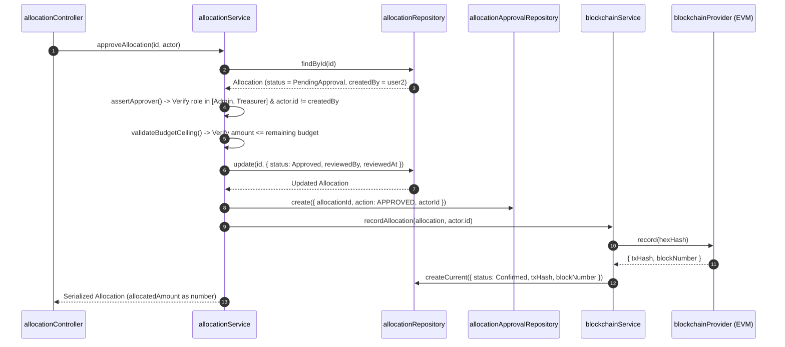
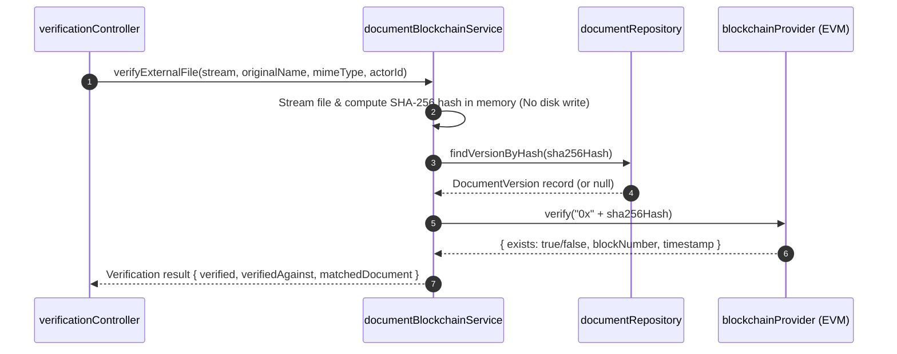

# Service Layer — BudgetChain Backend

> **Scope:** complete architecture and specification of the backend service layer (`apps/backend/services/*.js`), detailing business logic, responsibilities, cross-service dependencies, repository interactions, and domain invariants.  
> **Source of truth:** the implementation in `apps/backend/services/`.

---

## 1. Overview & Architectural Role

The service layer is the **central domain engine** of the BudgetChain backend. In accordance with the project's layered architecture (`routes → middleware → controllers → services → repositories → Prisma`), all business logic, validation invariants, state machine transitions, cross-module orchestration, and audit triggers are strictly encapsulated within services.

```
┌──────────────────────────────────────────────────────────────────────────┐
│                           Controller Layer                               │
│  (Thin HTTP adapters: extract request data, invoke service, send JSON)    │
└────────────────────────────────────┬─────────────────────────────────────┘
                                     │
                                     ▼
┌──────────────────────────────────────────────────────────────────────────┐
│                             Service Layer                                │
│                     (apps/backend/services/*.js)                         │
│                                                                          │
│  • Business Rules & Budget Ceilings    • Soft-Delete & Safety Invariants  │
│  • Sequential Code Generation          • Cryptographic Hashing           │
│  • State Machine Transitions           • Fail-Soft Blockchain Anchoring  │
│  • Audit Logging & Telemetry           • Data Normalization (Decimal->num)│
└──────────┬─────────────────────────┬─────────────────────────┬───────────┘
           │                         │                         │
           ▼                         ▼                         ▼
┌─────────────────────┐   ┌─────────────────────┐   ┌─────────────────────┐
│ Repositories Layer  │   │  Blockchain Provider│   │   Storage Driver    │
│(Prisma ORM Queries) │   │ (ethers v6 / EVM)   │   │  (Local Disk / FS)  │
└─────────────────────┘   └─────────────────────┘   └─────────────────────┘
```

### Core Design Principles
1. **Controller Thinness**: Controllers perform no business decisions or raw database queries; they delegate completely to services (`apps/backend/controllers/`).
2. **Domain Invariants**: Rules such as budget ceiling validation, separation of duties, single active fiscal year enforcement, and versioning caps live exclusively in services.
3. **Data Serialization**: Prisma returns `Decimal` types for money and `BigInt` for block numbers. Services convert these via `toNumber()` (`utils/amountUtils.js:7`) before returning objects to controllers.
4. **Fail-Soft Blockchain Integration**: On-chain anchoring failures (network outages, unconfigured nodes) do not roll back database operations. Services record `Pending` or `Failed` status and delegate retry to the `blockchainScheduler`.
5. **Audit Logging Integration**: Critical business state modifications emit structured audit logs (`auditLogger.logSuccess` / `logFailure`) directly from services or controllers.

---

## 2. Service Inventory & Dependencies

The system comprises **18 service modules** located in `apps/backend/services/`:

| Service | Primary Concern | Repository Dependencies | Cross-Service Dependencies |
|---------|-----------------|-------------------------|----------------------------|
| `allocationService.js` | Allocation CRUD, workflow state machine, budget ceiling checks, approvals | `allocationRepository`, `allocationApprovalRepository`, `fiscalYearRepository`, `departmentRepository`, `fundSourceRepository`, `budgetCategoryRepository`, `budgetProgramRepository` | `blockchainService` |
| `blockchainService.js` | Allocation ledger anchoring, content hashing, transaction history, verification | `blockchainRepository`, `allocationRepository` | `blockchainProvider` (config) |
| `documentService.js` | Document upload, replacement, versioning, stream downloads, archiving | `documentRepository` | `documentStorageService`, `documentBlockchainService` |
| `documentBlockchainService.js` | Document version EVM anchoring, verification, zero-storage external file verification | `documentRepository` | `blockchainProvider` (config) |
| `documentStorageService.js` | Storage driver abstraction (Local FS vs S3 placeholder), path traversal checks | None | None |
| `authService.js` | User authentication, token signing/verification, token rotation, logout revocation | `userRepository`, `refreshTokenRepository` | `utils/jwt.js`, `utils/password.js` |
| `userService.js` | User management, password hashing, role & status updates | `userRepository` | `utils/password.js` |
| `auditLogService.js` | Audit log querying, filtering, statistics, CSV/JSON export formatting | `auditLogRepository` | None |
| `auditEventBlockchainService.js` | Audit event EVM ledger anchoring on `AuditLedger.sol`, event verification | `auditLogRepository` | `blockchainProvider` (config) |
| `blockchainHistoryService.js` | Read-time aggregation of on-chain record anchors across Allocations, Documents, and Audits | `blockchainRepository`, `documentRepository`, `auditLogRepository` | None |
| `blockchainScheduler.js` | Background 60-second retry loop for pending/failed EVM anchors | `blockchainRepository`, `documentRepository`, `auditLogRepository` | `blockchainService`, `documentBlockchainService`, `auditEventBlockchainService` |
| `dashboardService.js` | Summary metrics aggregation across fiscal years, allocations, departments, and ledgers | `fiscalYearRepository`, `allocationRepository`, `departmentRepository`, `auditLogRepository`, `blockchainRepository` | `blockchainProvider` (config) |
| `fiscalYearService.js` | Fiscal year lifecycle, budget ceiling setup, single active year enforcement | `fiscalYearRepository` | None |
| `departmentService.js` | Department master data CRUD, active status checks | `departmentRepository` | None |
| `budgetCategoryService.js` | Budget category master data CRUD, active status checks | `budgetCategoryRepository` | None |
| `budgetProgramService.js` | Budget program master data CRUD, department/category linkage checks | `budgetProgramRepository`, `departmentRepository`, `budgetCategoryRepository` | None |
| `fundSourceService.js` | Fund source master data CRUD, active status checks | `fundSourceRepository` | None |
| `timelineService.js` | Unified activity timeline merging approvals, document changes, and audit logs | `allocationApprovalRepository`, `documentActivityRepository`, `auditLogRepository` | None |

---

## 3. Core Domain Services

### 3.1 Allocation Service (`allocationService.js`)
Handles the financial allocation lifecycle, sequential code generation, budget ceiling enforcement, and multi-step approval workflow.

- **Key Methods**:
  - `createAllocation(allocationData, userId)`: Validates positive amount, reference status (active fiscal year, department, fund source, category, program), enforces budget ceiling (`validateBudgetCeiling`), checks duplicate reference combinations, generates sequential code (`BA-<year>-<NNN>`), creates record as `Draft`.
  - `updateAllocation(id, updateData, actor)`: Allows editing **Draft** allocations only. Re-validates references and duplicate constraints if core dimensions change.
  - `deleteAllocation(id, actor)`: Soft-deletes allocation (`deletedAt = new Date()`). Blocks deletion of `Archived` allocations; restricts Budget Officers to deleting `Draft` allocations only.
  - `submitForApproval(id, actor)`: Transitions status `Draft -> PendingApproval`, stamps `submittedAt`.
  - `approveAllocation(id, actor)`: Enforces approver role (`Administrator` or `Treasurer`), enforces **Separation of Duties** (`createdBy !== actor.id`), re-validates budget ceiling, transitions status to `Approved`, stamps `reviewedBy`/`reviewedAt`, records approval history, and triggers `blockchainService.recordAllocation()`.
  - `rejectAllocation(id, actor, reason)`: Enforces approver role and non-creator constraint, requires non-empty `reason`, transitions status to `Rejected`, records approval entry.
  - `returnToDraft(id, actor, comment)`: Allows approver (or creator if status is `Rejected`) to return allocation to `Draft` for revision.
  - `getRemainingBudget(filters)`: Calculates `Total Budget - Sum(Approved Allocations)`. Draft and PendingApproval allocations do not commit budget; Rejected, Archived, and soft-deleted allocations are excluded.

- **Invariants Enforced**:
  - **Budget Ceiling**: `Sum(Approved Allocations) + Requested Amount <= FiscalYear.budgetAmount` (`allocationService.js:769`).
  - **Separation of Duties**: Creator cannot approve or reject their own allocation (`allocationService.js:431`).
  - **Sequential Code**: Format `BA-YYYY-NNN` derived from fiscal year start date (`allocationService.js:821`).

---

### 3.2 Document Service (`documentService.js`)
Manages physical file uploads, versioning, metadata storage, document access, and archiving.

- **Key Methods**:
  - `createDocument(fileData, metaData, actor)`: Stores uploaded file stream via `documentStorageService`, computes SHA-256 hash in the same pass, generates unique code (`DOC-YYYY-NNN`), creates `ManagedDocument` and `DocumentVersion` (version 1), triggers `documentBlockchainService.anchorDocumentVersion()`, and logs `UPLOADED` activity.
  - `replaceDocument(documentId, fileData, actor)`: Stores new stream, verifies file SHA-256 against previous versions (rejects byte-identical replacements), checks maximum version cap (`MAX_DOCUMENT_VERSIONS`, default 50), increments `versionNumber`, sets new version as current, anchors on ledger, and logs `REPLACED` activity.
  - `downloadDocumentVersion(versionId, actor)` / `previewDocumentVersion(versionId, actor)`: Opens read stream from storage driver. Preview checks allowed MIME types (PDF, PNG, JPEG).
  - `archiveDocument(documentId, actor)`: Marks document status as `Archived`. Preserves all physical files and versions for evidentiary compliance.

---

### 3.3 Auth Service (`authService.js`)
Handles credential verification, JWT token issuance, token rotation, and session invalidation.

- **Key Methods**:
  - `login(email, password)`: Fetches user by email, verifies status is `Active`, checks bcrypt hash, issues 15-minute JWT access token and 7-day refresh token string, persists refresh token in DB, strips password from user profile output.
  - `refreshToken(refreshTokenString)`: Validates refresh token in DB (unrevoked, unexpired, user active), **revokes old token** (token rotation), issues a fresh access token and new refresh token pair.
  - `logout(userId, refreshTokenString)`: Revokes specific refresh token and/or all active refresh tokens for the user in DB (`refreshTokenRepository.revokeAllUserTokens`).
  - `getCurrentUserProfile(userId)`: Returns fresh profile from DB excluding password.

---

### 3.4 User Service (`userService.js`)
Provides user account administration for Administrators.

- **Key Methods**:
  - `createUser(userData)`: Validates email uniqueness, hashes password with `bcryptjs` (10 rounds), assigns role (`Administrator`, `Treasurer`, `BudgetOfficer`, `Auditor`), sets default status `Active`.
  - `updateUser(id, updateData)`: Updates profile information, handles optional password updates, checks email uniqueness.
  - `deleteUser(id)`: Soft-deletes or removes user record after verifying user exists.
  - `setUserStatus(id, status)`: Toggles user status (`Active` / `Inactive`). Deactivating a user immediately revokes API access via middleware re-validation.

---

## 4. Blockchain & Anchoring Services

### 4.1 Blockchain Service (`blockchainService.js`)
Anchors allocation content hashes onto the `BudgetLedger.sol` contract.

- **Key Methods**:
  - `recordAllocation(allocation, actor)`: Computes canonical SHA-256 hash over meaning-changing allocation fields (`computeAllocationContentHash`). If an existing `Confirmed` record exists, returns it; if `Pending`/`Failed`, retries. Otherwise, submits transaction `anchorUnlessExists(hash)` to EVM. Updates database record to `Confirmed` with `txHash` and `blockNumber`. Fail-soft.
  - `verifyAllocation(allocationId, actor)`: Recomputes content hash from DB row, compares with stored hash (`integrityOk`), queries on-chain contract (`onChain.exists`). Reports `verified`, `integrityOk`, `onChain`, or `inconclusive` (when node is unreachable).
  - `retryRecord(allocationId, actor)`: Re-attempts EVM transaction for `Pending` or `Failed` records.

---

### 4.2 Document Blockchain Service (`documentBlockchainService.js`)
Anchors document version hashes and performs zero-storage verification of external files.

- **Key Methods**:
  - `anchorDocumentVersion(version, document, actorId)`: Anchors SHA-256 hash of document version on `BudgetLedger.sol`.
  - `verifyExternalFile(stream, originalName, mimeType, actorId)`: Streams an uploaded external file, computes SHA-256 hash in memory, checks against DB `DocumentVersion` records and on-chain `BudgetLedger` contract. **File is never saved to disk**. Reports `verifiedAgainst: 'blockchain' | 'database' | 'none'`.

---

### 4.3 Audit Event Blockchain Service (`auditEventBlockchainService.js`)
Anchors security audit log event hashes on `AuditLedger.sol`.

- **Key Methods**:
  - `anchorAuditEvent(auditLog, actorId)`: Constructs SHA-256 hash of audit event parameters, submits `recordEvent` to `AuditLedger.sol`, updates `audit_logs` record with `anchorStatus = Confirmed`, `txHash`, and `blockNumber`.

---

### 4.4 Unified History & Background Scheduler

- **Blockchain History Service (`blockchainHistoryService.js`)**:
  - `getUnifiedLedgerHistory(filters, pagination, ordering)`: Merges allocation anchors (`BlockchainRecord`), document version anchors (`DocumentVersion`), and audit event anchors (`AuditLog`) into a single chronologically sorted, paginated feed.

- **Blockchain Scheduler (`blockchainScheduler.js`)**:
  - Runs every **60 seconds** (`server.js`).
  - `runRetryCycle()`: Queries `Pending` or `Failed` records across allocations, document versions, and audit logs, re-submitting transactions to the EVM node. Ensures eventual consistency after network recoveries.

---

## 5. Master Data & Utility Services

### 5.1 Master Data Management Services
- **`fiscalYearService.js`**: Enforces `budgetAmount > 0`, manages fiscal year dates, and guarantees that calling `activateFiscalYear(id)` deactivates all other fiscal years (`isActive = false`), maintaining a single active fiscal year.
- **`departmentService.js`**: Manages academic and administrative departments. Blocks deactivation if active budget programs reference the department.
- **`budgetCategoryService.js`**: Manages expenditure categories (e.g., Personnel Services, MOOE, Capital Outlay).
- **`budgetProgramService.js`**: Manages specific budget programs. Validates that referenced department and budget category exist and are active.
- **`fundSourceService.js`**: Manages funding sources (e.g., General Fund, Income, Grants).

---

### 5.2 Reporting & Analytics Services
- **`dashboardService.js`**: Aggregates high-level metrics for the executive dashboard: active fiscal year summary, total allocated vs remaining budget, pending approvals count, active departments count, recent audit logs, and EVM node sync health.
- **`timelineService.js`**: Aggregates `AllocationApproval`, `DocumentActivity`, and `AuditLog` entries into a unified chronological financial activity timeline for auditing.
- **`auditLogService.js`**: Provides administrative search, filtering, and export capabilities (JSON / CSV formats) for system audit trails.
- **`documentStorageService.js`**: Implements `LocalDocumentStorage` with path traversal prevention (`resolveKey`) and atomic stream-writing with inline SHA-256 calculation. Provides fail-fast `S3DocumentStorage` placeholder.

---

## 6. Key Workflows & Interaction Diagrams

### 6.1 Allocation Approval & On-Chain Anchoring



### 6.2 External File Zero-Storage Verification


