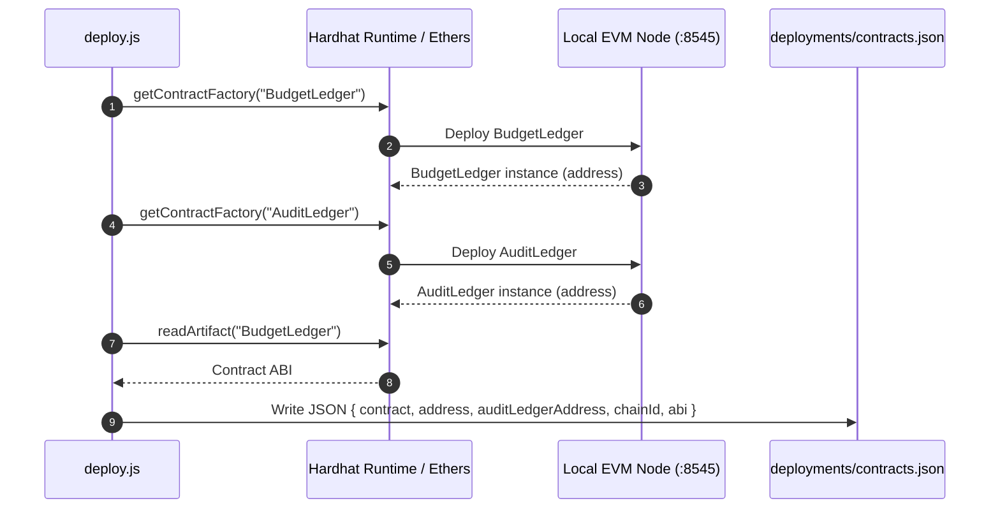
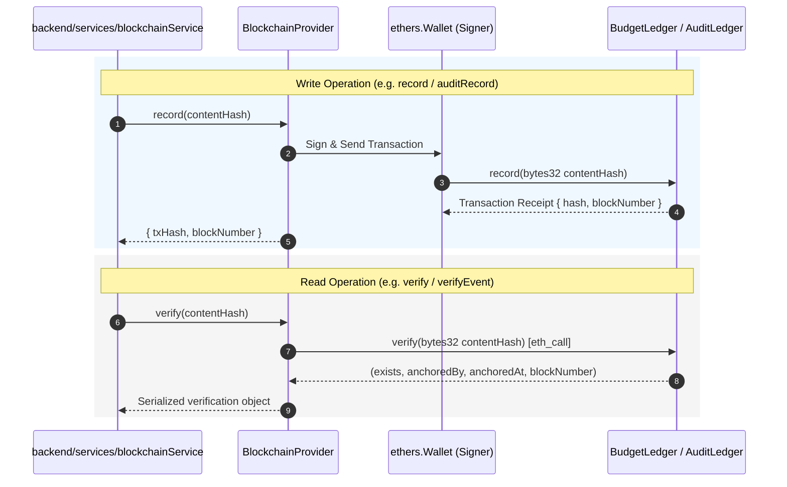

# Smart Contracts Reference — BudgetChain

> **Scope:** comprehensive technical reference for the Solidity smart contracts (`apps/contracts/contracts/*.js`), Hardhat build toolchain, deployment scripts, storage layout, access control, functions, events, custom errors, and interaction flows.  
> **Source of truth:** implementation in `apps/contracts/contracts/BudgetLedger.sol`, `apps/contracts/contracts/AuditLedger.sol`, `apps/contracts/hardhat.config.js`, `apps/contracts/scripts/deploy.js`, and unit test suites in `apps/contracts/test/`.

---

## 1. Overview & Architecture

BudgetChain utilizes **two standalone Solidity smart contracts** deployed on an EVM (Ethereum Virtual Machine) ledger to ensure tamper-evident records and auditability:

1. **`BudgetLedger.sol`**: An immutable registry for financial budget allocations and managed document file digests.
2. **`AuditLedger.sol`**: An immutable registry for security audit events, status transitions, and administrative actions.

```
┌──────────────────────────────────────────────────────────────────────────┐
│                         EVM Blockchain Ledger                            │
│                                                                          │
│   ┌────────────────────────────────┐  ┌──────────────────────────────┐   │
│   │        BudgetLedger.sol        │  │       AuditLedger.sol        │   │
│   ├────────────────────────────────┤  ├──────────────────────────────┤   │
│   │ • Allocation Content Hashes    │  │ • Security Audit Event Hashes│   │
│   │ • Document Version Hashes      │  │ • Action Categories          │   │
│   │ • Single-Owner Access Control  │  │ • Single-Owner Access Control│   │
│   └────────────────────────────────┘  └──────────────────────────────┘   │
└────────────────────────────────────▲─────────────────────────────────────┘
                                     │
                        ethers.js v6 (JSON-RPC)
                                     │
┌────────────────────────────────────┴─────────────────────────────────────┐
│                          Backend Services Layer                          │
│         (blockchainService, documentBlockchainService, etc.)             │
└──────────────────────────────────────────────────────────────────────────┘
```

---

## 2. Toolchain & Compiler Configuration

- **Solidity Version**: `^0.8.24`
- **Framework**: Hardhat 2.x (`@nomicfoundation/hardhat-toolbox`)
- **Optimizer Settings**: Enabled, `200` runs (`apps/contracts/hardhat.config.js:7-12`).
- **Target Network**: Local Hardhat Node (`http://127.0.0.1:8545`, Chain ID `31337`).

```javascript
// apps/contracts/hardhat.config.js
module.exports = {
  solidity: {
    version: '0.8.24',
    settings: {
      optimizer: {
        enabled: true,
        runs: 200,
      },
    },
  },
  networks: {
    localhost: {
      url: 'http://127.0.0.1:8545',
    },
  },
};
```

---

## 3. `BudgetLedger.sol` Contract Specification

- **File Path**: `apps/contracts/contracts/BudgetLedger.sol`
- **Purpose**: Holds immutable proof of budget allocation state and uploaded document version file digests.

### 3.1 Data Structures & Storage Layout

| Field / State Variable | Type | Visibility | Purpose |
|------------------------|------|------------|---------|
| `_owner` | `address` | `private` | Address of authorized contract deployer / backend signer key |
| `_records` | `mapping(bytes32 => Record)` | `private` | Maps SHA-256 content hashes to anchored `Record` structs |
| `_recordCount` | `uint256` | `private` | Cumulative count of anchored hashes |

```solidity
struct Record {
    bytes32 contentHash;  // 32-byte SHA-256 digest of allocation/document
    address anchoredBy;   // EVM address that submitted the anchor transaction
    uint256 anchoredAt;   // Block timestamp (block.timestamp)
    uint256 blockNumber;  // Block number (block.number)
}
```

### 3.2 Access Control & Safety Invariants
- **Owner-Only Mutations**: The `record()` function verifies `msg.sender == _owner`. Any non-owner address attempting to submit a record causes a revert with custom error `NotOwner()`.
- **Deduplication / Duplicate Rejection**: If `_records[contentHash].anchoredAt != 0`, the function reverts with custom error `HashAlreadyRecorded(contentHash)`.

### 3.3 Functions

#### Write Functions
```solidity
function record(bytes32 contentHash) external returns (uint256 recordIndex)
```
- **Access**: External, Owner Only (`NotOwner`).
- **Behavior**: Verifies non-duplicate hash (`HashAlreadyRecorded`), persists `Record` struct in `_records`, increments `_recordCount`, and emits event `Recorded`. Returns updated `recordCount`.

#### View / Read Functions
```solidity
function verify(bytes32 contentHash) external view returns (bool exists, address anchoredBy, uint256 anchoredAt, uint256 blockNumber)
```
- **Behavior**: Returns `(anchoredAt != 0, anchoredBy, anchoredAt, blockNumber)`. If hash is unanchored, `exists = false` and other fields are zeroed.

```solidity
function getRecord(bytes32 contentHash) external view returns (Record memory rec)
```
- **Behavior**: Returns the complete `Record` struct for the given `contentHash`.

```solidity
function recordCount() external view returns (uint256)
```
- **Behavior**: Returns total number of recorded hashes (`_recordCount`).

```solidity
function owner() external view returns (address)
```
- **Behavior**: Returns contract owner address (`_owner`).

### 3.4 Events & Custom Errors

```solidity
// Event
event Recorded(
    bytes32 indexed contentHash,
    address indexed anchoredBy,
    uint256 blockNumber,
    uint256 timestamp
);

// Custom Errors
error NotOwner();
error HashAlreadyRecorded(bytes32 contentHash);
```

---

## 4. `AuditLedger.sol` Contract Specification

- **File Path**: `apps/contracts/contracts/AuditLedger.sol`
- **Purpose**: Holds immutable proof of system security audit events and status changes.

### 4.1 Data Structures & Storage Layout

| Field / State Variable | Type | Visibility | Purpose |
|------------------------|------|------------|---------|
| `_owner` | `address` | `private` | Address of authorized contract deployer / backend signer key |
| `_events` | `mapping(bytes32 => AuditEvent)` | `private` | Maps SHA-256 event hashes to `AuditEvent` structs |
| `_categoryCounts` | `mapping(string => uint256)` | `private` | Tracks total anchored events per category |
| `_eventCount` | `uint256` | `private` | Total cumulative audit events recorded |

```solidity
struct AuditEvent {
    bytes32 eventHash;   // 32-byte SHA-256 digest of canonical audit event payload
    string category;     // Non-empty action category (e.g., "AUTH_LOGIN", "ALLOCATION_APPROVE")
    address anchoredBy;  // EVM address that submitted the anchor
    uint256 anchoredAt;  // Block timestamp
    uint256 blockNumber; // Block number
}
```

### 4.2 Access Control & Safety Invariants
- **Owner-Only Mutations**: `recordEvent()` requires `msg.sender == _owner`, reverting with `NotOwner()` on mismatch.
- **Category Validation**: Reverts with `InvalidCategory()` if `bytes(category).length == 0`.
- **Duplicate Prevention**: Reverts with `EventAlreadyRecorded(eventHash)` if `_events[eventHash].anchoredAt != 0`.

### 4.3 Functions

#### Write Functions
```solidity
function recordEvent(bytes32 eventHash, string calldata category) external returns (uint256 eventCountAfter)
```
- **Access**: External, Owner Only (`NotOwner`).
- **Behavior**: Enforces category non-emptiness and hash uniqueness. Increments `_categoryCounts[category]` and `_eventCount`. Stores `AuditEvent` struct and emits `EventRecorded`. Returns `_eventCount`.

#### View / Read Functions
```solidity
function verifyEvent(bytes32 eventHash) external view returns (bool exists, string memory category, address anchoredBy, uint256 anchoredAt, uint256 blockNumber)
```
- **Behavior**: Returns existence state and metadata for the given event hash.

```solidity
function getAuditEvent(bytes32 eventHash) external view returns (AuditEvent memory ev)
```
- **Behavior**: Returns the full `AuditEvent` struct.  
  *(Note: Named `getAuditEvent` instead of `getEvent` to avoid collision with ethers.js `Contract.getEvent` fragment lookup helper).*

```solidity
function eventCount(string calldata category) external view returns (uint256 count)
```
- **Behavior**: Returns the total number of events anchored under a specific category string.

```solidity
function totalEvents() external view returns (uint256)
```
- **Behavior**: Returns the total event count (`_eventCount`).

```solidity
function owner() external view returns (address)
```
- **Behavior**: Returns contract owner address.

### 4.4 Events & Custom Errors

```solidity
// Event
event EventRecorded(
    bytes32 indexed eventHash,
    string indexed category,
    address indexed anchoredBy,
    uint256 blockNumber,
    uint256 timestamp
);

// Custom Errors
error NotOwner();
error InvalidCategory();
error EventAlreadyRecorded(bytes32 eventHash);
```

---

## 5. Deployment & Artifact Generation Flow

When `npm run blockchain:deploy` is executed, `apps/contracts/scripts/deploy.js` performs contract compilation and deployment, writing contract addresses and ABI to `apps/contracts/deployments/contracts.json`:



### Generated Artifact Structure (`contracts.json`)
```json
{
  "contract": "BudgetLedger",
  "address": "0xe7f1725E7734CE288F8367e1Bb143E90bb3F0512",
  "auditLedgerAddress": "0x9fE46736679d2D9a65F0992F2272dE9f3c7fa6e0",
  "network": "localhost",
  "chainId": 31337,
  "deployedBy": "0xf39Fd6e51aad88F6F4ce6aB8827279cffFb92266",
  "deployedAt": "2026-08-05T17:52:13.824Z",
  "abi": [...]
}
```

---

## 6. Interaction Flow & Unit Testing

### 6.1 Backend Interaction Flow
Backend services interact with both contracts via `BlockchainProvider` (`apps/backend/config/blockchain.js`):



### 6.2 Unit Testing Coverage
Contract unit tests live in `apps/contracts/test/` and run via `npm run test --workspace=apps/contracts`:
- `BudgetLedger.test.js`: Verifies deployer ownership, owner-only authorization (`NotOwner`), event emission (`Recorded`), tamper detection, zero address returns for non-existent hashes, and duplicate rejection (`HashAlreadyRecorded`).
- `AuditLedger.test.js`: Verifies owner authorization, empty category rejection (`InvalidCategory`), event emission (`EventRecorded`), struct retrieval (`getAuditEvent`), duplicate rejection (`EventAlreadyRecorded`), and per-category counting (`eventCount`).
