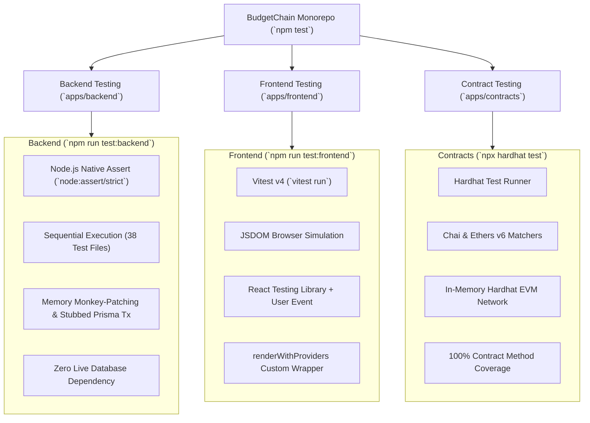
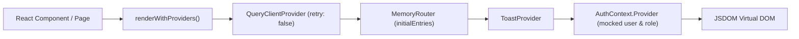

# System Testing Strategy & Test Reference — BudgetChain

> **Scope:** comprehensive technical reference for test architecture, test runners, assertion frameworks, mock strategies, unit tests, integration tests, manual verification procedures, test coverage metrics, test environments, and recommendations across the BudgetChain monorepo.  
> **Source of truth:** the implementation (`package.json`, `apps/backend/package.json`, `apps/backend/tests/*`, `apps/frontend/package.json`, `apps/frontend/vitest.config.ts`, `apps/frontend/src/test/*`, `apps/contracts/package.json`, `apps/contracts/hardhat.config.js`, `apps/contracts/test/*`).

---

## 1. Overall Testing Strategy

BudgetChain employs a **multi-tier, 3-domain testing strategy** tailored to the unique architectural needs of its three core workspaces:



### Core Principles
1. **Zero Database Dependency for Backend Unit Tests:** Backend tests mock repository and Prisma client methods in memory (`resetMocks()`), requiring no active MySQL database server to run.
2. **Component & Hook Isolation for Frontend Tests:** Frontend tests use Vitest and React Testing Library wrapped in a custom provider (`renderWithProviders`), stubbing network calls via `vi.spyOn` over hook modules.
3. **In-Memory EVM Execution for Contracts:** Smart contract tests run on Hardhat's in-memory EVM, validating deployment, access control (`NotOwner`), event emission, and error handling without external network dependencies.
4. **Audit Logging Suppression:** Unit tests load `disableAuditPersistence()` to disable background audit persistence and keep test runs clean and deterministic.

---

## 2. Workspace Testing Implementations

### 2.1 Backend Testing (`apps/backend`)

The backend testing suite consists of **38 individual test files** executed sequentially by standard Node.js without an external test runner framework.

- **Command:** `npm run test:backend` (invokes `node tests/testAuthLogic.js && node tests/testRateLimiter.js && ...` from `apps/backend/package.json:14`).
- **Assertion Library:** `node:assert/strict`.
- **Mocking & Isolation Pattern:**
  - Tests maintain a `repositoryMethods` dictionary and restore original methods before each test via `resetMocks()`.
  - Transaction methods (`prisma.$transaction`) are monkey-patched with synchronous or stubbed async callbacks.
  - Audit logging persistence is disabled in tests via `disableAuditPersistence()` in `tests/auditTestConfig.js`.

#### Backend Test Suite Inventory

| Test File Path | Target Subsystem / Module | Key Scenarios Covered |
|----------------|---------------------------|-----------------------|
| `tests/authService.test.js` | Authentication Service | Login, token generation, refresh token rotation, password hashing. |
| `tests/authMiddleware.test.js` | Auth & RBAC Middleware | JWT verification, expired token rejection, role-based access control (`authorize`). |
| `tests/userService.test.js` | User Management Service | User creation, role changes, status toggling, last-admin protection, self-deletion guard. |
| `tests/allocationService.test.js` | Budget Allocations | Sequential code generation (`BA-YYYY-XXX`), 5-tuple uniqueness, budget ceiling enforcement, self-approval prevention. |
| `tests/documentService.test.js` | Document Management | Upload, version bumping (up to 50 versions), replacement duplicate rejection, format-restricted preview. |
| `tests/documentStorageService.test.js` | Local File Storage | Path traversal defense (`resolveKey`), single-pass stream hashing, blob cleanup. |
| `tests/uploadMiddleware.test.js` | File Upload & Inspection | Magic-byte MIME sniffing (`sniffMimeType`), extension matching, size limit enforcement (413/415). |
| `tests/externalVerification.test.js` | Zero-Storage Verification | In-memory stream hashing, database lookup, on-chain ledger confirmation without disk storage. |
| `tests/blockchainService.test.js` | Ledger Anchoring | Fail-soft anchoring, duplicate hash prevention (`anchorUnlessExists`), block receipt serialization. |
| `tests/auditLogService.test.js` | Audit Log Subsystem | Query filtering, BigInt serialization, parameter redaction (`[REDACTED]`), summary statistics. |
| `tests/timelineService.test.js` | Activity Timeline | Multi-source read-time union (`allocation_approvals`, `document_activities`, `audit_logs`, `blockchain_records`), in-memory pagination. |
| `tests/dashboardService.test.js` | Dashboard & Analytics | Parallel database aggregations, chart data formatting, dynamic notification alerts. |

---

### 2.2 Frontend Testing (`apps/frontend`)

The frontend test suite uses **Vitest v4** and **React Testing Library** running inside a simulated **JSDOM** environment.

- **Command:** `npm run test:frontend` (invokes `vitest run` from `apps/frontend/package.json:11`).
- **Configuration:** `apps/frontend/vitest.config.ts`.
- **Browser Setup & Polyfills:** `apps/frontend/src/test/setup.ts` polyfills `window.matchMedia`, `ResizeObserverMock`, `PointerEvent` methods (`hasPointerCapture`, `setPointerCapture`), and `getBoundingClientRect`.
- **Custom Render Wrapper:** `renderWithProviders` in `apps/frontend/src/test/test-utils.tsx` automatically wraps components with:
  - `QueryClientProvider` (with `retry: false`, `staleTime: 0`)
  - `MemoryRouter` (accepting `routerInitialEntries`)
  - `ToastProvider`
  - `AuthContext.Provider` (accepting `authValue` overrides)

#### Frontend Test Summary

- **Total Test Files:** 22 passed (22)
- **Total Tests:** 174 passed (174)
- **Execution Time:** ~29 seconds



---

### 2.3 Smart Contract Testing (`apps/contracts`)

Smart contracts are tested using **Hardhat**, **Mocha**, **Chai**, and **Ethers v6**.

- **Command:** `npx hardhat test` or `npm run test --workspace=apps/contracts`.
- **Environment:** Local in-memory Hardhat EVM network.
- **Contracts Tested:**
  - `BudgetLedger.sol` ([`apps/contracts/test/BudgetLedger.test.js`](file:///d:/Ramisys%20files/Projects/capstone/apps/contracts/test/BudgetLedger.test.js))
  - `AuditLedger.sol` ([`apps/contracts/test/AuditLedger.test.js`](file:///d:/Ramisys%20files/Projects/capstone/apps/contracts/test/AuditLedger.test.js))

#### Contract Scenarios Tested
- **Ownership Verification:** Deployer is correctly assigned as contract `owner`.
- **Access Control Enforcement:** Reverting with `NotOwner` custom error when non-owner accounts attempt to call `record()` or `recordEvent()`.
- **Event Emission & Argument Integrity:** Verifying `Recorded` and `EventRecorded` log events match exact `contentHash`, `category`, `blockNumber`, and `timestamp` values.
- **Duplicate Prevention:** Ensuring duplicate hashes revert with `HashAlreadyRecorded` or `EventAlreadyRecorded`.
- **Input Validation:** Ensuring empty category strings revert with `InvalidCategory`.

---

## 3. Manual Testing Procedures

In addition to automated unit and integration suites, developers can manually verify system workflows using local dev servers and seed data.

### 3.1 Local Environment Setup & Seed Users

1. **Start Local Database & Backend:**
   ```bash
   cd apps/backend
   npx prisma migrate dev
   npm run seed
   npm run dev
   ```
2. **Start Frontend Dev Server:**
   ```bash
   npm run dev:frontend
   ```

#### Seed Credentials ([`apps/backend/prisma/seed.js`](file:///d:/Ramisys%20files/Projects/capstone/apps/backend/prisma/seed.js))

| Institutional Role | Email Address | Password | Privileges |
|--------------------|---------------|----------|------------|
| **Administrator** | `admin@university.edu` | `AdminPassword123!` | Full administrative access, user management, system overrides. |
| **Budget Officer** | `budgetofficer@university.edu` | `BudgetOfficer123!` | Create, edit, submit allocation proposals & upload documents. |
| **Treasurer** | `treasurer@university.edu` | `Treasurer123!` | Review, approve, reject allocation proposals; upload documents. |
| **Auditor** | `auditor@university.edu` | `Auditor123!` | Read-only access to allocations, documents, blockchain ledgers, & audit logs. |

### 3.2 Key Manual Verification Flows

1. **Authentication & Session Rotation:**
   - Log in as `budgetofficer@university.edu`. Verify JWT `accessToken` and `refreshToken` stored in `localStorage`.
   - Wait for token expiration or trigger refresh via `/api/auth/refresh-token`.
2. **Budget Allocation & Self-Approval Prevention:**
   - Create a new allocation as `budgetofficer@university.edu` (`BA-2026-001`). Submit for approval.
   - Attempt to approve as `budgetofficer@university.edu` → Expect UI button hidden & API `403 Forbidden` (*"Users cannot review their own allocations"*).
   - Log in as `treasurer@university.edu` and approve → Expect status `Approved` and fail-soft on-chain anchor attempt.
3. **Document Upload & Magic-Byte Verification:**
   - Navigate to `/documents/upload`. Upload a valid PDF file.
   - Rename an `.exe` or `.txt` file to `.pdf` and attempt upload → Expect rejection with `415 Unsupported Media Type` (*"The file extension does not match its actual content"*).
   - Navigate to `/verification` and drop any file → Expect zero-storage stream verification against database and blockchain hashes.
4. **Hardhat Blockchain Node & Re-Anchoring:**
   - In a terminal, run `npm run blockchain:node` and `npm run blockchain:deploy`.
   - Navigate to `/budget-allocation/blockchain` or `/audit`. Trigger manual retry on a `Pending` or `Failed` record → Expect status update to `Confirmed` with live `txHash` and `blockNumber`.

---

## 4. Test Environments & Tooling Inventory

| Workspace | Component | Tool / Library | Role / Purpose |
|-----------|-----------|----------------|----------------|
| **`apps/backend`** | Test Runner | Standard Node.js (`node`) | Executes ESM test scripts sequentially without external runners. |
| **`apps/backend`** | Assertions | `node:assert/strict` | Built-in Node.js strict assertion module. |
| **`apps/backend`** | Mocking | Custom `resetMocks()` Monkey-Patching | In-memory replacement of Prisma repository & provider methods. |
| **`apps/frontend`** | Test Runner | Vitest v4 (`vitest`) | Vite-native unit and component test runner. |
| **`apps/frontend`** | DOM Simulation | `jsdom` | Virtual browser DOM implementation. |
| **`apps/frontend`** | Component Testing | `@testing-library/react` | React component rendering and interaction testing. |
| **`apps/frontend`** | User Interactions | `@testing-library/user-event` | Real user event simulation (clicks, typing, file drops). |
| **`apps/contracts`** | Test Runner | Hardhat Test Runner | Solidity compiler and EVM test orchestrator. |
| **`apps/contracts`** | Assertions | Chai & `@nomicfoundation/hardhat-toolbox` | Contract waffle matchers (`to.emit()`, `revertedWithCustomError`). |

---

## 5. Critical Test Scenarios & Edge Cases

1. **Self-Approval Prevention:** Ensures `allocationService.assertApprover` blocks allocation creators from approving or rejecting their own proposals (`existing.createdBy !== actor.id`).
2. **Sequential Code Race-Condition Isolation:** Verifies `createWithSequentialCode` and `createDocumentWithVersion` execute within serializable Prisma transactions (`Prisma.TransactionIsolationLevel.Serializable`) to prevent duplicate codes during concurrent creation.
3. **Magic-Byte Sniffing & Extension Match:** Validates that `validateUploadFile` sniffs true MIME types from magic bytes (`sniffMimeType`) and rejects mismatched extensions with `415`.
4. **Zero-Storage External Verification:** Ensures `verifyExternalFile` streams inbound files in memory without saving them to disk, returning accurate verification metadata.
5. **Fail-Soft Blockchain Anchoring:** Confirms that RPC node failures or unconfigured contract addresses leave database records in `Pending` or `Failed` status without aborting underlying financial or document transactions.
6. **Last-Admin Protection & Self-Deletion Guard:** Verifies `userService.deleteUser` blocks admin deletion if only one active admin remains or if an admin attempts to delete their own account.

---

## 6. Known Testing Limitations & Discrepancies

1. **Lack of Automated End-to-End (E2E) Browser Testing:** There is currently no Playwright or Cypress suite for multi-browser end-to-end user journey automation.
2. **Hardcoded Backend Test Script Chain:** Backend tests are listed in a long hardcoded string in `apps/backend/package.json:14`. Adding a new backend test file requires manually editing `package.json`.
3. **Lenient Frontend TypeScript Configuration:** `apps/frontend/tsconfig.json` specifies `strict: false` and `allowJs: true`, allowing minor type discrepancies in test mocks to pass compilation.
4. **Unused Vitest Path Alias:** `vitest.config.ts` defines `@/` mapping to `./src`, but production frontend imports use relative paths per repository rules (`AGENTS.md`).

---

## 7. Recommendations for Improving Test Coverage

1. **Adopt Vitest or Node Test Runner for Backend:** Replace the hardcoded `npm run test:backend` string with a test runner supporting glob patterns (`tests/**/*.test.js`), parallel execution, and automated code coverage (`vitest run --coverage`).
2. **Implement Playwright E2E Integration Suite:** Add Playwright to test critical browser flows (User Login → Create Allocation → Submit → Approve → Upload Voucher → Verify File).
3. **Automate Smart Contract Deployment Smoke Tests:** Incorporate `npm run smoke` into the primary CI pipeline to verify local Hardhat node contract deployments automatically.
