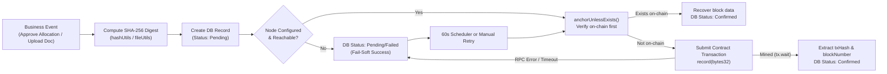
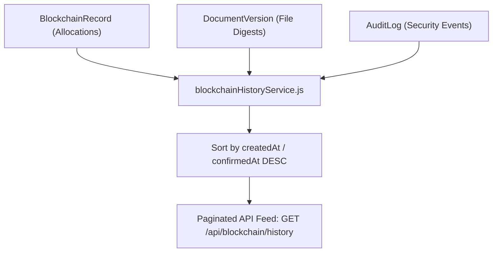
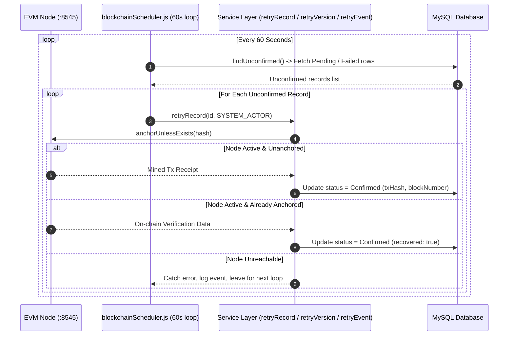

# Blockchain Transaction Lifecycle & Recovery — BudgetChain

> **Scope:** comprehensive technical reference for EVM transaction lifecycles, transaction submission via ethers v6, block receipts and confirmation, failure modes, fail-soft patterns, and automatic/manual recovery mechanisms in BudgetChain.  
> **Source of truth:** implementation in `apps/backend/config/blockchain.js`, `apps/backend/services/blockchainService.js`, `apps/backend/services/documentBlockchainService.js`, `apps/backend/services/auditEventBlockchainService.js`, `apps/backend/services/blockchainScheduler.js`, and `apps/contracts/contracts/`.

---

## 1. Overview & Architectural Design

In BudgetChain, **blockchain transactions** are write operations submitted by the backend service layer to anchor SHA-256 digests on `BudgetLedger.sol` or `AuditLedger.sol`.



### Key Transaction Metrics & State Fields

| Field | Database Model | Description |
|-------|----------------|-------------|
| `status` / `blockchainStatus` | `BlockchainRecord`, `DocumentVersion`, `AuditLog` | State enum: `Pending`, `Confirmed`, `Failed` |
| `txHash` | `BlockchainRecord`, `DocumentVersion`, `AuditLog` | 66-character 0x-prefixed EVM transaction hash (`@unique` index) |
| `blockNumber` | `BlockchainRecord`, `DocumentVersion`, `AuditLog` | Mined EVM block height (`BigInt` in MySQL -> `number` in API) |
| `confirmedAt` | `BlockchainRecord`, `DocumentVersion`, `AuditLog` | ISO timestamp when transaction inclusion was confirmed |
| `network` | `BlockchainRecord`, `DocumentVersion`, `AuditLog` | Targeted network label (e.g. `localhost`, `sepolia`) |

---

## 2. The 5-Stage Transaction Lifecycle

### Stage 1: Trigger & Hash Generation
When a financial allocation is approved, a document version uploaded/replaced, or a security audit log written:
- Canonical SHA-256 hash digest is generated (`computeAllocationContentHash`, `hashStream`, or `computeEventHash`).
- The payload is formatted as a 64-character hexadecimal string.

### Stage 2: Database State Initialization
Before invoking the EVM node, a mirror database record is created or updated:
- Allocations: `blockchainRepository.createCurrent()` stores initial `status = PENDING`.
- Document Versions: Created with `blockchainStatus = PENDING`.
- Audit Logs: Created with `anchorStatus = Pending`.

### Stage 3: Verification-Before-Submission (`anchorUnlessExists`)
To prevent contract reverts during recovery scenarios (where an on-chain transaction succeeded previously but the database update failed), the service executes `anchorUnlessExists(hash)` (`apps/backend/services/blockchainService.js:337`):
- Queries `contract.verify("0x" + hash)`.
- If `exists == true`: Reads `blockNumber` and timestamp from the ledger, sets `recovered = true`, and skips broadcasting a duplicate transaction.

### Stage 4: EVM Broadcast & Mining (`tx.wait()`)
If the hash is absent on-chain:
- Converts hex hash to `0x`-prefixed 32-byte format (`bytes32`).
- Submits contract function via `ethers.js v6` `Wallet`: `contract.record(hexHash)` or `contract.recordEvent(hexHash, category)`.
- Awaits receipt confirmation via `await tx.wait()`.
- Extracts `receipt.hash` (`txHash`) and `receipt.blockNumber`.

### Stage 5: Database Finalization & Mirror Confirmation
Upon receipt confirmation:
- Updates database mirror status to `Confirmed`.
- Saves `txHash`, `blockNumber`, and `confirmedAt = new Date()`.
- Writes audit log (`AUDIT_ACTIONS.BLOCKCHAIN_RECORD` / `DOCUMENT_ANCHOR_RETRY` / `AUDIT_LOG_ANCHOR_RETRY`).

---

## 3. Transaction Submission Architecture

### 3.1 Signer & Provider Setup
Transactions are constructed and signed by `BlockchainProvider` (`apps/backend/config/blockchain.js:151`):

```javascript
// Shared JsonRpcProvider and Wallet
const fetchReq = new ethers.FetchRequest(config.blockchain.rpcUrl);
if (config.blockchain.rpcTimeoutMs) {
  fetchReq.timeout = config.blockchain.rpcTimeoutMs;
}
const provider = new ethers.JsonRpcProvider(fetchReq, config.blockchain.chainId);
const signer = new ethers.Wallet(config.blockchain.privateKey, provider);
```

### 3.2 Nonce & Gas Management
- Ethers.js manages nonces sequentially per account address (`signer.getAddress()`).
- Gas limit and gas price estimation are computed automatically by Hardhat / ethers RPC middleware before broadcasting `eth_sendRawTransaction`.

### 3.3 Fail-Soft Guarding
Transaction execution is wrapped in try/catch blocks within service layers. If `tx.wait()` fails or throws an RPC error:
- The error is logged to stdout/system log.
- Database status is set to `Failed` (or left `Pending`).
- **The core HTTP request finishes successfully with HTTP 200/201**, ensuring primary application availability is unaffected by blockchain outages.

---

## 4. Confirmation, Explorer Links & History

### 4.1 Block Confirmations
- Local Hardhat Devnet: Transactions confirm instantaneously (`blockNumber` increments by 1 per tx).
- Block explorer URL generation: `getExplorerTxUrl(txHash)` appends `txHash` to `config.blockchain.explorerUrl` (e.g., `http://localhost:8545/tx/0x...`).

### 4.2 Unified Ledger History
`blockchainHistoryService.getUnifiedLedgerHistory()` (`apps/backend/services/blockchainHistoryService.js`) provides a single paginated API feed (`GET /api/blockchain/history`) that merges transaction anchors across three distinct entity types:



---

## 5. Failure Modes & Causes

| Failure Scenario | Root Cause | System Status Result | Recovery Path |
|------------------|------------|----------------------|---------------|
| **RPC Endpoint Down** | Node offline, port blocked, invalid `BLOCKCHAIN_RPC_URL` | Status set to `Failed` or `Pending` | Fail-soft API success; 60s background scheduler retries when node comes online |
| **Missing Signer Key** | `BLOCKCHAIN_PRIVATE_KEY` not configured in `.env` | Status stays `Pending` | Admin sets `.env` key; manually retries or waits for scheduler |
| **Contract Revert (`HashAlreadyRecorded`)** | Re-submitting hash without pre-checking | Handled by `anchorUnlessExists()` | Pre-check catches on-chain record and marks `Confirmed` from chain data |
| **Database Disconnection Post-Tx** | Transaction mined on-chain, but MySQL connection failed during mirror update | Database status remains `Pending`/`Failed` | `anchorUnlessExists()` reads existing on-chain data during next retry pass |
| **Out of Gas / Transaction Dropped** | Insufficient wallet funds or network congestion | Status set to `Failed` | Wallet re-funded; transaction re-submitted via retry endpoint |

---

## 6. Recovery & Reconciliation Mechanisms

BudgetChain includes **three complementary recovery mechanisms** to guarantee eventual consistency between MySQL and the blockchain ledger.



### 6.1 Recovery Mechanism 1: `anchorUnlessExists()`
Executed automatically on every initial or retry transaction attempt. Queries `verify(hash)` prior to submitting a transaction:
- Prevents duplicate gas spend.
- Resolves crash-window discrepancies where on-chain state exists but database mirror missed the update.

---

### 6.2 Recovery Mechanism 2: Manual Admin Retry Endpoints
Administrators, Treasurers, and Auditors can trigger manual re-anchoring from the UI or API:

| Endpoint | Target Entity | Service Method |
|----------|---------------|----------------|
| `POST /api/blockchain/allocations/:id/retry` | Budget Allocation | `blockchainService.retryRecord` |
| `POST /api/documents/:id/retry?version=N` | Document Version | `documentBlockchainService.retryDocumentVersion` |
| `POST /api/audit-logs/:id/retry` | Audit Event | `auditEventBlockchainService.retryAuditEventAnchor` |

---

### 6.3 Recovery Mechanism 3: Automated Background Scheduler
- **Service**: `blockchainScheduler` (`apps/backend/services/blockchainScheduler.js`)
- **Interval**: Fixed **60-second loop** (`start(60000)` initialized in `server.js:45`).
- **Behavior**:
  1. Checks `blockchainProvider.isConfigured()`.
  2. Acquires concurrency lock (`isProcessing = true`) to prevent overlapping execution passes.
  3. Queries `findUnconfirmed()` across `blockchain_records`, `document_versions`, and `audit_logs`.
  4. Iterates through pending/failed items, executing `retryRecord`, `retryVersion`, and `retryEvent` using `SYSTEM_ACTOR` credentials (`system-scheduler@university.edu`).
  5. Catches per-item exceptions so an error on one record does not abort the remaining reconciliation batch.
