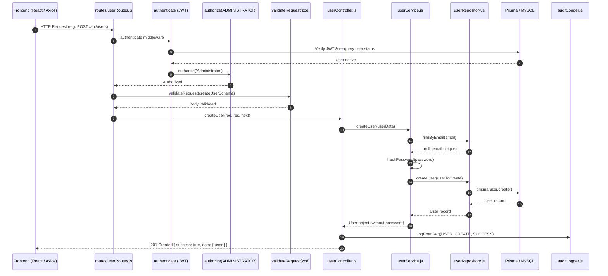
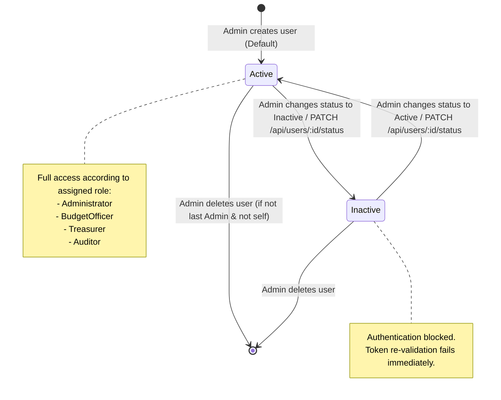

# User Management — BudgetChain

> **Scope:** complete technical reference for identity, user administration, role assignment, status lifecycles, business safety constraints, database persistence, and REST APIs in BudgetChain.  
> **Source of truth:** the implementation (`apps/backend/routes/userRoutes.js`, `apps/backend/controllers/userController.js`, `apps/backend/services/userService.js`, `apps/backend/repositories/userRepository.js`, `apps/backend/validators/userValidator.js`, `apps/backend/prisma/schema.prisma`, `apps/frontend/src/components/user/`).

---

## 1. Purpose

The **User Management** module governs user accounts, credential storage, role assignments, and account status across the BudgetChain platform. It provides Administrator-only administration of user profiles while providing identity backing for authentication, authorization (RBAC), and audit log attribution.

Key responsibilities:
- **Identity & Account Lifecycle:** Creation, retrieval, updating, status changes, and deletion of user accounts.
- **Role-Based Access Control (RBAC) Assignment:** Assigning institutional roles (`Administrator`, `Treasurer`, `BudgetOfficer`, `Auditor`) that dictate permissions across budget allocations, documents, and system settings.
- **Account Safety & Protection:** Enforcing safeguards against system lockout (Last Active Administrator protection) and self-destruction (Self-deletion protection).
- **Audit Compliance:** Emitting structured audit log events for all identity and role mutations with automatic credential redaction.

---

## 2. Features

- **Administrator-Only Administration:** All user management API endpoints (`/api/users*`) and frontend views (`/users*`) are restricted strictly to users with the `Administrator` role.
- **User Creation:** Provisioning new user accounts with mandatory full name, valid unique email, strong password validation, and optional initial role (defaults to `BudgetOfficer`) and status (defaults to `Active`).
- **User Search & Filtering:** Paginated query execution with keyword search across `email` and `fullName`, and filter capability by `role` and `status`.
- **Credential & Profile Modification:** Updating user attributes (full name, email) and resetting passwords with automatic bcrypt re-hashing. Passwords are never returned in responses.
- **Role Assignment (`PATCH /api/users/:id/role`):** Granular endpoint to modify user roles with validation against allowed role values.
- **Status Toggling (`PATCH /api/users/:id/status`):** Activating or deactivating user accounts. Deactivating an account immediately blocks authentication and revokes token re-validation.
- **User Removal (`DELETE /api/users/:id`):** Deleting user records while enforcing safety checks.
- **Last Administrator Protection:** System prevents demoting or deactivating or deleting the last remaining active Administrator account to prevent total administrative lockouts.
- **Self-Deletion Guard:** Authenticated administrators cannot delete their own active account.
- **Structured Audit Logging:** Every administrative action (`USER_CREATE`, `USER_UPDATE`, `USER_DELETE`, `USER_ROLE_CHANGE`, `USER_STATUS_CHANGE`) logs audit events (`SUCCESS` or `FAILURE`) without leaking passwords.

---

## 3. System Architecture & Request Workflow

### 3.1 Request Pipeline Flow

User management operations follow a standard layered architecture pipeline:



### 3.2 Account Status & Role Lifecycle



---

## 4. Controllers

The user controller layer lives in [`apps/backend/controllers/userController.js`](file:///d:/Ramisys%20files/Projects/capstone/apps/backend/controllers/userController.js). It acts as an HTTP adapter, extracting params/queries, delegating business logic to `userService`, logging audit entries via `auditLogger`, and returning standardized HTTP response envelopes.

### Methods in `UserController`

| Controller Method | Target Service Method | Success Status | Audit Action | Description |
|-------------------|-----------------------|----------------|--------------|-------------|
| `getAllUsers(req, res, next)` [`line 19`](file:///d:/Ramisys%20files/Projects/capstone/apps/backend/controllers/userController.js#L19-L45) | `userService.getAllUsers(filters, pagination)` | `200 OK` | N/A (read-only) | Parses `role`, `status`, `search`, `page`, `limit` query parameters and returns paginated users. |
| `getUserById(req, res, next)` [`line 53`](file:///d:/Ramisys%20files/Projects/capstone/apps/backend/controllers/userController.js#L53-L66) | `userService.getUserById(id)` | `200 OK` | N/A (read-only) | Retrieves a single user record by UUID parameter. |
| `createUser(req, res, next)` [`line 74`](file:///d:/Ramisys%20files/Projects/capstone/apps/backend/controllers/userController.js#L74-L100) | `userService.createUser(userData)` | `201 Created` | `USER_CREATE` | Creates a new user account and logs audit event on success or failure. |
| `updateUser(req, res, next)` [`line 108`](file:///d:/Ramisys%20files/Projects/capstone/apps/backend/controllers/userController.js#L108-L136) | `userService.updateUser(id, updateData, currentUserId)` | `200 OK` | `USER_UPDATE` | Updates profile/credentials and logs modified fields (with password field names redacted). |
| `deleteUser(req, res, next)` [`line 144`](file:///d:/Ramisys%20files/Projects/capstone/apps/backend/controllers/userController.js#L144-L170) | `userService.deleteUser(id, currentUserId)` | `200 OK` | `USER_DELETE` | Removes user account with self-deletion & last-admin protection checks. |
| `changeUserRole(req, res, next)` [`line 178`](file:///d:/Ramisys%20files/Projects/capstone/apps/backend/controllers/userController.js#L178-L207) | `userService.changeUserRole(id, role, currentUserId)` | `200 OK` | `USER_ROLE_CHANGE` | Updates target user role and records new role in audit details. |
| `changeUserStatus(req, res, next)` [`line 215`](file:///d:/Ramisys%20files/Projects/capstone/apps/backend/controllers/userController.js#L215-L244) | `userService.changeUserStatus(id, status, currentUserId)` | `200 OK` | `USER_STATUS_CHANGE` | Toggles status (`Active`/`Inactive`) and records new status in audit details. |

---

## 5. Services

The business logic resides in [`apps/backend/services/userService.js`](file:///d:/Ramisys%20files/Projects/capstone/apps/backend/services/userService.js). It enforces domain constraints, password hashing, and pagination formatting.

### Methods in `UserService`

#### `createUser(userData)` [`line 14`](file:///d:/Ramisys%20files/Projects/capstone/apps/backend/services/userService.js#L14-L40)
- Checks email uniqueness via `userRepository.findByEmail(userData.email)`. Throws `409 Conflict` if existing.
- Hashes password using `hashPassword(userData.password)` (bcrypt, 10 rounds).
- Applies default role `ROLES.BUDGET_OFFICER` (`BudgetOfficer`) and default status `USER_STATUS.ACTIVE` (`Active`) if unspecified.
- Strips `passwordConfirm` if present before repository persistence.
- Removes `password` from the returned user object.

#### `getUserById(id)` [`line 47`](file:///d:/Ramisys%20files/Projects/capstone/apps/backend/services/userService.js#L47-L55)
- Fetches user via `userRepository.findById(id)`. Throws `404 Not Found` if missing.
- Strips `password` from returned object.

#### `getAllUsers(filters, pagination)` [`line 63`](file:///d:/Ramisys%20files/Projects/capstone/apps/backend/services/userService.js#L63-L117)
- Constructs Prisma `where` clause:
  - Exact match on `role` and `status` when provided.
  - Case-insensitive substring matching (`contains`) on `email` or `fullName` when `search` filter is active.
- Applies default pagination: `page = 1`, `limit = 10`.
- Executes concurrent `Promise.all([userRepository.findMany(...), userRepository.count(...)])`.
- Orders results by `createdAt desc` and selects fields excluding `password`.
- Returns `{ users, pagination: { total, page, limit, totalPages } }`.

#### `updateUser(id, updateData, currentUserId)` [`line 126`](file:///d:/Ramisys%20files/Projects/capstone/apps/backend/services/userService.js#L126-L177)
- Verifies user existence via `userRepository.findById(id)`. Throws `404 Not Found` if absent.
- **Last Administrator Protection:** If target is an active Administrator (`role === Administrator`, `status === Active`) and `updateData` attempts demotion (`role !== Administrator`) or deactivation (`status !== Active`), counts active admins (`userRepository.count`). If `activeAdminCount <= 1`, throws `400 Bad Request`.
- If updating `email` to a new address, checks if target email is already taken by another user. Throws `409 Conflict` if collision occurs.
- Re-hashes `updateData.password` if provided; deletes `passwordConfirm`.
- Persists update and returns sanitized user object without `password`.

#### `deleteUser(id, currentUserId)` [`line 185`](file:///d:/Ramisys%20files/Projects/capstone/apps/backend/services/userService.js#L185-L221)
- Verifies target user exists (`404 Not Found`).
- **Self-Deletion Guard:** Compares `id === currentUserId`. Throws `400 Bad Request` if administrator attempts self-deletion.
- **Last Administrator Protection:** Checks if target is active Administrator and `activeAdminCount <= 1`. Throws `400 Bad Request` if attempting to delete the last active administrator.
- Invokes `userRepository.deleteUser(id)` and returns `{ message: 'User deleted successfully' }`.

#### `changeUserRole(id, role, currentUserId)` [`line 230`](file:///d:/Ramisys%20files/Projects/capstone/apps/backend/services/userService.js#L230-L238)
- Validates role against `ROLES` values (`Administrator`, `Treasurer`, `BudgetOfficer`, `Auditor`). Throws `400 Bad Request` if invalid.
- Delegates to `this.updateUser(id, { role }, currentUserId)`.

#### `changeUserStatus(id, status, currentUserId)` [`line 247`](file:///d:/Ramisys%20files/Projects/capstone/apps/backend/services/userService.js#L247-L255)
- Validates status against `USER_STATUS` values (`Active`, `Inactive`). Throws `400 Bad Request` if invalid.
- Delegates to `this.updateUser(id, { status }, currentUserId)`.

---

## 6. Database & Data Access

### 6.1 Prisma Schema Model

The `User` model is defined in [`apps/backend/prisma/schema.prisma:257-277`](file:///d:/Ramisys%20files/Projects/capstone/apps/backend/prisma/schema.prisma#L257-L277) and mapped to the `users` table:

```prisma
enum Role {
  Administrator
  Treasurer
  BudgetOfficer
  Auditor
}

enum Status {
  Active
  Inactive
}

model User {
  id        String   @id @default(uuid())
  fullName  String
  email     String   @unique
  password  String
  role      Role
  status    Status   @default(Active)
  createdAt DateTime @default(now())
  updatedAt DateTime @updatedAt

  createdAllocations  BudgetAllocation[]   @relation("AllocationCreator")
  reviewedAllocations BudgetAllocation[]   @relation("AllocationReviewer")
  approvalRecords     AllocationApproval[]
  refreshTokens       RefreshToken[]
  uploadedDocuments   ManagedDocument[]    @relation("DocumentUploader")
  archivedDocuments   ManagedDocument[]    @relation("DocumentArchiver")
  uploadedVersions    DocumentVersion[]    @relation("DocumentVersionUploader")
  documentActivities  DocumentActivity[]   @relation("DocumentActivityActor")

  @@map("users")
}
```

### 6.2 Data Access Layer (`userRepository.js`)

Located in [`apps/backend/repositories/userRepository.js`](file:///d:/Ramisys%20files/Projects/capstone/apps/backend/repositories/userRepository.js):

- `findByEmail(email)`: `prisma.user.findUnique({ where: { email } })` [`line 10`](file:///d:/Ramisys%20files/Projects/capstone/apps/backend/repositories/userRepository.js#L10)
- `findById(id)`: `prisma.user.findUnique({ where: { id } })` [`line 22`](file:///d:/Ramisys%20files/Projects/capstone/apps/backend/repositories/userRepository.js#L22)
- `createUser(userData)`: `prisma.user.create({ data: userData })` [`line 34`](file:///d:/Ramisys%20files/Projects/capstone/apps/backend/repositories/userRepository.js#L34)
- `updateUser(id, updateData)`: `prisma.user.update({ where: { id }, data: updateData })` [`line 47`](file:///d:/Ramisys%20files/Projects/capstone/apps/backend/repositories/userRepository.js#L47)
- `deleteUser(id)`: `prisma.user.delete({ where: { id } })` [`line 137`](file:///d:/Ramisys%20files/Projects/capstone/apps/backend/repositories/userRepository.js#L137)
- `findMany(options)`: `prisma.user.findMany(options)` [`line 54`](file:///d:/Ramisys%20files/Projects/capstone/apps/backend/repositories/userRepository.js#L54)
- `count(options)`: `prisma.user.count(options)` [`line 58`](file:///d:/Ramisys%20files/Projects/capstone/apps/backend/repositories/userRepository.js#L58)
- `aggregateRoleCounts()`: `prisma.user.groupBy({ by: ['role'], _count: true })` [`line 62`](file:///d:/Ramisys%20files/Projects/capstone/apps/backend/repositories/userRepository.js#L62)
- `aggregateStatusCounts()`: `prisma.user.groupBy({ by: ['status'], _count: true })` [`line 69`](file:///d:/Ramisys%20files/Projects/capstone/apps/backend/repositories/userRepository.js#L69)
- `getDashboardStatsAggregated()`: Single `groupBy(['role', 'status'])` query calculating `totalUsers`, `activeUsers`, `inactiveUsers`, and breakdown for `administrators`, `treasurers`, `budgetOfficers`, and `auditors` [`line 81`](file:///d:/Ramisys%20files/Projects/capstone/apps/backend/repositories/userRepository.js#L81)

---

## 7. APIs

All endpoints mount under `/api/users` in [`apps/backend/routes/userRoutes.js`](file:///d:/Ramisys%20files/Projects/capstone/apps/backend/routes/userRoutes.js). All endpoints require authentication (`authenticate`) and Administrator authorization (`authorize(ROLES.ADMINISTRATOR)`).

### Summary Table

| Method | Endpoint Path | Middleware Pipeline | Description |
|--------|---------------|---------------------|-------------|
| `GET` | `/api/users` | `authenticate`, `authorize(ADMINISTRATOR)` | List users (paginated, filtered, searched) |
| `GET` | `/api/users/:id` | `authenticate`, `authorize(ADMINISTRATOR)` | Get user details by ID |
| `POST` | `/api/users` | `authenticate`, `authorize(ADMINISTRATOR)`, `validateRequest(createUserSchema)` | Create a new user account |
| `PUT` | `/api/users/:id` | `authenticate`, `authorize(ADMINISTRATOR)`, `validateRequest(updateUserSchema)` | Update user details or reset password |
| `DELETE` | `/api/users/:id` | `authenticate`, `authorize(ADMINISTRATOR)` | Delete user account |
| `PATCH` | `/api/users/:id/role` | `authenticate`, `authorize(ADMINISTRATOR)` | Modify user role |
| `PATCH` | `/api/users/:id/status` | `authenticate`, `authorize(ADMINISTRATOR)` | Modify user account status |

---

### 7.1 `GET /api/users`

- **Access:** Private (`Administrator` only)
- **Query Parameters:**
  - `page` (string/integer, optional, default: 1): Page number.
  - `limit` (string/integer, optional, default: 10): Items per page.
  - `role` (enum, optional): Filter by role (`Administrator`, `Treasurer`, `BudgetOfficer`, `Auditor`).
  - `status` (enum, optional): Filter by status (`Active`, `Inactive`).
  - `search` (string, optional): Substring search against `email` or `fullName`.
  - `sortBy` (enum, default: `createdAt`): Sort field (`id`, `email`, `fullName`, `role`, `status`, `createdAt`, `updatedAt`).
  - `sortOrder` (enum, default: `desc`): `asc` or `desc`.

#### Response Envelope (200 OK)
```json
{
  "success": true,
  "message": "Users retrieved successfully",
  "data": {
    "users": [
      {
        "id": "c1f7a074-7a32-4d0d-9b5d-1f6b864a7812",
        "email": "budgetofficer@university.edu",
        "fullName": "Budget Officer User",
        "role": "BudgetOfficer",
        "status": "Active",
        "createdAt": "2026-08-01T00:00:00.000Z",
        "updatedAt": "2026-08-01T00:00:00.000Z"
      }
    ],
    "pagination": {
      "total": 1,
      "page": 1,
      "limit": 10,
      "totalPages": 1
    }
  }
}
```

---

### 7.2 `GET /api/users/:id`

- **Access:** Private (`Administrator` only)

#### Response Envelope (200 OK)
```json
{
  "success": true,
  "message": "User retrieved successfully",
  "data": {
    "user": {
      "id": "c1f7a074-7a32-4d0d-9b5d-1f6b864a7812",
      "email": "budgetofficer@university.edu",
      "fullName": "Budget Officer User",
      "role": "BudgetOfficer",
      "status": "Active",
      "createdAt": "2026-08-01T00:00:00.000Z",
      "updatedAt": "2026-08-01T00:00:00.000Z"
    }
  }
}
```

---

### 7.3 `POST /api/users`

- **Access:** Private (`Administrator` only)
- **Validation:** `createUserSchema` (`userValidator.js:8-34`)
  - `email`: required, valid email format, trimmed.
  - `password`: required, min 8 chars, must contain at least 1 lowercase, 1 uppercase, 1 digit (`/^(?=.*[a-z])(?=.*[A-Z])(?=.*\d)/`).
  - `fullName`: required, string, min 2 chars.
  - `role`: optional, enum (`Administrator`, `Treasurer`, `BudgetOfficer`, `Auditor`), default: `BudgetOfficer`.
  - `status`: optional, enum (`Active`, `Inactive`), default: `Active`.

#### Request Body
```json
{
  "email": "new.user@university.edu",
  "password": "SecurePassword123!",
  "fullName": "Jane Doe",
  "role": "Treasurer",
  "status": "Active"
}
```

#### Response Envelope (201 Created)
```json
{
  "success": true,
  "message": "User created successfully",
  "data": {
    "user": {
      "id": "e9b28f3a-4c12-4e89-8d7b-2f3a1b4c5d6e",
      "email": "new.user@university.edu",
      "fullName": "Jane Doe",
      "role": "Treasurer",
      "status": "Active",
      "createdAt": "2026-08-06T05:00:00.000Z",
      "updatedAt": "2026-08-06T05:00:00.000Z"
    }
  }
}
```

---

### 7.4 `PUT /api/users/:id`

- **Access:** Private (`Administrator` only)
- **Validation:** `updateUserSchema` (`userValidator.js:39-68`) — all fields optional.

#### Request Body
```json
{
  "fullName": "Jane Smith Doe",
  "password": "NewPassword123!"
}
```

#### Response Envelope (200 OK)
```json
{
  "success": true,
  "message": "User updated successfully",
  "data": {
    "user": {
      "id": "e9b28f3a-4c12-4e89-8d7b-2f3a1b4c5d6e",
      "email": "new.user@university.edu",
      "fullName": "Jane Smith Doe",
      "role": "Treasurer",
      "status": "Active",
      "createdAt": "2026-08-06T05:00:00.000Z",
      "updatedAt": "2026-08-06T05:10:00.000Z"
    }
  }
}
```

---

### 7.5 `DELETE /api/users/:id`

- **Access:** Private (`Administrator` only)

#### Response Envelope (200 OK)
```json
{
  "success": true,
  "message": "User deleted successfully",
  "data": {}
}
```

---

### 7.6 `PATCH /api/users/:id/role`

- **Access:** Private (`Administrator` only)
- **Validation:** `changeRoleSchema` (`userValidator.js:86-90`)

#### Request Body
```json
{
  "role": "Auditor"
}
```

#### Response Envelope (200 OK)
```json
{
  "success": true,
  "message": "User role updated successfully",
  "data": {
    "user": {
      "id": "e9b28f3a-4c12-4e89-8d7b-2f3a1b4c5d6e",
      "role": "Auditor"
    }
  }
}
```

---

### 7.7 `PATCH /api/users/:id/status`

- **Access:** Private (`Administrator` only)
- **Validation:** `changeStatusSchema` (`userValidator.js:95-99`)

#### Request Body
```json
{
  "status": "Inactive"
}
```

#### Response Envelope (200 OK)
```json
{
  "success": true,
  "message": "User status updated successfully",
  "data": {
    "user": {
      "id": "e9b28f3a-4c12-4e89-8d7b-2f3a1b4c5d6e",
      "status": "Inactive"
    }
  }
}
```

---

## 8. Permissions & RBAC

### 8.1 Module Permission Matrix

| Role | GET `/api/users*` | POST `/api/users` | PUT `/api/users/:id` | DELETE `/api/users/:id` | PATCH `/api/users/:id/role` | PATCH `/api/users/:id/status` |
|------|:-----------------:|:----------------:|:--------------------:|:-----------------------:|:--------------------------:|:----------------------------:|
| **Administrator** | ✅ Allowed | ✅ Allowed | ✅ Allowed | ✅ Allowed | ✅ Allowed | ✅ Allowed |
| **BudgetOfficer** | ❌ 403 Forbidden | ❌ 403 Forbidden | ❌ 403 Forbidden | ❌ 403 Forbidden | ❌ 403 Forbidden | ❌ 403 Forbidden |
| **Treasurer** | ❌ 403 Forbidden | ❌ 403 Forbidden | ❌ 403 Forbidden | ❌ 403 Forbidden | ❌ 403 Forbidden | ❌ 403 Forbidden |
| **Auditor** | ❌ 403 Forbidden | ❌ 403 Forbidden | ❌ 403 Forbidden | ❌ 403 Forbidden | ❌ 403 Forbidden | ❌ 403 Forbidden |

### 8.2 Frontend Route Guarding

In `apps/frontend/src/routes/AppRoutes.tsx:56-87`, user management pages are wrapped with `<ProtectedRoute roles={[ROLES.ADMINISTRATOR]}>`:

```tsx
<Route
  path="/users"
  element={
    <ProtectedRoute roles={[ROLES.ADMINISTRATOR]}>
      <UserList />
    </ProtectedRoute>
  }
/>
<Route
  path="/users/new"
  element={
    <ProtectedRoute roles={[ROLES.ADMINISTRATOR]}>
      <UserForm />
    </ProtectedRoute>
  }
/>
<Route
  path="/users/:id"
  element={
    <ProtectedRoute roles={[ROLES.ADMINISTRATOR]}>
      <UserDetail />
    </ProtectedRoute>
  }
/>
<Route
  path="/users/:id/edit"
  element={
    <ProtectedRoute roles={[ROLES.ADMINISTRATOR]}>
      <UserForm />
    </ProtectedRoute>
  }
/>
```

In the sidebar navigation (`apps/frontend/src/components/layout/sidebar/sidebarConfig.ts`), the "User Management" section is marked with `roles: [ROLES.ADMINISTRATOR]`, suppressing menu items for non-administrator roles.

---

## 9. Business Rules & Safety Constraints

### Rule 1: Last Active Administrator Protection
- **Enforcement Location:** `userService.updateUser` [`line 134`](file:///d:/Ramisys%20files/Projects/capstone/apps/backend/services/userService.js#L134-L153) and `userService.deleteUser` [`line 201`](file:///d:/Ramisys%20files/Projects/capstone/apps/backend/services/userService.js#L201-L215).
- **Rule:** An active Administrator (`role === Administrator`, `status === Active`) cannot be demoted to a non-Admin role, deactivated (`status === Inactive`), or deleted if they are the sole remaining active Administrator account in the database.
- **Validation check:** Counts active administrators (`where: { role: 'Administrator', status: 'Active' }`). If count is `<= 1`, operation is aborted with HTTP `400 Bad Request` and error message:
  - *"Operation failed. Cannot demote or deactivate the last active administrator account."*
  - *"Operation failed. Cannot delete the last active administrator account."*

### Rule 2: Self-Deletion Protection
- **Enforcement Location:** `userService.deleteUser` [`line 193`](file:///d:/Ramisys%20files/Projects/capstone/apps/backend/services/userService.js#L193-L198).
- **Rule:** An authenticated administrator cannot delete their own account (`req.user.id === targetId`).
- **Validation check:** Compares `currentUserId` against target `id`. If equal, operation aborts with HTTP `400 Bad Request` and message:
  - *"Self-deletion is not permitted. You cannot delete your own account."*

### Rule 3: Unique Email Enforcement
- **Enforcement Location:** Prisma schema `@unique` constraint and `userService.createUser` / `userService.updateUser` [`line 156`](file:///d:/Ramisys%20files/Projects/capstone/apps/backend/services/userService.js#L156-L161).
- **Rule:** Email address must be unique across all user accounts (case-insensitive trim in validator). Attempting to register or update to an existing email throws HTTP `409 Conflict` with message:
  - *"User with this email already exists"*

### Rule 4: Credential Security & Password Hygiene
- **Enforcement Location:** `userService.createUser`, `userService.updateUser`, and `userValidator.js`.
- **Rule:** Passwords must meet strength requirements (min 8 chars, 1 uppercase, 1 lowercase, 1 digit) and are hashed using `bcrypt` (salt rounds = 10) before storage. Passwords are **never returned** in API responses; service methods explicitly omit or destructure out the `password` field before returning.

### Rule 5: Audit Event Emission
- **Enforcement Location:** `userController.js` using `auditLogger.logFromReq`.
- **Rule:** All mutating operations issue structured audit entries with `USER_CREATE`, `USER_UPDATE`, `USER_DELETE`, `USER_ROLE_CHANGE`, or `USER_STATUS_CHANGE` actions and `SUCCESS` or `FAILURE` status. Sensitive data like passwords are automatically excluded from audit details.
